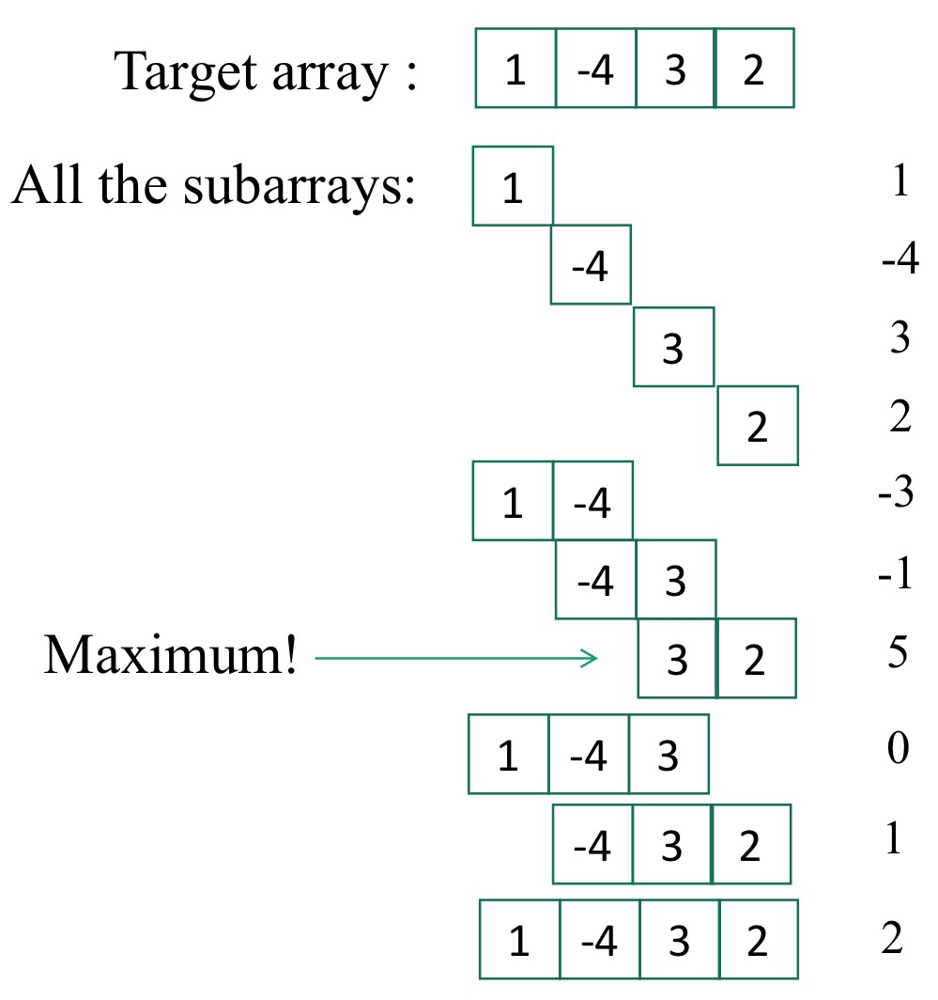
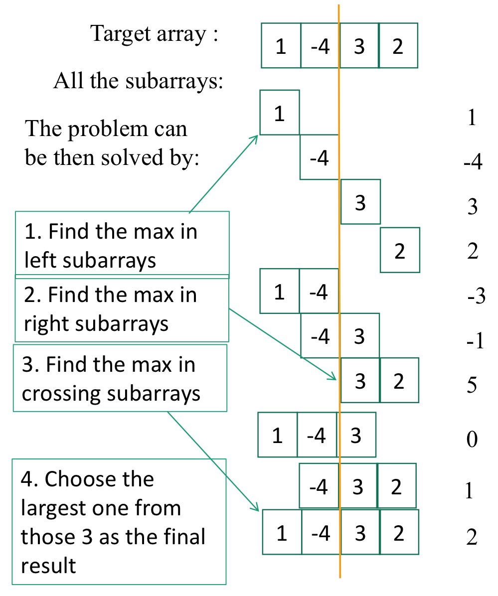
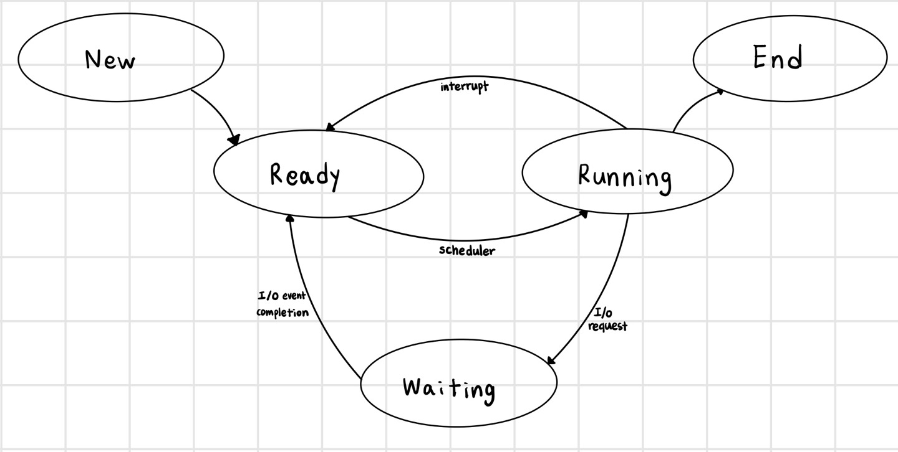

# algorithm (알고리즘) 학습

## Chapter 1

### What are algorithms?

- 알고리즘은 주어진 문제를 해결하거나 주어진 조건을 달성하기 위해 수행될 수 있는 일련의 단계에 대한 정확하고 명확한 사양이다
- 알고리즘은 잘 정의된 계산 문제를 해결하기 위한 계산 절차이다
- 알고리즘은 일부 값 또는 값 집합을 입력으로 받아들이고 값 또는 값 집합을 출력으로 생성한다
- 알고리즘은 입력을 출력으로 변환한다
- 알고리즘은 입력 및 출력 값의 데이터 구조의 특성과 밀접한 관련이 있다

### Algorithm

- 알고리즘은 주어진 문제를 해결하도록 설계됨
- 알고리즘은 프로그래밍 언어의 복잡성과 한계를 고려하지 않음
- 알고리즘은 모호하지 않아야 함
    - 정확한 단계를 가져야 함
- 알고리즘은 크게 3가지 요소가 있음
    - 입력, 알고리즘, 출력
- 알고리즘은 프로그래밍 언어를 사용하여 구현될 것임
- 알고리즘 디자이너는 건축가와 같고 프로그래머는 석공, 목수, 배관공 등과 같음

### Algorithm vs Program

- Algorithm
    - 실제 프로그램에 대한 추상적인 설명
    - 종료되는 계산 절차
    - 유한한 단계 집합으로 구성
- Program
    - 알고리즘의 구체적인 구현
    - 특정 컴퓨터에서, 특정 언어로

### Presenting Algorithm

- `Desciption`: 알고리즘은 하나 이상의 예제를 사용하여 영어로 설명한다
- `Specification`: 알고리즘은 의사코드(pseudo code)로 제시된다
- `Validation`: 알고리즘이 모든 문제 사례에 대해 올바른 것으로 증명된다
- `Analysis`: 알고리즘의 실행 시간 또는 공간 복잡도를 평가한다

### The algorithms we design should be

- `Simple`: 단순한
    - `Unambiguous`: 모호하지 않은
- `Feasible`: 실현 가능한
    - 프로그래밍을 사용하여 구현할 수 있어야 함
- `Cost effective`
    - `CPU time`
    - `Memory used`
    - `Communication`
    - `Energy`

### Design and Analysis of Algorithms

- 알고리즘을 어떻게 설계할까?
    - `Brute force`: 무차별 대입
        - 발생할 수 있는 모든 경우를 탐색
    - `Divide and conquer`: 분할 및 정복
        - 하나의 문제를 작은 여러 개의 문제로 쪼갠 후 재귀적으로 각 문제를 해결한 후 이를 다시 합쳐 문제를 해결
    - `Dynamic programming`: 동적 프로그래밍
        - 큰 문제를 작은 문제로 나누어 푸는 문제
        - 정답을 구한 작은 문제를 어딘가에 메모해두고, 그보다 큰 문제를 풀 때 똑같은 작은 문제가 나타나면 메모해둔 작은 문제의 결과값 이용
    - `Greedy Algorithm`: 탐욕 알고리즘
        - 선택의 순간마다 최적의 상황만을 쫓아 최종적인 해답에 도달하는 방법
- 어떻게 알고리즘의 효율성을 분석할까?
    - `Time`: 시간
    - `Space`: 공간
    - `Energy`: 에너지

## Chapter 2

### The importance of sorting 

- 컴퓨터는 정렬에 가장 많은 시간을 소비함
- 정렬은 다양한 알고리즘을 가진 컴퓨터과학에서 가장 잘 연구된 문제

### Running time

- 실행 시간은 입력에 따라 다르다: 이미 정렬된 배열은 정렬하기가 더 쉽다
- 주요 단순화 규칙: 짧은 배열이 긴 배열보다 정렬하기 쉽기 때문에 실행 시간을 입력 크기로 매개 변수화한다
    - $T_A(n)$ = 길이 n 입력에서 A의 시간
- 일반적으로, 성능을 보장하기 위해 수행시간의 상한을 찾는다

### Kinds of analysis

- **Worst-case**: $T(n)$ = 크기 n의 입력에 대한 알고리즘의 최대 시간
- **Average-case**: $T(n)$ = 크기 n의 모든 입력에 대한 알고리즘의 예상 시간
- **Best-case**: 어떤 입력에 대해 빠르게 동작

### Analysis of Algorithm

- 알고리즘을 분석할 때 worst-case가 중요한 이유
- 최악의 경우는 알고리즘의 실행 시간에 대한 상한(알고리즘의 성능이 이보다 나쁠 수 없음)
- 일부 알고리즘의 경우 worst-case가 자주 발생

### Insertion Sort

- 삽입 정렬: 자료 배열의 모든 요소를 앞에서부터 차례대로 이미 정렬된 배열 부분과 비교하여, 자신의 위치를 찾아 삽입함으로써 정렬을 완성하는 알고리즘

#### INSERTION-SORT(A)

1. **for** j = 2 to length[A]
2. &nbsp;&nbsp;&nbsp;&nbsp;**do** key $\leftarrow$ A[j]
3. &nbsp;&nbsp;&nbsp;&nbsp;&nbsp;&nbsp;//insert A[j] to sorted sequence A[1 ... j - 1]
4. &nbsp;&nbsp;&nbsp;&nbsp;&nbsp;&nbsp;i $\leftarrow$ j - 1
5. &nbsp;&nbsp;&nbsp;&nbsp;&nbsp;&nbsp;**while** i > 0 and A[i] > key
6. &nbsp;&nbsp;&nbsp;&nbsp;&nbsp;&nbsp;&nbsp;&nbsp;&nbsp;&nbsp;**do** A[i + 1] $\leftarrow$ A[i]  //move A[i] one position right
7. &nbsp;&nbsp;&nbsp;&nbsp;&nbsp;&nbsp;&nbsp;&nbsp;&nbsp;&nbsp;&nbsp;&nbsp;&nbsp;&nbsp;i $\leftarrow$ i - 1
8. &nbsp;&nbsp;&nbsp;&nbsp;&nbsp;&nbsp;A[i + 1] $\leftarrow$ key

#### Insertion Sort analysis

- Worst case
    - Reverse sorted list: 역으로 정렬된 리스트
    - $O(n^2)$
- Best case
    - Sorted input: 정렬된 리스트
    - $O(n)$
- 삽입 정렬이 빠른 정렬 알고리즘인가?
    - n이 작은 경우에는 적당히 빠름
    - n이 클 경우에는 빠르지 않음

### Merge Sort

- 합병 정렬: 분할 정복 알고리즘의 하나로 n개의 요소의 배열을 정렬하기 위해 배열을 각각 n/2개의 요소를 가진 하위 배열로 분류하고 합병 정렬을 다시 호출하여 하위 배열들을 재귀적으로 정렬함으로써 정복한다. 그 뒤 두 개의 정렬된 배열을 병합하여 결합한다

#### MERGE-SORT(A, p, r)

1. **if** p < r
2. **then** q $\leftarrow \lfloor$ (p + r) / 2 $\rfloor$
3. &nbsp;&nbsp;&nbsp;&nbsp;MERGE-SORT(A, p, q)
4. &nbsp;&nbsp;&nbsp;&nbsp;MERGE-SORT(A, q + 1, r)
5. &nbsp;&nbsp;&nbsp;&nbsp;MERGE(A, p, q, r)

#### Merge

- 병합은 이미 정렬된 2개의 하위 배열과 빈 배열이 있다고 가정하여 작동
- 무한대가 있다고 가정, 무한대는 각 하위 배열의 끝에 있는 마지막 항목보다 더 크며 하위 배열의 끝에 도달했을 때 알려줌
- 각 하위 배열의 첫번째 항목을 보고 가장 작은 항목을 선택, 그 항목을 출력 배열로 이동을 항목의 개수만큼 반복

#### MERGE(A, p, q, r)

1. n1 $\leftarrow$ q - p + 1
2. n2 $\leftarrow$ r - q
3. create arrays L[1 ... n1 + 1] **and** R[1 ... n2 + 1]
4. **for** i $\leftarrow$ 1 **to** n1
5. &nbsp;&nbsp;&nbsp;&nbsp;**do** L[i] $\leftarrow$ A[p + i - 1]
6. **for** j $\leftarrow$ 1 **to** n2
7. &nbsp;&nbsp;&nbsp;&nbsp;**do** R[j] $\leftarrow$ A[q + j]
8. L[n1 + 1] $\leftarrow \infty$ 
9. R[n2 + 1] $\leftarrow \infty$ 
10. i $\leftarrow$ 1
11. j $\leftarrow$ 1
12. **for** k $\leftarrow$ p **to** r
13. &nbsp;&nbsp;&nbsp;&nbsp;**do if** L[i] $\leq$ R[j]
14. &nbsp;&nbsp;&nbsp;&nbsp;&nbsp;&nbsp;&nbsp;&nbsp;**then** A[k] $\leftarrow$ L[i]
15. &nbsp;&nbsp;&nbsp;&nbsp;&nbsp;&nbsp;&nbsp;&nbsp;&nbsp;&nbsp;&nbsp;&nbsp;&nbsp;&nbsp;&nbsp;&nbsp;&nbsp;i $\leftarrow$ i + 1
16. &nbsp;&nbsp;&nbsp;&nbsp;&nbsp;&nbsp;&nbsp;&nbsp;**else** A[k] $\leftarrow$ R[j]
17. &nbsp;&nbsp;&nbsp;&nbsp;&nbsp;&nbsp;&nbsp;&nbsp;&nbsp;&nbsp;&nbsp;&nbsp;&nbsp;&nbsp;&nbsp;&nbsp;&nbsp;j $\leftarrow$ j + 1

#### Analysis of Divide-and-Conquer

- 재귀 방정식으로 기술
- $T(n)$ 을 크기 n의 문제의 실행 시간이라고 가정
- $T(n) = \Theta(1)$ if $n \leq c$   
&nbsp;&nbsp;&nbsp;&nbsp;&nbsp;&nbsp;&nbsp;&nbsp;&nbsp;&nbsp;&nbsp;&nbsp; $aT(n / b) + D(n) + C(n)$ otherwise
    - a: 하위 배열의 수
    - n/b: 하위 배열의 크기
    - D(n): 분할 작업 비용
    - C(n): 정복 작업 비용

#### Analysis of MERGE-SORT

- **Base case**: n = 1, 크기가 1인 배열의 병합 정렬은 일정한 시간이 소요됨, $\Theta(1)$
- **Divide**: 합병 정렬의 분할 단계는 단지 하위 배열의 중간을 계산하는 것으로 일정한 시간이 소요됨, $D(n) = \Theta(1)$
- **Conquer**: 2번의 병합 정렬 호출을 하는데 각 호출은 매개 변수로 전달하는 하위 배열의 1/2을 처리, $2T(n/2)$
- **Combine**: n개의 요소 하위 배열에서 Merge를 실행하면 $\Theta(n)$이 걸리므로 $C(n) = \Theta(n)$
    

- $T(n) = \Theta(1)$ if $n = 1$   
&nbsp;&nbsp;&nbsp;&nbsp;&nbsp;&nbsp;&nbsp;&nbsp;&nbsp;&nbsp;&nbsp;&nbsp; $2T(n / 2) + \Theta(1) + \Theta(n)$ if $n > 1$

- $\Theta(1)$과 $\Theta(n)$은 관계가 없으므로 무시할 수 있다
- $T(n) = c$ if $n = 1$   
&nbsp;&nbsp;&nbsp;&nbsp;&nbsp;&nbsp;&nbsp;&nbsp;&nbsp;&nbsp;&nbsp;&nbsp; $2T(n / 2) + c(n)$ if $n > 1$

- 분할 단계는 얼마나 많은가?
- n이 2의 어떤 거듭제곱이라고 가정하면, 크기 n의 배열에 대해 배열을 크기 1의 하위 배열로 재귀적으로 세분화하는 $log_2n$ 단계가 필요
- 결과적으로 재귀 트리에 $log_2(n) + 1$개의 레이어를 가진다
- 각 배열 내에서 각 배열 항목을 적절한 위치에 배치해야 하기 때문에 반복 트리의 모든 계층은 n단계를 수행해야 한다
- 총 비용은 $cn(log_2n + 1) = cn(log_2n) + cn$
    - 저차항과 상수를 무시하면 $\Theta(n*log_2n)$을 얻을 수 있음

## Chapter 3

### Asymptotic notation

- 필수적인 부분에 초점을 맞추고 관련 없는 세부 사항을 무시하는 알고리즘의 계산 비용에 대해 이야기할 방법 필요
- 실제 단계를 정확하게 계산하는 것은 지루하고 일반적으로 유용하지 않음
- 작업마다 다른 시간이 소요됨(실행할 때마다 캐싱 등의 변화가 발생함)

- Asymtotic: 점근적
- 점근법은 극한에서 함수의 동작을 설명함(그 매개 변수의 값이 충분히 큰 경우)
- 알고리즘의 실행 시간의 증가 순서는 알고리즘의 실행 시간을 설명하는 식의 최상위 항으로 정의됨
- 식의 모든 하위 항뿐만 아니라 최상위 항의 계수 무시

### Big O: Upper bound

- $O(g(n))$ 은 함수들의 집합이다   
$O(g(n)) = f(n)$: 모든 $n \ge n_0$에 대해 $0 \le f(n) \le cg(n)$을 만족하는 양의 상수 $c$ 와 $n_0$이 존재한다
- 일반적으로 빅오 표기법은 수행 시간의 상한이기 때문에 중요
- 예)   
$7n - 2$ is $O(n)$   
모든 $n \ge n_0$에 대해 $7n - 2 \le cn$을 만족하는 $c > 0$과 $n_0 \ge 1$이 필요하다   
이는 $c = 7$과 $n_0 = 1$에 대해 만족한다

### Omega: Lower bound

- $\Omega(g(n))$ 은 함수들의 집합이다   
$\Omega(g(n)) = f(n)$: 모든 $n \ge n_0$에 대해 $0 \le cg(n) \le f(n)$을 만족하는 양의 상수 $c$ 와 $n_0$이 존재한다

### Theta: Upper and Lower bound

-   $\Theta(g(n))$ 은 함수들의 집합이다   
$\Theta(g(n)) = f(n)$: 모든 $n \ge n_0$에 대해 $0 \le c_1g(n) \le f(n) \le c_2g(n)$을 만족하는 양의 상수 $c_1, c_2$ 와 $n_0$이 존재한다
- 함수에서 빅오와 빅오메가의 공통부분 

### Some rules of thumb

- rule of thumb: 경험 법칙
- 곱셈 상수는 생략할 수 있다
    - $14n^2 \rightarrow n^2$, $7logn \rightarrow logn$
- 저차항 함수는 생략할 수 있다
    - $n + 5 \rightarrow n$, $n^2 + n \rightarrow n^2$
- $a > b$일 경우 $n^a$가 $n^b$를 지배한다
    - $n^{1.5}$ dominates $n^{1.4}$, so $n^{1.5} + n^{1.4} \rightarrow n^{1.5}$
- $a > b$일 경우 $a^n$이 $b^n$을 지배한다
    - $3^n$ dominates $2^n$
- 임의의 지수가 임의의 다항식을 지배한다
    - $3^n$ dominates $n^5$
- 임의의 다항식이 임의의 로그를 지배한다
    - $n^2$ dominates $nlogn$, $n$ dominates $log n$ or $log logn$
- 다른 변수들로 이루어진 차항에서 저차항을 생략하면 안된다
    - $(n^2 + m)$ &nbsp; $- \times \rightarrow n^2$

### Some examples of Big O

- $O(1)$: 상수, 투입 규모에 상관없이 고정된 작업량
    - 32비트 숫자 2개를 더한다
    - 숫자가 짝수인지 홀수인지 판별한다
    - 배열의 첫 20개 원소를 합한다
    - 이중 연결 리스트에서 하나의 요소를 삭제한다
- $O(logn)$: 로그와 관련된, 각 반복 시 입력의 일부(즉 절반)를 폐기한다
    - 이진 탐색
- $O(n)$: 선형, 입력의 각 요소에 일정한 양의 작업 수행
    - 연결 리스트에서 항목 찾기
    - 배열에서 가장 큰 요소 결정
- $O(nlogn)$: 로그 선형, 재결합에서 선형 작업량을 가진 분할 정복 알고리즘
    - 병합 정렬로 숫자의 리스트 정렬
- $O(n^2)$: 2차항, 데이터 위에서 반복되는 이중 중첩 루프
    - 삽입 정렬, 선택 정렬, ...
- $O(n^3)$: 3차항, 데이터 위에서 반복되는 삼중 중첩 루프
- $O(2^n)$: 기하급수적인
    - 가능한 모든 하위 집합 열거
    - 동적 프로그래밍을 사용하는 Traveling salesman 문제
- $O(n!)$
    - 모든 순열 열거

### Big O, Omega, Theta

- 병합 정렬 실행 시간을 $O(n(log_2n))$대신 $\Theta(n(log_2n))$으로 표현하는 이유?   
$\rightarrow$ 세타가 빅오보다 정확하기 때문에
- 병합 정렬 실행 시간을 $O(n(log_2n))$라고 하면, 병합 정렬의 점근적 상한에 대한 주장을 하는 것일뿐이지만, 병합 정렬의 실행 시간을 $\Theta(n(log_2n))$라고 하면, 병합 정렬의 점근적 상한과 하한에 대한 주장을 하는 것이다

## Chapter 4

### Divide and Conquer

- 좋은 분할 정복 알고리즘은 일반적으로 알고리즘의 쉬운 재귀적 버전을 의미
- 3단계
    - `Divide`: 문제를 여러 하위 문제로 나눈다
    - `Conquer`: 하위 문제를 재귀적으로 풀어서 정복한다   하위 문제 크기가 충분히 작을 때는 하위 문제만 풀면 됨
    - `Combine`: 하위 문제를 결합하여 원래 문제의 해결책을 만든다

### Recurrence

- 재귀는 더 작은 입력에 대한 함수의 값으로 설명하는 방정식 또는 부등식이다
- 예)   
$T(n) = \Theta(1)$    
&nbsp;&nbsp;&nbsp;&nbsp;&nbsp;&nbsp;&nbsp;&nbsp;&nbsp;&nbsp;&nbsp;$aT(n/b)+D(n)+C(n)$

- 많은 알고리즘의 복잡성은 쉽게 재귀로 표현된다
- 재귀적 알고리즘의 복잡성은 쉽게 재귀로 표현된다

### Maximum Subarray Problem

- Maximum subarray problem: 숫자들로 이루어진 주어진 1차원 배열 A[1 ... n] 내에서 가장 큰 합을 갖는 연속적인 하위 배열을 찾는 작업
- brute-force방법으로 maximum subarray를 풀면 시간복잡도는 $O(n^2)$   

- brute-force 알고리즘보다 더 나은 알고리즘이 필요 $\rightarrow$ 분할 및 정복 알고리즘은 어떨까?

- 배열을 2개의 배열로 나눈다
    - 왼쪽 배열에 속하는 하위 배열
    - 오른쪽 배열에 속하는 하위 배열
    - 중간을 가로지르는 하위 배열
- A[low ... high]의 maximum subarray를 구한다고 가정할 때
    - 분할과 정복은 하위 배열의 중간점(mid)를 찾고 하위 배열 A[low ... mid]와 A[mid + 1 ... high]를 고려
    - 연속된 하위 배열 A[i ... j]는 3 영역 중 하나의 영역에 있어야 한다
        - entirely in A[low ... mid]
        - entirely in A[mid + 1 ... high]
        - crosses the midpoint

#### Find Max Crossing Subarray

- 중간점을 가로지르는 maximum subarray를 쉽게 찾을 수 있음
- A[i ... mid]와 A[mid + 1 ... j]의 maximun subarray를 찾아 결합하면 됨

- FIND-MAX-CROSSING-SUBARRAY(A, low, mid, high)
1. left-sum = $-\infty$
2. sum = 0
3. **for** i = mid **downto** low
4. &nbsp;&nbsp;&nbsp;&nbsp;sum = sum + A[i]
5. &nbsp;&nbsp;&nbsp;&nbsp;**if** sum > left-sum
6. &nbsp;&nbsp;&nbsp;&nbsp;&nbsp;&nbsp;&nbsp;&nbsp;left-sum = sum
7. &nbsp;&nbsp;&nbsp;&nbsp;&nbsp;&nbsp;&nbsp;&nbsp;max-left = i
8. right-sum = $-\infty$
9. sum = 0
10. **for** j = mid + 1 **to** high
11. &nbsp;&nbsp;&nbsp;&nbsp;sum = sum + A[j]
12. &nbsp;&nbsp;&nbsp;&nbsp;**if** sum > right-sum
13. &nbsp;&nbsp;&nbsp;&nbsp;&nbsp;&nbsp;&nbsp;&nbsp;right-sum = sum
14. &nbsp;&nbsp;&nbsp;&nbsp;&nbsp;&nbsp;&nbsp;&nbsp;max-right = j
15. **return** (max-left, max-right, left-sum + right-sum)

#### Find Maximum subarray

- 3가지 경우로 나누어 최적의 솔루션을 선택한다
    - 왼쪽 하위 배열
    - 교차 하위 배열
    - 오른쪽 하위 배열

- FIND-MAXIMUM-SUBARRAY(A, low, high)
1. **if** high == low
2. &nbsp;&nbsp;&nbsp;&nbsp;**return** (low, high, A[low])
3. **else** mid = $\lfloor$ (low + high) / 2 $\rfloor$
4. &nbsp;&nbsp;&nbsp;&nbsp;(left-low, left-high, left-sum) = FIND-MAXIMUM-SUBARRAY(A, low, mid)
5. &nbsp;&nbsp;&nbsp;&nbsp;(right-low, right-high, right-sum) = FIND-MAXIMUM-SUBARRAY(A, mid + 1, high)
6. &nbsp;&nbsp;&nbsp;&nbsp;(cross-low, cross-high, cross-sum) = FIND-MAX-CROSSING-SUBARRAY(A, low, mid, high)
7. &nbsp;&nbsp;&nbsp;&nbsp;**if** left-sum $\ge$ right-sum **and** left-sum $\ge$ cross-sum
8. &nbsp;&nbsp;&nbsp;&nbsp;&nbsp;&nbsp;&nbsp;&nbsp;**return** (left-low, left-high, left-sum)
9. &nbsp;&nbsp;&nbsp;&nbsp;**elseif** right-sum $\ge$ left-sum **and** right-sum $\ge$ cross-sum
10. &nbsp;&nbsp;&nbsp;&nbsp;&nbsp;&nbsp;&nbsp;&nbsp;**return** (right-low, right-high, right-sum)
11. &nbsp;&nbsp;&nbsp;&nbsp;**else** **return** (cross-low, cross-high, cross-sum)
- 시간복잡도는 $O(nlogn)$

### Methods for Solving Recurrences

#### Substitution Method

1. 풀이의 형태를 추측한다
2. 수학적 귀납법을 이용하여 상수를 찾고 풀이법이 작동함을 보인다
    - 풀이를 추측하기 쉬울 때 잘 작동한다
    - 상한 또는 하한에서 사용할 수 있다
- 예)   
$T(n) = 2T(n/2) + n$ = ?
- $T(n) = O(nlogn)$이라고 추측
- $T(n) \le cnlogn$을 어떤 $c$에 대해 증명
    - Inductive base: 어떤 작은 $n$에 대해 부등식이 성립함을 증명
        - $T(2) = 2T(1) + 2 = 4$
        - $cnlogn = c * 2 * log2 = 2c$   choose any $c \ge 2$
    - Assume true for $n/2$
        - $T(n/2) \ge c(n/2)log(n/2)$
    - Prove
        - $T(n) = 2T(n/2) + n$   
        $\le 2T(c(n/2)log(n/2)) + n$   
        $= cnlog(n/2) + n$   
        $= cnlogn - cn + n$   
        $\le cnlogn$  &nbsp;&nbsp;&nbsp;&nbsp; for $c \ge 2$   
        $= O(nlogn)$  &nbsp;&nbsp;&nbsp;&nbsp; for $c \ge 2$
- 재귀 방정식이 익숙해보인다면 비슷한 풀이를 추측할 수 있다
    - $T(n) = 2T(n/2+17) + n$
    - $T(N) = O(nlogn)$ 추측 가능
        - 왜? 17은 재귀방정식 풀이에 실질적으로 영향을 미칠 수 없다 (단지 상수이기 때문에)

#### Iterative Substitution

- 예)   
$T(n) = 0$ &nbsp;&nbsp;&nbsp;&nbsp; if $n = 0$   
$= T(n-1) + n$ &nbsp;&nbsp;&nbsp;&nbsp; if $n > 0$
- 원래 관계식에서 n을 n-1로 대체하면: $T(n-1) = T(n-2) + (n-1)$
- 원래 관계식에서 n-1을 위에서 구한 식으로 대체하면: $(T(n-2)+(n-1))+n$
- $T(n-2) = T(n-3) + (n-2)$임을 안다
- 위위의 식에서 $T(n-2)$를 위의 식으로 대체하면: $T(n) = (T(n-3)+(n-2))+(n-1)+n$
- 패턴을 확인할 수 있다
    - $T(n) = T(n-1)+n$
    - $T(n) = (T(n-2)+(n-1))+n$
    - $T(n) = (T(n-3)+(n-2))+(n-1)+n$
    - $\dots$
    - $T(n) = T(n-(n-2))+2+3+\dots+(n-2)+(n-1)+n$
    - $T(n) = T(n-(n-1))+2+3+\dots+(n-2)+(n-1)+n$
    - $T(n) = T(n-(n-0))+2+3+\dots+(n-2)+(n-1)+n$
    - $\Rightarrow T(n) = T(0)+1+2+3+\dots+(n-2)+(n-1)+n$
- $T(0) = 0$임을 알고있으므로 $T(n) = 0+1+2+3+\dots+(n-2)+(n-1)+n$
    - $T(n) = T(0)+1+2+3+\dots+(n-2)+(n-1)+n$의 합은 $T(n) = (n(n+1)/2) = 1/2n^2 + 1/2n$
    - 따라서 $O(n^2)$ 

#### Recursion Tree

- 각 노드는 재귀 함수 호출 집합에서 단일 하위 문제의 비용을 나타낸다
- 트리의 각 레벨 내에서 비용을 합산하여 레벨별 비용 집합을 얻는다
- 모든 레벨의 비용을 합산하여 재귀의 총 비용을 결정한다
- substitution method를 위한 좋은 추측을 생성하는 데 유용하다

#### Master Theorem

- $a \ge 1$, $b > 1$이고, $f(n)$이 점근적 양의 함수인 $T(n) = aT(n/b)+f(n)$형태의 재귀를 해결하기 위한 cookbook method를 제공한다
- 분할 정복 알고리즘은 $T(n) = aT(n/b) + D(n) + C(n)$의 형태가 반복되기 때문에 마스터 정리의 형태는 매우 편하다
- $T(n) = aT(n/b)+f(n)$
    - case 1) if $f(n) = O(n^{log_b{a-\varepsilon}})$ for $\varepsilon > 0$, then $T(n) = \Theta(n^{log_ba})$
    - case 2) if $f(n) = \Theta(n^{log_ba})$, then $T(n) = \Theta(n^{log_ba}logn)$
    - case 3) if $f(n) = \Omega(n^{log_b{a+\varepsilon}})$ for $\varepsilon > 0$ and $af(n/b) \le cf(n)$ for $c < 1$ then $T(n) = \Theta(f(n))$
- 위의 정리를 다시 말하면
    - 우선 $f(n)$과 $n^{log_ba}$를 비교한다
    - $f(n)$이 점근적으로 느리게 성장하면(case 1)
        - $T(n) = \Theta(n^{log_ba}$
    - 성장률이 같으면(case 2)
        - $T(n) = \Theta(n^{log_ba}logn)$
    - $f(n)$이 점근적으로 빠르게 성장하면(case 3)
        - $T(n) = \Theta(f(n))$
- 예)   
$T(n) = 16T(n/4)+n$
- $f(n)$과 $n^{log_ba}$를 비교한다
    - $f(n) = n$
    - $a = 16, b = 4$
    - $n^{log_ba} = n^{log_416} = n^2$
- $f(n) = n$은 $n^2$보다 점근적으로 느리게 성장한다
    - case 1) $T(n) = \Theta(n^{log_ba} = \Theta(n^2)$

## Chapter 6

### Heapsort

- 병합 정렬 및 삽입 정렬의 더 나은 특성들을 결합한다
    - 병합 정렬과 같이 실행 시간은 $O(nlogn)$이다
    - 삽입 정렬과 같이 제자리 정렬이다
- 알고리즘을 실행하는 동안 정보를 관리하기 위한 데이터 구조(heap)을 만든다
- 힙에는 정렬 이외에 우선 순위 큐가 있다

### Some Definitions

- In place sorting
    - 추가 메모리를 사용하지 않고, 원래의 데이터 구조 내에서 정렬을 수행
    - 주어진 데이터를 수정하며 정렬하는 방식(배열의 요소 교환 or 재배치)
    - 공간 사용을 줄이는 것이 중요
- Not in place (out of place) sorting
    - 주어진 데이터 구조를 정렬하기 위해 추가 메모리를 사용
    - 주어진 데이터를 수정하지 않고 정렬된 결과를 새로운 데이터 구조에 저장
    - 안정적인 정렬 알고리즘 - 동일한 키(값)를 가진 요소들의 순서 유지

### Full vs Complete Binary Trees

- 이진 트리 T는 각 노드가 단말 노드이거나 2개의 자식 노드가 있으면 전 이진 트리(full binary trees)이다
- n개의 레벨을 갖는 이진 트리 T는 마지막 레벨을 제외한 모든 레벨이 완전히 채워져 있고, 마지막 레벨의 모든 노드는 가능한 한 가장 왼쪽에 있으면 완전 이진 트리(complete binary tree)이다

### Representation of Complete Binary Tree

- 완전 이진 트리는 배열(포인터 없이)로 표현될 수 있음
- 루트 노드로 시작하여 레벨에서 레벨로 이동하는 노드에 레벨 내에서 왼쪽에서 오른쪽으로 번호를 지정
- 노드에 할당된 번호는 배열의 인덱스

### Additional Properties of Complete Binary Trees

- 루트 노드는 A[1]
- 만약 노드의 인덱스가 i라면
    - 부모 노드: $\lfloor i/2 \rfloor$
    - 왼쪽 자식 노드: $2i$
    - 오른쪽 자식 노드: $2i + 1$
- 배열을 완전한 이진 트리로 본다
    - 물리적으로는 선형 배열이지만
    - 논리적으로는 이진 트리(마지막 레벨 제외 모든 레벨이 채워져있는)

### Heap

- 힙(heap): 힙 속성을 만족시키는 완전 이진 트리
- `max-heap`: 루트 이외의 모든 노드 i에 대해 A[부모(i)] $\ge$ A[i] (부모 노드가 더 큼)
- `min-heap`: 루트 이외의 모든 노드 i에 대해 A[부모(i)] $\le$ A[i] (부모 노드가 더 작음)

#### Height

- 트리에서 노드의 높이: 노드에서 단말노드까지의 가장 긴 단순한 하향 경로의 가지 수
- 트리의 높이: 루트의 높이
- 힙의 높이: $\lfloor log n \rfloor$

#### Heap Characteristics

- Height(높이) = $\lfloor log n \rfloor$
- \# of leaves(단말노드의 개수) = $\lceil n/2 \rceil$
- \# of nodes of height h(높이 h에서의 노드의 개수) $\le \lceil n/2^{h+1} \rceil$

#### Heaps have 5 basic procedures

- `HEAPIFY`: 힙 속성을 유지한다
- `BUILD-HEAP`: 정렬되지 않은 배열로 힙을 만든다
- `HEAPSORT`: 배열을 제자리에서 정렬한다
- `EXTRACT-MAX`: 최대 요소를 선택한다
- `INSERT`: 새 요소를 삽입한다

##### Max Heapify

- Assumption: Left(i) and Right(i) are max-heaps
- MAX-HEAPIFY(A, i)
1. l $\leftarrow$ left(i)
2. r $\leftarrow$ right(i)
3. **if** l $\le$ heap-size[A] **and** A[l] > A[i]
4. &nbsp;&nbsp;&nbsp;&nbsp;**then** largest $\leftarrow$ l
5. &nbsp;&nbsp;&nbsp;&nbsp;**else** largest $\leftarrow$ i
6. **if** r $\le$ heap-size[A] **and** A[r] > A[largest]
7. &nbsp;&nbsp;&nbsp;&nbsp;**then** largest $\leftarrow$ r
8. **if** largest $\ne$ i
9. &nbsp;&nbsp;&nbsp;&nbsp;**then** exchange A[i] $\leftrightarrow$ A[largest]
10. &nbsp;&nbsp;&nbsp;&nbsp;&nbsp;&nbsp;&nbsp;&nbsp;MAX-HEAPIFY(A, largest)
- 수행 시간: $O(logn)$ or $O(h)$

##### Build Max Heap

- BUILD-MAX-HEAP(A)
1. heap-size[A] $\leftarrow$ length[A]
2. **for** i $\leftarrow \lfloor$ length[A]/2 $\rfloor$ **downto** 1 **do**
3. &nbsp;&nbsp;&nbsp;&nbsp;MAX-HEAPIFY(A, i)
- 수행 시간: $O(n)$

##### Heap Sort

- HEAP-SORT(A)
1. BUILD-MAX-HEAP(A)
2. **for** i $\leftarrow$ length[A] **downto** 2 **do**
3. &nbsp;&nbsp;&nbsp;&nbsp;exchange A[1] $\leftrightarrow$ A[i]
4. &nbsp;&nbsp;&nbsp;&nbsp;heap-size[A] $\leftarrow$ heap-size[A] - 1
5. &nbsp;&nbsp;&nbsp;&nbsp;MAX-HEAPIFY(A, 1)
- 수행 시간: $O(nlogn)$
- 힙 정렬은 힙을 데이터 구조로 사용함
- 힙 정렬은 제자리 정렬임
- 추가로 공간이 필요한가?
    - 아주 적은 양의 공간: 두 개의 배열 요소를 교환할 때 임시 저장소로 한 개의 추가 공간이 필요함

##### Priority Queue

- 속성
    - 각 요소는 값(우선 순위)과 연결됨
    - 우선 순위가 가장 높은(또는 가장 낮은) 키가 먼저 추출됨
    - FIFO(First Input First Out)이 아님!!
- 힙의 대중적이고 중요한 용도로 사용됨
- 최대 및 최소 우선 순위 큐
- 요소의 동적 집합 S를 유지함
- 각 집합 요소에는 키(= 연관된 값)가 있음
- 삽입 및 추출을 효율적으로 지원하는 것이 목표
- 적용
    - 운영 체제에서
        - 작업 예약
        - 운영 체제의 프로세스를 우선 순위에 따라 목록을 준비(목록은 매우 동적임)
    - 시뮬레이터에서
        - 이벤트 중심 시뮬레이터에서 시뮬레이션할 이벤트 목록을 발생 시간의 순서대로 유지   

###### Basic Operatioins

- 최대 우선 순위 큐에 대한 작업
    - `Insert(S, x)`: 요소 x를 집합 S에 삽입한다 $S \leftarrow S \cup \{x\}$
    - `Maximum(S)`: 키 값이 가장 큰 S의 요소를 반환한다
    - `Extract-Max(S)`: 키 값이 가장 큰 S의 요소를 제거하고 반환한다
    - `Increase-Key(S, x, k)`: 원소 x의 키 값을 새로운 값 k로 증가시킨다
- 최소 우선 순위 큐도 삽입, 최소, 최소값 추출, 키 감소를 지원한다

###### Heap Maximum

- HEAP-MAXIMUM(A)
1. **return** A[1]
- 힙의 최상위(루트)에 있는 요소를 반환한다
- 수행 시간: $\Theta(1)$

###### Heap Extract Max

- HEAP-EXTRACT-MAX(A)
1. **if** heap-size[A] < 1
2. &nbsp;&nbsp;&nbsp;&nbsp;**then error** "heap-underflow"
3. max $\leftarrow$ A[1]
4. A[1] $\leftarrow$ A[heap-size[A]]
5. heap-size[A] $\leftarrow$ heap-size[A] - 1
6. MAX-HEAPIFY(A, 1)
7. **return** max
- 수행 시간: $O(log n)$ (MaxHeapify의 수행시간에 지배됨)

###### Heap Increase Key

- HEAP-INCREASE-KEY(A, i, key)
1. **if** ket < A[i]
2. &nbsp;&nbsp;&nbsp;&nbsp;**then error** "new key is smaller then the current key"
3. A[i] $\leftarrow$ key
4. **while** i > 1 **and** A[Parent[i]] < A[i]
5. &nbsp;&nbsp;&nbsp;&nbsp;**do** exchange A[i] $\leftrightarrow$ A[Parent[i]]
6. &nbsp;&nbsp;&nbsp;&nbsp;&nbsp;&nbsp;&nbsp;&nbsp;i $\leftarrow$ Parent[i]
- 수행 시간: $O(log n)$

###### Heap Insert

- HEAP-INSERT(A, key)
1. heap-size[A] $\leftarrow$ heap-size[A] + 1
2. A[heap-size[A]] $\leftarrow -\infty$
3. HEAP-INCREASE-KEY(A, heap-size[A], key)
- 수행 시간: $O(log n)$

#### Heap Summary

- MAX-HEAPIFY&nbsp;&nbsp;&nbsp;&nbsp;&nbsp;&nbsp;&nbsp;&nbsp; $O(log n)$
- BUILD-MAX-HEAP&nbsp;&nbsp;&nbsp;&nbsp;&nbsp;&nbsp;&nbsp;&nbsp; $O(n)$
- HEAP-SORT&nbsp;&nbsp;&nbsp;&nbsp;&nbsp;&nbsp;&nbsp;&nbsp; $O(nlog n)$
- HEAP-MAXIMUM&nbsp;&nbsp;&nbsp;&nbsp;&nbsp;&nbsp;&nbsp;&nbsp; $O(1)$
- HEAP-EXTRACT-MAX&nbsp;&nbsp;&nbsp;&nbsp;&nbsp;&nbsp;&nbsp;&nbsp; $O(log n)$
- HEAP-INCREASE_KEY&nbsp;&nbsp;&nbsp;&nbsp;&nbsp;&nbsp;&nbsp;&nbsp; $O(log n)$
- HEAP-INSERT&nbsp;&nbsp;&nbsp;&nbsp;&nbsp;&nbsp;&nbsp;&nbsp; $O(log n)$

## Chapter 7

### Quick Sort

- 퀵 정렬은 분할 정복 알고리즘이다
- 하지만 병합 정렬과 다르다
    - 배열을 반으로 나누지 않는다
    - 피벗이라는 요소를 기반으로 배열을 나눈다
    - 분할 단계는 모든 작업을 수행한다, 병합 단계는 사소하다
- 하위 배열에 1개의 요소만 포함될 때까지 배열을 두 개의 하위 배열로 분할하여 왼쪽의 모든 값이 오른쪽의 값보다 작아지도록 반복한다
