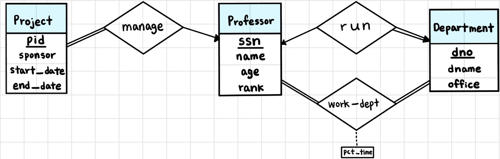
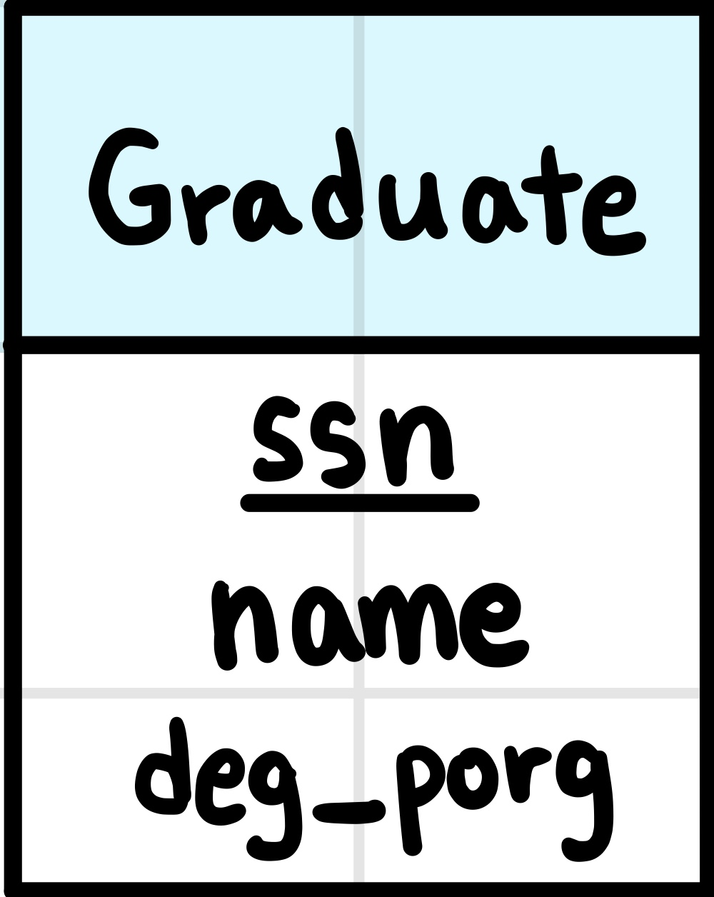

# database(데이터베이스) 학습

## Chapter 1

### 관계형 모델 소개

- 관계형 데이터베이스는 테이블(table)의 모임으로 구성
- Table
    - 고유한 이름을 가지고 있음

- Table = Relation
    - 테이블은 관계
- Column = Attribute
    - 열은 속성
- Row = Tuple
    - 행은 튜플

#### Attribute Types

- domain
    - 각 속성에 대해 허용되는 값의 집합
- 속성 값은 원자적(더 나누어질 수 없음)
    - 값이 하나 있어야 함(하나 또는 null)
- null
    - 모든 domain의 멤버
        - 모르는 값
        - 존재하지 않는 값

#### Relation Schema

- $A_1, A_2, ..., A_n$ 은 속성일 때
- $R(A_1, A_2, ..., A_n)$ 은 relation schema!
    - 예) instructor (ID,  name, dept_name, salary)

#### Keys

- Primary Key(기본키)
    - 테이블에 한 개 존재
    - 한 테이블에서 레코드를 유일하게 식별할 수 있는 속성
    - null 값을 가질 수 없음
    - 중복된 값을 가질 수 없음
    - 밑줄로 구분

- Foreign Key(외래키)
    - 다른 테이블의 기본키를 참조하는 키
    - 한 테이블에 여러 개의 외래키 존재 가능
    - 외래키에서 나타나는 값은 기본키에 있는 값이어야 함
    - 외래키에서 기본키로 향하는 화살표로 표시

## Chapter 2

### SQL Data Definition

#### Basic Types in SQL

- `char(n)`
    - 사용자가 지정한 길이가 n인 고정 길이 문자열
- `varchar(n)`
    - 사용자가 지정한 최대 길이가 n인 가변 길이 문자열
- `int`
    - 정수
- `smallint`
    - 작은 정수
- `numeric(d, p)`
    - 사용자가 지정한 전체 자릿수 p자리, 소수점 자릿수 d자리의 고정 소수점 숫자
- `real`, `double precision`
    - 부동 소수점 및 이중 정밀 부동 소수점 숫자

#### Create Table Construct

- `create table`
    - 관계를 정의할 때 사용
    - **create table** r (A1 D1, A2 D2, ..., An, Dn, (제약 조건));
        - r: 관계의 이름
        - Ai = 관계 r의 속성
        - Di = Ai의 데이터 타입(도메인)

#### Insert Statement

- `insert into` 관계 이름 `values` (튜플);
    - 속성을 테이블에 추가할 때 사용

#### Alter Table

- `alter table` 관계 이름 `add` 관계에 추가할 속성 이름&nbsp;&nbsp;&nbsp;&nbsp;추가할 속성의 도메인
    - null을 새 속성 값으로 할당한다

- `alter table` 관계 이름 `drop` 관계에서 삭제할 속성 이름
    - 속성을 삭제한다

#### Drop Table

- `drop table` 관계 이름
    - 관계에 대한 모든 튜플 및 테이블 삭제, 관계 삭제

- `delete from` 관계 이름
    - 관계의 모든 튜플 삭제, 하지만 관계는 보존

#### Integrity Constraints

- `not null`
    - 해당 특성에 null 값이 허용되지 않음

- `primary key`(속성)
    - 기본키로 선언 시 not null과 unique 보장
    - null값이 없으며 값이 중복되지 않음
    - 제약 조건으로써 선언해도 되고, 속성의 도메인 뒤에 선언해도 됨

- `foreign key`(속성...) `reference` 관계(속성...)
    - 참조하는 값이 존재해야 참조할 수 있음

#### 기본 기능

- `show databases`
    - 존재하는 데이터베이스들을 보여준다
- `use` 데이터베이스 이름
    - 데이터베이스를 선택
- `show tables`
    - 데이터베이스 내에 존재하는 테이블들을 보여준다

### Basic Structure of SQL Queries

#### Relational Algebra(관계대수)

- `Selection` - $\sigma$
    - 선택 연산
    - 선택 조건을 만족하는 관계의 튜플들을 출력
    - $\sigma_{condition}(Relation)$
    - $\wedge$: and, $\vee$: or

- `Projection` - $\sqcap$
    - 추출 연산
    - 관계에서 선택된 속성들을 출력
    - $\sqcap_{attribute-list}(Relation)$

- `Natural Join` - $\Join$
    - 자연 조인
    - 같은 이름을 가지고 있는 속성들에서 두 관계가 같은 값을 가지고 있는 튜플의 쌍을 출력
    - Relation1 $\Join$ Relation2

- `Cartesion product` - $\times$
    - 카티션 곱
    - 두 관계로부터 가능한 모든 튜플의 쌍을 출력
    - Relation1 $\times$ Relation2

- `Union` - $\cup$
    - 합집합
    - 두 관계의 튜플에 대하여 합집합 수행
    - Relation $\cup$ Relation2

- `Intersection` - $\cap$
    - 교집합
    - 두 관계의 튜플에 대하여 교집합 수행
    - Relation1 $\cap$ Relation2

- `Set difference` - -
    - 차집합
    - 두 관계의 튜플에 대하여 차집합 수행
    - Relation1 - Relation2

#### Basic Query Structure

**select** A1, A2, ..., An   
**from** r1, r2, ..., rm   
**where** P   

- Ai: 속성
- ri: 관계
- P: 서술어
- SQL 쿼리의 결과는 관계!

#### The select Clause

- 쿼리 결과에서 원하는 속성 나열
- 관계대수의 추출 연산에 해당
- `distinct`
    - 쿼리 결과에서 관계의 중복 제거
    - select distinct
- `all`
    - 쿼리 결과에서 관계의 중복 허용
    - select all = select
- `*`
    - 모든 속성을 나타냄

- select 절에 +, -, *, /와 관련된 산술 식을 포함하여 튜플의 상수 또는 속성에 대해 연산 가능

#### The where Clause

- 결과가 만족해야 하는 조건 지정
- 관계대수의 선택 연산에 해당
- **and** 또는 **or** 사용 가능

#### The from Clause

- 쿼리와 관련된 관계 나열
- 관계대수의 카티션 곱 연산에 해당
- 카티션 곱은 그다지 유용하지 않지만 ,where절의 조건과 결합하면 유용

#### Join

- select ... from A, B ... where A.att = B.att

#### Natural Join

- 모든 공통 속성에 대해 동일한 값을 갖는 튜플과 일치
- 각 공통 열에 대해 하나의 복사본만 유지
- select ... from A `natural join` B

### Additional Basic Operations

#### The Rename Operation

- `as`
    - 관계 및 속성 이름 변경 가능
    - select A `as` B
    - 긴 관계 이름을 사용하기 쉽게 단축할 수 있다
    - 같은 관계에 있는 튜플을 비교해야 할 때 사용할 수 있다(self join)

#### String Operations

- `like`
    - %: 부분 문자열과 일치하는 모든 문자
        - str%: str로 시작하는 문자열
        - %str%: str이 포함되어 있는 문자열
    - _: 문자와 일치하는 문자
    - where A `like` '%str%'

#### Ordering the Display of Tuples

- `order by`
    - `order by` A
    - A에 대해 정렬
    - `desc`: 내림차순
    - `asc`: 오름차순, 기본값

#### Where Clause Predicates

- `between`
    - where A `between` 90000 and 100000
    - 90000 이상 100000 이하

### Set Operaions

- `union`, `intersect`, `except`
- 자동으로 중복을 제거한다

- `union`
    - (select ... from ... where ...) `union` (select ... from ... where ...)
    - `union all`
        - 모든 중복을 보존한다

- `intersect`
    - (select ... from ... where ...) `intersect` (select ... from ... where ...)

- `except`
    - (select ... from ... where ...) `except` (select ... from ... where ...)

### Null Values

- 튜플은 일부 속성에 대해 null로 표시되는 null 값을 가질 수 있다
- null을 포함하는 산술식의 결과는 null이다

- `is null`
    - null 값이 있는지 확인한다
- `is not null`
    - null 값이 없는지 확인한다

- null과의 비교는 unknown을 반환한다
    - unknown or true = true
    - unknown and false = false
    - 나머지는 다 unknown

### Aggregate Functions

- 집계 함수
    - 관계열의 값들의 다중집합에서 작동하고 값을 반환

- `avg`
    - 평균
    - select `avg`(속성)
    - `as` 사용 가능

- `count`
    - 튜플 수 찾기
    - select `count`(속성)
    - 속성에 * 가능
    - `distinct` 사용 시 중복 제거

- `max`
    - 최댓값
    - select `max`(속성)

- `min` 
    - 최솟값
    - select `min`(속성)

- `sum`
    - 합계
    - select `sum`(속성)

- `group by`
    - select 절에서 집계 함수만 사용해야 함
    - 집계 함수와 속성을 같이 추출하고 싶을 때 사용
    - 집계 함수와 같이 추출되는 속성이 모두 group by 목록에 나타나야 한다
    - select A, B, count(*) from ... group by A, B

- 집계 함수는 null의 양을 무시한다
- 만약 null이 아닌 양의 값이 없다면 결과는 null
- count(*)를 제외한 모든 집계 함수는 집계된 속성에서 null값이 있는 튜플을 무시한다
    - null 값만 있는 경우 count는 0 반환 (나머지는 null 반환)

- `having`
    - 튜플이 아닌 그룹에 적용되는 조건을 나타낼 때 사용
    - where 절은 그룹을 구성하기 전에 적용되고 `having` 절은 그룹을 형성한 후에 적용된다

### Nested Subqueries

- SQL은 하위 쿼리를 중첩시키는 메커니즘을 제공한다
- 하위 쿼리는 다른 쿼리 내에 중첩되는 select-from-where 형식이다

- `in`
    - A `in` (...)
    - ...에 속하는 A
    - 교집합과 같음
- `not in`
    - A `not in` (...)
    - ...에 속하지 않는 A
    - 차집합과 같음

- `some`
    - 최소 하나 이상의 값이 존재
- `all`
    - 모든 값이 존재

- `exists`
    - `exists`(...)
    - (...)의 값이 존재하면 true 반환
- `not exists`
    - `not exists`(...)
    - (...)의 값이 존재하지 않으면 true 반환

#### Correlated subquery

- 외부 쿼리의 상관 관계 이름을 사용하는 하위 쿼리
- 예)  
**select** course_id
**from** section **as** S
**where** semester = 'Fall' **and** year = 2009 **and**
    **exists** (**select** * **from** section **as** T **where** semester = 'Spring' **and** year = 2010 **and** S.course_id = T.course_id);

- exists 뒤의 하위 쿼리에 S.course_id가 사용되고 있는데 이는 하위 쿼리의 외부에 있는 쿼리에서 사용되고 있다

#### Derived Relations

- **from** 절에서 하위 쿼리 식을 사용할 수 있다   
**select** ...   
**from** (**select** ... **from** ... )

#### Scalar Subquery

- 단일 속성을 포함하는 하나의 튜플만 반환한다   
**select** ..., (**select** ... **from** ... **where** ...)   
**from** ...;

### Modification of the Database

- Deletion
    - `delete from` (테이블 이름)
        - 모든 튜플 삭제
    - where 절 추가 시 조건에 맞는 튜플만 삭제
    - 다른 곳에서 참조하고 있는 키는 삭제할 수 없다

- Insertion
    - `insert into` (테이블 이름) `values` (튜플)
        - 테이블에 새로운 튜플을 추가
    - `insert into` (테이블 이름) **select** ... **from** ... **where** ...
        - 쿼리 결과를 테이블에 추가한다

- Updates
    - `Update` (테이블 이름) `Set` 조건
        - 테이블을 조건에 맞게 업데이트
    - `Update` (테이블 이름) `Set` 조건 **where** ...
        - where 절을 만족하고 조건을 만족하도록 테이블을 업데이트

## Chapter 4

### Join Expressions

- Join 연산은 두 개의 관계를 취하고 결과적으로 다른 관계 반환
- join 연산은 두 관계의 튜플이 (어떤 조건 하에서는) 일치해야 하는 카티션 곱

#### Join Conditions

- select * from A, B where A.id = B.id
- select * from A natural join B
- select * from A join B on A.id = B.id

- 위 3개의 쿼리는 모두 동일한 결과를 반환한다

#### Outer Join

- 정보 손실을 방지하는 join 연산의 확장
- join을 계산한 다음 join의 결과와 다른 관계의 튜플과 일치하지 않는 하나의 관계의 튜플 추가
- null 값 사용

- Inner Join
    - from A `inner join` B `on` 조건

- Left Outer Join
    - from A `left outer join` B `on` 조건
    - 왼쪽 (A) 관계에 있는 튜플을 보존

- Right Outer Join
    - from A `right outer join` B `on` 조건
    - 오른쪽 (B) 관계에 있는 튜플을 보존

- Full Outer Join
    - from A `full outer join` B `on` 조건
    - 양쪽 관계에 있는 튜플을 보존

#### Join type and condition

- join type
    - 조인 조건을 기준으로 다른 관계의 튜플과 일치하지 않는 각 관계의 튜플이 처리되는 방법 정의
    - `inner join`
    - `left outer join`
    - `right outer join`
    - `full outer join`

- join condition
    - 두 관계에서 일치하는 튜플과 조인 결과에 존재하는 속성 정의
    - `natural`
    - `on` <서술어>

### Integrity Constraints

- 데이터베이스 변경으로 인해 데이터 일관성이 손실되지 않도록 보장 -> 데이터베이스의 우발적 손상 방지

- `not null`
    - null값을 가지지 않도록 제약

- `primary key`
    - 기본키로 지정

- `unique`
    - 값이 중복되지 않도록 제약
    - `unique`(A, B): A, B 중 하나만 달라도 unique 만족

- `check(p)`
    - p: 서술어
    - p를 만족하는지 검사
    - p를 만족하지 않는 값이 없도록 제약

#### Referential Integrity

- 특정 특성 집합에 대해 한 관계에 나타나는 값이 다른 관계의 특정 특성 집합에도 나타나도록 함
    - 기본키에서 삭제(업데이트)하면 외래키에서도 삭제(업데이트)됨

- cascade
    - `on delete cascade`
    - `on update cascade`
    - 외래키 참조할 때 추가

#### 제약 조건 변경

- `show create table` 테이블 이름
- `alter table` 테이블 이름 `drop foreign key` 제약 조건 이름
    - 사이클이 있을 때 이 방법을 사용할 수 있음
- `alter table` 테이블 이름 `add foreign key` 속성 이름 `referenes` 참조할 테이블(속성) `on DELETE CASCADE on UPDATE CASCADE`

### Views

- 경우에 따라서 모든 사용자가 전체 논리 모델(데이터베이스에 저장된 모든 실제 관계)을 보는 것이 바람직하지 않음
- view는 특정 사용자의 관점에서 특정 데이터를 숨기기 위한 메커니즘 제공
- 개념적 모델이 아니지만 사용자에게 가상 관계로 보이는 모든 관계

- View Definition
    - `create view` 뷰 이름 `as` <쿼리>

- Using View
    - select ... from 뷰 이름 where ...
    - 뷰에 포함되지 않는 속성 사용시 오류
    - 다른 뷰를 사용해서 뷰를 정의할 수 있음

- Drop View
    - `drop view` 뷰 이름 [, 뷰 이름]
    - 1개나 여러 개의 뷰를 삭제할 수 있음

## Chapter 7

### Design Phase

- Design Process

### Modeling

- 데이터베이스는 엔티티(entity)들의 집합과 개체 간의 관계로 모델링 될 수 있다
    - Entity-relationship(E-R) model

#### Entity

- 엔티티(객체)는 존재하는 객체이며, 다른 객체와 구별 가능한 것
    - 대학에 있는 각 개인, 대학에 있는 각 수업
- 객체 집합(entity set)은 동일한 속성을 공유하는 동일한 유형의 객체 집합
    - 주어진 대학의 교수들, 대학의 학생들
- 객체는 속성(attributes)을 가지고 있다
    - 사람들은 이름과 주소를 가지고 있다

#### Relationship

- 관계는 여러 객체들 사이의 연관
- 관계 집합(relationship set)은 2개 이상의 사이의 객체들 사이의 수학적 관계이다
    - $\{(e_1, e_2, ..., e_n) | e_1 \in E_1, e_2 \in E_2, ..., e_n \in E_n \}$
    - $(e_1, e_2, ..., e_n)$ 은 관계이다
    - 관계 집합도 속성을 가질 수 있다

- binary relationship(이항 관계)
    - 두 개의 객체 집합을 포함(또는 두 개의 차수)
    - 데이터베이스 시스템에서 대부분의 관계 집합은 이항 관계이다
    - 두 개 이상의 객체 집합 사이의 관계는 드물다

#### Attributes

- 객체는 속성들의 집합으로 표현
- 도메인(Domain)은 각 속성에 대해 허용된 값의 집합이다
- 속성 유형
    - 단순 속성과 복합 속성
        - simple(단순): 부분으로 나눌 수 없음
        - composite(복합): 부분으로 나눌 수 있음
            - 이름 -> 성, 성을 제외한 이름
    - 단일값 속성(single-valued)과 다중값(multivalued) 속성
        - 다중값 속성: 전화번호 등
    - 파생(derived) 속성
        - 다른 속성으로 부터 계산될 수 있는 속성
        - 생년월일이 주어졌을 때 나이를 계산할 수 있는 것

### Constraints

#### Mapping Cardinality

- 관계 집합을 통해 다른 객체를 연결할 수 있는 객체 수를 표현
- 이항 관계 집합 설명 시 유용
- 4가지 유형
    - 일 대 일 (one to one)   
    
    - 일 대 다 (one to many)   
    
    - 다 대 일 (many to one)   
    
    - 다 대 다 (many to many)   
    
- 관계 집합이 모델잉하는 실제 상황에 따라 매핑 카디널리티는 달라진다

#### Keys

- super key(슈퍼 키)
    - 각 행을 유일하게 식별할 수 있는 하나 또는 그 이상의 속성들의 집합
    - 유일성만 만족하면 됨
        - 유일성: 고유한 데이터 속성
- candidate key(후보 키)
    - 각 행을 유일하게 식별할 수 있는 최소한의 속성들의 집합
    - 기본키가 될 수 있는 후보들
    - 유일성과 최소성을 만족해야 함
- primary key(기본 키)
    - 후보키들 중에서 하나를 선택한 키
    - 유일성과 최소성 만족
    - 기본 키는 오직 1개만 지정 가능
    - NULL 값을 가질 수 없고, 중복된 값을 가질 수 없음
- alternate key(대체 키)
    - 기본 키로 선정되지 않은 후보 키

- 참여하는 객체 집합들의 기본 키들의 조합은 관계 집합의 슈퍼 키를 형성
- 후보 키가 무엇인지 결정할 때 관계 집합의 매핑 카디널리티를 고려해야 함
- 후보 키가 두 개 이상일 경우 기본 키를 선택할 때 관계 집합의 의미를 고려해야 함

#### Participation Constraints

- Total participation(전체 참여)
    - 객체 집합의 모든 객체가 관계 집합에 하나 이상의 관게에 참여
- Partial participation(부분 참여)
    - 일부 객체는 관계 집합의 어떤 관계에도 참여하지 않음

### E-R Diagrams

- **직사각형** : 객체 집합(entity set)
    - 속성은 직사각형 안에 나열된다
- **마름모** : 관계 집합(relationship set)
- **밑줄** : 기본 키인 속성을 나타낸다
- **선** : 객체 집합과 관계 집합을 연결
    - 매핑 카디널리티
        - **화살표** : 매핑 카디널리티에서 one을 나타냄
        - **무방향 선** : 매핑 카디널리티에서 many를 나타냄
    - 참여 제약
        - **이중 선** : 전체 참여(total participation)를 나타냄
        - **단일 선** : 부분 참여(partial participation)를 나타냄
        - 숫자로도 표현 가능
            - 0, 1, *(1보다 큰 숫자를 의미)
            - 1..1: total
            - 0..*: partial
            - 1..*: total
- **파선** (----) : 관계 집합의 속성과 관계 집합을 연결

#### Complex Attributes

#### Roles

- 관계의 객체 집합들은 서로 다를 필요가 없다
- 객체 집합의 각각의 발생은 관계에서 역할(role)을 한다
- 역할의 레이블을 표시

#### Weak Entity Sets

- 기본 키가 없는 객체 집합을 약한 객체 집합(weak entity set)이라고 한다
    - 반대로 기본 키가 있는 객체 집합은 강한 객체 집합(strong entity set)
- 약한 객체 집합의 존재는 식별 객체 집합의 존재 여부에 따라 달라진다
    - 식별 객체 집합과 관련이 있어야 함
    - **중첩된 마름모** : 식별 관계를 나타냄
- 약한 객체 집합의 판별자(부분 키)는 약한 객체 집합의 모든 객체를 구별하는 속성의 집합이다
- 약한 객체 집합의 기본 키는 약한 객체 집합이 의존하는 강한 객체 집합의 기본 키와 약한 객체 집합의 판별자(부분 키)에 의해 형성된다
- 약한 객체 집합의 부분 키는 **파선**으로 밑줄 그어진다

#### Exercise

1. 교수(Professor)는 아이디(ssn), 이름(name), 나이(age), 직위(rank)를 가진다.   

- 이름, 나이, 직위는 중복될 수 있으므로 중복되지 않는 속성인 아이디(ssn)를 기본 키로 설정
2. 학과(Department)에는 학과번호(dno), 학과이름(dname), 학과사무실(office)이 있다.   
   
- 중복되지 않는 속성인 학과 번호를 기본 키로 설정
3. 학과마다 그 학과를 운영(run)하는 교수가 한 명씩 있다.   

- 한 학과를 운영하는 교수가 한 명씩 있으므로 one to one
- 학과를 운영하지 않는 교수가 있을 수 있으므로 교수는 부분 참여
- 모든 학과에 운영하는 교수가 한 명씩은 있으므로 학과는 전체 참여
4. 한 교수가 여러 학과에서 근무(work-dept)할 수 있는데, 이때 각 학과별로 참여백분율(pct_time)이 기록된다.   

- 한 교수가 여러 학과에서 근무할 수 있고, 학과에선 여러 교수가 근무할 수 있으므로 many to many
- 교수는 적어도 하나의 학과에서 근무하므로 교수는 전체 참여
- 학과는 적어도 하나의 교수가 근무하므로 학과는 전체 참여
- 근무의 속성으로 pct_time이 존재
5. 과제(Project)는 과제번호(pid), 지원기간(sponsor), 개시일(start_date), 종료일(end_date)이 있다.   

- 중복되지 않는 속성인 과제 번호를 기본 키로 설정
6. 과제는 한 교수에 의해 관리(manage) 된다.   

- 과제는 한 교수에 의해 관리 되고, 서로 다른 과제가 한 교수에 의해 관리 될 수 있으므로 many to one
- 모든 과제는 적어도 하나의 교수가 관리하므로 과제는 전체 참여
- 과제를 관리하지 않는 교수가 존재할 수 있으므로 교수는 부분 참여
7. 과제는 한 사람 이상의 교수에 의해 수행(work-in) 된다.   

- 과제는 여러 교수에 의해 수행되고, 한 교수는 한 개 이상의 과제를 수행할 수 있으므로 many to many
- 모든 과제는 적어도 한 교수에 의해 수행되므로 과제는 전체 참여
- 과제를 수행하지 않는 교수가 존재할 수 있으므로 교수는 부분 참여
8. 대학원생은(Graduate)은 아이디(ssn), 이름(name), 학위과정(deg_porg)을 가진다.   

- 중복되지 않는 속성인 아이디를 기본 키로 설정
9. 대학원생에게는 학위 과정을 밟을 전공학과(major)가 하나씩 있다.   

- 대학원생은 적어도 하나의 전공 학과가 있고, 학과에는 대학원생이 여러 명 있을 수 있으므로 one to many
- 대학원생이 전공하지 않는 학과가 있을 수 있으므로 학과는 부분 참여
- 모든 대학원생은 적어도 하나의 전공 학과를 가지므로 대학원생은 전체 참여
10. 대학원생에게는 어떤 과목을 들으면 좋을지 조언(advisor)해주는 선임 대학원생이 있다.   

- 대학원생이 대학원생에게 조언해주는 것으로 role을 사용한다
- 대학원생은 한 명의 선임 대학원생이 있고, 선임 대학원생은 여러 명의 대학원생에게 조언을 해줄 수 있으므로 many to one
- 모든 대학원생은 한 명의 선임 대학원생이 있으므로 대학원생은 전체 참여
- 조언을 하지 않는 선임 대학원생이 있을 수 있으므로 선임 대학원생은 부분 참여

### Reduction to Relational Schemas

- E-R 데이터베이스 스키마를 관계 스키마로 표현할 수 있다
- 객체 집합과 관계 집합은 데이터베이스의 내용을 나타내는 관계 스키마로 통일적으로 표현할 수 있다
- 각 객체 집합 및 관계 집합에는 해당 객체 집합 또는 관계 집합의 이름이 할당되는 고유한 스키마가 있다
- 각 스키마에는 고유한 이름을 가진 수많은 열(속성)이 있다

- E-R 데이터베이스 스키마 예시   

#### Representing Entity Sets with Simple Attributes

- 강한 객체 집합은 동일한 특성을 가진 스키마로 줄어든다
- student(<u>ID</u>, name, tot_cred)
    - 객체 집합의 기본키 = 관계의 기본 키
- department(<u>dept_name</u>, building, budget)
- classroom(<u>building</u>, <u>room_number</u>, capacity)
- course(<u>course_id</u>, title, credits)
- student(<u>ID</u>, name, tot_cred)
- instructor(<u>ID</u>, name, salary)

#### Representing Entity Sets with Complex Attributes

- 복합 속성은 복합 속성을 이룬 단일 속성들로 정의   

- instructor(<u>ID</u>, first_name, middle_initial, last_name, street_number, street_name, apt_number, city, state, zip, date_of_birth)

- 파생 속성은 무시한다.

##### Multivalued Attributes

- 객체 E의 다중값 속성 M은 별도의 스키마 EM으로 표현
- 스키마 EM은 E의 기본 키에 해당하는 속성과 다중값 속성 M에 해당하는 속성을 가짐

- instructor(<u>ID</u>, first_name, middle_initial, last_name, street_number, street_name, apt_number, city, state, zip, date_of_birth)
- inst_phone(<u>ID</u>, <u>phone_number</u>)
    - ID는 instructor의 기본 키를 참조하는 외래 키
    - phone_number은 instructor의 다중값 속성
    - ID와 phone_number을 합쳐 기본 키를 이룬다

- 특수한 경우: 기본 키가 아닌 속성이 하나이며, 그 속성이 다중값 속성인 경우
    - 다중값 속성에 해당하는 속성을 생성하기만 하면 됨
    - time_slot_multi(<u>time_slot_id</u>, <u>day</u>, <u>start_time</u>, <u>end_time</u>)

#### Representation of Weak Entity Sets

- 약한 객체 집합은 식별하는 강한 객체 집합의 기본 키에 대한 열을 포함하는 테이블이 된다   

- section(<u>course_id</u>, <u>sec_id</u>, <u>semester</u>, <u>year</u>)
    - course_id는 course의 기본 키를 참조하는 외래 키
    - sec_id, semester, year은 section의 부분 키
    - course_id, sec_id, semester, year을 합쳐 기본 키를 이룬다

#### Representing Relationship Sets

- 두 참여 객체 집합의 기본 키에 대한 속성과 관계 집합의 속성을 가진 스키마로 표현
- 속성: 양 객체 집합의 기본 키 + 관계 집합의 속성
- many to many
    - 기본 키: 양 객체 집합의 기본 키를 합친 키
- one to one
    - 기본 키: 양 객체 집합의 기본 키 중 아무거나 하나(두 개를 다 기본키로 사용하는 것은 틀림)
- one to many, many to one
    - 기본 키: many쪽의 기본 키

#### Redundancy of Schemas

- 중복되는 관계 스키마는 제거한다
- many to one, one to many는 many쪽이 전체 참여(total)라면 관계 집합을 제거할 수 있다
    - 관계 집합이 양 객체 집합의 기본 키로 이루어지며 many쪽의 기본 키를 기본 키로 갖는다
    - 관계 집합의 기본 키가 아닌 키를 many쪽 관계에 추가하여 관계 집합을 제거할 수 있다
    - many쪽 관계는 one쪽 관계의 기본 키를 참조하는 외래 키를 가진다

- department(<u>dept_name</u>, building, budget)
- instructor(<u>ID</u>, name, salary)
- Inst_dept(<u>ID</u>, dept_name)   

    $\downarrow \downarrow \downarrow$ 
- department(<u>dept_name</u>, building, budget)
- instructor(<u>ID</u>, name, salary, dept_name)
    - instructor.dept_name은 department.dept_name을 참조하는 외래 키
- 만약 one쪽 관계에 추가한다면?
    - one쪽 관계의 기본 키가 중복되는 문제 발생
- 만약 부분 참여(partial)의 관계 집합을 제거한다면?
    - 다른 집합의 기본 키를 참조한 외래 키의 값이 null 값을 갖는 문제 발생

#### Exercise

   

- students(<u>std_id</u>, name, department)
- professors(<u>p_id</u>, name, room, rank)
- lectures(<u>lec_id</u>, title, credits, p_id)
    - p_id는 professors.p_id를 참조하는 외래 키
- assistants(<u>a_id</u>, name, room, p_id)
    - p_id는 professors.p_id를 참조하는 외래 키
- attend(<u>std_id</u>, <u>lec_id</u>)
    - std_id는 students.std_id를 참조하는 외래 키
    - lec_id는 lectures.lec_id를 참조하는 외래 키
    - std_id와 lec_id 합쳐서 기본 키
- is_preconditions(<u>lec_id</u>, <u>pre_id</u>)
    - lec_id는 lectures.lec_id를 참조하는 외래 키
    - pre_id는 lectures.lec_id를 참조하는 외래 키
    - lec_id와 pre_id 합쳐서 기본 키
