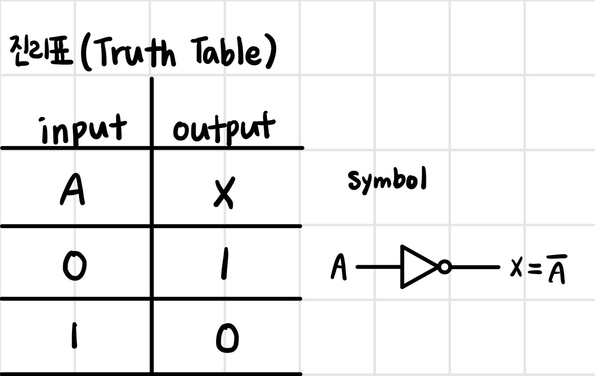
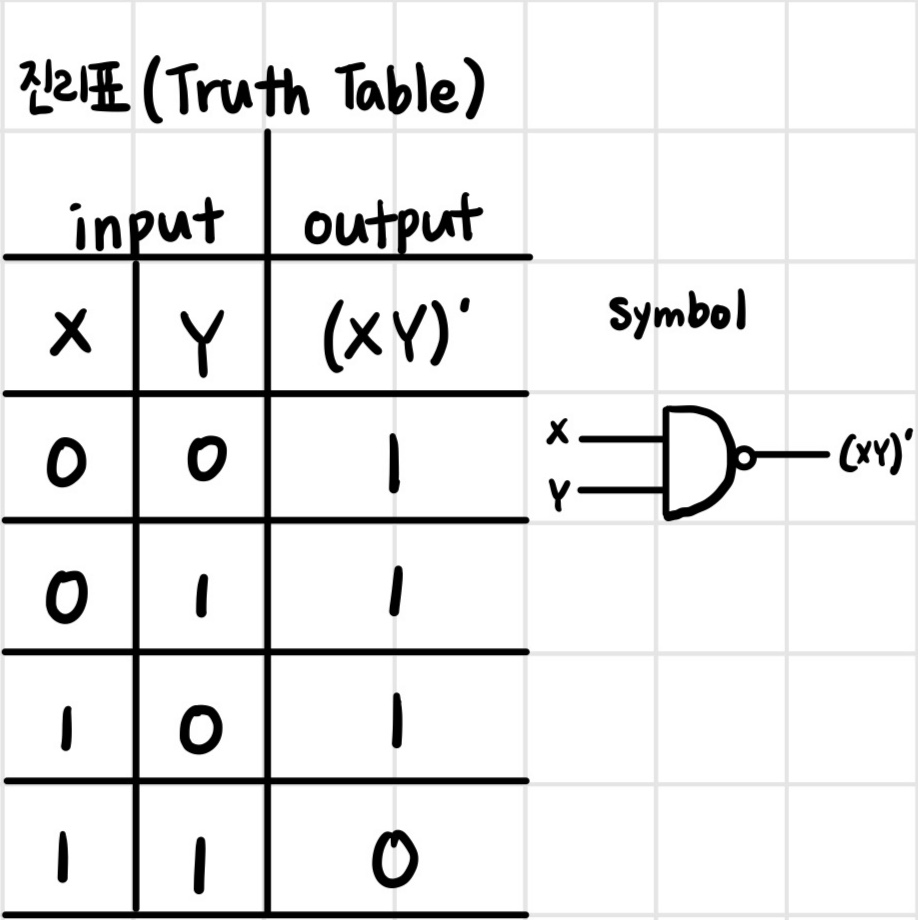
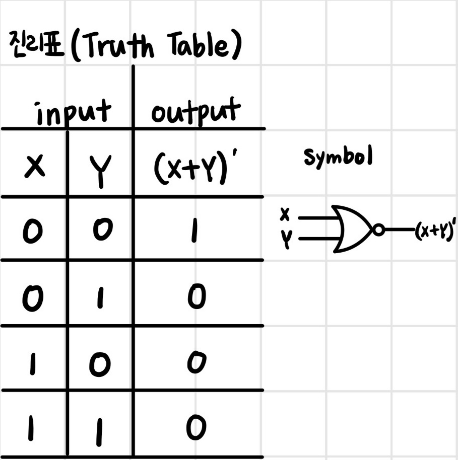
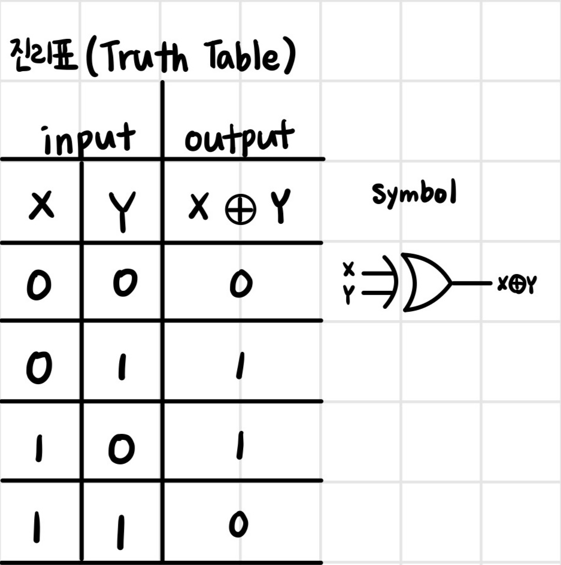
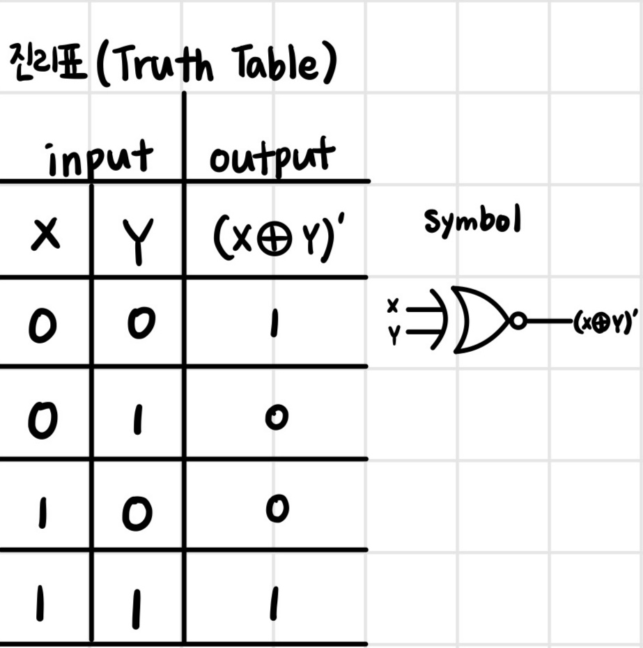

# logic circuit (논리회로) 학습

## Digital Design

- 컴퓨터를 포함한 많은 디지털 기기에서 디지털 하드웨어 내에 있는 디지털 전자 회로의 설계
- 회로는 논리라고도 불린다

## Definition of the **Digital**

- Digit: 사람의 손가락이나 발가락
    - 아라비아 숫자 (0, 1, 2, ... , 9)

- Digital: 사람의 손가락으로 셀 수 있는
    - 디지털(digital)과 이산(discrete)을 동의어로 사용

## Analog signal

- 아날로그 신호는 연속적인 변수를 가진다
    - 예) 소리, 목소리, 영상
- 자연에서 측정될 수 있는 대부분은 아날로그 형태로 나타난다
    - 예) 하루 동안의 기온

### How to convert analog signal -> digital signal

1. 아날로그 신호를 샘플링(Sampling)한다
    - 이산 시간 신호를 생성한다
2. 샘플링된 데이터를 양자화(Quantization)한다
    - 샘플링된 데이터 정밀도를 설명하기 위해 제한된 수의 비트를 사용하는 양자화가 필수

- 아날로그 데이터를 디지털로 표현하는 것은 샘플링과 양자화를 통해 가능하다

## Sampling theorem

- 데이터가 **가장 높은 데이터 빈도의 2배 이상의 비율** 로 **일정한 시간 간격** 으로 샘플링된 경우, 샘플에는 원본 데이터의 모든 정보가 포함된다
- Nyquistrate(나이키스트 레이트): 원신호를 복원할 수 있는 최소의 주파수
    - $f_s \ge 2f_m$
- 예) 사람이 들을 수 있는 가장 높은 빈도는 20kHz
    - 40kHz이상으로 샘플링하면 샘플은 모든 정보를 가진다

### Sampling theorem & Quantization Error

- 샘플을 충분히 자주 추출하면 원본 아날로그 데이터를 완벽하게 복원할 수 있음
- 하지만 양자화 에러로 인해 원본을 완벽하게 복원할 수 없음...

## Example of Audio Coding

- `cd(compact disc)`
    - PCM(Pulse Coded Modulation): 16bit/44.1kHz(1411.2kbps)
    - CD ripping: waveform audio format(.wav)
    - 무손실 압축: FLAC(Free Lossless Audio Coding), ALAC(Apple Lossless Audio Coding),(.ape)
    - 손실 압축: MP3(56kbps, 196kbps)

- `sacd(super audio cd)`
    - 24bit/192kHz(9.216mbps)

- `dsd(direct stream digital)`
    - PDM(Pulse Density Modulation)
        - dsd64: 1bit 2.8224mHz
        - dsd128: 1bit 5.6448mHz
    - 32bit/768kHz(49.152mbps)
    - 확장자: .dff, .dsf

## Digital advantages

- `Data Processing`(데이터 처리): 더 효율적이게
- `Data Transmission`(데이터 전송): 더 믿을 수 있게
- `Data Storage`(데이터 저장): 더 작게

- 복사본은 원본과 완전히 같을 수 있다 -> 정보 공유
- 우리의 삶에서 디지털(digital)은 공유(sharing)와 같다

## Digital Hardware System

- Computer: Power supply, PCBs(Printed circuit boards, mother board), storage units(Hard disk, Solid state disk, DVD, CD-ROM, ...)
- Mother board: CPU, storage(ROM/RAM), I/O interface, plugged-in slots
- **Chip: sub-circuit(logic gates)**

### Digital Hardware Components

- Standard Chip
    - 1980년대 초까지 논리 회로를 구축하는데 자주 사용됨
    - Drawback: 고정적 기능과 비효율적 공간
- Programmable Logic Devices
    - FPGA(Field-Programmable Gate Array)
- Custom-Designed Chips
    - custom or semi-custom design
    - ASIC(Application Specific Integrated Circuit)

## Binary Number

- $a_5a_4a_3a_2a_1a_0 . a_{-1}a_{-2}a_{-3}$  
    = $a_nr^n+a_{n-1}r^{n-1}+\dots+a_2r^2+a_1r+a_0+a_{-1}r^{-1}+a_{-2}r^{-2}+\dots+a_{-m}r^{-m}$
- $a_i$: coefficient(계수)
- $r$: base(진수)

### Number Base Conversions

- 10진수 -> 2진수
    1. 주어진 수를 2로 나눈다
    2. 나누었을 때의 몫이 0이 될 때까지 1.을 반복한다
    3. 나머지를 뒤에서부터 적는다

- 10진수 -> 8진수
    1. 주어진 수를 8로 나눈다
    2. 나누었을 때의 몫이 0이 될 때까지 1.을 반복한다
    3. 나머지를 뒤에서부터 적는다

- 10진수(소수 0.xxxx) -> 2진수
    1. 주어진 수에 2를 곱한다
    2. 소수점 뒤의 수가 0이 될 때까지 1.을 반복한다
    3. 소수점 앞 숫자들을 앞에서부터 적는다

.jpg)

## Logic Gates

- Basic Logic Gates
    - `AND`
    - `OR`
    - `NOT`
- Related Logic Gates
    - `NAND(AND-NOT)`
    - `NOR(OR-NOT)`
    - `X-OR`
    - `X-NOR`

### AND

- X AND Y = XY or X*Y
- 불 대수(Boolean Algebra)에서 곱셈과 같음

- **입력이 모두 1일 경우 출력이 1**

### OR

- X OR Y = X+Y
- 불 대수에서 덧셈과 같음

- **입력 중 하나라도 1일 경우 출력이 1**

### NOT(Inverter)

- X = $\bar A$ or X = A'
- Not A = A complement = A prime = A bar

### NAND

- X NAND Y = (XY)'

### NOR

- X NOR Y = (X+Y)'

### Exclusive-OR(X-OR)

- X XOR Y = XY'+X'Y = X⊕Y
- Mod 2 addition

### Exclusive-NOR(equivalence)

- X XNOR Y = XY+X'Y' = (X⊕Y)'
- 두 입력이 서로 같으면 1, 다르면 0

## Boolean Algebra

- 1850년대에 George Boole이 개발한 기호로 논리 진술을 공식화하는 시스템
- 논리 문제를 일반적인 대수처럼 쓰고 풀 수 있음
- Constants(상수)
    - True and False
    - 1 and 0
- Variables(변수)
    - 불 상수인 값을 저장하는 변수

### Properties of Boolean Algebra

- Duality
    - Interchange OR and AND operators
    - 예) $X + 0 = X ↔ X * 1 = X$
        - X OR 0일 때 0은 False이므로 X의 값에 따라 X + 0이 결정됨   
        즉, X가 0이면 0이고 X가 1이면 1이됨
        - X AND 1일 때 X가 1인 경우에만 XY가 1이 되고 나머지 X가 0인 경우에는 XY가 0이 됨
    
- Operator precedence(연산자 우선순위)
1. Parentheses(괄호)
2. NOT
3. AND
4. OR

- Basic OR, AND operation
    - $x + 0 = x ↔ x * 1 = x$
    - $x + x' = 1 ↔ x * x' = 0$
    - $x + x = x ↔ x * x = x$
    - $x + 1 = 1 ↔ x * 0 = 0$

- Involution
    - (영한사전) 거듭제곱법, 누승법
        - 불 대수에선 이중 부정으로 이해
    - $(x')' = x$

- Commutative
    - (영한사전) 가환성의(제시된 수의 순서에 상관없이 결과가 동일한)
        - 수학에서의 교환법칙이라고 이해
    - $x + y = y + x ↔ xy = yx$

- Associative
    - (영한사전) 결합의
        - 수학에서의 결합법칙이라고 이해
    - $x + (y + z) = (x + y) + z ↔ x(yz) = (xy)z$
