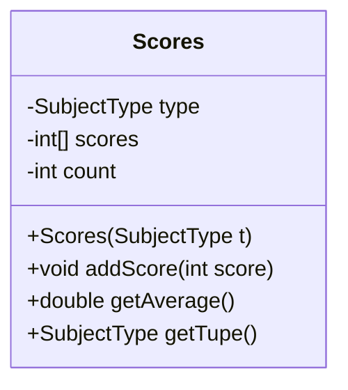

# object oriented programming(객체 지향 프로그래밍) 학습

- 상명대학교 컴퓨터과학전공 조용주 교수님께서 임좌상 교수님과 함께 저술하신 [한번에 이해되는 자바 프로그래밍]이라는 책을 기반으로 공부하였음

## Chapter 1

### 변수와 대입 연산

- 기억 장소의 필요성
    - 프로그래밍: 주어진 문제를 컴퓨터를 이용해서 해결하는 과정
    - 문제 해결 과정에서 무언가를 기억해야 하는 부분 필요

- 변수는 상자 같은 저장소
    - 값을 기억하기 위해 변수 사용
    - 컴퓨터에서는 CPU(중앙 처리 장치)와 메모리가 각각 계산과 기억 담당
    - 컴퓨터의 메모리는 바이트(byte)라고 불리는 일정한 크기의 공간들이 연속적으로 붙어있는 형태
        - 값을 기억하기 위해 상자(공간)에 값을 넣으면 그게 어디인지 알아야 함
        - 메모리에 번호(주소)가 붙음
    - 변수를 이용해 메모리의 특정 영역을 지정하고, 값을 기록하거나 확인
    - 메모리의 주소를 기억하기 쉬운 단어 형태로 바꾸어 놓은 것이 변수 이름

- 변수 이름과 값
    - 변수 이름은 메모리 공간 또는 공간에 있는 값을 나타냄

- 변수 생성 방법과 초기화
    - 변수는 사용하기 전에 생성해야 하고, 자료형을 지정해야 함
    - 변수를 생성하는 과정 = 변수를 정의한다
        - 변수의 이름을 프로그램에서 사용하겠다고 알리고, 컴퓨터 메모리에 변수의 값을 저장할 수 있는 공간을 확보한다
    - **자료형 변수_이름 [= 초기값];**
        - int num;
        - int num; num = 3;
        - int num = 3;
    - 초기값이 주어지지 않으면 쓰레기 값이 저장됨
    - 초기값을 지정하지 않으면 스스로 초기화를 시키거나 오류 발생
        - 초기값이 주어지지 않으면 0으로 초기화됨
        - 초기화시키지 않은 변수 사용 시 오류 발생

- 식별자(변수, 클래스, 함수) 이름 짓기 규칙
    - 알파벳 영문자, 밑줄 문자(_), 또는 달러 문자($)로 시작
        - 관례적으로 알파벳 영문자로 시작
    - 두번째 글자부터는 숫자도 사용 가능
    - 공백 문자, 특수 기호(달러 문자 제외) 사용 불가
    - 자바의 키워드 사용 불가
    - 영문 대문자와 소문자 구별
    - 이름의 길이는 무제한
        - 너무 길지 않으면서 의미가 뚜렷한 것이 좋음
    - 관례적으로 카멜 표기법 사용
        - 단어를 여러 개 붙여서 이름을 만들 때 각 단어의 시작 글자만 대문자로 표기
        - 관례적으로 클래스는 대문자, 함수와 변수 이름은 소문자로 시작
    - 키워드   
        |키워드|키워드|키워드|키워드|키워드|키워드|
        |:---|:---|:---|:---|:---|:---|   
        |abstract|assert|boolean|break|byte|case|
        |char|catch|class|const|continue|default|
        |do|double|else|enum|exports|extends|
        |false|final|finally|float|for|goto|
        |if|implements|import|instanceof|int|interface|
        |long|module|native|new|null|package|
        |private|protected|public|requires|return|short|
        |static|strictfp|super|switch|synchronized|this|
        |throw|throws|transient|true|try|var|
        |void|volatile|while|

- 대입 연산자
    - 변수에 초기값을 지정하거나 또는 값을 저장할 때 사용되는 '=' 기호
    - 기호 오른쪽에 있는 값을 왼쪽에 있는 변수에 저장하라는 의미
    - 왼쪽에는 변수, 오른쪽에는 값을 적는다
    - 오른쪽에 변수가 있다면 이 변수는 값 의미
    - 오른쪽에 변수가 여러 개 있다면 변수들 모두 값 의미

- 변수와 자료형
    - 기본 자료형(기본형): 자바 언어에서 기본적으로 제공하는 자료형
        - 사람들이 컴퓨터에서 많이 사용하는 값
        - **byte, short, int, long, float, double, char, boolean**
        - 각 자료형이 표현할 수 있는 값의 종류와 범위가 명확함
    - 참조 자료형(참조형): 기본형이 아닌 모든 자료형
        - 참조값(주소값)을 가지는 자료형
        - **String, 배열, 클래스, 인터페이스**    
    
    - 같은 자료형으로 생성된 변수들은 다른 변수값을 저장할 수 있음
    - 자료형이 달라도 값을 저장할 수 있는 경우가 있음
        - 같은 종류인데 크기에 따라 다른 것들로 분류되는 것들
            - 정수형과 실수형
    - 값을 객체로 표현하기 위해 각 자료형에 대응하는 클래스 자료형이 있음
        - 래퍼 클래스(wrapper class)

- 기본형
    |기본형|메모리 크기(bits)|범위 (최소~최대)|래퍼 클래스|
    |:---|:---|:---|:---|
    |byte|8|-128~127|Byte|
    |short|16|-32768~32767|Short|
    |int|32|-2147483648~2147483647 (약 21.4억)|Integer|
    |long|64|-9223372036854775808~9223372036854775807|Long|
    |float|32|1.4E-45~3.4028235E38 (E-45는 10-45승)|Float|
    |double|64|4.9E-324~1.7876931348623157E308|Double|
    |char|16|0~65535|Character|
    |boolean|8|true, false|Boolean|

    - 정수형
        - 다뤄야 하는 자료의 종류에 따라 다른 자료형 사용 가능
        - 기본은 int, 보통 가장 빠르게 처리됨
        - 변수의 자료형이 표현할 수 있는 범위 밖의 값을 저장하면 오류 발생
        - 큰 범위의 자료형 변수에서 작은 범위의 자료형 변수로 저장할 때 값이 유실될 수 있음
        - 정수 뒤에 영문자 'l' 또는 'L'을 붙이면 long형으로 취급
    
    - 실수형
        - 소수점이 붙은 숫자들을 표현하는데 사용
        - 숫자 뒤에 'f' 또는 'F'를 붙이면 float형
        - 큰 범위에서 작은 범위로 저장은 오류 발생
        - 작은 범위에서 큰 범위로 저장은 허용되나 오차 발생 가능성 있음
        - 가능하면 double 사용
    
    - 문자형
        - 문자 한 개를 표현
        - 작은 따옴표(') 사용
    
    - 이스케이프 시퀀스
        - 화면에 안 보이는 글자들과 따옴표같이 특별한 용도로 사용되는 글자들을 코드에서 문자 또는 문자열로 표현할 때 사용됨
        - 항상 백슬래시('\\')로 시작
        
        |이스케이프 시퀀스|설명|   
        |:---|:---|   
        |\\\\ | 백슬래시, \\ |
        |\\\' | 작은 따옴표, ' |
        |\\\" | 큰 따옴표, " |
        |\\n | 줄바꿈 문자|
        |\\t |탭 문자|

    - 불린형
        - 참(true)과 거짓(false) 의미
    
- 숫자 상수
    - 코드에 숫자 값을 직접 표기하는 것  

    |수|자료형|설명|
    |:---|:---|:---|
    |7, -10, 0|int|소수점이 없음|
    |0.7|double|소수점이 있음, 실수|
    |.7|double|소수점 앞 0 생략 가능|
    |7.|double|소수점 뒤에 숫자가 없으면 0 생략|
    |7E5|double| $7 \times 10^5$ 표현|
    |7E-5|double| $7 \times 10^{-5} $ 표현|
    |7.2E-3|double| $7.2 \times 10^{-3} $ 표현|

- 대입 연산자와 자료형
    - 대입 연산자의 왼쪽 변수와 오른쪽 값의 자료형은 같아야 함
    - 작은 범위를 큰 범위로 저장하는 것은 일반적으로 허용
    - 큰 범위를 작은 범위로 저장하는 것은 오류 발생

- 자료형 변환
    - 대입 연산자의 왼쪽과 오른쪽 자료형이 다른 경우 자료형 불일치 발생
    - 작은 범위를 큰 범위로 저장하는 것은 자동 자료형 변환 발생
    - 강제 형 변환: 강제로 자료형을 변환하는 것
    - 값이 저장될 변수의 범위를 넘지 않으면 강제 형변환을 통해 변환 후 사용 가능
        - **변수 = (변환_자료형) 값;**
    - 실수형을 정수형으로 변환 시 소수점 이하 부분이 사라짐
    - 만능이 아니므로 프로그래머가 예측 가능한 경우에만 사용해야 함

### 산술 연산

- 수학의 사칙연산 같은 것
- 똑같은 우선 순위를 가짐(곱셈/나눗셈/나머지 > 덧셈/뺄셈)
- 곱셈 연산자는 '*', 나누기 연산자는 '/', 정수의 나머지 연산자는 '%'
- **System.out.println()** 기본형 출력 가능

- 자료형의 최소값, 최대값 및 System.out.printf() 함수
    - 최소값, 최대값 확인
        - 래퍼클래스.MIN_VALUE, 래퍼클래스.MAX_VALUE
    - **System.out.printf()**
        - 서식에 맞춰 값을 화면에 출력하는 함수
        

        |서식 지시어|설명|
        |:---|:---|
        |%%|% 글자를 화면에 출력|
        |%n 또는 \\n|줄바꿈 문자 출력|
        |%d|인자로 전달되는 정수값 출력|
        |%f|인자로 전달되는 실수값 출력|
        |%c|인자로 전달되는 문자 출력|
        |%s|인자로 전달되는 내용을 문자열 형태로 변환해서 출력|
        |%h|인자의 해시코드를 출력. 주로 참조값을 출력할 때 사용|
        |%b|불린값을 true 또는 false로 출력. %s로 지정해도 같은 결과|
        |%B|불린값을 대문자로 출력|

### 사용자로부터 키보드 입력 받기

- 외부 패키지의 클래스 사용하기
    - 사용자로부터 입력을 받으려면 java.util 패키지의 Scanner 클래스를 사용해야 함
    - 클래스 명시 방법
        - 패키지 이름과 클래스 이름 명시
        - **패키지_이름.클래스_이름 변수_이름;**
        - **java.util.Scanner sc = new java.util.Scanner();**
        - import 키워드를 사용해서 패키지의 클래스 명시
        - **import 패키지_이름.클래스_이름;**   import java.util.Scanner;
        - **클래스_이름 변수_이름**     Scanner sc = new Scanner();
    - 패키지의 모든 클래스 import 하기  **import java.util.*;**

- 사용자로부터 입력 받기
    - 키보드를 통해서 입력받는다면 Scanner 클래스 객체 생성자에 System.in 전달
    - Scanner 클래스가 제공하는 입력용 함수
    
    |함수|설명|
    |:---|:---|
    |String next()|다음 입력을 문자열 형태로 받음. 공백 문자를 만날 때까지 입력된 모든 문자들을 문자열 형태로 반환|
    |String nextLine()|줄바꿈 문자를 만날 때까지 입력된 모든 문자들을 있는 그대로 문자열 형태로 반환(줄바꿈 문자 제거)|
    |byte nextByte()|다음 입력을 byte형 정수로 받음|
    |short nextShort()|다음 입력을 short형 정수로 받음|
    |int nextInt()|다음 입력을 int형 정수로 받음|
    |long nextLong()|다음 입력을 long형 정수로 받음|
    |float nextFloat()|다음 입력을 float형 실수로 받음|
    |double nextDouble()|다음 입력을 double형 실수로 받음|

    - 실습 문제 1: 단어와 숫자 입력 받기
        - 사용자로부터 문자열과 정수를 순차적으로 입력 받고, 그 내용을 바로 화면에 출력하는 프로그램 작성
        - 문자열을 입력 받고 화면에 출력, 정수를 입력 받고 출력
        - 문자열은 1개 단어로 구성, 정수는 int형 범위 내의 값
        ```java
        import java.util.Scanner;

        class Scanner1{
            public static void main(String[] args){
                Scanner sc = new Scanner(System.in);
                String s = sc.next();
                System.out.println(s);
                int num = sc.nextInt();
                System.out.println(num);
            }
        }
        ```
 
    - 실습 문제 2: nextLine() 메소드로 입력 받기
        - 문자열을 문장 단위로 입력 받고 화면에 출력하는 프로그램 작성
        - "hello 1"과 "   hello   1"의 차이 확인
        - Scanner 클래스의 nextLine() 이용
        - 프로그램의 이름은 ReadLine
        ```java
        import java.util.Scanner;

        class ReadLine{
            public static void main(String[] args){
                Scanner sc = new Scanner(System.in);
                String s = sc.nextLine();
                System.out.println(s);
            }
        }
        ```
 
- 입력 버퍼
    - 키보드로 입력할 때 입력 버퍼가 사용됨
    - 입력 버퍼: 사용자가 입력한 내용을 임시로 저장해두는 메모리 공간
    - next~() 함수들이 실행되고 입력을 기다릴 때 사용자가 입력한 내용은 모두 입력 버퍼에 저장됨
    - 입력 버퍼에서는 어떤 글자까지 처리했는지 파악하기 위해 입력 포인터 사용
    - 입력 포인터: 입력 버퍼에서 다음에 사용하게 될 글자의 시작 위치를 나타내는 주소값
    - 실습 문제 3: 온도 변환, 화씨 온도를 섭씨 온도로 변환해보기
        - 화씨 23도를 섭씨 온도로 변환하는 프로그램 작성
        - 결과 값은 소수 둘 째 자리까지 출력
        - 화씨 = 섭씨 * (9 / 5) + 32
        - 섭씨 = (5 / 9) * (화씨 - 32)
        ```java
        public class ConvertF23toC{
            float fahrenheit = 23;
            float celsius = ((float) 5 / 9) * (fahrenheit - 32);
            System.out.printf("%.2f \n", celsius);
        }
        ```
 
    - 실습 문제 4: 사용자에게 입력 값을 받아서 더하기
        - 두 개의 숫자를 입력 받아서 합을 구하는 프로그램 작성
        - 사용자는 두 개의 숫자를 입력
        - 정수일 수도 실수일 수도 있음
        - 문자열로 입력 받고 Integer 클래스의 parseInt() 또는 Float 클래스의 parseFloat() 함수 사용해 문자열을 숫자로 변환해서 사용
        ```java
        import java.util.Scanner;

        public class Add2Nums{
            public static void main(String[] args){
                Scanner sc = new Scanner(System.in);

                String s = sc.next();
                float num1 = Float.parseFloat(s);
                s = sc.next();
                float num2 = Float.parseFloat(s);
                System.out.println(num1 + num2);
            }
        }
        ```
 
        - 기본형 중에서 숫자형을 포장하는 클래스들과 Boolean 클래스는 문자열을 값으로 변환해주는 함수들을 포함
            - parseType() 형태로 구성
            - 객체를 생성하지 않고 **클래스이름.parseType()** 형태로 사용
    
    - 실습 문제 5: 사용자에게 화씨 온도를 입력 받아 섭씨 온도로 변환하기
        - 사용자로부터 화씨 온도를 입력 받고, 섭씨 온도로 변환한 후에 화면에 출력하는 프로그램 작성
        - 사용자가 입력하는 화씨 온도는 실수 값
        - 변환된 섭씨 온도는 소수 첫 째 자리까지만 출력
        - 사용자는 화씨 온도를 제대로 입력할 것이라고 가정
        ```java
        import java.util.Scanner;

        public class FtoC{
            public static void main(String[] args){
                Scanner sc = new Scanner(System.in);
                float fahrenheit = sc.nextFloat();
                float celsius = ((float)5 / 9) * (fahrenheit - 32);
                System.out.printf("%.1f \n", celsius);
            }
        }
        ```
 
### 연산자

- 자바에는 약 30여 개 연산자가 있음
- 사칙 연산자, 나머지 연산자
- 비교 연산자, 논리 연산자
- 자바에 특화된 연산자

- 부호 연산자
    - 양수와 음수를 표현하는 부호 연산자(+, -)
    - 대표적인 단항 연산자
    - 변수 앞에도 연산자 사용 가능
        - 변수값을 바꾸는 것이 아니라 결과 값만 부호 변경

- 증감 연산자
    - 변수값을 1만큼 증가(++) 또는 감소(--)
    - 변수 앞 또는 뒤에 위치할 수 있고, 장소에 따라 다른 결과가 나타남
        - 앞에 위치: 변수값이 사용되기 전에 1증가 또는 감소
        - 뒤에 위치: 변수값 사용 후 1증가 또는 감소

- 복합 연산자
    - 대입 연산자와 산술 연산자를 함께 묶어서 줄여 쓸 수 있는 방법

    |사용 예|설명|
    |:---|:---|
    |a += b| a = a + b|
    |a -= b| a = a - b|
    |a *= b| a = a * b|
    |a /= b| a = a / b|
    |a %= b| a = a % b|

- 연산자 우선 순위

|우선 순위|연산자|설명|
|:---:|:---|:---|
|1|(), [], .|괄호, 배열 인덱스, 종속 연산자|
|2|!, ~, ++, --, +, -, (type)|부정(논리), 부정(비트), 증가, 감소, 부호, 형변환|
|3|*, /, %|곱셈, 나눗셈, 나머지|
|4|+, -|덧셈, 뺄셈|
|5|<<, >>, >>>|비트 단위의 쉬프트(shift)|
|6|<, <=, >, >=|작다, 작거나 같다, 크다, 크거나 같다|
|7|==, !=|같다, 다르다|
|8|&|비트 단위의 논리 연산(and)|
|9|^|비트 단위의 논리 연산(xor)|
|10|\||비트 단위의 논리 연산(or)|
|11|&&|논리곱|
|12|\|\||논리합|
|13|?:|조건|
|14|=, +=, -=, *=, /=, %=, <<=, >>=, &=, ^=, ~=|대입, 복합 연산자|

|우선 순위|종류|대표 연산자|
|:---:|:---|:---|
|1|단항 연산자|부호, 증감 연산자|
|2|산술 연산자|덧셈, 뺄셈, 곱셈, 나눗셈, 나머지 등|
|3|비교 연산자|크기 비교, 같다, 다르다|
|4|논리 연산자|논리곱, 논리합|
|5|조건 연산자|?:|
|6|대입 연산자|=, 복합 연산자|

### 배열

- 배열: 연관된 자료들을 여러 개 사용할 때 변수 이름 한 개로 여러 값을 저장하고 사용할 수 있음
- 여러 개의 변수를 붙여놓은 것
    - 이름을 한 개로 붙여서 사용
    - 배열을 구성하는 각 변수가 요소
    - 배열의 요소는 0, 1처럼 번호를 붙여서 사용(인덱스)
    - 자바에서 인덱스는 0부터 시작
    - **배열이름[인덱스]**

- 배열 생성 방법
    - 배열 선언
    - **자료형[] 변수명;**
    - **자료형 변수명[];**
    - 배열 메모리 공간 확보
    - 초기값 지정
    - **자료형[] 변수명 = {초기값1, 초기값2, ..., 초기값n};**
    - new 사용
    - **자료형[] 변수명;    변수명 = new 자료형[배열_크기];**
    - 선언과 공간 확보를 함께
    - **자료형[] 변수명 = new 자료형[배열_크기];**

- 배열 사용 방법
    - 배열 요소는 인덱스를 이용해 접근 가능
    - arr[0] = 1;   arr[1] = 2;

- 배열의 크기
    - 배열의 크기를 확인 하고 싶을 때
    - **배열_이름.length**
    - 배열 요소에 접근 시 자료형에 주의해야 함
    - 인덱스 범위를 벗어나면 오류 발생

- 실습 문제 6: 배열 크기 및 요소 출력
    - 배열을 1.1, 2.3, 4.7, 7.5로 초기화시켜 생성하고, 배열의 크기 및 요소들을 화면에 출력
    - 배열을 생성하면서 값을 지정할 것
    ```java
    public class Array6{
        public static void main(String[] args){
            double arr[] = {1.1, 2.3, 4.7, 7.5};

            System.out.println(arr.length);

            System.out.println(arr[0]);
            System.out.println(arr[1]);
            System.out.println(arr[2]);
            System.out.println(arr[3]);
        }
    }
    ```

- 실습 문제 7: 배열 생성 후 요소 값 저장 및 출력
    - 4개짜리 배열을 먼저 생성하고 각 요소에 1.1, 2.2, 3.3, 4.4를 저장한 뒤, 배열의 크기와 각 요소를 화면에 출력
    - double형으로 지정하고, 소수점 첫 째 자리까지 출력
    ```java
    public class Array7{
        public static void main(String[] args){
            double arr[] = new double[4];

            arr[0] = 1.1;
            arr[1] = 2.2;
            arr[2] = 3.3;
            arr[3] = 4.4;

            System.out.println(arr.length);

            System.out.printf("%.1f \n", arr[0]);
            System.out.printf("%.1f \n", arr[1]);
            System.out.printf("%.1f \n", arr[2]);
            System.out.printf("%.1f \n", arr[3]);
        }
    }
    ```
 
### 연습 문제

1. 사용자로부터 실수값으로 초(seconds)를 입력 받고 시, 분, 초에 해당하는 값을 구하고 "시:분:초" 형태로 출력하는 프로그램 작성, 시, 분, 초는 정수로 출력한다.
```java
import java.util.Scanner;

public class Prac1{
    public static void main(String[] args){
        Scanner sc = new Scanner(System.in);

        double seconds = sc.nextDouble();

        int hour = (int)(seconds / 3600);
        seconds = (int)(seconds % 3600);
        int minute = (int)(seconds / 60);
        int second = (int)(seconds % 60);

        System.out.printf("%d:%d:%d\n", hour, minute, second);
    }
}
```

2. 자바의 System.currentTimeMillis() 함수는 세계 표준 시간 UTC로 1970년 1월 1일 0시부터 현재 시각까지의 차이를 1/1000초 단위로 알려준다. 이를 이용해서 현재 시각을 UTC 기준으로 찾아내는 프로그램을 작성한다. 출력하는 방법은 Year는 현재 년도, Day는 1월 1일부터 몇 일 째인지, 시각은 시:분:초 형태로 출력한다. 윤년은 고려하지 않고, 1년은 365일로 가정한다.
**Year: 2020 Days: 248 Time: 3:14:7 UTC**
```java
public class Prac2 {
    public static void main(String[] args) {
        long seconds = System.currentTimeMillis();
        seconds = seconds / 1000;
        int year = 1970 + (int)(seconds / 31546000);
        seconds = (int)(seconds % 31546000);
        int days = (int)(seconds / 86400);
        seconds = (int)(seconds % 86400);
        int hour = (int)(seconds / 3600);
        seconds = (int)(seconds % 3600);
        int minute = (int)(seconds / 60);
        seconds = (int)(seconds % 60);

        System.out.printf("Year: %d Days: %d Time: %d:%d:%d UTC\n", year, days, hour, minute, seconds);
    }
}
```
3. 예전 운영체제에서 시간을 측정할 때 32비트 정수를 사용해서, 2038년도 일정 시점이 지나면 오버플로우가 발생하는 문제가 있었다. 오버플로우가 발생하는 시각이 UTC 기준으로 언제인지 구한다. 윤년은 고려하지 않고, 1년은 365일로 월은 30일로 계산한다.
**Year: 2038 Month: 2 Day: 5 Time: 3:14:7 UTC**
```java

```

4. 사용자로부터 a, b, c에 해당되는 세 개의 int형 정수를 입력 받고 $ax^2 + bx + c = 0$ 이라는 이차방정식의 해를 구해서 출력하는 프로그램을 작성한다. 해를 구하는 것은 근의 공식을 이용한다. $b^2 - 4 \times a \times c >= 0$ 조건을 만족하는 정수 a, b, c 값을 사용자가 입력한다고 가정하고, 제곱근은 Math.sqrt() 함수를 사용해서 구한다.
```java

```

5. 사용자로부터 R1, R2, Height 값을 double형으로 입력 받고, R1을 윗면, R2를 밑면, Height를 높이로 하는 원뿔대의 부피를 구해서 출력하는 프로그램을 작성한다. 원주율 값은 3.14로 계산한다. ($V = \frac{1}{3} \times \pi \times (R1^2 + R1 + R2 + R2^2) \times Height $)
```java

```

6. 사용자로부터 온도(화씨)와 풍속(m/s)을 입력 받고, 체감 온도를 계산하고 화면에 출력하는 프로그램을 작성한다.
(체감 온도 = $13.12 + 0.6215 \times T - 11.37 \times V^{0.16} + 0.3965 \times V^{0.16} \times T$ (T는 기온 V는 풍속))
```java

```

7. 사용자로부터 문자 5개를 입력 받고 배열에 저장한 후에 해시 값을 구해서 화면에 출력하는 프로그램을 작성한다. 해시 값은 소수 둘째 자리까지 출력한다. 만약 문자들을 저장한 배열이 s라고 가정할 때 아래 공식에 따라 해시 값을 계산한다. 첫 번째로 입력한 문자가 s[0], 두 번째는 s[1]에, 그리고 나머지 문자들도 순서대로 저장된다고 가정한다. 승수 계산은 Math.pow(x, y)함수를 사용한다.
($s[0] \times 31^{(n-1)} + s[1] \times 31^{(n-2)} + ... + s[n-1] \times 31^0$)
```java

```

8. 사용자에게서 5개 정수를 입력 받을 때까지 프로그램을 실행시키면서, 매 숫자 입력 후에 그때까지 입력된 모든 정수값들의 합을 계산해서 출력하는 프로그램을 작성한다.(반복문 사용 없이)
```java

```

9. 사용자로부터 두 개의 double형 실수를 입력 받고, 두 수의 덧셈, 뺄셈, 곱셈, 나눗셈 연산 결과를 출력하는 프로그램을 작성하라.
```java

```

10. 배열을 1, 3, 5, 7, 9로 초기화하고 배열 요소의 합과 평균을 구하는 프로그램을 작성한다.(반복문 사용 없이)
```java

```

11. 배열을 문자열 "one", "two", "three"로 초기화시키고, 각 문자열을 화면에 순서대로 출력하는 프로그램을 작성한다.(반복문 사용 없이)
```java

```

12. 다음 표는 특정 시기 서울의 미세먼지 현황을 보인다. 7일 동안의 PM2.5와 PM10의 평균을 계산해서 화면에 출력한다. 단 PM2.5와 PM10 데이터를 각각 배열에 초기화시킨 후에 평균을 구한다.(반복문 사용 없이)

| | | | | | | | |
|:---|:---:|:---:|:---:|:---:|:---:|:---:|:---:|
|PM2.5(초미세먼지)|29|21|18|34|67|79|18|
|PM10(미세먼지)|44|44|32|60|84|112|41|

```java

```

13. 사용자로부터 (x1, y1), (x2, y2)에 해당되는 정보를 double형으로 입력 받고 두 점 사이의 거리를 계산해서 출력하는 프로그램을 작성한다. 거리는 두 점 사이의 거리를 계산하는 공식을 이용한다.
($두 점 사이의 거리 = \sqrt{(x_2 - x_1)^2 + (y_2 - y_1)^2}$ )
```java

```

14. 헤론의 공식은 세 변의 길이만으로 삼각형의 넓이를 구하는 공식이다. 세변의 길이를 각각 a, b, c라고 할 때 사용자로부터 세 변의 길이를 입력 받고 삼각형의 면적을 계산해서 출력하는 프로그램을 작성한다.
($area = \sqrt{(s \times (s-a) \times (s-b) \times (s-c))}$ ) ( $s = \frac{a + b + c}{2}$ )
```java

```

15. 사용자로부터 삼각형을 이루는 세 점의 좌표를 입력 받고 면적을 구해서 출력하는 프로그램을 작성한다. 좌표는 정수로 입력 받는다.
```java

```

16. 한 달에 x원씩 연 이율 r%인 적금을 넣는다고 가정해보자. 이자 소득세율이 t%라고 가정할 때 1년 만기 후 내가 받을 수 있는 금액이 얼마인지 계산해서 출력하는 프로그램을 작성한다. 불입한 원금에 대한 이자만 계산하는 단리 계산 방식은 다음 공식에 따른다. 이자에 대한 소득세는 전체 이자 금액에 대해서 일정 비율 차감한다.
($interest = monthlyPayment \times n \times \frac{(n+1){2}} \times \frac{r}{12}$) (monthlyPayment: 월 납입액, n 개월, r = 연 이율(%) / 100)
사용자로부터 한 달에 넣는 납입액(원), 연 이율(%단위), 이자 소득 세율(%단위)을 입력 받고 사용자가 최종으로 받을 수 있는 금액을 계산해서 출력하는 프로그램을 작성한다.
```java

```

## Chapter 2

### 간단한 함수 만들어보기

- 함수: 특정 작업을 처리하도록 만들어진 한 줄 이상의 코드 묶음
- 함수 구현 방법
    ```
    반환_자료형 함수_이름(매개변수_리스트){
        //함수 코드
    }
    ```

    - 반환_자료형: 결과값의 자료형, 값을 반환하지 않을 경우 void, 값을 반환하는 코드에서는 return 키워드 사용
    - 매개변수_리스트: 함수에 전달하는 입력을 받을 변수의 리스트, 자료형 변수_이름으로 구성, 한 개 이상인 경우 콤마(',')로 분리, 입력이 없는 함수라면 빈 괄호 ()
    - 함수 코드는 {과 } 사이에 들어감

### 클래스가 뭐지?

- 객체 지향 프로그래밍을 하는 이유
    - 프로그램 = 데이터 + 코드
    - 객체 지향 프로그래밍은 데이터와 코드를 객체로 함께 구성해서 한 개 자료형으로 취급
    - 많은 객체 지향 언어들이 클래스라는 이름으로 데이터와 코드를 묶을 수 있는 기능을 제공함
    - 추상화, 재사용성, 캡슐화를 위해 필요

- 클래스 형식
    - 키워드 class로 시작
    - 데이터 - 멤버 변수
    - 절차 - 멤버 함수
    ```
    class 클래스명{
        자료형 변수명;
        ...
        자료형 함수명(인자...){

        }
    }
    ```
 
    - class: 클래스 선언, 앞에 접근 제어자나 static을 사용할 수 있다
    - 클래스_이름: class의 이름을 적는다, 카멜 표기법으로 지정하되 관례적으로 첫글자는 대문자로 시작한다
    - 변수_이름: 변수 이름을 적는다, 멤버 변수 또는 멤버 필드라고도 한다
    - 함수_이름: 함수 이름을 적는다, 멤버 함수라고 한다, main()함수가 포함될 수도 있다

- 객체와 클래스
    - 객체 지향 프로그래밍은 우리가 사는 세상에서 실제로 일어나는 일을 흉내 내어 프로그래밍 함
        - 주변에 있는 모든 것이 클래스가 될 수 있고, 프로그래밍 될 수 있음
        - 일반적으로 명사로 표현될 수 있는 것들은 모두 객체로 표현할 수 있다고 봄
    - 좋은 클래스를 만드는 것이 중요
        - 설계를 먼저 하는 것이 필요
    - 목적에 따라 클래스 내용이 달라질 수 있음
        - 좋은 클래스란 필요한 데이터들만 포함될 수 있도록 응집성 있게 만들어야 함
    - 객체는 프로그램에서 사용할 수 있도록 클래스로부터 생성한 것
    - 객체 생성: **객체_변수 = new 클래스_이름();**
    - 객체 사용: **객체_변수.멤버_함수_이름();**
    - 클래스는 객체의 속성과 함수를 선언한다
    - 클래스는 객체의 속성과 기능을 설명하는 자료가 된다

- UML로 클래스 그려보기
    - 클래스 다이어그램: 클래스를 그림 형태로 표현한 것
    - 3칸으로 구성(클래스 이름, 속성(변수와 값), 함수)
    - 책에서는 planttext 사이트 이용
    ```
    @startuml
    class Name{
        data
        code()
    }
    @enduml
    ```

### 객체 만들고 사용해보기

- new 연산자와 힙 공간
    - new 연산자는 힙이라는 메모리 공간에서 객체 영역을 할당 받은 뒤에 참조값을 반환
    - 공간이 없다면 null 반환
    -할당된 메모리 공간은 원할 때까지 또는 프로그램 종료 시까지 자유롭게 사용 가능
    - 가비지 콜렉션 기능 제공
        - 할당된 메모리 공간 중에서 더 이상 사용되지 않는 영역들을 찾아 힙 관리자에게 일괄적으로 반환

- 자바의 메모리 구조
    - 정적 메모리 영역
        - 컴파일할 때 결정되고 실행 중에 변하지 않는 것들
        - 자바 코드, 클래스의 정적 멤버 변수나 멤버 함수, 상수 들이 저장되는 메모리 공간
    - 스택 영역
        - 프로그램 실행 중에 증감하는 영역
        - 멤버 함수 내부에 생성된 지역 변수들과 매개 변수들이 저장됨
        - 함수가 호출되면 메모리가 할당되었다가 종료되면 사라짐
    - 힙 영역
        - 연속적인 메모리 공간을 대여함
        - 연속적인 공간이 없으면 null 반환

- 객체는 생성하는 것만으로 사용할 수 없음
    - 객체를 사용하려면 구별할 수 있어야 함 -> 변수 사용
    - 객체 생성 후 다른 변수에 저장도 가능

- 기본형 변수는 값, 클래스 변수는 참조값
    - 객체를 저장하는 변수는 참조값을 저장하는 참조형이다

- 객체 사용하기
    - 객체의 멤버 변수에 접근하거나 메소드 호출
    - 점 연산자('.') 이용
        - **객체_변수_이름.멤버_변수_이름;**
        - **객체_변수_이름.멤버_함수_이름();**
    - 점 연산자를 사용해도 클래스에서 허용된 범위 내에서만 접근 가능

### 문자열과 String 클래스

- 문자열 상수
    - 문자열: 한 개 이상의 문자, 숫자(문자로 취급), 기호 등을 나열해 놓은 것
    - 큰 따옴표 두 개 사이에 문자들을 넣어 표현
    - 문자열 상수(문자열 값): 코드에서 사용된 따옴표에 둘러싸인 문자열, 문자와 구별

- String 클래스와 문자열 변수
    - 자바에서 문자열을 저장하려면 String 자료형(참조형)을 사용
    - 변수를 정의할 때 초기값을 지정하는 것이 좋음
    - 덧셈 연산자(+)는 피연산자로 문자열을 취할 수 있음
        - 문자열과 숫자, 문자, 불린 값들과 더해지면 새로운 문자열 생성
        - 결합 순서는 왼쪽 -> 오른쪽
    - String 변수가 참조하는 문자열 내용은 바꿀 수 없음
        - 다른 문자열들이 저장될 수 있지만, 참조하는 문자열의 내용은 변경 불가
        - 수정하고 싶다면 새로 만들어서 저장(참조)해야 함

- 문자열 배열 만들기
    - **String[] 변수명 = {초기값1, 초기값2, ..., 초기값n};**
    - **String[] 변수명 = new String[배열 크기];**
    - 문자열 배열은 참조값을 저장하는 배열

- String 클래스의 대표적 메소드

|메소드|설명|
|:---|:---|
|int length()|문자열의 길이를 반환|
|char charAt(int index)|주어진 index 위치의 글자 반환|
|int compareTo(String aStr)|객체의 문자열과 aStr을 비교. 글자 단위로 비교해서 같으면 0, aStr리 사전적으로 뒤에 나오면 음수, 앞에 나오면 양수 반환. 대문자와 소문자 구별|
|int compareToIgnoreCase|객체의 문자열과 aStr을 비교. 글자 단위로 비교해서 같으면 0, aStr리 사전적으로 뒤에 나오면 음수, 앞에 나오면 양수 반환. 대문자와 소문자 구별하지 않음|
|String concat(String str)|객체의 문자열에 str을 붙인 새로운 문자열을 생성해서 반환|
|boolean contains(CharSequence seq)|seq로 주어진 문자열이 객체 문자열 내에 존재하면 true 반환, 없으면 false 반환|
|boolean endsWith(String suffix)|객체 문자열이 suffix로 주어진 문자열로 끝나면 true, 아니면 false|
|int indexOf(int ch)|객체의 문자열에서 ch로 주어진 문자가 처음 등장하는 위치의 인덱스 반환. 없으면 -1 반환|
|int indexOf(String str)|객체의 문자열에서 str로 주어진 문자열이 처음 등장하는 위치의 인덱스 반환. 없으면 -1 반환|
|String substring(int index)|index로 주어진 인덱스 글자부터 문자열 끝까지 복사해서 새로운 문자열로 반환|
|String substring(int start, int end)|문자열에서 start부터 end - 1 인덱스까지의 문자열을 복사해서 새로운 문자열로 반환|
|boolean isEmpty()|빈 문자열("")인지 확인 후 true 또는 false 반환|
|String trim()|객체 문자열의 시작 부분과 끝 부분에 있는 공백 문자들을 제거한 새로운 문자열 반환|
|String[] split(String regex)|regex로 구분해서 문자열을 분리해주는 함수|
|String[] split(String regex, int limit)|regex로 구분해서 문자열을 분리하는데 limit 개수까지만 분리|

- 수정할 수 있는 문자열 클래스

|메소드|설명|
|:---|:---|
|StringBuilder append(String str)|객체 문자열에 str에 주어진 문자열을 추가(연결시킴)|
|char charAt(int index)|주어진 index 위치의 글자 반환|
|StringBuilder delete(int start, int end)|인덱스 번호 start부터 end - 1까지 삭제(end에 있는 문자는 삭제 안됨)|
|char deleteCharAt(int index)|주어진 index 위치의 글자 삭제|

    - StringBuilder는 반드시 new 연산자를 이용해서 객체를 생성한 후에 사용해야 함

- 문자열로부터 정수, 실수 등 입력 받기
    - 기본형의 래퍼 클래스는 숫자들로 구성된 문자열로부터 숫자값을 추출하는 메소드 제공
        - 문자열이 숫자로만 구성되어야 함
    - Scanner 클래스를 이용해서 입력 버퍼를 통해서 입력 받는 것처럼 문자열에서 입력 받는 것이 가능

### 클래스에 속성 추가하기

- UML에서 객체에 속성 추가하기
    - **속성_이름: 자료형 [= 초기값]**
    - **함수_이름([매개_변수_리스트]): 반환하는_자료형**

- 멤버 변수와 멤버 함수의 순서 및 위치
    - 클래스에 포함된 멤버 변수는 각 객체의 메모리 공간에 따로 존재함
    - 클래스 내에 선언된 멤버 변수 또는 함수는 그 위치나 순서에 관계없이 모든 멤버 함수에서 접근하고 사용할 수 있음

- 멤버 변수와 초기값
    - 클래스 멤버 변수는 초기값이 지정되지 않으면 기본값으로 초기화

    |자료형|기본값|
    |:---|:---|
    |byte, short, int, long, float, double|0 (실수는 0.0)|
    |char|u0000(유니코드로 null 문자)|
    |String, 객체, 참조형|null|
    |boolean|false|

### 생성자와 this 참조

- 생성자
    - 객체를 생성할 때 한 번만 실행됨
    - 객체 멤버 변수를 초기화하기 위해 사용
    - 주로 한 번 정해지면 거의 변경되지 않거나 혹은 객체가 사용되기 전에 값이 정해져야 하는 것
    ```
    클래스_이름([매개_변수_리스트]){
        //생성자 코드
    }
    ```

    - 클래스 이름과 동일
    - 반환 자료형 없음, void도 사용하지 않음
    - 매개 변수는 있을 수 있음
    - 생성자가 없으면 기본 생성자가 자동 생성됨
    - 접근 제어자는 지정 가능하나 키워드는 사용 불가

- 기본 생성자
    - 매개 변수가 없는 생성자

- 생성자 오버로딩
    - 기본 생성자 말고 매개 변수가 있는 생성자도 있을 수 있음
        - 예: Scanner 클래스
        - **new 클래스_이름(매개_변수에_전달될_인자);**
    - 한 개 이상의 생성자가 존재할 수 있음
        - 생성자 오버로딩
        - 매개 변수의 개수가 다르거나 종류가 달라야 함
        - 전달 인자에 따라 적절한 형태의 생성자가 사용됨

- this 참조
    - this 키워드는 클래스 내부 생성자나 메소드에서만 사용할 수 있음
    - 객체 자신을 참조하는 변수

- this를 이용한 다른 생성자 호출
    - 생성자 코드 내에서 다른 생성자를 호출하는 것이 가능
    - 생성자의 가장 첫번째 코드여야 함

- 생성자에서 다른 멤버 함수 호출
    - 초기화시키는 공통 코드를 멤버 함수로 구현하고 이를 생성자에서 호출 가능
    - 첫번째 코드가 아니어도 됨

### 클래스 배열

- 객체 배열 만들기
    - 문자열 배열을 만드는 것과 비슷
    ```
    //초기값은 한 개 이상
    //new를 이용해서 미리 생성했던 객체들의 참조값을 초기 참조값으로 지정
    클래스_자료형[] 변수_이름 = {초기 참조값1, 초기 참조값2, ..., 초기 참조값n};

    //객체를 새로 생성하거나 이미 생성된 객체의 참조값을 이용해서 배열을 채워야 함
    클래스_자료형[] 변수_이름 = new 클래스_자료형[배열_크기];
    변수_이름[0] = 객체;
    변수_이름[1] = new 클래스_자료형();
    ```

- 배열에 있는 객체 사용법
    - 변수에 저장되어 있는 객체 사용법과 같음
    - **배열[인덱스].멤버함수();**

### 연습 문제

1. "Kim 65.0Kg"를 출력하는 Person 클래스를 구현한다. 생성자를 이용해서 이름을 설정하고, 몸무게는 setWeight()함수로 입력한다.
```java

```

2. "Let's meet in my office at 10"이라는 문자열에서 사용자로부터 입력 받은 문자열을 새로운 문자열로 치환하는 프로그램을 작성한다. 예를 들어 사용자가 "10"을 "12"로 바꾸겠다고 입력하면, 새로운 문장은 "Let's meet in my office at 12"가 출력된다.
```java

```

3. 여러 카드 중에서 한 장의 카드를 나타내는 클래스를 구현한다. 카드 클래스의 show() 멤버 함수를 호출하면 카드에 있는 모양과 변호를 화면에 출력하도록 한다.(하트 10, J, Q, K, A)
```java

```

4. 문자열 "Sangmyung University"를 반대로 뒤집어서 출력하는 프로그램을 구현한다.
```
class StringMirror{
    String mirror(String s); //s를 반대로 뒤집은 형태의 문자열 반환
    public static void main(String[] args); //main() 함수
}
```

```java

```

5. 서울(Seoul), 인천(incheon), 성남(Seongnam)의 도시명을 문자열 배열에 저장하고, 도시 이름 앞과 뒤에 각각 "www"와 "go.kr"을 붙여서 www.seoul.go.kr 같은 형태로 만들어서 출력하는 프로그램을 구현한다.
```java

```

6. 우리가 사용하는 주사위를 클래스로 만들어 본다. 다음은 클래스 속성과 함수들을 보인다. 주사위는 굴리면 1 ~ 6 사이의 수가 나온다.

|구분|설명|
|:---|:---|
|클래스 이름|"Dice"|
|속성|number. 주사위에서 나오는 결과 1 ~ 6, 정수|
|함수|주사위를 굴리는 함수 roll(). 매개변수와 반환 변수가 없음. 주사위를 던진 결과는 속성 number에 저장|
|함수|주사위를 던져서 나온 결과를 확인할 수 있는 함수 getNumber()|

```java

```

7. String 배열 10개짜리를 만들고 사용자로부터 두 글자 이상의 문자열 3개를 입력 받아 배열에 저장하는 프로그램을 작성한다. 문자형은 정수형과 사칙 연산을 하면 자동으로 형 변환이 일어난다. 이를 이용해서 문자열을 배열에 저장할 때는 문자열의 처음 두 개 글자의 합을 배열의 크기로 나눈 나머지를 인덱스로 사용한다. 다음은 문자열 "hello"의 인덱스 번호를 구하는 코드 예시를 보인다. 같은 인덱스 번호를 갖는 문자열이 입력되는 경우 기존에 저장된 내용을 무시하고 새로운 문자열을 저장한다.
```
int sum = 0;
sum += ('h' + 'e'); //sum = 205
int index = sum % 10;//index = 5;
```

```java

```

8. 사용자로부터 문자열 한 개를 입력 받고, 단어의 개수를 센 뒤, 문자열의 길이, 단어의 개수를 화면에 출력하는 프로그램을 작성한다. 단어 구별은 공백 문자(' ','It', 'In')로 한다. 공백 문자는 두 개 이상 연속적으로 나타날 수 있다. 공백 문자는 두 개 이상 연속적으로 나타날 수 있다.
```java

```

9. 파일 이름에서 확장자를 변경하는 프로그램을 작성하려 한다. 사용자로부터 파일 이름, 새로운 확장자를 입력 받아서 변경하는 프로그램을 작성한다. 예를 들어 사용자가 "italy_3280.jpg"를 파일 이름으로 새로운 확장자를 "png"로 입력했다면 새로운 파일은 "italy_3280.png"가 된다. 파일 이름에는 '.'가 여러 개 포함될 수 있고, 이때 확장자는 가장 마지막 '.' 다음 단어가 된다. 확장자가 없는 파일 이름에 대해서는 고려하지 않는다.
```java

```

## Chapter 3

### 제어 흐름

- 제어 흐름의 기본은 위에서 아래로

- 흐름의 제어 

    |구분|설명|명령문|
    |:---:|:---|:---|
    |순차|순서에 따라 작업이 실행되는 기본적인 실행 방법|continue, break를 제외한 모든 명령문|
    |분기|조건 표현식의 값에 따라 분기하므로 의사 결정이라고 한다|if, else, switch|
    |반복|조건에 따라 혹은 일정 횟수만큼 반복한다.|for, while, do...while|

### 조건문(분기문)

- if 문
    ```
    if (조건식)
        명령문
    
    if(조건식)
        코드_블록
    ```
    - 조건식 만족 시 명령문 또는 코드_블록의 코드 실행

- 비교 연산과 논리 연산
    - 조건식의 결과 값은 불린형으로 나옴
    - 비교 연산자
        - >, >=, <=, <, ==, !=
    - 문자열 비교
        - 문자열 같은 참조형 변수에 비교 연산자를 사용하면 메모리 주소를 비교
    - 논리 연산자
        - 논리 연산의 결과값은 참 또는 거짓
        - &&, ||, !
        - 평가 순서: 왼쪽 -> 오른쪽
        - 단축 평가 방법 사용
            - 논리 연산자의 왼쪽 피연산자 값만으로 전체 논리 연산의 결과 값을 유추할 수 있다면 오른쪽 피연산자 값을 평가하지 않음
            - 예외 상황을 미리 막을 수 있으며 효율적임

- 실습 문제 1: 장학생 선발하기
    - 어떤 학생이 이번 학기에 장학생 후보가 되는지 확인하는 프로그램을 작성한다. 학교에서 정한 장학생 후보는 학기 평점 3.5 이상과 소득분위 5 이하여야 한다. 다음 표에 있는 학생들의 평점과 소득분위를 확인해서 학생이 장학생 후보인지 아닌지 출력하는 프로그램을 작성한다.

    |이름|평점|소득분위|
    |:---|:---|:---|
    |서유리|4.1|3|
    |권혜린|3.71|5|
    |문오성|3.93|7

    - 학생 이름, 평점, 소득분위를 데이터로 가지고 있고, 이름, 평점, 소득분위 등을 결과 값으로 반환하는 메소드를 포함하는 클래스를 구성한다. 객체를 생성하면서 표에 있는 자료들을 바탕으로 초기값을 지정한다.

    ```java
    class Student{
        String name;
        double gpa;
        int incomeLevel;

        Student(String name, double gpa, int incomeLevel){
            this.name = name;
            this.gpa = gpa;
            this.incomeLevel = incomeLevel;
        }

        String getName(){
            return name;
        }
        double getGPA(){
            return gpa;
        }
        int getIncomeLevel(){
            return incomeLevel;
        }
    }

    class TestStudent{
        public static void main(String[] args){
            Student s1 = new Student("서유리", 4.1, 3);
            Student s2 = new Student("권혜린", 3.71, 5);
            Student s3 = new Student("서유리", 3.93, 7);

            if(s1.getGPA() >= 3.5 && s1.getIncomeLevel() <= 5){
                System.out.printf("%s 학생은 장학생 후보입니다.\n", s1.getName());
            }
            if(s2.getGPA() >= 3.5 && s2.getIncomeLevel() <= 5){
                System.out.printf("%s 학생은 장학생 후보입니다.\n", s2.getName());
            }
            if(s3.getGPA() >= 3.5 && s3.getIncomeLevel() <= 5){
                System.out.printf("%s 학생은 장학생 후보입니다.\n", s3.getName());
            }
        }
    }

    ```

- 조건이 만족될 때와 만족되지 않을 때 다른 코드 실행하기
    - if-else 문
    ```
    if(조건식)
        코드_블록_1 //조건식이 true일 때 실행되는 코드 블록
    
    else
        코드_블록_2 //조건식이 false일 때 실행되는 코드 블록
    ```

- 실습 문제 2: 약수인지 확인하고 출력하기
    - 사용자로부터 정수 2개를 입력 받고, 첫번째 숫자가 두번째 숫자의 약수인지 확인해서 출력하는 프로그램을 작성한다. 약수이면 "숫자1은 숫자2의 약수입니다"를 출력하고, 약수가 아니면 "숫자1은 숫자2의 약수가 아닙니다"를 화면에 출력한다. 사용자는 정수만을 입력할 것이라고 가정한다.

    ```java
    import java.util.Scanner;
    
    public class Divisor1{
        Scanner sc = new Scanner(System.in);

        int num1, num2;

        System.out.println("정수 2개를 입력하세요: ");
        num1 = sc.nextInt();
        num2 = sc.nextInt();

        if((num2 % num1) == 0){
            System.out.printf("%d는 %d의 약수입니다.\n", num1, num2);
        }
        else{
            System.out.printf("%d는 %d의 약수가 아닙니다.\n", num1, num2);
        }
    }
    ```

- 여러 가지 조건 중 한 가지만 선택하기
    - if-else if-else 문
    ```
    if(조건식1)
        코드_블록_1
    else if(조건식2)
        코드_블록_2
    ...
    else    //생략 가능
        코드_블록_n;
    ```

- 실습 문제 3: 극장 표 값 알아보기
    - 사용자로부터 원하는 종류의 극장 좌석을 입력 받고, 해당 영역의 가격을 화면에 출력하는 프로그램을 작성한다.
    - 사용자로부터의 입력은 키보드로 받고, 사용자는 prime, standard, economy 또는 다른 단어를 입력할 수 있다고 가정한다. 다른 단어를 입력한 경우, "좌석 종류를 잘못 입력했습니다"라고 출력한다.

    |좌석 영역|이코노미|스탠다드|프라임|
    |:---|:---|:---|:---|
    |가격|9000|10000|11000|

    ```java
    import java.util.Scanner;
    
    public class MovieTicketPrice{
        public static void main(String[] args){
            Scanner sc = new Scanner(System.in);

            System.out.print("원하는 극장 좌석을 입력해주세요: ");
            String zone = sc.next();

            if(zone.compareTo("prime") == 0){
                System.out.println("프라임존 표 값은 11000원입니다.");
            }
            else if(zone.compareTo("standard") == 0){
                System.out.println("스탠다드존 표 값은 10000원입니다.");
            }
            else if(zone.compareTo("economy") == 0){
                System.out.println("이코노미존 표 값은 9000원입니다.");
            }
            else{
                System.out.println("좌석 종류를 잘못 입력했습니다.");
            }
        }
    }
    ```

- 중첩 조건문
    - 조건문에서 실행시키는 명령문에 또 다른 조건문이 들어 있음
    ```
    if(조건식 1){
        if(조건식 2){
            명령문;
        }
    }
    ```

- 삼항 조건 연산자
    - ?과 :로 구성된 연산자
    - 조건식과 표현식에 해당되는 피연산자를 3개 취함
    - 값을 반환하는 간단한 형태의 if-else 문 대체 가능
    - 결과값이 존재하며 조건식이 아닌 피연산자와 같은 자료형이 도출됨
    ```
    (조건식) ? 표현식1: 표현식2;

    변수 = (조건식) ? 표현식1 : 표현식2;

    return (조건식) ? 표현식1: 표현식2;
    ```

### 반복

- 반복문: 같은 작업 또는 비슷한 작업을 반복시키는 것을 처리하는 방법

- 반복문의 구성
    - 반복 조건: 반복시키는 또는 반복을 종료시키는 조건, 조건식으로 표현됨
    - 반복 명령어
        - while: 반복 작업 전 반복 조건 확인
            - 조건이 만족될 때까지 반복하고 싶을 때
            - 조건이 맞지 않아 반복 작업이 시작되지 않을 수 있음
        - do...while: 반복 작업 후 반복 조건 확인
            - 조건이 만족될 때까지 반복하고 싶을 때
            - 반복 작업을 최소한 한 번 실행
        - for: 반복 작업 전 반복 조건 확인
            - 정해지 횟수만큼 반복할 때

- while 문
    ```
    while(조건식){
        명령문;
    }
    ```

- 실습 문제 4: 단어 입력 받고 화면에 출력하기
    - 사용자로부터 단어를 입력 받고 화면에 출력하는 프로그램을 작성해본다. 단 사용자가 "quit"라는 단어를 입력하면 프로그램을 종료한다.
    - "quit"이 입력 되면 화면에 출력하지 않고 프로그램을 종료한다. 또한 사용자가 숫자를 입력해도 문자열로 취급한다.
    ```java
    import java.util.Scanner;

    public class InputWord{
        public static void main(String[] args){
            Scanner sc = new Scanner(System.in);
            String word;

            System.out.print("단어를 입력하세요(quit을 입력하면 종료): ");
            word = sc.next();
            while(!word.equals("quit")){
                System.out.println(word);
                System.out.print("단어를 입력하세요(quit을 입력하면 종료): ");
            word = sc.next();
            }
        }
    }
    ```

- do...while 문
    ```
    do{
        명령문;
    } while(조건식);
    ```

- 실습 문제 5: 사용자가 0을 입력할 때까지 지속적으로 정수를 입력 받고 화면에 출력하기
    - 사용자로부터 지속적으로 정수를 한 개씩 입력 받아 출력하는 프로그램을 작성한다. 단 사용자가 0을 입력하면 프로그램을 종료한다.
    - 0을 입력하면 그 값을 화면에 출력하고 프로그램이 종료된다. 사용자가 정수만을 입력하는 것을 가정한다.
    ```java
    import java.util.Scanner;

    public class InputInt1{
        public static void main(String[] args){
            Scanner sc = new Scanner(System.in);
            int num;

            do{
                System.out.print("정수 한 개를 입력하세요(0이 입력되면 종료): ");
                num = sc.nextInt();
                System.out.println(num);
            } while(num != 0);
        }
    }
    ```

- for 문
    - 정해진 횟수만큼 반복하는 내용을 작성할 때 while보다 for을 사용하면 더 짧게 작성할 수 있다
    ```
    for(변수_초기화; 조건_확인; 변수_증감_연산){
        반복될 명령문;
    }
    ```

- 중첩 반복문
    - 반복 코드에 또 다른 반복문이 있는 것

- break
    - break문 뒤에 남아 있는 코드를 더 이상 실행하지 않고 반복문을 빠져 나가고, 다음에 다른 명령문이 있다면 그 부분부터 순차적으로 실행

- 실습 문제 6: 정수 입력 받고 화면에 출력하기
    - 사용자로부터 정수 한 개를 입력 받아서 출력하는 프로그램을 작성한다. 단 사용자가 0을 입력하면 프로그램이 종료된다.
    - 0이 입력되면 화면에 출력하지 않고 프로그램을 종료한다. 강제 종료가 아닌 break문을 이용해 반복문을 빠져나가도록 한다. 사용자가 정수만을 입력하는 것을 가정한다.
    ```java
    import java.util.Scanner;

    public class InputInt2{
        public static void main(String[] args){
            Scanner sc = new Scanner(System.in);
            int num;

            do{
                System.out.print("정수 한 개를 입력하세요(0이 입력되면 종료): ");
                num = sc.nextInt();
                if(num != 0)
                    System.out.println(num);
                else
                    break;
            } while(true);
        }
    }
    ```

- continue
    - continue 다음에 있는 반복문 코드는 실행되지 않고, 다시 반복문의 첫 부분부터 실행된다

- 실습 문제 7: 정수 입력 받고 화면에 출력하되 0이면 다시 입력 받고, 100이상이면 종료
    - 사용자로부터 정수 한 개를 입력 받고 화면에 출력하는 프로그램을 작성한다. 0이 입력되면 값을 출력하지는 않고 다시 입력 받는다. 만약 100이상의 정수가 입력되면 프로그램을 종료시킨다.
    - 사용자가 정수만을 입력하는 것을 가정한다.
    ```java
    import java.util.Scanner;

    public class InputInt3{
        public static void main(String[] args){
            Scanner sc = new Scanner(System.in);
            int num;

            do{
                System.out.print("0이 아닌 정수 한 개를 입력하세요(100이상이 입력되면 종료): ");
                num = sc.nextInt();
                if(num != 0)
                    continue;
                else
                    System.out.println(num);
            } while(num < 100);
        }
    }
    ```

- 실습 문제 8: 배열과 반복문 사용 1
    - 배열을 1.1, 2.3, 4.7, 7.5로 초기화시켜 생성하고, 배열의 크기 및 각 요소를 화면에 출력하라.
    - 반복문을 사용해서 처리한다.
    ```java
    class Array6{
        public static void main(String[] args){
            double arr[] = {1.1, 2.3, 4.7, 7.5};

            System.out.println(arr.length);
            for(int i = 0; i < arr.length; i++){
                System.out.printf("arr[%d] = %f\n", i, arr[i]);
            }
        }
    }
    ```

- for each문과 배열
    - for each문은 배열 또는 자료구조와 반복문을 사용할 때 코드를 단순화
    ```
    for(자료형 변수_이름 : 배열_이름){
        명령문;
    }
    ```
    - 인덱스 번호가 불필요할 때
    - 배열의 각 요소에 반복적인 작업을 할 때
    - 배열 요소의 값을 변경하지 않고 사용만 할 때

- 실습 문제 9: 배열에서 문자열 검색
    - "New York", "Beijing", "Seoul"을 요소로 표함한 문자열 배열을 생성하고, 그 중에서 "Seoul"이라는 단어를 가진 요소가 있으면 화면에 출력
    - "인덱스번호 문자열 형태로" 출력한다. 문자열이 배열에 없으면, 해당 문자열을 찾을 수 없다고 출력한다. 문자열이 검색되면 반복을 멈추고 종료한다.
    ```java
    class FindStringWithFor{
        public static void main(String[] args){
            String[] cities = {"New York", "Beijing", "Seoul"};
            boolean found = false;
            for(int i = 0; i < cities.length; i++){
                if(cities[i].equals("Seoul")){
                    System.out.printf("%d %s\n", i, cities[i]);
                    found = true;
                    break;
                }
            }
            if(found == false){
                System.out.println("Seoul을 찾을 수 없습니다.");
            }
        }
    }

    class FindStringWithForEach{
        public static void main(String[] args){
            String[] cities = {"New York", "Beijing", "Seoul"};
            boolean found = false;
            int i = 0;
            for(String city : cities){
                if(city.equals("Seoul")){
                    System.out.printf("%d %s\n", i, cities[i]);
                    found = true;
                    break;
                }
                i++;
            }
            if(found == false){
                System.out.println("Seoul을 찾을 수 없습니다.");
            }
        }
    }
    ```

### switch 문

- if-else if문과 유사
- switch문이 효율적인 코드를 생성하지만 if-else if문에서는 다양한 종류의 조건식이 가능하다
- switch문은 값이 동일한지만 비교 가능하다
    - 같음을 비교하는 조건식들이 ||(or)로 묶일 수 있음
    - 비교 대상은 문자, 정수형, enum, 문자열
```
switch(비교값){
    case 값1:
        실행코드1;
        break;
    case 값2:
    case 값3:
        실행코드2;
        break;
    
    default:
        실행코드3;
        break;
}
```
- 비교값을 case와 비교해서 같으면 해당 영역의 코드 실행
- break문을 수행하면 switch문 종료 후 다음 명령문부터 순차적 실행
- 비교값이 case와 다르다면 다음 case와 비교
- 모든 case들과 비교값이 다르다면 default에 있는 코드 실행

- 실습 문제 10: 극장 표 값 알아보기
    - 사용자로부터 원하는 종류의 극장 좌석("prime", "standard", "economy" 중 1)을 입력 받고, 해당 영역의 가격을 화면에 출력한다.
    - switch문을 사용한다. 사용자는 문자열을 단어 형태로 입력한다. 사용자가 다른 단어도 입력할 수 있다고 가정하며, 다른 단어 입력 시 "좌석 종류를 잘못 입력했습니다"를 출력한다.
    
    |좌석 영역|이코노미|스탠다드|프라임|
    |:---|:---|:---|:---|
    |가격|9000|10000|11000|

    ```java
    import java.util.Scanner;
    
    public class MovieTicketPriceWithSwitch{
        public static void main(String[] args){
            Scanner sc = new Scanner(System.in);

            System.out.print("원하는 극장 좌석을 입력해주세요: ");
            String zone = sc.next();

            switch(zone){
                case "prime":
                    System.out.println("프라임존 표 값은 11000원입니다.");
                    break;
                case "standard":
                    System.out.println("스탠다드존 표 값은 10000원입니다.");
                    break;
                case "economy":
                    System.out.println("이코노미존 표 값은 9000원입니다.");
                    break;
                default:
                    System.out.println("좌석 종류를 잘못 입력했습니다.");
                    break;
            }
        }
    }
    ```

### enum

- enum
    - 특별한 형태의 클래스 자료형
    - 열거형이라고도 함
    - 연관된 상수들을 멤버로 포함, 메소드도 포함 가능
    - 기억하기 쉬운 이름을 이용해서 잘못 사용하는 오류를 줄일 수 있음
    - 별도의 자바 파일로 저장할 수도 있고, 클래스 안 또는 밖에서 만들 수 있음
    - 접근 제어자 지정 가능

- enum 선언
    - **enum 열거형_이름 {상수1, 상수2, ..., 상수n};**
    - 상수 사용은 **열거형_이름.상수**
    - 상수를 문자열로 변환은 **열거형_이름.상수.toString()**

- enum 변수
    - **열거형_이름 변수_이름;**
    - "열거형_이름"이라는 새로운 자료형을 만든다
    - 다른 자료형 값을 함수에 전달하면 올가 발생한다

- enum 상수는 동일한지 비교가 가능하다
- switch문에서 case 값을 지정할 때 사용 가능
    - case값에 상수만 사용

- enum과 for each문
    - for each문과 enum 자료형의 values() 메소드 이용 시 각 열거형 값에 대해서 특정 코드 실행 가능

- enum과 valueOf() 메소드
    - enum의 valueOf() 메소드는 매개변수로 전달된 문자열에 해당되는 상수 반환

- enum에 멤버 변수와 함수 추가하기
    - enum에 멤버 변수와 함수를 추가하면 enum 상수를 특정 값과 연동시켜 사용 가능
    - enum 자료형을 선언할 때 생성자와 멤버 함수들을 포함시키면 enum에 있는 상수의 멤버 변수와 함수가 됨

- 실습 문제 11: 교통 신호등을 enum 자료형으로 표현하기
    - 세 가지 색상(빨강(RED), 주황(AMBER), 초록(GREEN))에 해당되는 교통 신호등을 나타내는 enum 자료형을 만든다.
    - 해당 색상들이 켜져서 유지되는 시간을 각 색상 정보와 함계 저장할 수 있도록 한다. 클래스를 생성한 후에는 각 색상의 이름과 켜져 있는 시간 정보를 각 요소별로 화면에 출력한다.
    - 각 색상별 신호등이 켜져 있는 시간은 정수로 표현하고, 초 단위로 저장한다. 빨강색과 초록색은 30초씩, 주황색 신호등은 10초가 유지된다고 가정한다.
    ```java
    class TrafficLightClass{
        enum TrafficLight{
            RED(30), AMBER(10), GREEN(30);
            int seconds;

            TrafficLight(int seconds){
                this.seconds = seconds;
            }
            int getSeconds(){
                return seconds;
            }
        }

        public static void main(String[] args){
            for(TrafficLight light : TrafficLight.values()){
                System.out.printf("%s: 유지 시간: %d\n", light, light.getSeconds());
            }
        }
    }
    ```

### 연습 문제

1. 사용자로부터 정수 한 개를 입력 받고 윤년에 해당되는지 아닌지 출력하는 프로그램을 작성한다. 단 사용자가 입력한 정수가 0 이하이면 "제대로 된 년도가 아닙니다"라고 출력한다. 1 이상의 정수가 입력되면 다음 조건을 확인하고 "윤년입니다" 또는 "윤년이 아닙니다"를 화면에 출력한다. 다음은 주어진 해가 윤년인지 아닌지 확인하는 조건이다.
    - 년도가 4로 나눠지면 해는 윤년
    - 년도가 4로 나눠지면서 100으로도 나눠지면 윤년이 아님
    - 년도가 400으로 나눠지면 윤년
```java

```

2. 사용자로부터 년도, 월, 일에 해당되는 정수 세 개를 입력 받고(년도(year), 월(month), 일(day)은 범위 내에 있는 값을 입력할 것이라고 가정), 통일(day of year, 그 해 1월 1일부터 통틀어 계산한 수)을 구하는 프로그램을 작성한다. 다음은 통일을 구하는 알고리즘을 보인다.
    - 모든 달을 31일로 계산해서 곱셈(월에서 1을 빼고 곱해야 함)하고 일을 더 함
    - 달이 3~12월이면 앞에서 계산된 dayOfYear에서 ((4 * 월 + 23) / 10)을 뺌, 단 년도가 윤년이면 1을 더함
    - 달이 1 또는 2월이면 앞에서 계산된 dayOfYear가 통일이 됨
```java

```

3. 온라인이 아닌 일반 상점에 가서 컴퓨터를 사는데 필요한 전체 비용을 비교하는 프로그램을 작성한다. 예를 들ㅇ어 8km 떨어진 A 상점에서는 컴퓨터를 99만원에 팔고 있고, 5km 떨어진 B 쇼핑몰에서는 100만원에 팔고 있다면, 어떤 쇼핑몰로 가는 것이 더 나은지 비교해서 알려준다. 전체 비용에는 컴퓨터 가격뿐만 아니라 자동차 유류비와 시간에 대한 비용이 포함된다. 자동차는 가솔린 1리터당 10km를 갈 수 있다고 가정하고, 가솔린 가격은 1리터당 1400원이다. 그리고 자동차로 이동할 때 평균 속도는 시간당 40km로 운행하고 시간당 임금은 10000원으로 계산한다. 사용자로부터 두 쇼핑몰까지의 거리(단위: km)와 컴퓨터 가격(단위: 원)을 입력 받고, 더 싸게 구입할 수 있는 쇼핑몰을 화면에 출력하는 프로그램을 구현한다.
```java

```

4. 스페이드 모양의 카드들을 섞은 후에 두 번 뽑아서 더 높은 숫자를 가진 카드를 가진 사람이 이기는 게임을 진행한다. 여기서는 두 개 카드 번호만 출력하고 어떤 카드가 더 높은 값을 가졌는지 화면에 출력하기로 한다. 카드 번호를 화면에 출력할 때에는 2~10까지는 숫자값을 사용하고 1, 11, 12, 13은 각각 "ace", "jack", "queen", "king"으로 대체한다.
카드를 뽑는 것은 Math.random() 함수를 이용해서 1~13까지의 번호를 무작위로 2개 발생시키고, 어떤 카드가 더 높은 번호인지 화면에 출력한다.
```java

```

5. 사용자로부터 2 이상의 정수 한 개를 입력 받고 해당 숫자의 약수를 모두 찾아 화면에 출력하는 프로그램을 작성한다. 사용자가 2 이상의 값을 입력하지 않으면 화면에 "잘못 입력했습니다. 2 이상의 정수를 입력하세요"라고 출력하고, 제대로 입력할 때까지 입력 받는다.
```java

```

6. 사용자로부터 2 이상의 정수 한 개를 입력 받고 그 정수가 소수인지 아닌지 화면에 출력하는 프로그램을 작성한다. 사용자가 2 이상의 정수값만을 입력할 것이라고 가정한다.
```java

```

7. 사용자로부터 2 이상의 정수 한 개를 입력 받고 2~해당 숫자까지 약수의 개수와 소수인지 아닌지를 출력하는 프로그램을 작성한다. 여기서는 사용자가 2 이상의 정수값만을 입력할 것이라고 가정한다. 화면에 정수값, 약수 개수, 소수인지 확인하는 것을 (정수: 2 약수 개수: 2 소수: true) 형태로 출력한다.
```java

```

8. 사용자로부터 월(month)을 영어 단어로 입력 받고, 해당 월이 몇 일까지 있는지 화면에 출력하는 프로그램을 작성한다. 사용자가 월 이름을 입력할 때 첫 글자만 대문자이고 단어의 나머지는 소문자로 구성되어 있다고 가정한다. 윤년은 따로 처리하지 않고 2월은 무조건 28일까지만 있는 것으로 출력한다. 월에 해당되는 단어들을 문자열 배열로 구성하고, 반복문을 이용해서 문제를 해결한다.
```java

```

9. 사용자로부터 정수 한 개를 입력 받고 n이라는 변수에 저장한다. n개만큼 0~100 사이(100 포함)의 정수를 무작위로 생성하고, 그 중에서 50보다 작은 값들의 평균을 구해서 화면에 출력하는 프로그램을 작성한다.
```java

```

10. $a^4$ 이 10000을 넘는 가장 작은 정수 a를 화면에 출력한다.
```java

```

11. $a^3$ 이 100을 넘는 최초 값까지의 양의 정수 $a^3$ 의 값을 구한다. 단 break문을 반드시 사용한다.
```java

```

12. 50개 정수를 담을 수 있는 배열을 만들고 무작위로 1~30 사이의 정수를 생성해서 배열을 채운다. 배열에 있는 숫자들 중에서 1~10, 11~20, 21~30 사이의 숫자들이 각각 몇 개씩 있는지 화면에 출력한다.
```java

```

13. 1000~9999까지의 정수 중 한 개를 n이라고 가정한다. n의 천 단위 수를 n1, 백 단위 수를 n2, 십 단위 수를 n3, 일 단위 수를 n4라고 가정한다. 1000~9999까지의 정수 중에서 $n = n1^4 + n2^4 + n3^4 + n4^4$인 n을 모두 찾아서 출력하는 프로그램을 작성한다.
```java

```

14. 다음 문장에서 사용자가 입력한 글자 5개가 나타난 횟수를 찾아서 출력하는 프로그램을 작성한다. 다음 문자열을 String 자료형 변수에 초기화 시킨 후에 사용자로부터 5개 글자를 입력 받아 배열에 저장한다. 배열에 있는 글자들이 문자열에 몇 번 나타나는지 세고, 글자와 빈도수를 "글자: 횟수" 형태로 화면에 출력한다.
```
Lorem ipsum dolor sit amet, consectetur adipiscing elit. Curabitur nunc tellus, faucibus quis maximus in, sodales in est. Aenean nec ipsum mauris. Morbi bibendum bibendum dui, commodo convallis turpis volutpat eu. Etiam consectetur a magna pretium mollis. Duis egestas ultrices lacinia. Morbi nunc sapien, varius sit amet maximus id, pharetra eget ipsum. Quisque interdum augue mauris, non facilisis ligula consectetur sit amet. Nam scelerisque est sed convallis sodales. Proin tempor nibh sit amet neque pretium, nec elementum libero mattis. Duis commodo eu nisl non varius. Mauris dapibus quam eros, nec volutpat magna tincidunt fermentum. Cras elit leo, porta quis pulvinar a, condimentum rutrum justo. Nunc et odio fringilla sem rhoncus efficitur sit amet vitae ligula. Pellentesque vel aliquam magna, vitae auctor metus.
```
```java

```

15. 사용자로부터 반지름 정수 r을 입력 받고, 원 내부에 있는 정수 좌표의 개수를 세는 프로그램을 작성한다. 좌표가 원의 내부에 있는지 확인하는 것은 원의 방정식을 사용한다. $x^2 + y^2 = r^2$ 을 만족하는 (x, y)는 원의 내부에 있다.
```java

```

16. 버스를 탈지 지하철을 탈지 고민하는 사람이 있다. 이 사람을 주사위를 n번 던져서 합계를 구했을 때 짝수이면 버스를 타고, 홀수이면 지하철을 타도록 한다. 사용자로부터 n을 입력받고, 이 사람이 타고 가야 하는 교통 수단을 화면에 출력해주는 프로그램을 작성한다.
```java

```

17. 영어 또는 수학 과목 성적을 입력 받고 평균을 구하는 프로그램을 작성한다. 과목에 따라 시험을 보는 횟수가 다르다. 영어는 2번 수학은 4번 시험을 본다. 시험보는 횟수는 다르지만, 영어 또는 수학 과목 점수를 관리하는데 있어 클래스를 따로 만들지 않고 Scores라는 클래스 한 가지를 이용해서 관리하려고 한다.


```java

```

18. 패밀리 레스토랑에서 카드 할인율과 적립률(두 가지 모두 프로그램에서 enum 형태로 표현)을 확인하는 프로그램을 작성한다. 다음 표는 카드 할인율과 적립률을 보인다. 사용자가 입력한 카드 이름(문자열)에 해당되는 할인율과 적립률을 화면에 출력하는 프로그램을 작성한다. 사용자는 카드 이름을 문자열 형태로 입력한다.

|카드|enum 명칭|할인율|적립률|
|:---|:---|:---|:---|
|CK ONE 삼미 카드|CKONE_SAMMI|30|1|
|CK ONE 신남 카드|CKONE_SINNAM|30|1|
|The CK|THE_CK|20|2|
|삼미 6 V4|SAMMI_6_V4|20|0|
|신남 Lady|SHINNAM_LADY|20|0|
|KE Star|KE_STAR|20|0|
|이매트 KE|EMAT_KE|15|0|

```java

```

## Chapter 4

### 함수

- 함수: 특정 작업을 처리할 수 있도록 만들어진 코드의 묶음
- 함수 구현
    - 여러 가지 명령문들을 조합해서 특정 작업을 처리할 수 있도록 코드를 작성하고 이름을 붙이는 것
    - 프로그램에서 함수를 사용한다는 것은 해당 함수가 할 수 있는 작업을 의뢰하는 것이며 "함수를 호출한다"라기도 함
    - 자바에서는 클래스 내부에서만 함수를 구현할 수 있고 호출할 수 있음
    - 예외적으로 JShell에서는 클래스 없이 함수만 구현하고 호출 가능

- 함수의 필요성
    - 문제를 작게 나누어서 해결
    - 코드의 재사용
    - 코드 수정의 편의성
    - 검증된 코드 사용
    - 코드의 단순화와 가독성

- 함수는 머리와 몸체로 구성됨
    - 함수 머리: **반환자료형 함수이름(매개변수리스트)**
    - 함수 몸체: 함수에서 실행할 코드
    - 반환 자료형: 함수에서 반환하는 결과 값의 자료형을 명시
    - 함수 시그니처: 함수를 구별하는데 사용됨 **함수이름(매개변수리스트)**
    - 구현: 함수에서 처리해야 하는 작업을 코드로 작성한 부분

- 함수 이름을 식별자 이름을 짓는 규칙을 따름
    - 하는 일이 무엇인지 알 수 있게 단어 조합
    - 소문자 영문 알파벳으로 시작하고 영문자와 숫자의 조합 사용
    - 카멜 표기법을 이용
    - 매개변수 리스트에는 메소드에 입력으로 전달될 값을 저장할 변수 정의, 두 개 이상인 경우 ','로 분리

- 함수에 매개변수를 사용하면 융통성과 재사용성을 높일 수 있음
- 함수에 인자를 전달할 때 자동 형 변환 발생 가능

- 클래스의 멤버 함수와 멤버 변수
    - 함수가 클래스 내부에 있을 때와 독립적으로 존재할 때 매개변수의 사용법이 다를 수 있음
        - 컴파일러를 이용할 때 함수는 클래스 내부에만 구현 가능
        - JShell에서는 함수만 독립적으로 존재 가능
    - 독립적으로 함수를 만들 때에는 함수에 대한 모든 입력을 매개변수를 통해 전달
    - 클래스 내부에 만들어지는 멤버 함수들을 같은 클래스에 있는 모든 멤버 변수에 직접 처리하고 사용 가능

- 클래스 내에서 함수 구현 순서 또는 위치
    - 같은 클래스 내부에 구현된 함수들은 서로 호출 가능
    - 함수의 위치와 순서에 상관없음

- JShell에서 함수 구현 순서
    - 클래스 내부에 함수를 구현할 수도 있고, 클래스 없이 함수를 구현하고 호출도 가능
    - 독립적으로 만들어지는 함수들은 미리 정의된 함수만 호출 가능

- 실습 문제 1: 함수를 이용해서 정수 출력하기
    - 1~100 이내의 정수를 입력 받아 화면에 출력하는 프로그램을 작성한다. 만약 범위 밖의 정수가 입력되었다면 "1~100 범위 밖 정수가 입력되었습니다."라는 문다열을 대신 출력한다. 정수를 입력 받아 화면에 출력하는 함수와 주어진 정수가 일정 범위 안에 있는지 확인하는 함수를 구현하고 사용한다.
    ```java
    import java.util.Scanner;

    class PrintNumInRange{
        int value;
        Scanner sc;

        PrintNumInRange(Scanner sc){
            this.sc = sc;
        }
        boolean isInRange(int min, int max){
            return (value >= min && value <= max) ? true : false;
        }
        void printInt(){
            System.out.println(value);
        }
        void readInt(){
            System.out.print("정수를 입력하세요: ");
            value = sc.nextInt();
        }
    }

    class TestPrintNumInRange{
        public static void main(String[] args){
            Scanner sc = new Scanner(System.in);
            PrintNumInRange printNumInRange = new PrintNumInRange(sc);
            
            printNumInRange.readInt();
            if(printNumInRange.isInRange(1, 100)){
                printNumInRange.printInt();
            }
            else{
                System.out.println("1~100 범위 밖 정수가 입력되었습니다.");
            }
        }
    }
    ```

- 리턴문
    - 값이나 참조를 반환할 수 있고, 함수 내부의 코드 실행을 중단시키고 실행 흐름을 함수를 호출한 곳으로 되돌림
    - **return 값;**
    - **return ;**

- 실습 문제 2: 값이 100보다 작은지 확인하는 함수 구현
    - 함수에 전달된 정수형 값이 100보다 작으면 true를 아니면 false를 반환하는 함수를 구현한다.
    - 함수를 구현하고 해당 함수를 사용하는 main()함수를 같은 클래스에 구현한다.
    ```java
    class NumLessThan100{
        boolean isLessThan100(int num){
            return (num < 100) ? true : false;
        }

        public static void main(String[] args){
            NumLessThan100 numLessThan100 = new NumLessThan100();
            System.out.println(numLessThan100.isLessThan(50));
        }
    }
    ```

- 실습 문제 3: 입력된 숫자의 범위에 따라 다른 일 하기
    - 함수가 호출될 때마다 전달된 정수의 범위에 따라 다음에서 설명한 것처럼 동작하는 프로그램을 작성한다.
    - 값이 100보다 크면 멤버 변수에 있던 값에 더해서 합을 구하고 다시 멤버 변수에 저장한 훙 화면에 결과를 출력한다.
    - 값이 50보다 크고 100보다 작거나 같으면 현대 멤버 변수에 저장되어 있는 값을 화면에 출력한다.
    - 값이 50보다 작거나 같을 때에는, 아무것도 하지 않고 함수를 종료한다.
    ```java
    class Sum1{
        int sum = 0;
        int getSum(){
            return sum;
        }
        int add(int num){
            if(num <= 50){
                return sum;
            }
            else if(num > 100){
                sum += num;
            }
            printSum();
            return sum;
        }
        void printSum(){
            System.out.println(getSum());
        }
    }

    class TestSum1{
        public static void main(String[] args){
            Sum1 s = new Sum1();
            s.add(101);
            s.add(51);
            s.add(50);
            s.printSum();
        }
    }
    ```

### 객체를 함수에 전달하기

- 매개변수 전달 방법
    - 기본형이나 참조형 모두 매개변수로 전달될 때 값 전달 방법이 사용됨
    - 값 전달 방법: 매개변수에 변수값을 전달할 때 복사본을 생성
    - 매개변수 변경
        - 기본형이나 참조형 모두 매개변수 값을 바꾸는 것은 함수 내부에서만 영향을 미침
        - 참조형을 전달했을 때, 매개 변수를 이용해서 객체의 멤버 변수를 변경하면 이는 함수 외부에 영향을 줌

- swap()함수 구현은 안된다
    - 자바에서는 매개변수에 전달되는 두 값을 서로 바꾸는 swap() 함수 구현이 불가능
    - 참조값이 복사되는 형태로 전달되기 때문

### 유효 범위

- 유효 범위: 프로그래밍 언어에서 단어들을 코드에서 사용할 수 있는 영역
- 변수나 함수 등을 유효 범위를 벗어나서 사용하려고 하면 컴파일 오류 발생

- 클래스 유효 범위
    - 멤버 변수 또는 멤버 함수를 사용할 수 있는 영역
    - 멤버 변수들과 멤버 함수들은 클래스 영역 어디서든 사용 가능

- 메소드 범위
    - 메소드 내부에서 만들어지는 변수들의 사용 범위는 해당 메소드 내부
    - 지역 변수라고 부르며 해당 함수를 벗어나면 사용 불가

- for 반복문 범위
    - for문에서 생성되는 변수들은 해당 반복문 내부에서만 사용 가능

- 코드 블록 범위
    - 임의의 코드 블록 내에서 변수를 정의하면 그 변수의 유효 범위는 코드 블록 내부
    - 메소드에서 정의된 매개 변수나 지역 변수와 동일한 이름의 변수는 코드 블록 내에 다시 만들 수 없음

- 유효 범위의 우선 순위
    - 유효 범위는 안쪽에서 바깥쪽으로 확장

### 메소드 오버로딩

- 오버로딩은 동일한 클래스 내에서 메소드의 이름은 같게, 매개변수는 다르게 구현
    - 함수의 이름과 매개변수가 같고, 반환 자료형만 다른 경우 오버로딩이 될 수 없음

- 함수가 오버로딩 되었을 때 전달되는 인자를 취할 수 있는 시그니처를 가지는 함수가 없다면 컴파일 오류 발생

- 오버로딩과 자동 형 변환
    - 오버로딩 된 함수들을 사용할 때에도 인자와 매개변수 사이에 자동 형 변환 발생 가능
    - 오버로딩 된 함수를 호출하는 방법의 우선 순위
        - 인자의 자료형과 매개변수의 자료형이 정확하게 일치
        - 자동 형 변환을 통해 전달 가능
    - 작은 범위에서 큰 범위의 자료형으로 값이 자동으로 변환되어 오버로딩된 함수가 호출되는 것을 프로모션(promotion)되었다고 함

- 실습 문제 4: int, double, String 형 인자 두 개를 전달 받아 합(또는 연결된 문자열)을 반환
    - Add라는 클래스를 만들면서 int, double, String형 인자 두 개를 전달 받아 두 숫자의 합 또는 두 문자열을 연결해서 새로운 문자열을 반환하는 함수들을 오버로딩을 이용해서 만든다.
    - 오버로딩된 함수들의 이름은 add()로 만든다.
    - 함수들을 사용하는 main()함수를 같은 클래스 안에 함께 구현한다.
    - 문자열을 연결할 때에는 중간에 공백 문자를 한 개 삽입한다.
    ```java
    class Add{
        String add(String s1, String s2){
            return s1 + ' ' + s2;
        }
        int add(int n1, int n2){
            return n1 + n2;
        }
        double add(double d1, double d2){
            return d1 + d2;
        }

        public static void main(String[] args){
            Add a = new Add();
            String newStr = a.add("hello", "world");
            int sumInt = a.add(5, 3);
            double sumDouble = a.add(5.1, 3.5);
            System.out.printf("newStr = %s\n", newStr);
            System.out.printf("sumInt = %d\n", sumInt);
            System.out.printf("sumDouble = %f\n", sumDouble);
        }
    }
    ```

### 재귀 호출

- 재귀 호출: 함수가 자기 자신을 다시 호출하는 것
- 재귀 함수: 함수 코드 내부에서 자기 자신을 다시 호출하는 함수

- 재귀 호출과 종료 조건
    - 재귀 함수에는 반드시 종료 조건이 포함되어야 함
    - 스택 오버플로우 발생 가능성이 있기 때문

- 실습 문제 5: 재귀 호출
    - 1~100까지의 합을 구하는 코드를 재귀 호출을 이용해서 처리한다.
    - 매개 변수는 int, 반환 자료형은 long으로 작성한다.
    - 1~n까지의 합을 구하는 함수를 작성하고 이를 이용해 1~100까지의 합을 구한다.
    ```java
    class TestRecursiveSum{
        long sum(int n){
            if(n == 1){
                return 1;
            }
            else{
                return n + sum(n - 1);
            }
        }

        public static void main(String[] args){
            TestRecursiveSum sum = new TestRecursiveSum();
            System.out.println(sum.sum(100));
        }
    }
    ```

### 연습 문제

1. 자바의 랜덤 함수를 이용해서 5~10 사이의 임의의 정수를 100개 생성하고 배열에 저장한다. countNum() 함수는 정수형 배열과 정수 한 개를 입력으로 전달 받는 함수이다. 이 함수는 첫 번째 인자로 전달 받은 배열에서 두 번째 인자로 전달 받은 정수를 검색하고 배열에 나타난 횟수를 반환하는 함수이다. main() 함수에서는 무작위로 생성된 100개짜리 배열에서 7이 몇개인지 화면에 출력하는 프로그램을 작성한다.
```java

```

2. 문자열과 문자 한 개를 입력 받아서 해당 문자를 찾아 개수를 세고, 그 값을 반환하는 함수를 구현한다. 본인이 이름을 적절하게 붙이고, Lorem Ipsum을 생성해주는 사이트에서 문자열을 생성한 후에 'n'이라는 글자가 몇 개인지 화면에 출력하는 프로그램을 작성한다.
```java

```

3. 함수에 입력으로 전달되는 문자열을 거꾸로 뒤집어서 반환하는 함수를 구현하고, 이를 확인하는 프로그램을 작성한다.
```java

```

4. 함수를 이용해서 생일을 월과 일로 입력 받고 별자리를 문자열 형태로 반환하는 함수를 구현한다. 별자리는 enum 형태로 구현하고 함수에서는 enum 자료형을 반환한다. enum 자료형은 별자리 이름을 나타내는 문자열과 연결시켜 화면에 출력할 때는 문자열이 출력되도록 한다.
```java

```

5. 별자리 이름을 한글로 입력 받고 기간을 반환하는 함수를 구현한다. 기간을 반환할 수 있도록 두 개의 java.util.Date(시작 날짜, 마지막 날짜)를 속성으로 가지는 클래스와 적절한 메소드를 구현한다.
```java

```

6. int, float, double형 값 2개와 '+', '-', '*', '/' 기호를 입력 받고 사칙 연산 결과를 반환하는 함수를 오버로딩을 이용해서 구현하고, 이를 활용하는 프로그램을 작성한다. 사용자로부터 int, float, double 중 어떤 값을 입력할지 물어보고, 적절한 입력 함수를 이용해서 값을 전달 받는다. 그런 후에 오버로딩된 함수를 호출해서 결과를 화면에 출력하는 프로그램을 작성한다.
```java

```

7. 정수 한 개를 입력 받고 1과 자시 자신을 제외한 약수의 개수를 반환하는 함수를 작성한다. 이 함수를 이용해서 2~99까지의 약수 개수를 출력하는 프로그램을 작성한다. 단 약수가 없는 소수인 경우에는 소수라고 출력한다.
```java

```

8. 문자열을 입력 받고 문자열의 해시 값을 반환하는 함수를 구현한다. 해시 값은 double 형으로 계산한다. 5개의 문자열을 생각해서 배열에 넣고, 여기서 구현한 함수를 이용해서 구한 해시 값을 화면에 출력하는 프로그램을 작성한다.
($s[0] \times 31^{(n-1)} + s[1] \times 31^{(n-2)} + ... + s[n-1] \times 31^0$)
```java

```

9. 클래스에 printSum(int from, int to) 함수를 구현하고 사용하는 코드를 작성하시오. 반복문은 while문으로 구현한다.
```java
class SumNumbers{
    void printSum(int from, int to);
    public static void main(String[] args){
        SumNumbers s1 = new SumNumbers();
        s1.printSum(1, 100);
        s1.printSum(1, 101);
    }
}
```

10. 주민등록번호를 생성자를 통해 입력 받아 저장하는 클래스를 구현하고, 주민등록번호의 자릿수와 숫자를 검증하는 함수 boolean isValid()를 구현한다. 클래스에 전달되는 주민등록번호는"123456-7890123" 형태의 문자열로 구성된다. isValid() 메소드는 멤버 변수에 저장되어 있는 주민등록번호가 생년월일에 해당되는 여섯 자리 숫자와 '-' 기호, 그리고 일곱 자리 숫자로 구성되어있는지 확인한다. 이를 위해 먼저 문자열의 길이기 14인지 확인하고, 여섯 자리 생년월일에 해당되는 숫자들이 적절한지 확인한다. 또한 생년월일에서 우러에 해당되는 정보를 뽑아 영어로 출력하는 함수인 String getMonth() 메소드도 구현한다. 글자가 문자인지 또는 숫자인지 확인하는 것은 Character 클래스의 isLetter()나 isDigit 함수를 사용한다.
```java

```

11. 실수가 저장된 배열을 입력 받고, 표준 편차를 구해서 반환하는 함수를 작성한다.
$\sqrt{(\frac{\Sigma_{i = 0}^{n-1}(arr[i] - average)^2}{n})}$
(arr: 배열의 이름, average: 배열에 있는 모든 요소의 평균, n: 배열 요소의 개수)
사용자로부터 다섯 개 숫자를 입력 받고, 배열로 구성한 후, 함수에 전달애서 구한 표준 편차를 화면에 출력하는 프로그램을 작성한다.
```java

```

12. 사용자로부터 1000~9999 까지의 정수 한 개를 입력 받고, 천, 백, 십, 일 단위의 숫자들을 분리해서 출력하는 클래스와 프로그램을 작성한다. 이 클래스는 사용자가 입력한 정수를 저장할 수 있는 멤버 변수와 다음에 설명한 메소들을 포함하고 이들을 사용하는 코드를 작성한다.
```java
/**
 * 사용자로부터 주어진 범위(low~high, high 포함)의 정수를 입력 받아서 변환. 범위 밖의 정수가 입력되면 제대로 입력할 때까지 반복해서 입력 받음.*/

int readIntInRange(int low, int high);

/**
 * 멤버 변수로 있는 정수에서 주어진 단위(천, 백, 십, 일)의 숫자를 추출해서 반환.
 * 범위를 벗어나는 정수는 입력되지 않는다고 가정. placeNumber는 1000(천 단위 추출), 100, 10, 1을 입력 */

int getDigit(int placeNumber);
```

13. 인자로 정수 한 개를 입력 받아, 그 숫자만큼 사용자로부터 정수를 반복해서 입력 받고, 배열에 저장해서 반환하는 함수를 구현한다. 프로그램에서는 사용자로부터 입력할 정수의 개수를 먼저 입력 받고, 앞에서 만든 함수를 이용해서 배열을 구성한다. 그리고 배열에 있는 모든 요소의 평균을 구하고, 각 요소 값과 평균을 화면에 출력한다.
```java

```

14. 무작위 정수 30개를 생성하면서 합계, 최대값, 최소값을 매회 계산하여 출력하는 함수 void printSumMinMax() 를 구현한다.
```java

```

15. 다음 사례에 대해 교통 범칙금을 계산하는 프로그램을 구현한다.
- 사례 1: 제한속도 30 초과 이륜
- 사례 2: 신호위반 + 중앙선 위반 승합차
- 사례 3: 고속도로 버스 전용차로 주행 + 제한속도 60 초과 승용
교통 범칙금은 다음 표에 정리한 것처럼 위반 사항과 차종에 따라서 다르게 매겨지고 벌금은 만원 단위로 계산한다.

|위반 사항|영문 약자|승합차(VAN)|승용차(CAR)|이륜(AUTO)|
|:---|:---|:---|:---|:---|
|신호위반|LIGHT|8|7|5|
|보도침범|PEDESTRAIN|8|7|5|
|중앙선 침범|YELLOW|10|9|0|
|고속도로 버스 전용차로 주행|BUSONLYHIGHWAY|10|9|0|
|버스 주행 차선 위반|BUSONLY|0|5|4|
|차로 위반|LANE|4|4|3|
|제한속도 60 초과|OVER60|14|13|9|
|제한속도 40-60 초과|OVER4060|11|10|7|
|제한속도 20-40 초과|OVER2040|8|7|5|
|제한속도 20이하 초과|OVER20|4|4|3|

```java

```

16. 사용자로부터 자연수 N을 입력 받고 1, 2, 3, ..., N을 순차적으로 출력하는 프로그램을 반복문과 재귀 호출을 이용해서 구현한다.
```java

```

17. 다음은 최대 공약수를 구하는 또 다른 알고리즘이다. 이를 반복문과 재귀 호출을 이용해서 구현해본다.
    1. 두 개의 정수 m, n을 매개 변수로 받음(m과 n은 1 이상의 정수, m, n 사이에는 최대 공약수가 반드시 존재한다고 가정)
    2. n이 0이라면 m을 반환하고 함수 실행 종료
    3. m이 n으로 나눠지면(나머지가 0이면), n을 반환하고 함수 실행 종료
    4. m을 n으로 나눈 나머지를 새로 m에 저장한 후에, m과 n을 바꾸고 2번으로 다시 돌아감

```java

```

## Chapter 5

### 클래스 찾기

- 클래스는 무엇이나 될 수 있지만, 무엇이나 될 수 없다
    - 객체 지향으로 프로그래밍 하려면 "클래스" 구현
    - 자바는 단순한 명령문을 실행하려고 해도 무조건 "클래스"를 구현해야 함
        - JShell에서는 클래스 없이 함수 생성, 호출이 가능하지만 컴파일러에선 불가

- 좋은 클래스란?
    - 다른 프로그램에서도 사용할 수 있으며, 확장이 쉽고, 고쳐 쓰기 쉬운 것
    - 일관성(응집성)과 결합성을 기준으로 사용
        - 일관성: 클래스는 목적이 있어야 하고 그 목적에 부합해야 함
            - 클래스를 구성하는 요소들이 뭉쳐 있는 정도 및 연관성
            - 클래스의 목적을 이룰 수 있도록 관련된 데이터와 그 데이터를 처리하는 함수들만으로 구성
            - 클래스가 어떤 자료(데이터)를 가지고 있어야 하는지 먼저 생각
            - 그 후 그 자료를 처리하는 코드를 멤버 함수로 구현
        - 결합성: 클래스는 다른 클래스에 대한 의존이 적어야 함
            - 결합은 클래스가 서로 연결되면서 발생
            - 클래스를 설계할 때에는 서로 간의 결합성이 낮아야 함(loosely coupled 또는 weakly coupled)
            - 특정 클래스 내부 코드의 변경이 다른 클래스에 미치는 영향이 적다는 것
            - 클래스를 단순화한다는 것

- 명사 인식
    - 개발하려는 내용을 나열하고, 그로부터 문제에 있는 "명사"를 클래스 후보로 인식
    - 클래스 후보 가운데 서로 포함되는 명사가 있으면, 멤버 데이터로 인식
    - 클래스가 수행하는 "기능" 보다 "데이터"를 먼저 적는다. 멤버 데이터가 없이 기능만 존재하는 유틸리티 클래스도 만들 수 있다.
    - 응집성에 따라 함께 묶을 수 있는 연관된 데이터들을 이용해서 클래스를 구성한다.

### 캡슐화와 사용 권한 제어

- 캡슐화의 정의와 필요성
    - 클래스의 캡슐화
    - 관련된 데이터들과 그 데이터를 사용하는 함수들을 함께 클래스에 넣는 것
    - 인터페이스를 제공해서 클래스를 사용할 수 있게 함
    - 캡슐화의 목적: 사용자가 내부 데이터를 함부로 수정하지 못하도록 만들어서 클래스가 포함하는 데이터의 응집성과 무결성을 보장, 내부 동작 방법을 몰라도 사용할 수 있도록 하는 것

- 접근 제어자와 가시성
    - 캡슐화를 지원하기 위해 클래스의 "틀"이 데이터와 메소드를 가지고 있고, 각각의 사용 권한을 제어해야 함
    - 가시성 또는 접근성: 클래스를 설계하고 구현하는 프로그래머가 클래스 외부에서는 특정 멤버 변수와 메소드만을 사용할 수 있도록 지정하는 것

    |구분|UML 표시|설명|클래스 내부|패키지 내부|서브 클래스|모든 클래스|
    |:---|:---|:---|:---|:---|:---|:---|
    |public|+|누구나|Y|Y|Y|Y|
    |protected|#|자손, 패키지|Y|Y|Y|N|
    |default(package private)|~|패키지|Y|Y|N|N|
    |private|-|나 자신|Y|N|N|N|

    - private 접근 제어자
        - 클래스 내부에서 자유롭게 사용 가능
        - 클래스 외부에서는 접근(사용) 불가
        - 오류를 제거하려면 get 함수나 set 함수 등을 제공
    
    - public 접근 제어자
        - 클래스 내/외부에서 자유롭게 사용 가능
    
    - 멤버 함수, 생성자와 접근 제어자
        - 접근 제어자는 멤버 함수나 생성자 등을 제한시킬 때도 사용 가능
            - 멤버 변수와 똑같은 형태로 접근 제한
    
    - 접근 제어자가 없는 멤버 변수, 멤버 함수, 생성자
        - 접근 제어자가 지정되지 않으면 default(package private)
        - default로 지정된 변수, 함수, 생성자 등은 클래스 내부의 다른 메소드와 같은 패키지에 있는 클래스의 함수에서 접근 가능
        - 같은 폴더에 있는 다른 클래스에서 접근 가능
        - JShell에서 작성되는 코드들도 같은 패키지로 인식됨
    
    - private과 public 클래스
        - private로 클래스를 만들면 해당 클래스의 멤버 변수와 함수들은 어떤 접근 제어자를 통해 지정되든 모두 private가 됨
            - 생성자 호출 불가
            - private인 외부 클래스는 객체 생성 불가
        - 내부가 아닌 클래스를 private로 만드는 것은 의미가 없으므로 오류 발생

### 정적 메소드, 정적 변수, final 변수, 상수

- 정적 메소드(static method)
    - 자바는 객체를 생성하지 않고 클래스의 메소드를 직접 호출할 수 있는 정적 메소드 기능 제공
    - **클래스_이름.메소드_이름** 또는 **객체_이름.메소드_이름** 형태로 사용

- 정적 멤버 함수
    - 정적 메소드만 있는 클래스들은 C/C++ 혹은 다른 언어의 전역 함수를 대체하기 위해 만들어짐
    - 전역 함수: 프로그램 어디서나 사용할 수 있는 함수
    - 자바의 일반 함수들은 클래스에 존재하기 때문에 객체가 생성되기 전에는 사용할 수 없음
    - 정적 메소드는 객체 생성 없이 사용할 수 있어 전역 함수 대체 가능
    - 예: Math.random() 등

- 정적 멤버 변수
    - 클래스에 선언되는 정적 멤버 변수는 해당 클래스로부터 생성되는 모든 객체가 공유하는 변수
        - 한 객체에서 정적 멤버 변수 값을 변경하면, 다른 객체들도 변경된 값을 사용하게 됨
        - 객체를 생성하지 않아도 사용할 수 있음
    - 클래스 내부에서 정적 멤버 변수는 일반 멤버와 사용법이 동일하지만, 모든 객체에 공유됨에 주의
    - 정적 멤버 변수도 접근 제어자로 접근성 지정 가능
    - 접근 제어자로 외부에서 정적 멤버 변수를 사용할 수 있도록 지정

    |특성|정적 멤버 변수|일반 멤버 변수|
    |:---|:---|:---|
    |메모리 공간|모든 객체가 공유하는 정적 메모리 공간|객체 별로 할당된 동적 메모리 공간|
    |생성 시기|프로그램이 시작될 때 생성됨|객체가 생성될 때 만들어짐|
    |접근 가능 시기|객체 생성과 상관없이 접근 및 사용 가능. 객체가 생성되지 않아도 변수는 사용할 수 있음. 함수가 종료되면서 객체가 사라져도 정적 멤버 변수는 접근 가능.|객체가 생성된 후에 접근 및 사용 가능. 객체가 생성되지 않으면 변수 사용 불가. 함수 등이 종료되면서 객체가 사라지면 해당 객체의 멤버 변수는 사용 불가.|
    |외부 접근 방법|클래스_이름.변수_이름 또는 객체_이름.변수_이름|객체_이름.변수_이름|
    |내부 접근 방법|클래스_이름.변수_이름, this.변수_이름, 변수_이름|this.변수_이름, 변수_이름|

- 정적 메소드와 정적 멤버 변수
    - 정적 메소드는 정적 멤버 변수만 접근 가능

- final 멤버 변수와 상수
    - final 멤버 변수: 값이 한 번 정해지면 더 이상 바꿀 수 없는 변수
        - 초기값 지정 생략 가능, 초기화되지 않으면 생성자에서 초기화해야 함
        - 접근 제어자 붙일 수 있음
    - final 멤버 변수는 상수 개념으로도 사용 가능
        - 읽기 전용 변수 가능
        - 프로그램 실행 중에 값 변경 불가
        - 관례적으로 이름을 대문자로 지정, 단어는 밑줄 문자('_')를 이용해 구분

- 접근 제어자, final, static 등 키워드 순서
    - PSF 형태
    - P: private, protected, public
    - S: static, abstract
    - F: final

### 다시 보는 main() 함수와 명령행 인자

- 자바에서 컴파일된 클래스를 실행시키고 싶으면 main() 함수가 있어야 하고, 자바 프로그램은 main() 함수 내에 있는 코드를 실행시키는 것

- main() 함수의 헤더
    - **public static void main(String[] args)**

- Main 클래스 실행
    - **java Main**

- 자바 시스템에서 호출
    - Main.main(args);

- 명령행 인자에 따옴표를 넣으려면 이스케이프 시퀀스 사용
- 인자에 공백 문자가 들어가면 따옴표 사용
- 인텔리제이 IDEA에서 명령행 인자 지정
    - 메뉴에서 Run|Edit configurations...를 실행 한 후 "Program arguments" 부분에 내용 입력

### 클래스들의 관계

- 클래스 또는 객체 사이의 관계
    - 연관(association)
        - 두 클래스 사이가 연결되어 있다
        - 클래스 간에 참조가 사용됨
        - 클래스의 멤버 변수로 다른 클래스가 저장됨
        - UML에서 실선과 화살표를 이용
    - 의존(dependency)
        - 한 클래스가 변경되었을 때 그 클래스를 사용하는 다른 클래스도 변경해야 한다
        - 참조를 사용하는 시기가 짧음
        - 한 클래스 메소드가 다른 클래스 객체를 인자로 전달 받아 메소드 호출
        - 메소드 내부에서 다른 클래스 객체를 생성해서 메소드 호출
        - 한 클래스의 메소드에서 반환되는 다른 클래스 객체의 메소드를 사용
        - UML에서 점선 또는 점선으로 구성된 화살표를 이용
    - 집합(aggregation)
        - 집합과 구성은 전체와 부분을 나타내는 관계
            - 한 클래스가 다른 클래스를 포함하는 관계
        - 집합은 전체와 부분의 생명 주기가 다름
        - 주로 생성자 등을 통해 참조를 전달 받아서 멤버 변수에 저장
        - UML에서는 실선으로 표시하되 전체를 나타내는 쪽에 마름모 모양이 붙음
            - 마름모 모양은 비어있는 상태
    - 구성(composition)
        - 전체와 부분의 생명 주기가 일치
        - 주로 부분에 해당되는 객체를 전체를 담당하는 클래스의 생성자 등에서 생성
        - UML에서는 실선으로 표시하되 전체를 나타내는 쪽에 마름모 모양이 붙음
            - 마름모 모양이 채워진 상태

- 실습 문제 1: 수강 신청하는 프로그램 작성
    - 이번 학기에 개설되는 실습 과목인 객체 지향 강좌를 수강 신청하는 프로그램을 작성한다. 최대 인원은 30명이고, 강사는 김갑돌, 강의실은 GB111이다.
    ```java
    class Student{
        private String stNo;
        private String name;

        public Student(String stNo, String name){
            this.stNo = stNo;
            this.name = name;
        }

        public String getStNo(){
            return stNo;
        }
        public String getName(){
            return name;
        }
        public String toString(){
            return "Name: " + name + " , Student Number: " + stNo;
        }
    }

    class Lecturer{
        private String email;
        private String name;
        private String room;

        public Lecturer(String name, String room, String email){
            this.name = name;
            this.room = room;
            this.email = email;
        }
        public String getEmail(){
            return email;
        }
        public String getName(){
            return name;
        }
        public String getRoom(){
            return room;
        }
    }

    class Book{
        private String name;
        private String author;

        public Book(String name, String author){
            this.name = name;
            this.author = author;
        }
        public String getName(){
            return name;
        }
        public String getAuthor(){
            return author;
        }
    }

    class Course{
        private final static int MAX_STUDENTS = 30;
        private int numEnrolled = 0;
        private Lecturer lecturer;
        private String room;
        private Book ref;
        private Student[] students = new Student[MAX_STUDENTS];

        Course(Lecturer lecturer, String room){
            this.lecturer = lecturer;
            this.room = room;
        }
        
        public void setRoom(String room){
            this.room = room;
        }
        public void setBook(Book r){
            ref = r;
        }
        public void enroll(Student s){
            if(numEnrolled < MAX_STUDENTS){
                students[numEnrolled] = s;
                numEnrolled++;
            }
        }
        public void drop(Student s){
            if(numEnrolled > 0){
                for(int i = 0; i < students.length; i++){
                    if(students[i] == s){
                        for(int j = i + 1; j < students.length; j++){
                            students[j - 1] = students[j];
                        }
                        numEnrolled--;
                        break;
                    }
                }
            }
        }
        public int getNumEnrolled(){
            return numEnrolled;
        }
        public void printEnrolled(){
            for(int i = 0; i < numEnrolled; i++){
                System.out.println(students[i]);
            }
        }
    }

    class TestCourse{
        public static void main(String[] args){
            Lecturer lecturer = new Lecturer("김갑돌", "GB112", "gd32@ac.kr");
            Course oo1 = new Course(lecturer, "GB111");
            Student s1 = new Student("202011111", "jsl");
            Student s2 = new Student("202011112", "bdk");
            Student s3 = new Student("202011113", "cho");

            oo1.enroll(s1);
            System.out.printf("Num of Students: %d\n", oo1.getNumEnrolled());
            oo1.enroll(s2);
            System.out.printf("Num of Students: %d\n", oo1.getNumEnrolled());
            oo1.enroll(s3);
            System.out.printf("Num of Students: %d\n", oo1.getNumEnrolled());
            oo1.drop(s3);
            System.out.printf("Num of Students: %d\n", oo1.getNumEnrolled());
        }
    }
    ```

- 실습 문제 2: 약속
    - 누군가와 약속을 정해서 특정 장소에서 만나는 것을 약속이라는 클래스로 만들어보자.
    - 약속 객체를 1개 만들과 화면에 출력한다. 이 문제에서 구현하는 모든 클래스에 toString() 함수를 구현하고 이를 이용해서 화면에 출력한다.
    ```java
    class Person{
        private String name;
        private String phone;

        public Persom(String n, String ph){
            name = n;
            phone = ph;
        }
        public String getName(){
            return name;
        }
        public String getPhoneNumber(){
            return phone;
        }
        public String toString(){
            return "Name: " + name + " Phone: " + phone;
        }
    }

    class Place{
        private String name;
        private String phone;

        public Place(String n, String ph){
            name = n;
            phone = ph;
        }
        public String getName(){
            return name;
        }
        public String getPhoneNumber(){
            return phone;
        }
        public String toString(){
            return "Name: " + name + " Phone: " + phone;
        }
    }

    import java.time.LocalDateTime;

    class Appointment{
        private LocalDateTime time;
        private Person person;
        private Place place;

        Appointment(LocalDateTime time, Person person, Place place){
            this.time = time;
            this.person = person;
            this.place = place;
        }

        public String toString(){
            return "DateTime: " + time.toString() + "\nPerson: " + person.toString() + "\nPlace: " + place.toString();
        }
    }

    public class TestAppointment{
        public static void main(String[] args){
            Appointment appt = new Appointment(LocalDateTime.of(2020, 5, 19, 16, 30, 0), new Person("cho", "111-1111-1111"), new Place("jongno", "222-2222-2222"));

            System.out.println(appt);
        }
    }
    ```

- 실습 문제 3: 병원 약속
    - 병원 약속 클래스를 만들어본다. 병원 약속 클래스는 의사와 환자, 시간 등을 지정해서 객체를 생성하도록 한다.
    - 의사의 클래스는 의사의 아이디와 이름을 지정해서 객체를 생성하고 이러한 속성들을 확인할 수 있다. 의사는 이미 병원에 속해 있으므로 의사의 아이디는 이미 정해져 있는 값을 사용한다고 가정한다. 다만 그 값이 상수로 지정되는 것은 아니고, 의사 객체를 생성할 때 숫자값 형태로 부여된다.
    - 환자 클래스는 객체를 생성할 때 환자의 이름을 지정한다. 환자 클래스의 객체가 생성될 때 환자의 고유 아이디를 만들어서 부여하고, 이를 확인할 수 있는 멤버 함수를 제공한다.
    - 병원 약속의 객체들을 생성해서 배열에 추가하고 화면에 이를 출력해본다.
    - 모든 클래스에 toString() 함수를 구현하고 이를 이용해서 화면에 출력한다.
    ```java
    class Doctor{
        private int id;
        private String name;

        public Doctor(int id, String name){
            this.id = id;
            this.name = name;
        }

        public int getId(){
            return id;
        }
        public String getName(){
            return name;
        }
        public String toString(){
            return "Doctor: name: " + name + " id: " + id;
        }
    }

    import java.util.Date;

    class Patient{
        private String id;
        private String name;

        public Patient(String name){
            this.name = name;
            Date d = new Date();
            id = d.getTime() + name;
        }
        public String getName(){
            return name;
        }
        public String getId(){
            return id;
        }
        public String toString(){
            return "Patient: name: " + name + " id: " + id;
        }
    }

    import java.time.LocalDateTime;

    class HospitalAppointment{
        private Doctor doctor;
        private Patient patient;
        private LocalDateTime date;

        public HospitalAppointment(Doctor doctor, Patient patient, LocalDateTime date){
            this.doctor = doctor;
            this.patient = patient;
            this.date = date;
        }
        public String toString(){
            return "HospitalAppointment: " + date.toString() + "\n" + doctor.toString() + "\n" + patient.toString();
        }
    }

    class TestHospitalAppointment{
        public static void main(String[] args){
            Doctor d = new Doctor(10, "Dr. Lim");
            Patient p = new Patient("cho");

            LocalDateTime d1 = LocalDateTime.of(2020, 5, 20, 13, 30, 0);
            LocalDateTime d2 = LocalDateTime.of(2020, 6, 20, 13, 30, 0);
            LocalDateTime d3 = LocalDateTime.of(2020, 7, 20, 13, 30, 0);

            HospitalAppointment[] has = new HospitalAppointment[3];
            has[0] = new HospitalAppointment(d, p, d1);
            has[1] = new HospitalAppointment(d, p, d2);
            has[2] = new HospitalAppointment(d, p, d3);

            for(HospitalAppointment apnt : has){
                System.out.println(apnt);
            }
        }
    }
    ```

- 실습 문제 4: 커피 주문
    - 커피를 주문하는 프로그램을 작성하려고 한다. 좋은 커피 집이 어디 있는지 업소명, 위치, 전화번호를 찾는다. "좋아요"가 많은 곳을 고른다.
    - 같은 곳에서 10회 이상 주문하면 커피를 한 잔 무료로 받을 수 있다고 가정한다.
    ```java
    class Customer{
        private String name;
        private String phoneNo;
        private int visit;

        Customer(String name, String phNo){
            this.name = name;
            phoneNo = phNo;
            visit = 0;
        }

        public String getName(){
            return name;
        }
        public String getPhoneNo(){
            return phoneNo;
        }
        public int increaseVisit(){
            visit++;
            return visit;
        }
        public void resetVisit(){
            visit = 0;
        }
    }

    class Coffee{
        private String name;
        private int price;

        public Coffee(String name, int price){
            this.name = name;
            this.price = price;
        }
        public String getName(){
            return name;
        }
        public String gerPrice(){
            return price;
        }
    }

    import java.time.LocalDateTime;

    class Order{
        private static final int MAX_NVISIT = 10;
        private Customer customer;
        private LocalDateTime orderDateTime;
        private Coffee coffee;
        private int quantity;

        public void takeOrder(Customer customer, Coffee coffee){
            this.customer = customer;
            this.coffee = coffee;
            quantity++;
            orderDateTime = LocalDateTime.now();
            int v = customer.increaseVisit();
            if(v >= MAX_NVISIT){
                System.out.printf("%d ordered. So you get free coffee!\n", v);
                customer.resetVisit();
            }
        }

        public int charge(){
            int total = coffee.getPrice() * quantity;
            System.out.printf("You charge will be %d\n", total);
            return total;
        }
    }

    class CoffeeHouse{
        private static final int MAX_ORDER = 100;
        private String name;
        private String phoneNo;
        private String address;
        private int nLike;
        private Order[] orders;
        private int nOrder;

        public CoffeeHouse(String name, String phone, String addr){
            this.name = name;
            phoneNo = phone;
            address = addr;
            orders = new Order[MAX_ORDER];
            nOrder = 0;
            nLike = 0;
        }
        public String getAddress(){
            return address;
        }
        public String getPhoneNo(){
            return phoneNo;
        }
        public int getLike(){
            return nLike;
        }
        public int increaseLike(){
            nLike++;
            return nLike;
        }
        public void addOrder(Order order){
            if(nOrder < MAX_ORDER){
                orders[nOrder] = order;
                nOrder++;
            }
        }
    }

    class TestCoffeeHouse{
        public static void main(String[] args){
            CoffeeHouse ch = new CoffeeHouse("SMUCoffee", "02-1111-1111", "Jongnogu 111, Seoul");
            Customer v = new Customer("js", "010-2222-2222");
            Coffee c = new Coffee("americano", 5000);
            Order o = new Order();

            for(int i = 0; i < 12; i++){
                o.takeOrder(v, c);
            }
            ch.addOrder(o);
            o.charge();
        }
    }
    ```

### 패키지

- 패키지
    - 관련된 클래스들을 묶어서 관리
    - 소스 코드와 클래스 파일들을 폴더로 나누어서 관리
    - 클래스 이름이 같아 충돌하는 것을 막기 위해 사용
    - 패키지 이름은 폴더 구조와 관련되어 있음
    - 패키지 이름은 단어를 '.'으로 구분
    - 단어는 폴더 이름, '.'은 폴도를 구분하는 '\' 또는 '/'

- 자바의 패키지
    - java로 시작되는 패키지들은 기본 제공 패키지
    - javax는 확장 개념
    - time, util은 서브 그룹 개념

- 패키지 이름 결정 방법
    - 충돌하지 않게 자유롭게 정할 수 있음
    - 관례적으로 URL을 거꾸로 씀

- 패키지 사용법
    - 패키지의 클래스를 사용하려면 어떤 패키지에 속한 클래스인지 정확하게 코드에 표기해야 함
    - '*' 기호를 사용하면 패키지 내 전체 클래스를 한 번에 import 가능

- 패키지 만들기
    - 소스 코드와 클래스 파일들을 적절한 폴더 구조를 구성해서 넣어야 함
    - 자바 소스 코드에 "package 패키지_이름"을 적고 코드 구현

- 실습 문제 5: 지정된 패키지로 코드 작성, 컴파일, 실행하기
    - Hello 클래스를 com.my.hello 패키지로 만들고 이 클래스를 사용하는 com.my.app 패키지의 Main 클래스를 만들어 보자.
    ```java
    package com.my.hello;

    public class Hello{
        String toWhom = "world";
        public Hello(){ }
        public Hello(String toWhom){
            this.toWhom = toWhom;
        }
        public void sayHello(){
            System.out.print("hello %s!", toWhom);
        }
    }
    ```
    ```java
    package com.my.app;

    import com.my.hello.Hello;

    public class Main{
        public static void main(String[] args){
            Hello hm = new Hello("cho");

            hm.sayHello();
        }
    }
    ```
    - 프로젝트 디렉토리는 "C:\code\java\05"로 정한다
        - 소스 코드 저장: "C:\code\java\05\PackageTest\src"
        - 클래스 파일 저장: "C:\code\java\05\PackageTest\classes"
    - 패키지 이름에 맞게 소스 코드 폴더에 서브 디렉토리 구성
        - C:\code\java\05\PackageTest\src\com\my\hello
        - C:\code\java\05\PackageTest\src\com\my\app
    - 컴파일
        - C:\code\java\05\PackageTest>javac -d classes -sourcepath src src\com\my\hello\Hello.java
        - C:\code\java\05\PackageTest>javac -d classes -cp .;classes; src\com\my\app\Main.java
    - 실행
        - C:\code\PackageTest>java -cp .;./classes com.my.app.Main

- 패키지와 접근 제어자
    - 디폴트 또는 package private
        - 패키지 내부에서 private
        - 패키지 내부에 있는 다른 클래스에서는 자유롭게 접근하고 사용 가능
        - 패키지 외부에 있는 클래스에서는 접근 불가
    - 클래스에도 public이 없으면 다른 패키지에서 접근 불가

- jar 파일: 자바 파일들을 zip 파일 형태로 압축하고 확장자를 다르게 붙인 파일
    - 클래스 파일들이 많을 때 다수의 파일을 배포하고 다운로드 하는 것보다 한 개의 파일이 편함
    - 패키지 사용 시 폴더 안에 또 다른 서브 폴더가 만들어지는 구조인데 파일 배포시 똑같은 파일 구조를 만들어줘야 하기 때문에 번거로움, jar 파일 사용 시 압축 파일 내부에 폴더 구조 유지 가능으로 배포 쉬움        - 압축을 풀지 않고도 바로 실행 시킬 수 있음(main() 함수가 지정하는 내용이 포함되어 있어야 함)
    - 생성 및 실행
        - 실행용 jar 파일을 만들려면 매니페스트 파일을 작성해야 함
            - Main-Class: com.my.app.Main
            - com.my.app.Main 클래스에 있는 main() 함수를 실행시키라는 의미
            - 위처럼 작성하고 manifest.txt 파일로 저장
        - jar파일 생성 시 jar 명령 실행

        |선택 사항|설명|
        |:---|:---|
        |c(reate)|새로운 jar 파일을 생성|
        |v(erbose)|자세한 정보를 출력함|
        |f(ile name of jar)|생성할 jar 파일의 이름을 지정|
        |m(anifest)|manifest 파일의 이름을 지정|
        |C(hange dir)|지정된 디렉토리로 변경하고 파일 또는 폴더를 포함시킴. 서브 디렉토리가 있으면 재귀적으로 파일을 포함시킴|
        |t(list table of contents)|f 옵션과 함께 사용되어 주어진 jar 파일의 내용을 화면에 출력|

        - java -jar executable_jar_file_name
            - 실행용 jar 파일임을 알림
    - 파일 내용 확인
        - jar -tf file_name.jar
    - 파일 실행
        - java -jar file_name.jar

- 클래스 라이브러리 경로: classpath
    - import 키워드를 이용해서 클래스를 사용하겠다고 표시하면, 클래스 라이브러리 경로로 지정된 폴더에서 클래스를 찾게 됨
    - 패키지가 사용된다면 해당 폴더 구조가 classpath로 지정된 폴더 안에 있어야 함
    - jar 파일도 경로에 지정 가능

### 연습 문제

1. 온라인 쇼핑몰에서 주문하는 클래스를 구현한다. 고객(Customer)은 고유 ID, 이름, 전화번호, 주소, 마일리지를 포함한다. 주문(Order) 클래스는 주문 ID, 상품명, 개수, 금액, 시간, 상태, 배송지를 포함한다. 고객과 주문 사이에는 연관, 의존(집합, 구성) 가운데 적절한 관계를 만들고, 주문 관련 정보들을 배열을 이용해서 저장한다(최대 10개까지 주문 가능). 구현된 클래스를 이용해서 고객 정보를 입력하고, 주문하고, 주문 내역을 출력하는 프로그램을 작성한다. 필요하다면 원하는 멤버 변수와 함수들을 추가해서 구현한다.
```java

```

2. 중고 자동차 판매사(Dealer)와 자동차(Car) 클래스를 어떤 연관 관계를 이용해서 구현할지 생각해 본다. 주문 관련 정보들을 배열을 사용해서 저장한다(최대 데이터 개수는 10개 이하로 가정한다). 판매사 클래스에는 판매할 수 있는 자동차의 목록이 있고, 자동차 클래스에는 ID, 제조사, 모델 이름, 제조년, 가격, 마일리지 등이 포함된다. 필요하다면 원하는 멤버 변수와 함수들을 추가해서 구현한다. 구현된 클래스들을 이용하는 프로그램을 작성한다.(판매 가능한 자동차를 등록하고 제외하는 기능, 자동차를 ID 또는 가격대로 검색하는 기능)
```java

```

3. WordProcessor 클래스는 철자를 확인해주는 모듈과 문서를 다른 파일 포맷으로 저장해주는 클래스를 포함한다. SpellChecker 클래스는 check() 함수를 제공해서 워드프로세서에서 철자를 확인할 수 있도록 한다. DocConverter 클래스는 주어진 확장자를 가진 파일로 변환하는 코드를 포함한다. 세 개 클래스를 구현하고, WordProcessor의 기능을 이용해서 철자를 확인하는 것과 다른 파일 형식으로 저장하는 것을 실행해보는 Main 클래스를 구현한다.
```java

```

4. 패밀리 레스토랑별로 카드 할인과 적립 %를 확인하는 프로그램을 작성한다. 다음 표는 "VANS"와 "Outland" 레스토랑의 카드 할인율과 적립률을 각각 보인다. 사용자로부터 카드 이름을 입력 받고 해당되는 레스토랑의 할인율과 적립률을 화면에 출력하는 프로그램을 작성한다. 동일 카드가 두 개 레스토랑에서 할인 및 적립이 가능한지 확인하는 코드도 작성한다.

- VANS의 카드 할인율과 적립률

|카드|enum 명칭|할인율|적립률|
|:---|:---|:---|:---|
|CK 삼미 카드|CK_SAMMI|30|1|
|CK 신남 카드|CK_SINNAM|30|1|
|삼미 6 V4|SMI_6_V4|20|0|
|이매트 KE|EMT_KE|20|0|

- Outland의 카드 할인율과 적립률

|카드|enum 명칭|할인율|적립률|
|:---|:---|:---|:---|
|삼미 6 V4|SMI_6_V4|25|2|
|신남 Lady|SHM_LADY|20|0|
|KE Star|KE_STAR|20|1|
|이매트 KE|EMT_KE|15|0|

```java

```

5. 주소(Address)와 주소록(AddressBook) 클래스를 구현한다. 주소록에는 주소를 최대 20개까지 저장할 수 있고, 주소록 전체 내용을 출력하거나 이름 및 전화번호 등으로 검색된 주소를 출력하는 프로그램을 작성한다.
```java

```

## Chapter 6

### 상속

- 상속이란?
    - 객체 지향의 상속은 한 클래스가 기존 클래스의 속성이나 기능을 재사용하면서 자신의 새로운 속성이나 기능을 추가해서 확장하거나 기존 기능을 정제하고 개선하는 구현 방식
    - 부모 클래스: 기존 클래스
        - 수퍼 클래스, 상위 클래스, 베이스 클래스
    - 자식 클래스: 확장되거나 개선된 클래스
        - 서브 클래스, 하위 클래스, 파생 클래스
    - 자식 클래스는 부모 클래스의 모든 속성과 함수들을 상속 받지만, 부모 클래스에서는 자식 클래스가 접근할 수 있는 속성과 메소드를 지정 가능
    - 부모 클래스는 한 개 이상의 자식 클래스와 관계를 맺는 계층 구조로 표현 가능
        - 공통 부분을 부모 클래스에, 서로 다른 부분은 자식 클래스에 구현 가능

- 상속과 클래스 설계
    - 상속은 클래스를 만드는 것과 비슷하게, 코드의 재사용성을 높이는 것을 목표로 함
    - 상속은 기존 클래스 코드를 수정하지 않고 새로운 속성이나 기능 추가 가능
    - 부모 클래스의 기능을 대체하거나 기존 기능을 일부 실행시키면서 다른 것들을 추가 가능
    - 부모 클래스의 소스 코드 없이 컴파일된 바이트 코드 파일만 있어도 기능을 확장하거나 개선할 수 있음
    - 클래스를 구성할 때 현재 문제가 주어진 상태에서 생각할 수 있는 가장 일반적인 클래스부터 만드는 것부터 설계 시작
    - 기존에 만들어진 클래스가 있다면 재사용 가능성 확인
    - 기존 클래스들이 공통 부분이 많다면 정리해서 새로운 관계를 만드는 것을 고려
    - 리팩토링: 기존에 있던 코드를 다시 설계해서 개선해나가는 과정
    - 상속은 계층 구조를 이룸

- 상속 구현 방법
    ```
    class 자식_클래스 이름 extends 부모_클래스_이름{
        ...
    }
    ```

- 부모 생성자 호출과 Super 키워드
    - super 키워드는 자식 클래스에서 부모 클래스를 참조하는 특수한 식별자
    - 부모 클래스의 멤버 변수, 생성자나 멤버 함수를 직접 접근하거나 호출 가능
        - 부모 클래스의 생성자나 멤버 함수가 자식 클래스에서 접근할 수 있도록 지정되어 있어야 함
    - super을 이용한 부모 생성자 호출은 생성자 코드에서 가장 먼저 실행되어야 함
    - 부모 클래스의 멤버 변수에 접근하거나 함수를 호출하는 것은 메소드 어디서나 가능
    - super가 함수 이름인 것 처럼 사용
        - **super(인자)**
    - 부모 클래스의 생성자는 반드시 호출되어야 함
    - 자식 클래스의 생성자에서 부모 생성자를 따로 호출하지 않으면 자동으로 부모 클래스의 기본 생성자가 호출됨
        - 부모 생성자가 호출되지 않으면 오류 발생
    - 자식을 부모를 대체할 수 있어야 한다
        - 자식 객체는 부모 클래스의 모든 내용을 포함하므로 부모 클래스형 객체인 것처럼 사용할 수 있음
        - 자식 클래스 객체는 부모 클래스형 변수에 저장(대입) 가능
        - 부모 클래스를 매개 변수로 취하는 함수에 자식 클래스의 객체를 인자로 전달 가능
        - 자식 객체를 부모 객체처럼 사용할 때는 부모 클래스에 있는 함수들과 변수만 사용 가능
        - 업캐스팅: 부모 클래스형 변수에 자식 클래스 객체를 저장

- instanceof 연산자
    - 객체가 부모, 자식, 또는 특정 클래스에서 생성되었는지 확인
    - **객체_변수 instanceof 클래스_이름**
    - 객체 변수가 참조하는 객체가 클래스_이름으로부터 만들어졌다면 true 반환, 아니면 false 반환
    - 상속 관계로 맺어진 자식 클래스 객체는 부모 클래스 객체로 보일 수 있음

- 부모와 자식 클래스의 공통 부분은 부모와 동일
    - 부모의 모든 특징이나 기능을 물려 받아야 함
    - 자식 클래스는 부모 클래스의 모든 요소를 가져야 함
    - 부모 클래스는 자식 클래스와 공통 부분이 됨
    - 공통 부분 외에 추가적인 요소들이 자식 클래스에 존재

### 함수의 오버라이딩

- 부모 클래스 메소드를 오버라이딩
    - 부모 클래스에 있는 함수를 동일하게 자식 클래스에서 다시 구현
    - 함수가 오버라이드 되었다고도 함
    - 주 목적은 다형성
    - **@Override**
        - 자식 클래스에서 오버라이딩 할 때 함수 앞에 붙이고, 프로그래머가 부모 클래스에 있는 똑같은 함수를 오버라이딩 하는 것을 컴파일러에게 알림
        - 부모 또는 조상 클래스에 같은 함수가 없다면 컴파일러는 오류 발생

- super 키워드를 이용한 부모 클래스 메소드 호출
    - super는 참조 변수이므로 '.' 연산자를 이용해서 메소드 호출 가능

- 자바 어노테이션
    - 1.5부터 도입된 문법
    - @로 시작
    - @Override
        - 프로그램 실행에 영향을 미치지 않음
        - 소스 코드에 넣으면 함수 이름 및 시그니처를 잘못 사용했을 때 문법 오류를 발생시켜 사용자 실수를 막아줌
        - 함수 이름이 같고 매개 변수의 개수나 종류가 다르면 함수를 오버로딩하는 것을 가정
        - @Override를 붙였을 때 매개 변수의 개수나 종류가 다르면 함수가 잘못 오버라이딩 되었다고 알려줌
    - @Deprecated
        - 생성자나 메소드 등이 더 이상 필요없을 때 다른 프로그래머들이 그 함수를 사용하지 않도록 알림
        - 컴파일러가 해당 함수가 deprecated 되었다는 경고 발생
    - @supresswarnings
        - 컴파일러에게 경고 메시지를 출력하지 않도록 요청

- 오버라이딩과 오버로딩 비교
    - 똑같은 함수를 다시 구현하면 오버라이딩
        - 실행하면서 어떤 객체의 함수가 호출될지 결정됨
    - 시그니처가 달라지면 오버로딩
        - 컴파일 할 때 어떤 함수가 호출될지 결정됨
    
    |구분|오버라이딩|오버로딩|
    |:---|:---|:---|
    |함수 이름|같다|같다|
    |입력 변수|같다|다르다|
    |구별 시점|실행|컴파일|

- 업캐스팅과 오버라이딩
    - 부모 클래스형 변수에 자식 클래스 객체가 저장된 후에 오버라이딩 된 함수를 호출하면 자식 객체의 함수가 실행됨
    - 오버라이딩 된 함수가 호출될 때 실제 어떤 객체의 함수가 사용될지 실행 중에 결정됨
    - 함수 이름이 같다고 해도 오버라이딩 된 함수가 아니면 업캐스팅 될 때 제거됨

- toString() 함수 오버라이딩
    - 자바에서 클래스를 생성하면서 다른 클래스로부터 상속 받지 않으면 Object로부터 자동으로 상속됨
    - 다른 클래스에서 상속을 받더라도, 그 부모 클래스의 부모가 Object일 수 있음
    - Object 클래스에는 String을 반환하는 toString() 함수가 정의되어 있음
    - 여태까지 만들었던 toString() 함수는 Object 클래스의 toString() 함수를 오버라이딩 한 것
    - 가능하면 @Override라는 어노테이션을 붙일 것

- 리스코프 치환 법칙
    - LSP(Liscov Substitution Principle)
    - 상속에서 지켜야 하는 원칙
    - 자식 클래스를 부모 클래스인 것처럼 사용할 때 아무런 문제가 발생하지 않아야 한다
    - 자식 클래스는 부모 클래스와 똑같은 형태로 동작하되 추가되는 내용만 있어야 한다

- 다중 상속
    - 프로그래밍 언어에 따라서 여러 부모에게 상속 받는 경우가 있음(C++)
    - 자바에서는 다중 상속을 허용하지 않음
    - 인터페이스를 사용하면 비슷한 효과를 냄
    - 다이아몬드 문제

### 접근 제어자와 상속

- 클래스 속성은 자신 외에는 누구도 사용할 수 없게 하는 것이 좋음
    - 다른 클래스가 사용한다면 최소한으로 허락되도록 최소한의 권한을 지켜서 설정해야 함
- 클래스 메소드는 내부에서만 사용될 것인지 아니면 외부에 인터페이스로 제공될 것인지에 따라서 권한을 설정
- private로 지정된 변수나 함수들은 자식 클래스에서도 접근하거나 사용할 수 없음
- protected로 지정된 속성이나 멤버 함수들은 같은 패키지 내에 있는 클래스들이나 상속 관계에 있는 클래스에서 자유롭게 사용 가능

|접근 제어자|설명|
|:---|:---|
|private|클래스 자신 외에는 모두 사용 불가. 상속 관계에서 자식 클래스도 접근 및 사용 불가|
|protected|같은 패키지 내에 있는 클래스들과 상속 관계에 있는 자식 클래스가 사용 가능. 상속 받는 자식 클래스는 다른 패키지에 있어도 됨|
|default|같은 패키지 내에 있는 클래스에서 사용 가능|
|public|상속 또는 패키지와 관계없이 모든 클래스에서 사용 가능|

### 클래스간의 연관 관계

- 객체 지향에서 클래스들을 구성하면서 서로 간의 연관 관계에 대해 언급할 때 자주 나오는 것
    - is-a
    - has-a
- 상속할 것이냐 아니면 멤버 변수로 포함시킬 것인가를 결정짓는 중요한 요소
- is-a: 상속 관계
- has-a: 포함 관계

### 인터페이스

- 인터페이스의 정의
    - 서로 다른 두 시스템, 장치, 소프트웨어 따위를 서로 이어주는 부분 또는 그런 접속 장치

- 자바의 인터페이스
    - 함수를 미리 선언하고 구현은 비워놓은 추상 메소드
    - 함수 선언은 그 함수가 어떻게 입력 받고 어떤 결과 값을 반환할 것이라는 사용법을 나타냄
    - 함수 선언을 지켜서 구현하라는 약속
        - 함수를 사용하는 사람의 코드를 변경하는 것을 최소화

- 인터페이스로 선언된 함수들은 다른 클래스에서 구현됨

- 인터페이스의 장점
    - 이미 구현된 것들을 교체하기 쉬움
    - 다중 상속을 해야 하는 경우에 사용 가능

- 인터페이스 선언 방법
    ```
    interface 이름{
        함수_헤더;
    }
    ```
    - 함수를 구현하는 코드 없이 함수의 헤더만 존재
    - public 이외의 접근 제어자 사용 불가
    - 아무것도 지정되지 않으면 자동으로 public이 지정된 것으로 가정

- 인터페이스를 구현하는 클래스
    ```
    class 클래스_이름 implements 인터페이스_이름, 인터페이스_이름2{
        ...//인터페이스에서 선언된 함수 구현 코드
        ...//나머지 코드
    }
    ```
    - 구현하는 인터페이스가 여러 개라면 ','로 분리해서 인터페이스 이름을 나열하고 해당 인터페이스들의 함수를 모두 구현

- 인터페이스 구현 클래스는 인터페이스처럼 사용
    - 인터페이스는 상속 관계의 부모 클래스와 유사하게 사용 가능
    - 자식 클래스 객체는 부모 클래스 자료형 변수에 저장하거나 인자로 전달 가능
    - 인터페이스를 구현하는 클래스 객체도 인터페이스 변수에 저장하거나 인자로 전달 가능
    - 인터페이스는 부모 클래스인 것처럼 사용되지만 실제 클래스는 아님
    - 인터페이스만으로 객체 생성 안됨
    - 인터페이스는 Object로부터 상속 받지 않음

- UML에서는 인터페이스를 구현하는 것을 비어있는 삼각형과 점선으로 표현
    - 화살표는 구현하는 클래스로부터 인터페이스로 향함
    - 상속 관계와 비슷하지만 실선 대신 점선 사용

- 다중 상속
    - 자바는 다중 상속을 할 수 없지만 인터페이스를 이용해서 비슷한 효과를 낼 수 있음
    - 특정 클래스로부터 상속 받는 클래스가 인터페이스를 구현한다면 다음 형태로 선언
        ```
        class 자식_클래스_이름 extends 부모_클래스_이름 implements 인터페이스_이름1, 인터페이스_이름2{
            //인터페이스 구현 코드
            //클래스 구현 코드
        }
        ```

- 인터페이스 상속
    - 인터페이스는 다른 인터페이스를 상속할 수 있음
    - 클래스 상속 받는 것처럼 extends 사용
    - 클래스에서 상속된 인터페이스를 구현한다면 부모와 자식 인터페이스에 있는 모든 함수를 구현해야 함
    - 인터페이스 상속은 일반적이지는 않음
    - 클래스에서 두 개 인터페이스 구현 가능
        - 인터페이스는 최소한의 기능으로 분리시키는 것이 구현 클래스를 복잡하게 만들지 않는 설계 방법

- 인터페이스와 상수
    - 인터페이스에 선언되는 함수에서 사용할 변수 또는 상수를 인터페이스 안에 정의 가능
    - 자바의 인터페이스에는 일반적인 멤버 변수는 존재할 수 없고, public static final 형태의 상수만 포함 가능
    - 인터페이스에 있는 변수들은 상수이므로, 변수가 선언될 때 초기값 지정해야 함

- 디폴트 메소드
    - default로 시작하는 함수(가장 먼저)
    - 인터페이스에 함수 코드를 구현
    - 인터페이스를 구현하는 클래스에서 해당 함수를 따로 구현하지 않으면 인터페이스에 있는 함수를 사용
    - 클래스에서 다른 작업을 처리해야 한다면, 디폴트 메소드를 오버라이딩해서 다시 구현
    - 인터페이스에 새로운 내용이 추가되는 경우 기존에 작성한 인터페이스 구현 클래스를 그대로 사용할 수 있는 호환성 보장

- 정적 메소드
    - 인터페이스를 구현하는 클래스가 같은 메소드를 다시 구현하지 못함(오버라이딩하지 못함)
    - 인터페이스를 구현하는 클래스에서 인터페이스의 정적 메소드를 사용할 때 일반 클래스의 정적 멤버 함수처럼 객체를 생성하지 않고 호출할 수 있음
        - **인터페이스_이름.정적_함수_이름()** 형태로 호출
    - 정적 메소드는 함수 앞에 "static"을 붙임
    - 인터페이스가 정적 메소드와 일반 메소드를 포함하고 있다면, 일반 메소드들은 반드시 클래스에서 구현하고 객체를 만든 후에 사용
    - 인터페이스의 정적 메소드는 인터페이스를 구현한 클래스 이름이나 객체 변수 이름으로 사용 불가

- 객체 복사 예제
    - 얕은 복사(shallow copy)
        - 객체를 복사할 때 참조 값만 복사되는 것
        - 다른 참조 변수를 이용해서 객체를 수정했을 때 원본 객체 값이 바뀌는 문제 발생 가능
    - 깊은 복사(deep copy)
        - 새로운 객체 공간을 만들고 객체 내용을 똑같이 복사해서 두 개의 객체를 생성하는 것
        - 객체 안에 다른 객체가 멤버 변수로 존재한다면 이들 역시 깊은 복사를 이용해서 처리
        - 자바에서는 깊은 복사를 할 수 있도록 Object 클래스에서 clone() 함수를 제공
            - **클래스_이름 변수명 = (클래스_이름) 변수명.clone();**
        - 깊은 복사를 하려면 클래스에서 Cloneable 인터페이스를 구현하고 clone() 함수를 public으로 재지정
        - clone() 함수를 구현할 때 주의할 사항
            - clone() 함수가 구현되는 클래스 자료형으로 변수 선언
            - 부모 클래스의 clone() 함수를 호출해서 변수에 저장
            - 멤버 변수 중에서 기본형은 값을 복사해서 저장
            - 멤버 변수 중에서 참조형은 주의해서 복사본 생성
                - 멤버 변수가 String이면 기본형처럼 값을 복사
                - public으로 지정된 clone() 함수를 제공하면 이 함수를 호출해서 복사본 생성
                - clone() 함수가 없다면 새로운 객체를 생성하고 get/set 함수를 이용해서 복사

### 추상 클래스

- 추상 클래스
    - "abstract"라는 키워드로 선언된 클래스
    - 선언만 하고 구현하지 않은 추상 메소드를 한 개 이상 포함
        - 추상 메소드는 "abstract" 키워드가 헤더에 붙은 것
        - 함수의 헤더만 존재하고 실제 코드는 없음
    - 한 개 이상의 추상 메소드가 존재하면 클래스도 abstract 키워드를 붙여서 선언
    - 추상 메소드와 일반 메소드가 함께 존재 가능
    - 추상 클래스는 객체 생성 불가
        - 객체를 생성하려면 상속 받고 추상 메소드를 모두 구현해야 함
    - 일반 메소드만 있는 클래스에 abstract를 붙이면 추상 클래스가 되기는 함(별로 의미는 없음)

- 인터페이스와 비교

|구분|인터페이스|추상 클래스|
|:---|:---|:---|
|속성을 포함|없다|있다|
|함수를 포함|있다|있다|
|함수를 구현|없다(default 제외)|있다|
|객체 생성|없다|없다|

    - 인터페이스와 추상 클래스는 구현 클래스 또는 자식 클래스가 어떤 형태로 동작해야 하는지를 지정하는 목적으로 사용됨
    - 인터페이스는 기본적으로 함수 인터페이스를 정의
        - 디폴트 메소드까지 추가됨
        - 클래스가 여러 개 인터페이스를 구현할 수 있어 한 개 객체를 다양한 인터페이스로 변환해서 활용 가능
        - 상수를 제외한 일반 멤버 변수를 넣을 수 없음
    - 추상 클래스는 속성을 넣을 수 있음
    - 속성의 필요성을 고민해서 인터페이스와 추상 클래스 중에서 결정

### 다형성

- 다형성이란?
    - 한 가지 모양의 코드가 여러 가지 방법으로 동작하는 것
    - 변수나 객체 등에 여러 자료형이 할당될 수 있는 것
    - 한 개의 인터페이스(또는 추상 클래스)로 되어 있는 코드가 실제 실행될 때 다양한 형태로 실행될 수 있는 것
    - int x라고 선언하면 x에는 정수값만 허용됨 -> 단형적
    - Object x라고 선언하면 어떤 객체라도 저장 가능

- 다형성을 사용하기 위한 조건
    - 객체들이 상속 관계에 있어야 함
        - 인터페이스와 인터페이스를 구현하는 클래스도 포함
    - 하위 클래스에서 오버라이딩 된 함수가 있어야 함
    - 상위 클래스로 선언된 변수를 사용할 때 하위 클래스에서 오버라이딩 된 메소드가 호출되는 동적 바인딩이 가능해야 함

- 다형성 정리
    - 부모 클래스의 참조가 자식 클래스를 가리키고 있을 때, 자식 클래스의 함수 호출 가능 (인터페이스 참조가 구현 클래스를 가리키고 있을 때, 실제 함수를 구현한 코드 호출 가능)
    - 실행 중에 어떤 클래스의 메소드가 호출될지 결정하는 동적 바인딩이 사용됨

- 동적 바인딩 동작 원리
    - 동적 바인딩을 구현하는 것은 가상 메소드(함수) 표를 이용
    - 자바에서 생성되는 모든 객체들은 가상 메소드 표를 가지고 있음
        - 표는 클래스마다 한 개씩 존재하고, 같은 클래스에서 생성된 모든 객체들은 이 표를 공유
    - 가상 메소드 표는 메소드 이름과 메소드 코드의 주소를 쌍으로 묶어서 나열

- final과 오버라이딩
    - 메소드 헤더에 final을 붙이면 자식 클래스에서 오버라이딩 할 수 없음을 나타냄

- 실습 문제 1: 여러 나라 언어로 sayHello 하기
    - 여러 나라 말로 구현된 sayHello()를 호출한다. 프랑스어("Bonjour"), 스페인어("Hola a todos"), 한국어("안녕하세요")로 인사하는 클래스(Hello)를 만들고 다형성을 이용해서 문제를 풀어본다. 클래스에는 인사를 하는 대상(toWhom)이 속성으로 포함된다.
    - Hello 클래스는 추상 클래스로 만들고, 각 언어로 인사하는 클래스들을 자식 클래스로 구현한다.
    ```java
    abstract class Hello{
        private String toWhom;

        public Hello(String whom){
            toWhom = whom;
        }
        public String getWhom(){
            return toWhom;
        }
        public abstract void sayHello();
    }

    class HelloFrench extends Hello{
        public HelloFrench(String toWhom){
            super(toWhom);
        }

        @Override
        public void sayHello(){
            System.out.println("Bonjour " + getWhom());
        }
    }

    class HelloSpanish extends Hello{
        public HelloSpanish(String toWhom){
            super(toWhom);
        }

        @Override
        public void sayHello(){
            System.out.println("Hola a todos " + getWhom());
        }
    }

    class HelloKorean extends Hello{
        public HelloKorean(String toWhom){
            super(toWhom);
        }

        @Override
        public void sayHello(){
            System.out.println("안녕하세요 " + getWhom());
        }
    }

    class TestHello{
        public static void main(String[] args){
            Hello[] harr = new Hello[3];
            harr[0] = new HelloFrench("js1");
            harr[1] = new HelloSpanish("js2");
            harr[2] = new HelloKorean("js3");

            for(Hello hello : harr){
                hello.sayHello();
            }
        }
    }
    ```

### Object 클래스

- 궁극적으로 자바으 ㅣ모든 클래스는 Object로부터 상속 받음

|메소드|설명|
|:---|:---|
|public final Class getClass()|객체가 어느 클래스에서 만들어졌는지 반환|
|public int hashCode()|해시 코드 반환. 일종의 고유 코드이지만 완벽한 고유 번호를 반환하지는 않음|
|public boolean equals(Object obj)|객체가 주어진 객체와 같은지 비교|
|protected Object clone() throws CloneNotSupportedException|객체를 복사해서 반환|
|public String toString()|객체를 문자열 표현으로 반환. 주로 오버라이딩해서 객체에 대한 정보를 문자열로 반환

- 해시코드
    - 객체에서 다른 객체와 자신을 비교할 수 있는 고유 번호
    - 자바 가상 기계(JVM)이 부여하는 정수값(기본적으로 메모리 주소에 기반해서 만들어짐)

    - 해시코드 값 확인 방법

    |함수|설명|
    |:---|:---|
    |System.identityHashCode(객체_변수)|해시코드를 10진수로 출력|
    |객체_변수.hashCode()|해시코드를 10진수로 출력|

    - 해시 코드와 equals() 메소드
        - Object 클래스의 equals() 메소드는 두 개 객체가 동일한 것인지 확인
        - 자바에서 객체를 비교하는 방법은 "=="(또는 "!=") 연산자와 equals() 함수
            - "=="는 단순하게 참조값만 비교
            - equals() 함수도 참조값 비교
            - 상속 받는 클래스에서는 equals()를 오버라이딩 해서 속성이 같은지 검사 가능
        - String 클래스에서는 equals() 함수를 오버라이딩해서 단순히 참조값을 비교하지 않고 문자열의 내용을 비교
        - String 클래는 hashCode() 함수도 오버라이딩해서 같은 문자열에 대해서 같은 값을 반환

### 익명 클래스

- 익명 클래스(Anonymous Class)
    - 이름이 없는 클래스
    - 익명 객체: 익명 클래스로부터 생성되는 객체
    - 객체 생성은 클래스 선언과 함께 이루어지고 단 한 개 객체만 생성 가능
    - 생성자도 포함할 수 없고, 변수를 이용해서 참조하는 것도 불가능
    - 부모 클래스로부터 상속 받거나 인터페이스를 구현하는 형태로 생성해야 함
    - 익명 클래스는 부모 클래스의 메소드를 오버라이딩 할 수 있다
        - 부모 클래스형 변수를 이용해서 자식 객체에서 오버라이딩 된 함수를 호출하면 실제 자식 클래스의 함수가 호출됨
    - 익명 클래스는 부모 클래스나 인터페이스에 없는 메소드나 멤버 변수를 포함할 수 있지만, 새로운 함수나 변수들은 클래스 내부에서만 사용할 수 있다
    - 객체를 한 개만 생성할 때 코드를 단순화 시키려고 주로 사용

- 익명 클래스 객체 구현 방법
    ```
    new 부모_클래스 또는 인터페이스_이름(){
        //클래스 코드
    }
    ```

### 연습 문제

1. 다음에 보인 Vehicle 인터페이스와 Sedan 클래스를 완성한다. 자동차 시동을 거는 것은 start(), 시동을 끄는 것은 stop(), 그리고 속도를 변경하는 메소드는 changeSpeed()이다. Sedan의 signalOn 변수는 자동차 시동이 걸린 상태를 나타낸다 (true면 시동이 걸린 것, false면 꺼진 상태). Directioin은 LEFT와 RIGHT로 구성된 열거형이다.
    - start() 함수를 호출하면 "starting..."을 화면에 출력한다.
    - 속도 변경 함수 changeSpeed() 를 호출해서 속도를 10으로 변경하면 "changing speed now at 10"을 출력한다.
    - 속도를 10에서 20으로 변경해서 "changing speed now at 20"을 출력해본다.
    - 속도를 20에서 30으로 변경해본다.
    - stop() 함수를 호출해서 "stopping..."을 출력한다.
```java
interface Vehicle{
    void signalTurn(Direction direction, boolean signalOn);
    void changeSpeed(int newSpeed);
    void start();
    void stop();
}

class Sedan implements Vehicle{
    boolean power;
    int speed;
}
```

2. 면적과 둘레를 계산해서 반환하는 함수를 포함하는 Shape 클래스를 구현한다. 그리고 Shape에서 상속 받는 Rectangle과 Circle 클래스를 구현한다. 사각형은 왼쪽 위 좌표가 (x1, y1), 오른쪽 아래 좌표가 (x2, y2)이며 원은 중심의 좌표가 (x, y), 반지름의 길이가 r이다. 특정 좌표계를 지정하지 않으므로 x1과 x2, y1과 y2 중에 어떤 것이 더 큰지 알 수 없다. 따라서 면적과 둘레를 계산할 때에는 절대값을 사용해야 한다.
```java
    
```

3. 컴퓨터 기기 중에서 저장 장치(Storage Device)를 나타내는 클래스를 만든다. 저장 장치 클래스에는 장치의 이름(ModelName, 문자열), 용량(Capacity, 정수) 속성들이 있고, 이를 초기화시키는 생성자와 속성들을 문자열로 구성해서 반환하는 toString() 함수가 있다. StorageDevice 클래스는 Connection 인터페이스를 구현한다.
```
interface Connection{
    default void connected(){
        System.out.println("Not Connected");
    }
}
```
StorageDevice로부터 상속 받는 하드 디스크(HDD) 클래스를 구현한다. HDD는 회전 속도(RPM, 5400 또는 7200)와 크기 정보(2.5 또는 3.5) 속성을 갖는다. 외장형 하드인 ExternalHDD는 HDD로부터 상속 받으며, Connection 인터페이스를 오버라이딩해서 "USB로 연결됨"이라는 문자열을 출력한다. 내장형 하드인 InternalHDD도 역시 HDD로부터 상속 받으며, Connection 인터페이스를 오버라이딩해서 "SATA로 연결됨"이라는 문자열을 출력한다.USB 메모리를 나타내는 USBMemory 클래스도 StorageDevice로부터 상속 받으며, Connection 인터페이스를 구현한다. 이 클래스는 USB 메모리를 구성하는 메모리칩의 종류(MemoryType)로 SLC, MLC, TCLC, QLC라는 enum 자료형의 값 중 한가지를 멤버 변수에 저장한다(생성자에서 지정된다). USBMemory 클래스도 Connection 인터페이스를 구현하며 "USB로 연결됨"이라는 문자열을 출력한다.
이러한 메모리 장치들을 사용하는 컴퓨터(Computer) 클래스를 구현한다. 컴퓨터 클래스에는 SATA 연결 장치가 최대 4대까지, USB 연결 장치가 최대 3대까지 지원된다고 가정한다. main() 함수에서 SATA 연결 장치 두 개와 USB 연결 장치 두 개를 생성해서 컴퓨터에 연결한 후에, 컴퓨터에 연결된 모든 저장 장치의 이름, 용량을 출력한다. 만약 있다면 디스크의 크기나 회전 속도도 출력한다.
```java
    
```

4. 문자열형으로 이름, 전화번호, 주소를 멤버 변수로 포함하는 Address 클래스 코드를 작성하고, hashCode()와 equals() 함수를 오버라이딩한다. 이 함수들이 제대로 동작하는지 확인하는 프로그램을 작성한다.
```java
    
```

5. 컴퓨터 부품 관련 인터넷 쇼핑몰 프로그램을 개선하려 한다. 처음에는 CPU만 전문으로 파는 쇼핑몰로 시작하였다. 판매되는 CPU는 아이템 번호(itemNumber), 이름(name), 제조업체(manufacturer), 가격(price), 재고 개수(numInStock), 코어 개수(numCores), 속도(speed), 모델 번호(modelNumber), 일련 번호(serialNumber)라는 속성들이 포함되었다. 그러다가 그래픽 카드(GPU)도 함께 판매하기로 결정되었고 쇼핑몰 관리 프로그램을 수정해야 한다. GPU는 아이템 번호(itemNumber), 이름(name), 제조업체(manufacturer), 가격(price), 재고 개수(numInStock), 코어 개수(numCores), 속도(speed), 그래픽 칩셋(chipset), 메모리 속도(memorySpeed), 메모리 종류(GDDR6X, GDDR6, GDDR5, GDDR4, GDDR3), 메모리 용량(memorySize), 모델 번호(modelNumber), 일련 번호(serialNumber)라는 속성이 포함된다. CPU와 GPU를 함께 판매하게 되면서 중복되는 부분을 정리해서 부모 클래스로 만들고 달라지는 부분만 CPU와 GPU 클래스로 남기는 리팩토링 작업을 하려고 한다. 다음 요구 사항을 만족시키는 프로그램을 작성한다.
    - CPU와 GPU의 공통 부분을 정리해서 새로운 부모 클래스 구현
    - CPU와 GPU에 각각 공통 부분에 포함되지 않는 부분을 정리해서 넣어서 클래스 구현
    - 각 클래스별로 멤버 변수의 속성들을 초기화시킬 수 있는 생성자 구현
    - get() 함수 구현
    - 각 클래스의 멤버 변수 정보들을 화면에 출력할 수 있는 함수 구현
    - 상속 관계로 구성된 클래스들을 사용하는 main() 함수 작성
```java
    
```

6. 다음에 보인 StringComparator, Comparator, Sorter, Problem6 클래스를 구현하고, 이를 이용해서 국내 광역시 이름 6개(Busan, Daegu, Incheon, Gwangju, Daejeon, Ulsan)를 정렬하는 프로그램을 완성한다. 정렬된 도시 이름을 화면에 출력한다. 필요하면 다른 메소드와 멤버 변수들을 추가해서 작성한다.
```java
class Problem6{
    void main(String[] args);
}

class Sorter{
    static void sort(Object[] data, Comparator comp);
}

interface Comparator{
    int compare(Object o1, Object o2);
}

class StringComparator implements Comparator{
    int compare(Object o1, Object o2);
}
```

## Chapter 7

### 자료 구조란?

- 자료들이 저장되고 사용되는 방식
- 정해진 방식에 따라 자료를 저장하고, 자료간 관계를 정하고, 이를 효과적으로 사용할 수 있는 방법을 정함
- 자바에서는 자료 구조를 지원하는 다양한 클래스 제공
    - 저장 방식의 다양성
        - 자료를 순서대로 저장
        - 키(key)와 값(value)으로 저장
        - 계층형으로 저장
    - 사용법도 다름
- 특히 자료가 많을 때 관리가 용이함
- 배열을 제외한 자바의 자료 구조들은 모두 메모리가 허용하는 한 저장할 수 있는 자료의 개수에 제한을 두지 않음

- 자료들을 저장하고 사용하는 방법에 따라 자료 구조를 정리
    - 자바의 자료 구조들과 1:1로 연동되지는 않음

|자료 구조 분류|설명|자료 구조 명칭|관련 자바 클래스|
|:---|:---|:---|:---|
|순서에 따른 구조|자료를 순서에 따라 연결하는 구조, 인덱스(index)로 자료를 읽을 수 있음|배열(Array), 리스트(List)|배열, Vector, ArrayList, LinkedList, Stack, Queue|
|키에 따라 읽는 구조|고유 키에 대응해서 자료가 연동되는 구조, 키가 서로 중복되지 않아야 함. 키를 인덱스로 삼아 자료를 읽음|맵(Map), 딕셔너리(Dictionary)|HashMap, TreeMap, Hashtable, Properties|
|집합 구조|자료를 순서없이 저장, 동일한 자료는 하나만 존재하고 중복은 허용되지 않는 구조, 수학의 집합과 유사|집합(Set)|HashSet, TreeSet|
|계층에 따라 읽는 구조|자료가 하위 자료를 가지는 계층적 구조, 연결 경로에 따라 자료를 저장하고 이동하여 읽을 수 있음|트리(Tree), 그래프(Graph)|TreeSet, TreeMap|

- 자료 구조의 필요성
    - 자료 구조를 이용하면 관련 있는 자료들을 동일한 변수 이름으로 체계적으로 저장하고 사용할 수 있음
    - 서로 자료과 연관되어 있을 때, 동일한 변수 이름 사용
        - 변수를 여러 개 사용할 때보다 가독성이 높고 코드 이해의 용이성
    - 자료 항목 각각에 동일한 연산 또는 비슷한 연산을 처리하는 경우 반복문을 사용해서 코드를 줄이기 쉬움

### 자바 컬렉션 프레임워크

- 컬렉션 구조
    - 여러 개 객체 데이터를 묶어서 저장하고 처리할 수 있도록 해주는 자료 구조 클래스나 라이브러리 함수들을 통칭해서 컬렉션 또는 컨테이너라고 부름
    - 자바에서는 자료 구조에 해당되는 클래스들을 묶어서 자바 컬렉션 프레임워크(Java Collections Framework, JCF)라고 부름

- 3가지 분류의 컬렉션
    - 리스트
        - 자료를 순서대로 저장하고 저장된 순서에 따라 자료를 가져올 수 있음
        - 종류에 따라 중간에 데이터를 삽입하거나 삭제 가능
    - 맵
        - 키를 사용해서 값을 저장하거나 읽음
        - 정수 뿐만 아니라 다양한 자료형(참조형 포함)을 키로 사용 가능
    - 세트
        - 수학의 집합과 유사한 자료 구조
        - 순서 없고 중복된 자료 허용 안됨

    |자료 구조|구현 클래스|특징|
    |:---|:---|:---|
    |리스트(List)|ArrayList, LinkedList|리스트는 순서가 있어서 인덱스를 사용해서 읽거나 수정 가능. 큐(Queue)는 링크드 리스트(linked list)로 구현되어 있으며, 먼저 들어가 자료가 먼저 나옴. 순서가 정해지면 수정 불가|
    |세트(Set)|HashSet, TreeSet, LinkedHashSet|세트는 순서가 없어 인덱스 사용 불가. 자료 중복이 없다는 점에서 맵의 키와 같은 의미가 됨(키로만 구성된 맵이라고 가정해도 됨)|
    |맵(Map)|HashMap, TreeMap, LinkedHashMap|키(key)-값(value)이 1:1 형태의 쌍으로 구성됨. 세트와 마찬가지로 순서가 없어 인덱스를 이용해서 접근 불가|

- 클래스 API

    |자료 구조|데이터 추가|데이터 사용(접근)|수정|삭제|크기|
    |:---|:---|:---|:---|:---|:---|
    |ArrayList|add()|get(index)|set(index, new value)|remove(index)|size()|
    |Queue|add(), offer()|peek()|우선순위이기 때문에 remove and reinsert|poll(), remove()|size()|
    |Set|add()|유일한 값이므로 순서대로 읽지 못함|remove and insert|remove()|size()|
    |Map|put()|get(key), values()|put(key, new value)|remove(key)|size()|

- 배열과 컬렉션 비교
    - 배열은 컬렉션 프레임워크에 속하지 않음
        - 기본형 저장 및 사용 가능
    - 자바의 컬렉션 클래스는 객체만을 요소로 가지는 자료 구조
        - 기본형을 사용할 수 없음
    
    |구분|컬렉션|배열|
    |:---|:---|:---|
    |기본형|기본형 사용 불가. 객체만 저장 및 사용 가능|기본형과 객체 모두 사용 가능|
    |크기|실행 중에 늘어날 수 있음|생성될 때 미리 정해짐. 크기 변경 불가|
    |사용성|정렬, 반복자 기능 등이 제공되는 것은 편리. 접근과 저장에 메소드를 이용하는 것은 불편|인덱스로 접근 가능은 편리. 정렬, 반복자 사용 불가(JCF의 Arrays를 사용해야 함)|
    |성능|메모리는 적게 쓸 수 있지만, 성능은 상대적으로 떨어짐|메모리는 많이 쓰지만(불필요하게 공간 할당되는 경우가 많음), 성능은 상대적으로 좋음|

- Arrays와 Collections 클래스
    - 배열과 컬렉션은 자체적으로 정렬, 복사, 검색 같은 작업을 할 수 없음
    - 자바의 컬렉션 프레임워크는 Arrays와 Collections 클래스에서 이러한 유틸리티 기능을 정적 함수 형태로 제공

    |클래스 구분|설명|
    |:---|:---|
    |Arrays|배열을 정렬, 복사, 검색하는 기능 제공|
    |Collections|리스트, 큐, 세트 등 자바 컬렉션 클래스를 정렬, 복사, 검색하는 기능 제공|

- 다차원 배열
    - 2차원 이상의 배열
    - 2차원 배열은 행과 열로 구성된 표
    - 행 별로 열의 개수가 동일함
    - 각 행을 열의 개수에 해당되는 크기를 갖는 1차원 배열로 볼 수 있으므로, 2차원 배열은 궁극적으로 1차원 배열을 요소로 취하는 배열
    - 배열 생성 시 중괄호 '{}'를 중첩시켜 요소들을 초기값을 지정해서 초기화
    - 초기값 없이 공간만 확보할 경우 **자료형 [][] 변수명 = new 자료형[행_개수][열_개수];**
    - 2차원 배열의 요소에 접근하는 방법
        - []를 한 개만 붙이면 행에 해당되는 배열
        - 중첩 반복문이나 중첩 for each문 사용

- 페럴렐 배열
    - 같은 크기의 서로 다른 배열이 연관된 데이터를 가지고 있는 것
    - 구조체나 클래스처럼 데이터를 묶어서 새로운 자료형으로 취급할 수 있도록 해주는 기능이 없는 언어에서 사용하던 방법
    - 자바에서는 클래스나 맵을 이용해서 구현하는 것이 더 나음

- 실습 문제 1: 문장 생성하기
    - 매우 단순한 영어 문장을 무작위로 만들어보자.
    - 다음에 보인 것처럼 주어, 동사, 기타(목적어 또는 조동사) 등에 해당되는 단어 또는 문구를 제공하고, 여기서 한 개씩 무작위로 추출해서 문장으로 구성하는 프로그램을 작성한다.
    - 주어: "I", "You", "We", "A friend of mine"
    - 동사: "play", "love", "eat"
    - 기타: "a football", "to cook"
    - StringBuilder 클래스를 이용해서 문자열을 추가하는 형태로(append() 함수 사용) 구현한다.
    ```java
    class TestStringBuilder{
        StringBuilder build(){
            StringBuilder sb = new StringBuilder();
            String[] subjects = {"I", "You", "We", "A friend of mine"};
            String[] verbs = {"play", "love", "eat"};
            String[] objects = {"a football", "to cook"};

            int rand1 = (int)(Math.random() * subjects.length);
            int rand2 = (int)(Math.random() * verbs.length);
            int rand3 = (int)(Math.random() * objects.length);

            sb.append(subjects[rand1]);
            sb.append(" ");
            sb.append(verbs[rand2]);
            sb.append(" ");
            sb.append(objects[rand3]);
            return sb;
        }

        public static void main(String[] args){
            TestStringBuilder builder = new TestStringBuilder();

            System.out.println(builder.build());
            System.out.println(builder.build());
            System.out.println(builder.build());
        }
    }
    ```

- 실습 문제 2: 문자열 "hello" 뒤집기
    - 문자열을 거울에 비추는 것처럼 거꾸로 뒤집는 문제이다. 주어진 문자열을 뒤집어서 새로운 문자열을 생성한다.
    - 첫 번째는 String 클래스에서 정해진 위치에 있는 문자를 추출하는 charAt() 함수를 사용하는 방법이 있다.
    - 두 번째는 문자열을 아예 문자 배열로 만들어서 마찬가지로 거꾸로 뒤집는 방법이다. index를 사용해서 뒤집어서 저장한다.
    - 새로운 문자열은 StringBuilder의 append() 함수를 이용해 한 개씩 추가한다.
    ```java
    public class TestStringMirroring{
        String mirror1(String hello){   //방법 1
            StringBuilder olleh = new StringBuilder();
            for(int i = hello.length() - 1; i >= 0; i--){
                olleh.append(hello.charAt(i));
            }
            return olleh.toString();
        }

        String mirror2(String hello){   //방법 2
            char[] chArr = hello.toCharArray();
            StringBuilder olleh = new StringBuilder();
            for(int i = chArr.length - 1; i >= 0; i--){
                olleh.append(chArr[i]);
            }
            return olleh.toString();
        }

        public static void main(String[] args){
            TestStringMirroring t = new TestStringMirroring();
            System.out.println(t.mirror1("sangmyung"));
            System.out.println(t.mirror2("university"));
        }
    }
    ```

### ArrayList 클래스

- 자바 컬렉션 프레임워크에서 가장 자주 사용하는 클래스

- ArrayList
    - 배열과 비슷하게 인덱스를 이용해서 요소에 접근할 수 있는 자료 구조
    - 생성될 때 크기가 고정되는 배열과는 달리, ArrayList는 저장할 수 있는 요소의 개수가 가변적
    - 배열은 기본형과 객체 저장 가능, ArrayList는 객체만 가능
    - 배열과 ArrayList 모두 순서대로 자료를 저장하고 인덱스를 통해 접근 (단 ArrayList는 [] 대신 메소드 사용)

    |기능|ArrayList|배열(Array)|
    |:---|:---|:---|
    |생성|ArrayList<자료형> 변수 = new ArrayList<자료형>(); ArrayList 변수 = new ArrayList();|자료형[] 변수 = new 자료형[개수];|
    |크기 변경|실행 중 자동으로 크기 변경|실행 중 크기 변경 불가|
    |저장 대상|객체만 가능, 기본형 사용 불가|기본형, 객체 모두 가능|
    |사용|size(), get(index)(함수 방식), 인덱스는 요소에 접근할 때만 사용 가능|length, [index](속성과 인덱스 방식), 인덱스는 자료를 저장할 때와 요소에 접근할 때 모두 사용 가능|
    |요소 종류|ArrayList<자료형> 형태로 생성 시 자료형 요소만 저장 가능, ArrayList 형태로 생성 시 어떤 객체라도 저장 가능|자료형[]으로 생성 시 자료형 요소만 저장 가능, Object[] 형으로 생성 시 어떤 객체라도 저장 가능|
    |정렬 방법|Collections.sort()|Arrays.sort()|

- 생성
    - 자료형이 없는 ArrayList 생성
        - **ArrayList 변수명 = new ArrayList();**

- 자료 저장
    - 자료형 없이 ArrayList를 생성하고 객체를 추가하면 경고 발생 가능, 하지만 자료 추가에는 문제 없음
    - add() 함수를 이용해 자료를 추가하거나 삽입

- 자료 접근 및 사용
    - 자료에 접근하려면 get() 함수 이용
    - 저장되어 있는 요소 개수를 확인하려면 size() 함수 사용

- 정렬 방법
    - **Collections.sort(ArrayList 객체);**

### 제네릭

- 제네릭이 필요한 이유
    - 자료 구조에 있는 자료형에 대해 제대로 파악 못하면 프로그램 실행 중에 오류 발생 가능
    - 해결 방안
        - 한 가지 종류의 자료만 저장
        - 사용자가 알아서 하는 것보다는 강제로 한 가지만 저장하도록 함
        - 굳이 여러 가지를 지원해야 한다면 자료형을 Object로 지정
    
- 제네릭 컬렉션 클래스 사용하기    
    - 한 가지 종류만을 담을 수 있는 자료 구조를 생성하는 방법은 제네릭을 사용하는 것
    - 제네릭은 자바 버전 1.5부터 새롭게 추가된 기능
        - 자료형 또는 함수에 적용하여 단일 종류의 자료형을 사용할 수 있도록 하고 이를 컴파일러가 확인
    - 컬렉션 클래스와 함께 <자료형>으로 표현
    - 자료_구조_클래스_이름 형태
    - 제네릭을 사용하는 컬렉션 사용법은 기존 컬렉션 프레임워크 사용법과 같음
    - 다른 종류의 객체를 추가하면 오류 발생
    - 객체만 사용 가능

- 배열을 List로 변환
    - 배열과 ArrayList는 각각 다른 장단점이 있음
    - 배열과 리스트는 서로 변환 가능
        - 배열 -> 리스트: **Arrays.asList()**
            - 객체 배열만 가능
            - 크기 변경 불가
                - 크기 변경 가능한 리스트로 변환하려면 결과물을 ArrayList의 생성자로 전달
            - get(), contains(), size() 등은 있지만 데이터 추가 함수 없음
        - 리스트 -> 배열: **List.toArray()**

### 반복자

- ArrayList를 비롯한 컬렉션 클래스를 사용하다 보면 각 요소에 접근해서 작업하는 경우가 있음
- 컬렉션 클래스의 요소에 접근하는 함수들이 다를 수 있음
- 컬렉션이 바뀌면 각 요소에 대해서 처리하는 코드도 바뀌어야 함

- 반복자
    - 자바의 컬렉션 클래스에서 같은 방법을 통해 각 요소에 대한 작업을 할 수 있도록 함
    - 컬렉션 클래스를 교체해도 반복자 코드는 수정 안하고 사용 가능
    ```
    변수 = 컬렉션의 반복자를 받음
    while(반복자를 이용해서 만약 컬렉션에 아직 처리 안된 요소가 남아 있다면){
        반복자를 이용해서 컬렉션의 다음 요소 접근
        접근해서 추출한 요소에 대해서 처리 작업
    }
    ```

    |함수|설명|
    |:---|:---|
    |iterator()|반복자에 대한 참조(Iterator 자료형)를 반환|
    |hasNext()|요소가 더 존재하는지 확인. true 또는 false 반환|
    |next()|다음 요소 가져오기. Object를 반환하므로 변환해서 사용

- 반복자와 for each 구문
    - 반복자 대신 for each 구문 사용 가능
    ```
    for(자료형 변수_이름 : 자료_구조_객체){
        //각 요소에 대한 작업 코드
    }
    ```
    - for each는 요소 삭제 또는 요소를 변경하는 작업에서는 사용 불가

- 실습 문제 3: 1~100 사이의 정수 중에 4로 나누어지고 5로 나누어지지 않는 정수의 합계 구하기
    - 1~100 범위의 정수 중에서 4로 나누어지고 5로 나누어지지 않는 값의 합계를 계산한다. 범위에 있는 정수 한 개씩 판단해서 적합하면 리스트에 추가한다. 그리고 최종적으로 리스트에 있는 모든 정수의 합계를 계산한다.
    - ArrayList를 사용한다.
    ```java
    import java.util.ArrayList;

    class Numbers{
        private ArrayList<Integer> myList = new ArrayList<Integer>();
        private int min;
        private int max;

        public Numbers(int min, int max){
            this.min = min;
            this.max = max;
        }

        public void setNumbers(){
            for(int x = min; x <= max; x++){
                if(x % 4 == 0 && x % 5 != 0){
                    myList.add(x);
                }
            }
        }
        
        public int sumList(){
            int sum = 0;
            for(int i : myList){
                System.out.printf("%d\t", i);
                sum += i;
            }
            return sum;
        }
    }

    class TestNumbers{
        public static void main(String[] args){
            Numbers n = new Numbers(1, 100);
            n.setNumbers();
            System.out.println("\nSum: " + n.sumList());
        }
    }
    ``` 

### 맵(Map)

- 해시맵(HashMap)
    - 키와 값으로 구성되는 자료 구조 중 하나
    - 키를 이용해서 검색하면 해당 키에 연결된 값을 구하거나 바꿀 수 있음
    - 키는 자료 구조에서 유일한 값
    - 같은 키에 다른 값을 저장하려고 하면 이전 값이 변경됨
    - 자바스크립트 언어의 JSON, 파이썬의 딕셔너리 등이 해시맵과 유사
    - 키-값은 숫자, 문자, 문자열 모두 가능
    - 자료가 필드, 값으로 구성된 경우
    - 자료의 갯수를 세는 경우

- 생성
    - **Map<객체_자료형, 객체_자료형> 변수_이름 = new HashMap<객체_자료형, 객체_자료형>();**
    - < >의 첫 번째는 키, 두 번째는 값의 자료형

- 자료 추가
    - put() 함수 사용
    - 첫 번재는 키, 두 번째는 값에 해당되는 두 개 매개 변수를 취함

- 키 확인
    - containsKey(키) 함수 이용
    - 해시맵에 키가 있는지 확인

- 값 접근
    - get(키) 함수 이용
    - 맵에서 키에 해당되는 값에 접근

- Map에서 각 요소에 접근하기
    - Map의 키를 세트(Set)로 받을 수 있고, 세트에는 반복자가 있음
        - **Iterator<키_자료형> 변수 = Map.keySet().iterator();**
        - 전체 키를 받아서 한 개씩 반복하면서 값을 추출 가능
    - for each 문 사용
        - Map.entrySet() 함수를 사용하면 맵에 있는 모든 요소를 세트 형태로 받을 수 있음
        - Map.Entry<키_객체_자료형, 값_객체_자료형> 자료형 변수를 for each 문에서 사용하면 Map에 있는 각 요소에 접근 가능
        - Map.Entry에서 키에 접근하려면 getKey(), 값에 접근하려면 getValue() 함수 사용
            ```
            for(Map.Entry<키_자료형, 값_자료형> 엔트리_변수 : 맵_변수.entrySet()){
                엔트리_변수.getKey();
                엔트리_변수.getValue();
            }
            ```
        - Map.ketSet() 함수를 이용하면 키로 구성된 세트를 얻을 수 있음
            ```
            for(키_자료형 키_변수 : 맵_변수.keySet()){
                맵_변수.get(키_변수);
            }
            ```

- 실습 문제 4: 문자열에서 문자를 세기
    - 영문 문자열을 입력 받고, 문자열에 있는 알파벳 문자별로 개수를 화면에 출력하는 프로그램을 작성한다. 문자열에 존재하지 않는 알파벳은 출력하지 않는다.
    - toCharArray() 함수를 이용해서 문자열을 문자 배열로 변환한 후에 문자열 개수를 센다.
    ```java
    import java.util.Map;
    import java.util.HashMap;

    class TestCountDigitsAndLetters{
        private String str;

        public TestCountDigitsAndLetters(String s){
            str = s;
        }

        public Map<Character, Integer> countDigitsAndLetters(){
            Map<Character, Integer> wc = new HashMap<Character, Integer>();
            char[] letters = str.toCharArray();

            for(char c : letters){
                if(wc.containsKey(c)){   //만약 문자가 맵에 존재하면
                    wc.put(c, wc.get(c) + 1)    //값을 추출해서 1 증가시키고 다시 저장
                }
                else{
                    wc.put(c, 1)    //처음 나타난 문자이므로 1 저장
                }
            }
            return wc;  //최종 해시맵 반환
        }

        public static void main(String[] args){
            TestCountDigitsAndLetters tcc = new TestCountDigitsAndLetters("sangmyung university");
            Map<Character, Integer> map = tcc.countDigitsAndLetters();
            System.out.println(map);
        }
    }
    ```

- 실습 문제 5: 문자열에 포함된 문자와 숫자의 개수 세기
    - "sangmyung1 university2" 문자열에서 숫자와 문자를 구분하여 각각 개수를 출력하는 프로그램을 작성한다. 이전 문제에서는 알파벳의 빈도를 구했지만, 여기서는 단순히 문자열에서 숫자에 해당되는 문자들의 개수와 그렇지 않은 문자들의 개수를 구한다.
    - 숫자를 확인하는 것은 isDigit() 함수를 사용한다. 객체를 생성하지 않고 사용한다.
    - 문자를 확인하는 함수는 isLetter() 함수이다.
    ```java
    import java.util.Map;
    import java.util.HashMap;

    class TestCountDigitsAndLetters{
        private String str;

        public TestCountDigitsAndLetters(String s){
            str = s;
        }

        public Map<String, Integer> countDigitsAndLetters(){
            Map<String, Integer> wc = new HashMap<String, Integer>();
            char[] letters = str.toCharArray();
            String keyName;

            for(char ch : letters){
                if(Character.isDigit(ch)){
                    keyName = "DIGITS";
                }
                else{
                    keyName = "LETTERS";
                }
                if(wc.containsKey(keyName)){
                    wc.put(keyName, wc.get(keyName) + 1);
                }
                else{
                    wc.put(keyName, 1);
                }
            }
            return wc;
        }

        public static void main(String[] args){
            String str = "sangmyung1 university2";
            TestCountDigitsAndLetters tcdl = new TestCountDigitsAndLetters(str);
            Map<String, Integer> wc = tcdl.countDigitsAndLetters();
            System.out.println(wc);
        }
    }
    ```

- 실습 문제 6: 문자열에서 대문자와 소문자 구별하기
    - 문자열 "hello123with456 HELLO"에서 대문자와 소문자를 구별하여 개수를 출력하는 프로그램을 작성한다.
    - 매개 변수를 통해 전달된 문자열에서 대문자와 소문자 개수를 저장한 맵을 반환하는 함수를 구현하고 이를 사용하는 코드를 작성한다.
    ```java
    import java.util.Map;
    import java.util.HashMap;

    class CountsOfUpperAndLowerChars{
        private String str;

        public CountsOfUpperAndLowerChars(String str){
            this.str = str;
        }

        public Map<String, Integer> getCountsOfUpperAndLowerChars(){
            Map<String, Integer> wc = new HashMap<String, Integer>();
            char[] letters = str.toCharArray();
            String keyName;

            for(char ch : letters){
                if(Character.isUpperCase(ch)){
                    keyName = "UPPER";
                }
                else if(Character.isLowerCase(ch)){
                    keyName = "LOWER";
                }
                else{
                    keyName = "OTHERS";
                }
                if(wc.containsKey(keyName)){
                    wc.put(keyName, wc.get(keyName) + 1);
                }
                else{
                    wc.put(keyName, 1);
                }
            }
            return wc;
        }
    }

    class TestCountsOfUpperAndLowerChars{
        public static void main(String[] args){
            String str = "hello123with456 HELLO";
            CountsOfUpperAndLowerChars culcs = new CountsOfUpperAndLowerChars(str);
            Map<String, Integer> wc = culcs.getCountsOfUpperAndLowerChars();
            System.out.println(wc);
        }
    }
    ```

- 실습 문제 7: 서울 경복궁 입구에서 제일 가까운 지하철 역 찾기
    - 서울 경복궁 주차장 입구에서 가장 가까운 지하철 역을 찾아서 출력하는 프로그램을 작성한다. 구글 지도를 이용해서 경복궁 근처에 있는 지하철 역 네 개를 파악하고 위도, 경도를 이용해서 거리를 측정한다(여기서는 역과 경복궁 사이의 직선 거리를 계산한다). 그리고 그 거리가 가장 짧은 역을 골라서 화면에 출력하는 프로그램을 작성한다.

    |장소|위도|경도|
    |:---|:---|:---|
    |경복궁 주차장 입구|37.577413|126.978946|
    |경복궁역|37.575840|126.973580|
    |안국역|37.576560|126.985472|
    |광화문역|37.572028|126.977505|
    |독립문역|37.574461|126.957921|

    - 위도와 경도로 표현되는 두 점 사이의 거리를 계산하는 Harversine 공식
    - deltaLatitude = lat2 - lat1
    - deltaLongitude = longt2 - longt1
    - $a = sin^2 (\frac{deltaLatitude}{2}) + cos(lat1) \times cos(lat2) \times sin^2 (\frac{deltaLongitude}{2})$
    - $c = 2 \times atan2(\sqrt{a}, \sqrt{1 - a})$
    - distance = Radius * c

    - R은 지구의 평균 반지름으로 약 6371km 정도 (6371000m)
    - lat1, lat2는 각각 두 점의 위도, longt1, longt2는 두 점의 경도를 라디안으로 나타낸 것
    - 자바에서 라디안은 Math.toRadians(Degree)로 구할 수 있다.

    ```java
    import java.awt.geom.Point2D;
    import java.util.HashMap;

    class FindNearestStation{
        private HashMap<String, Point2D.Double> locations;
        private Point2D.Double startPoint;
        private HashMap<String, Double> distances;

        private String[] stations = {"경복궁역", "안국역", "광화문역", "독립문역"};

        public FindNearestStation(){
            locations = new HashMap<String, Point2D.Double>();
            locations.put("경복궁역", new Point2D.Double(128.973580, 37.575840));
            locations.put("안국역", new Point2D.Double(128.985472, 37.576560));
            locations.put("광화문역", new Point2D.Double(128.977505, 37.572028));
            locations.put("독립문역", new Point2D.Double(128.957921, 37.574461));

            startPoint = new Point2D.Double(128.978946, 37.577413);

            distances = new HashMap<String, Double>();
        }

        //위도 경도를 이용해서 거리를 측정하는 함수
        public double distanceGPS(Point2D.Double startPoint, Point2D.Double endPoint){
            final int R = 6371000;  //지구 반지름

            double longt1Rad = Math.Radians(startPoint.getX());
            double lat1Rad = Math.Radians(startPoint.getY());
            double longt2Rad = Math.Radians(endPoint.getX());
            double lat2Rad = Math.Radians(endPoint.getY());

            double deltaLongt = longt2Rad - longt1Rad;  //경도
            double deltaLat = lat2Rad - lat1Rad;    //위도
            double a = Math.pow(Math.sin(deltaLat / 2.0), 2) + Math.cos(lat1Rad) * Math.cos(lat2Rad) * Math.pow(Math.sin(deltaLongt / 2.0), 2);
            double c = 2 * Math.atan2(Math.sqrt(a), Math.sqrt(1 - a));

            return R * c;
        }

        public void findNearestStation(){
            //첫 번째 역을 최소 거리의 역으로 먼저 지정
            String minDistanceName = stations[0];
            double minDistance = distances.get(stations[0]);

            //두 번째 역부터 최소 거리와 비교해서 더 짧으면 최소 거리와 역 이름 교체
            for(String station : stations){
                if(distances.get(station) < minDistance){
                    minDistance = distances.get(station);
                    minDistanceName = station;
                }
            }

            //최소 거리의 역 이름과 거리 출력
            System.out.printf("최소 거리 역 이름: %s, 최소 거리: %f\n", minDistanceName, minDistance);
        }

        public void calcDistances(){
            //각 역에 대해 거리를 계산한 후에 distances 해시맵에 추가
            for(String name : stations){
                Point2D.Double loc = locations.get(name);
                double distance = distanceGPS(startPoint, loc);
                distances.put(name, distance);
            }
        }

        public static void main(String[] args){
            FindNearestStation f = new FindNearestStation();
            f.calcDistances();
            f.findNearestStation();
        }
    }
    ```

- 실습 문제 8: 주어진 텍스트에서 3회 이상 나타나는 단어들을 출력하는 프로그램 작성
    - 다음은 에드거 앨런 포의 시 "The Bells"의 일부 내용을 보인 것이다. 여기서 3회 이상 나타나는 단어들을 출력하는 프로그램을 작성한다.
    ```
    Hear the sledges with the bells
    Silver bells!
    What a world of merriment their melody foretells!
    How they tinkle, tinkle, tinkle,
    In the icy air of night!
    While the stars that oversprinkle
    All the heavens, seem to twinkle
    With a crystalline delight;
    Keeping time, time, time,
    In a sort of Runic rhyme,
    To the tintinabulation that so musically wells
    From the bells, bells, bells, bells,
    Bells, bells, bells
    From the jingling and the tinkling of the bells.
    ```
    ```java
    import java.util.Map;
    import java.util.HashMap;
    import java.util.ArrayList;

    class CountWordsInText{
        private String[] doc;
        private Map<String, Integer> wordsMap;
        private ArrayList<Strint> wordsList;

        public CountWordsInText(String[] doc){
            this.doc = doc;
            wordsMap = new HashMap<String, Integer>();
            wordsList = new ArrayList<String>();
        }

        public void countWords(){
            for(String sentence : doc){
                String[] words = sentence.split("(\\,|\\!|\\;|''.|\\s+)+");
                for(String word : words){
                    if(wordsMap.containsKey(word)){
                        wordsMap.put(word, wordsMap.get(word) + 1);
                    }
                    else{
                        wordList.add(word);
                        wordsMap.put(word, 1);
                    }
                }
            }
        }

        public void printWordsShownMoreThan(int n){
            for(String word : wordsList){
                int num = wordsMap.get(word);
                if(num >= n){
                    System.out.printf("%s : %d\n", word, num);
                }
            }
        }

        public static void main(String[] args){
            String doc[] = {
                "Hear the sledges with the bells",
                "Silver bells!",
                "What a world of merriment their melody foretells!",
                "How they tinkle, tinkle, tinkle,",
                "In the icy air of night!",
                "While the stars that oversprinkle",
                "All the heavens, seem to twinkle",
                "With a crystalline delight;",
                "Keeping time, time, time,",
                "In a sort of Runic rhyme,",
                "To the tintinabulation that so musically wells",
                "From the bells, bells, bells, bells,",
                "Bells, bells, bells",
                "From the jingling and the tinkling of the bells."
            };

            CountWordsInText countWords = new CountWordsInText(doc);
            countWords.countWords();
            countWords.printWordsShownMoreThan(3);
        }
    }
    ```

### 연습 문제

1. 사각형 좌표 (-100, -50), (-100, 100), (100, 50), (50, -50)을 클래스의 멤버 변수인 리스트(List)로 저장하고, 중심이 되는 좌표를 계산한 수에 출력하는 프로그램을 작성한다. setCoordinates() 함수는 사각형의 좌표를 8개 double 값으로 입력 받아 리스트로 저장한다. 리스트는 좌표를 나타내는 Point 클래스를 사용하거나 double 값을 요소로 지정하고 두 개 double 값을 한 개 좌표로 취급한다. getCenter() 함수는 사각형의 좌표에서 중심점을 계산해서 double[] 로 반환한다.
```java

``` 

2. 무작위로 1~100 사이의 정수를 10개 생성하고 클래스의 멤버 변수인 리스트(List)에 저장하는 setNumbers() 함수를 구현한다. 저장된 리스트의 요소 중에서 짝수를 골라서 평균을 계산하고 반환하는 함수인 getAverageOfEvenNumbers() 를 구현하고 다음 형태로 출력한다. VALUE는 평균값을 나타낸다. (리스트 요소 중에서 짝수의 평균값 = VALUE)
```java

``` 

3. 다음에 보인 Tour 클래스를 완성한다. 접근 제어자를 지정하고, 컴파일 해서 실행할 수 있도록 완성한다. 도시 이름 Seoul, New York, Sydney, Tokyo, Beijing을 배열로 구성하고, 리스트로 변환한 후에 반복문으로 출력한다. 단 counter를 사용하지 않는 for문으로 출력한다.
```java
class Problem03_Tour{
    void printCities();
    void main(String[] args);
}
``` 

4. ArrayList에 색상 이름들을 각각 문자열 형태로 추가하고, 색상 이름을 for 반복문과 for each 반복문을 이용해 화면에 출력하는 프로그램을 작성한다.(Pink, Red, Green, Blue, Orange, Yellow, Cyan, Gray, White, Black)
```java

``` 

5. 앞 문제에서 만든 리스트의 내용을 오름차순으로 정렬한 후에 화면에 출력하는 프로그램을 작성한다.
```java

``` 

6. 색상을 표시하는 방법은 이미 잘 알려진 색상이면 직접 이름을 사용하거나 아니면 '#'문자와 더불어 16진수로 빨강, 초록, 파랑 색상 코드를 지정해야 한다. 다음 표에서는 웹 브라우저가 인식하는 140가지 색상 중 일부 이름과 색상 코드를 보인다. Color 클래스를 생성하고 표에서 보인 색상 이름과 색상 코드를 속성으로 포함시킨다. 색상 이름과 색상 코드를 초기화시킬 수 있도록 생성자를 만들고, get() 함수들을 작성한다. 그런 후에 ArrayList를 이용해서 다음에 보인 표의 색상 정보들을 저장한다. 사용자로부터 색상 이름을 입력 받고 해당 색상의 코드를 화면에 출력하는 프로그램을 작성한다.

|색상 이름|색상 코드|색상 이름|색상 코드|
|:---|:---|:---|:---|
|Pink|#FFC0CB|Yellow|#FFFF00|
|Red|#FF0000|Cyan|#00FFFF|
|Green|#00FF00|Gray|#808080|
|Blue|#0000FF|White|#FFFFFF|
|Orange|#FFA500|Black|#000000|

```java

``` 

7. 6번 문제에 있는 표의 내용을 Map 자료 구조를 이용해서 저장하고(Color 클래스는 사용하지 않음), 사용자가 색상 이름을 입력하면 해당 색상 코드를 화면에 출력하는 프로그램을 작성한다.
```java

``` 

8. 서울시에서 제공하는 공공 자료의 통계 평균을 구하는 프로그램을 작성한다. "서울 열린데이터 광장"에서 검색해서 찾은 서울시 학생의 학교생활 만족도 통계 자료를 이용해서 평균을 구해본다. 정보를 자료 구조 클래스를 선택해서 저장하고 각 항목 별로 "만족"에 대한 평균("매우 만족" + "약간 만족"의 평균)과 "불만족"에 대한 평균("약간 불만족" + "매우 불만족"의 평균)을 구해서 출력하는 프로그램을 작성한다.
    - 서울 열린데이터 광장에 접속해서 "검색하기"에 "통계 학교 생활"이라고 찾으면 "서울시 학생의 학교생활 만족도 통계" 내용을 확인할 수 있다. "SHEET"라는 부분을 클릭하면 좀 더 자세한 자료 내용을 확인할 수 있다.
```java

``` 

9. 대통령 연설 2개를 분석해서 빈번한 단어의 차이를 보여주는 프로그램을 작성한다. 미국 대통령 취임 연설이나 한국 대통령의 취임 연설에서 보이는 연설에서 두 개를 선택해서 연설문의 일부 내용을 문자열로 변수에 각각 저장한다. 그런 후에 해당 문자열에서 가장 많이 등장하는 단어 10개를 추출해서 화면에 출력하는 프로그램을 작성한다.
```java

``` 

10. 다음 표에서 보인 국제 전화 코드 번호를 이용해서 국제전화 코드는 정수, 국가명은 문자로 구성된 Map으로 만들고, 코드 첫 자리가 8인 국가를 골라서 출력하세요.

|국제 전화 코드 번호|국가 이름|국제 전화 코드 번호|국가 이름|
|:---|:---|:---|:---|
|82|South Korea|86|China|
|81|Japan|886|Taiwan|
|1|United States of America|49|Germany|
|44|United Kingdom|65|Singapore|
|84|Vietnam|33|France|

```java

``` 

11. 사용자로부터 문자, 특수 기호, 공백 문자, 숫자 등으로 구성된 문자열을 한 개 입력 받고, 여기서 숫자, 문자 그리고 기타 문자(특수 기호와 공백 문자)를 세서 각각 "DIGITS=개수, LETTERS=개수, OTHERS=개수" 형태로 출력하는 프로그램을 작성한다.
```java

``` 

12. 제네릭 ArrayList를 이용해서 제네릭 스택 자료 구조를 구현한다. 스택 자료 구조에서는 새로운 데이터를 넣을 때에는 가장 위쪽에 넣고, 가장 마지막에 놓인(즉 제일 위에 있는) 데이터를 추출한다. 데이터를 스택에 넣는 push() 함수와 데이터를 추출해서 변환하는 pop() 함수, 스택이 비어있는지 확인하는 isEmpty() 등을 포함하는 클래스를 구현하고 이를 활용하는 프로그램을 ArrayList를 이용해서 작성한다.
```java

``` 

13. 앞 문제에서 만든 스택을 이용해서 주어진 양의 정수의 단위별 숫자들을 큐에 저장하고, 큐에 저장된 숫자들을 다시 정수 형태로 변환하는 프로그램을 작성한다. 예를 들어 정수 1234가 주어졌다면 1, 2, 3, 4를 큐에 차례대로 저장하고 큐를 반환하는 함수를 구현한다. 반대로 1, 2, 3, 4 같이 한 자리 정수를 요소로 가지는 큐를 입력으로 전달 받아 정수를 반환하는 함수를 구현한다. 이 때 큐에 있는 요소의 개수는 정수를 변환했을 때 오버플로우가 발생하지 않을 정도라고 가정한다. 사용자로부터 0보다 큰 양의 정수 한 개를 입력 받고, 큐로 저장해서 숫자들을 따로 출력하고, 다시 큐에 있는 내용을 정수로 바꿔서 출력하는 프로그램을 작성한다.
```java

``` 

14. 입력으로 주어진 문자열에서 공백 문자 또는 특수 기호('.', ',', '"', ''', ';', '?', '!' 등)를 이용해서 단어를 분리해서 문자열의 모든 단어를 ArrayList의 요소로 담아 변환하는 함수인 tokenize()를 정적 메소드로 포함하는 클래스인 StringTokenizer를 구현한다. 그리고 이 클래스를 이용해서 Lorem Ipsum 사이트에서 무작위로 생성한 텍스트의 모든 단어(공백 또는 특수 문자는 무시)들을 분리해서 화면에 출력하는 프로그램을 작성한다.
```java

``` 

15. 앞 문제의 StringToker와 Lorem Ipsum 문자열을 이용해서 단어들을 추출한 후, 단어의 첫 번째 글자가 같은 것들끼리 묶어서 출력하는 프로그램을 작성한다. 단 단어들은 모두 소문자로 변환한 후에 처리하고, 중복되는 단어는 한 개만 출력한다.
    - 예를 들어 다음 문자열에서 'v'자로 시작하는 단어들은 "vulputate", "vestibulum", "velit", "vitae"가 존재한다. 동일한 단어가 없으므로 다음 형태로 출력된다. v: vulputate, vestibulum, velit, vitae
    - 하지만 'i'자로 시작하는 단어 중 "ipsum"은 두 번, "in"은 다섯 번 나타난다. 따라서 "i"자로 시작하는 단어들은 다음 형태로 출력된다. i: ipsum, in, imperdiet, iaculis

```java

``` 

16. 해시 테이블이란 일정 크기의 배열을 이용해서 데이터를 저장하고 검색하기 위해 만들어진 자료 구조이다. 데이터가 주어지면 해시 함수를 이용해서 해시값을 계산하고 이 값을 이용해서 배열 인덱스를 구한다. 하지만 같은 인덱스 번호를 생성하는 데이터들의 충돌 현상이 발생할 수 있어 본 문제에서는 ArrayList를 이용해서 같은 인덱스가 나오는 데이터들을 저장하기로 한다. 본 문제에서는 해시값은 Object 클래스의 hashCode() 함수가 반환하는 값으로 사용한다.
    - 배열의 크기는 10으로 지정하고, Lorem Ipsum 사이트에서 생성한 문자열에서 단어를 분리해서(특수 기호나 공백 문자는 무시) 해시 테이블에 저장한다. 그리고 해시 테이블에 있는 내용을 단어가 존재하는 인덱스 번호에 대해서만 다음 형태로 화면에 출력하는 프로그램을 작성한다([인덱스번호]: 단어1, 단어2).
    - 제네릭 형태(Object 클래스 기반 ArrayList)를 사용한다.

```java

``` 

17. 비밀 번호를 입력 받고 조건에 만족하는지 확인해주는 Password 클래스를 구현한다. 비밀 번호는 최소 8개 문자 이상으로 구성되며, 최소 문자 1개, 숫자 1개, 특수 문자 1개 이상을 포함해야 한다. 클래스는 비밀 번호에 해당되는 문자열을 입력 받는 생성자와 적합성을 알려주는 isValid() 함수로 구성한다. 사용자로부터 비밀 번호를 입력 받고, 적합한지 아닌지 확인하고, 문자열의 길이, 알파벳 문자, 숫자, 특수 기호의 개수를 출력한다. Map을 이용해서 구현한다.
```java

``` 

## Chapter 8

### 자바의 입출력

- 자바의 입출력
    - 데이터 스트림(stream)을 읽고 쓰도록 구현됨
    - 바이트 단위 또는 문자 단위로 구분해서 처리

- 텍스트 입출력을 할 때는 줄바꿈 문자에 대해서 알고 있어야 함
    - 운영체제에 따라서 줄바꿈 문자가 다르게 표현됨

- java.io 패키지
    - 자바의 입출력 기능을 담당하는 클래스들이 모여 있는 패키지
    - 기본 기능은 4개 클래스가 제공함
    - 추상 클래스이므로 실제 객체를 생성할 수는 없음

|구분|입력|출력|
|:---|:---|:---|
|바이트|InputStream|OutputStream|
|문자|Reader|Writer|

- java.io.InputStream
    - 추상 메소드인 read() 함수를 정의
    - read() 함수는 바이트 단위로 데이터를 입력 받음
    - 바이너리 데이터를 입력 받을 때 유용함

- java.io.OutputStream
    - 추상 메소드 write() 함수를 정의
    - 바이너리 데이터를 저장할 때 주로 사용됨

- java.io.Reader
    - read() 함수를 제공하는데 문자 단위로 입력 받음
    - 혹은 read() 함수를 이용해서 여러 문자를 입력 받을 수 있음

- java.io.Writer
    - 문자와 문자열을 출력하는 write() 함수 제공

### I/O 스트림

- System.out
    - PrintStream 객체를 참조하는 변수
    - 서식에 맞춰 출력하기
        - printf()
        - format()
        - StringBuilder를 이용하는 방법도 있음
        - String에도 비슷한 format() 함수가 있음
            - 화면에 출력하는 것이 아니라 문자열 생성

- System.in
    - InputStream 객체를 참조하는 변수
    - System.in은 표준 입력 장치(키보드)를 나타냄

### 파일 입출력

- 파일에서 데이터 읽기
    - Scanner
        - Scanner 객체 생성
        - 문자열 변수 = scanner.nextLine()
        - 변수 출력
        - scanner.close()
            - 파일 닫기
    - FileInputStream
        - FileInputStream 객체 생성
        - read() 함수 반환값의 자료형은 int
        - 바이트 단위로 데이터를 읽음
        - 파일의 끝에 도달하면 -1 반환
        - (char) 형변환
    - FileReader
        - 문자 단위로 읽어 반환
        - 오류 발생 시 -1 반환
    - BufferedReader
        - 버퍼에 내용을 채웠다가 한 문자씩 반환
        - 독립적으로 사용 불가, FileReader와 연결해서 사용
        - readLine() 함수 제공
            - 한 줄의 문장 읽기에 사용
            - 파일을 제대로 읽지 못하면 null 반환

- 파일에 데이터 저장하기
    - FileOutputStream
        - write() 함수 사용
            - write(int b): b로 주어진 바이트 저장
            - write(byte[] b): b로 주어진 바이트 배열의 모든 내용을 저장
            - write(byte[] b, int off, int len): b로 주어진 바이트 배열에서 off 인덱스부터 len 바이트만큼 저장
    - FileWriter
        - 문자, 문자 배열 또는 문자열 저장 가능
    - BufferedWriter
        - 버퍼를 사용하는 것을 제외하면 FileWriter를 사용할 때와 동일한 결과

- 실습 문제 1: 텍스트 파일에서 내용을 모두 읽어서 화면에 출력하기
    - "hello.txt" 파일의 내용을 모두 읽어서 화면에 출력하는 프로그램을 작성한다. 파일에서 한 문장씩 읽고 화면에 출력한다.
    - "hello.txt" 파일은 적절한 폴더에 존재한다고 가정한다.
    ```java
    import java.util.Scanner;
    import java.io.File;

    public class ReadHelloFile{
        public static void main(String[] args){
            try{
                Scanner sc = new Scanner(new File("hello.txt"));
                while(sc.hasNext()){
                    String line = sc.nextLine();
                    System.out.println(line);
                }
                sc.close();
            }
            catch(Exception e){
                e.printStackTrace();
            }
        }
    }
    ```

- 실습 문제 2: 파일에서 내용을 읽어서 소문자로 출력하기
    - "hello.txt" 파일에 있는 내용을 읽어서 화면에 출력하는데 영문 대문자는 소문자로 변환해서 출력한다.
    - "hello.txt" 파일은 적절한 폴더에 있다고 가정한다.
    ```java
    import java.io.FileReader;
    import java.io.BufferedReader;

    public class LowerCaseConversion{
        public static void main(String[] args){
            try{
                FileReader fr = new FileReader("hello.txt");
                BufferedReader f = new BufferedReader(fr);
                int data;

                while((data = f.read()) != -1){
                    char ch = Character.toLowerCase((char) data);
                    System.out.print(ch);
                }
                f.close();
            }
            catch(Exception e){
                e.printStackTrace();
            }
        }
    }
    ```

- 실습 문제 3: 파일에서 내용을 읽어서 새로운 파일에 복사하기
    - 파일을 복사하는 프로그램을 작성한다. "hello.txt"를 복사해서 "hello2.txt"를 만들어본다.
    - "hello.txt"와 "hello2.txt"는 현재 디렉토리에 있다고 가정한다.
    - InputStream과 OutputStream을 각각 매개 변수로 취하고 InputStream에서 읽은 데이터를 OutputStream으로 저장해서 파일을 복사하는 함수를 구현한다. 이 함수에 FileInputStream, FileOutputStream을 전달해서 파일을 복사해본다.
    ```java
    import java.io.*;

    class Copyfile{
        public static void copyFile(InputStream src, OutputStream dest){
            try{
                int data;
                
                while((data = src.read()) != -1){
                    dest.write(data);
                }
            }
            catch(Exception e){
                e.printStackTrace();
            }
        }

        public static void main(String[] args){
            try{
                String srcFileName = "hello.txt";
                String destFileName = "hello2.txt";

                FileInputStream src = new FileInputStream(srcFileName);
                FileOutputStream dest = new FileOutputStream(destFileName);
                copyFile(src, dest);
                src.close();
                dest.close();

                FileReader fr = new FileReader(destFileName);
                BufferedReader src3 = new BufferedReader(fr);
                String line;
                while((line = src3.readLine()) != null){
                    System.out.println(line);
                }
                src3.close();
            }
            catch(Exception e){
                e.printStackTrace();
            }
        }
    }
    ```

- 실습 문제 4: 파일에 쓰기
    - 파일에 다음 내용을 저장한다. 파일 이름은 "travel.txt"로 저장하고 들여쓰기 부분은 탭(tab) 문자를 이용한다.
    ```
    I love to travel.
    The cities I have visited:
        - Seoul
        - New York
        - Sydney
    ```
    - 파일을 저장할 때에는 BufferedWriter를 사용한다.
    ```java
    import java.io.*;

    class TestBufferedWriter{
        public static void main(String[] args){
            String fileName = "travel.txt";

            try{
                BufferedWriter bf = new BufferedWriter(new FileWriter(fileName));
                bf.write("I love to travel.\r\n");
                bf.write("The cities I have visited:\r\n");
                bf.write("\t- Seoul\r\n");
                bf.write("\t- New York\r\n");
                bf.write("\t- Sydney\r\n");
                bf.close();

                FileReader fr = new FileReader(fileName);
                BufferedReader br = new BufferedReader();
                String line;

                while((line = br.readLine()) != null){
                    System.out.println(line);
                }
            }
            catch(Exception e){
                e.printStackTrace();
            }
        }
    }
    ```

### 텍스트 파일과 부호화 방식

- 컴퓨터의 문자 처리 방법
    - 사람이 사용하는 문자를 컴퓨터가 이해할 수 있는 숫자(이진수) 형태로 변환하는 표를 만들어놓고 양방향으로 변환할 때 사용
    - 아스키 코드
    - 그 외 UTF-16, CP949(MS949), UTF-8 등 존재
    - 자바는 내부적으로 UTF-16을 사용
    - 자바는 기본적으로 시스템의 운영체제에서 사용하는 부호화 방식을 이용해서 파일을 읽거나 쓰도록 되어 있음
        - 플랫폼이 달라지면 문제가 될 수 있음
        - 자바 18부터 변경됨(디폴트로 utf-8 사용)

- 특정 부호화 방식으로 입출력 처리하기
    - InputStreamReader(InputStream in, String charsetName)
    - OutputStreamReader(OutputStream out, String charsetName)
