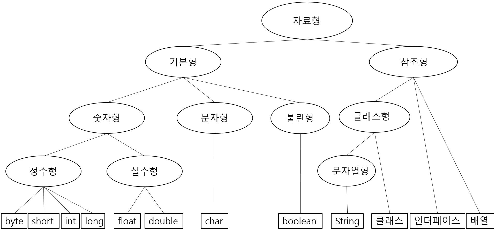
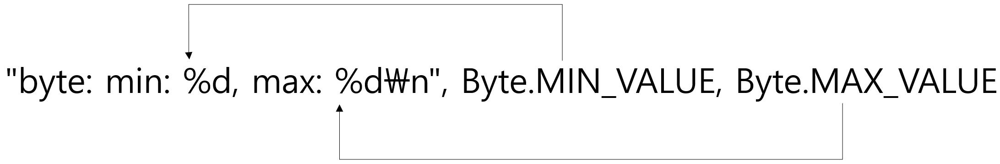
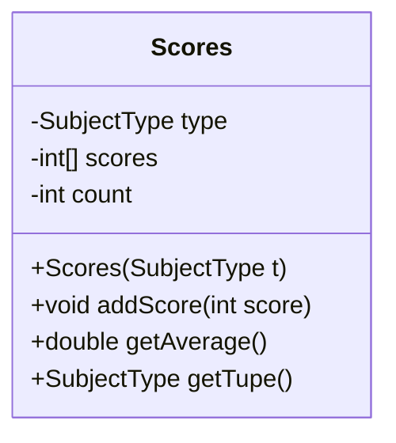

# object oriented programming(객체 지향 프로그래밍) 학습

- 상명대학교 컴퓨터과학전공 조용주 교수님께서 임좌상 교수님과 함께 저술하신 [한번에 이해되는 자바 프로그래밍]이라는 책을 기반으로 공부하였음

## Chapter 1

### 변수와 대입 연산

- 기억 장소의 필요성
    - 프로그래밍: 주어진 문제를 컴퓨터를 이용해서 해결하는 과정
    - 문제 해결 과정에서 무언가를 기억해야 하는 부분 필요

- 변수는 상자 같은 저장소
    - 값을 기억하기 위해 변수 사용
    - 컴퓨터에서는 CPU(중앙 처리 장치)와 메모리가 각각 계산과 기억 담당
    - 컴퓨터의 메모리는 바이트(byte)라고 불리는 일정한 크기의 공간들이 연속적으로 붙어있는 형태
        - 값을 기억하기 위해 상자(공간)에 값을 넣으면 그게 어디인지 알아야 함
        - 메모리에 번호(주소)가 붙음
    - 변수를 이용해 메모리의 특정 영역을 지정하고, 값을 기록하거나 확인
    - 메모리의 주소를 기억하기 쉬운 단어 형태로 바꾸어 놓은 것이 변수 이름

- 변수 이름과 값
    - 변수 이름은 메모리 공간 또는 공간에 있는 값을 나타냄

- 변수 생성 방법과 초기화
    - 변수는 사용하기 전에 생성해야 하고, 자료형을 지정해야 함
    - 변수를 생성하는 과정 = 변수를 정의한다
        - 변수의 이름을 프로그램에서 사용하겠다고 알리고, 컴퓨터 메모리에 변수의 값을 저장할 수 있는 공간을 확보한다
    - **자료형 변수_이름 [= 초기값];**
        - int num;
        - int num; num = 3;
        - int num = 3;
    - 초기값이 주어지지 않으면 쓰레기 값이 저장됨
    - 초기값을 지정하지 않으면 스스로 초기화를 시키거나 오류 발생
        - 초기값이 주어지지 않으면 0으로 초기화됨
        - 초기화시키지 않은 변수 사용 시 오류 발생

- 식별자(변수, 클래스, 함수) 이름 짓기 규칙
    - 알파벳 영문자, 밑줄 문자(_), 또는 달러 문자($)로 시작
        - 관례적으로 알파벳 영문자로 시작
    - 두번째 글자부터는 숫자도 사용 가능
    - 공백 문자, 특수 기호(달러 문자 제외) 사용 불가
    - 자바의 키워드 사용 불가
    - 영문 대문자와 소문자 구별
    - 이름의 길이는 무제한
        - 너무 길지 않으면서 의미가 뚜렷한 것이 좋음
    - 관례적으로 카멜 표기법 사용
        - 단어를 여러 개 붙여서 이름을 만들 때 각 단어의 시작 글자만 대문자로 표기
        - 관례적으로 클래스는 대문자, 함수와 변수 이름은 소문자로 시작
    - 키워드   
        |키워드|키워드|키워드|키워드|키워드|키워드|
        |:---|:---|:---|:---|:---|:---|   
        |abstract|assert|boolean|break|byte|case|
        |char|catch|class|const|continue|default|
        |do|double|else|enum|exports|extends|
        |false|final|finally|float|for|goto|
        |if|implements|import|instanceof|int|interface|
        |long|module|native|new|null|package|
        |private|protected|public|requires|return|short|
        |static|strictfp|super|switch|synchronized|this|
        |throw|throws|transient|true|try|var|
        |void|volatile|while|

- 대입 연산자
    - 변수에 초기값을 지정하거나 또는 값을 저장할 때 사용되는 '=' 기호
    - 기호 오른쪽에 있는 값을 왼쪽에 있는 변수에 저장하라는 의미
    - 왼쪽에는 변수, 오른쪽에는 값을 적는다
    - 오른쪽에 변수가 있다면 이 변수는 값 의미
    - 오른쪽에 변수가 여러 개 있다면 변수들 모두 값 의미

- 변수와 자료형
    - 기본 자료형(기본형): 자바 언어에서 기본적으로 제공하는 자료형
        - 사람들이 컴퓨터에서 많이 사용하는 값
        - **byte, short, int, long, float, double, char, boolean**
        - 각 자료형이 표현할 수 있는 값의 종류와 범위가 명확함
    - 참조 자료형(참조형): 기본형이 아닌 모든 자료형
        - 참조값(주소값)을 가지는 자료형
        - **String, 배열, 클래스, 인터페이스**    
    
    - 같은 자료형으로 생성된 변수들은 다른 변수값을 저장할 수 있음
    - 자료형이 달라도 값을 저장할 수 있는 경우가 있음
        - 같은 종류인데 크기에 따라 다른 것들로 분류되는 것들
            - 정수형과 실수형
    - 값을 객체로 표현하기 위해 각 자료형에 대응하는 클래스 자료형이 있음
        - 래퍼 클래스(wrapper class)

- 기본형
    |기본형|메모리 크기(bits)|범위 (최소~최대)|래퍼 클래스|
    |:---|:---|:---|:---|
    |byte|8|-128~127|Byte|
    |short|16|-32768~32767|Short|
    |int|32|-2147483648~2147483647 (약 21.4억)|Integer|
    |long|64|-9223372036854775808~9223372036854775807|Long|
    |float|32|1.4E-45~3.4028235E38 (E-45는 10-45승)|Float|
    |double|64|4.9E-324~1.7876931348623157E308|Double|
    |char|16|0~65535|Character|
    |boolean|8|true, false|Boolean|

    - 정수형
        - 다뤄야 하는 자료의 종류에 따라 다른 자료형 사용 가능
        - 기본은 int, 보통 가장 빠르게 처리됨
        - 변수의 자료형이 표현할 수 있는 범위 밖의 값을 저장하면 오류 발생
        - 큰 범위의 자료형 변수에서 작은 범위의 자료형 변수로 저장할 때 값이 유실될 수 있음
        - 정수 뒤에 영문자 'l' 또는 'L'을 붙이면 long형으로 취급
    
    - 실수형
        - 소수점이 붙은 숫자들을 표현하는데 사용
        - 숫자 뒤에 'f' 또는 'F'를 붙이면 float형
        - 큰 범위에서 작은 범위로 저장은 오류 발생
        - 작은 범위에서 큰 범위로 저장은 허용되나 오차 발생 가능성 있음
        - 가능하면 double 사용
    
    - 문자형
        - 문자 한 개를 표현
        - 작은 따옴표(') 사용
    
    - 이스케이프 시퀀스
        - 화면에 안 보이는 글자들과 따옴표같이 특별한 용도로 사용되는 글자들을 코드에서 문자 또는 문자열로 표현할 때 사용됨
        - 항상 백슬래시('\\')로 시작
        
        |이스케이프 시퀀스|설명|   
        |:---|:---|   
        |\\\\ | 백슬래시, \\ |
        |\\\' | 작은 따옴표, ' |
        |\\\" | 큰 따옴표, " |
        |\\n | 줄바꿈 문자|
        |\\t |탭 문자|

    - 불린형
        - 참(true)과 거짓(false) 의미
    
- 숫자 상수
    - 코드에 숫자 값을 직접 표기하는 것  

    |수|자료형|설명|
    |:---|:---|:---|
    |7, -10, 0|int|소수점이 없음|
    |0.7|double|소수점이 있음, 실수|
    |.7|double|소수점 앞 0 생략 가능|
    |7.|double|소수점 뒤에 숫자가 없으면 0 생략|
    |7E5|double| $7 \times 10^5$ 표현|
    |7E-5|double| $7 \times 10^{-5} $ 표현|
    |7.2E-3|double| $7.2 \times 10^{-3} $ 표현|

- 대입 연산자와 자료형
    - 대입 연산자의 왼쪽 변수와 오른쪽 값의 자료형은 같아야 함
    - 작은 범위를 큰 범위로 저장하는 것은 일반적으로 허용
    - 큰 범위를 작은 범위로 저장하는 것은 오류 발생

- 자료형 변환
    - 대입 연산자의 왼쪽과 오른쪽 자료형이 다른 경우 자료형 불일치 발생
    - 작은 범위를 큰 범위로 저장하는 것은 자동 자료형 변환 발생
    - 강제 형 변환: 강제로 자료형을 변환하는 것
    - 값이 저장될 변수의 범위를 넘지 않으면 강제 형변환을 통해 변환 후 사용 가능
        - **변수 = (변환_자료형) 값;**
    - 실수형을 정수형으로 변환 시 소수점 이하 부분이 사라짐
    - 만능이 아니므로 프로그래머가 예측 가능한 경우에만 사용해야 함

### 산술 연산

- 수학의 사칙연산 같은 것
- 똑같은 우선 순위를 가짐(곱셈/나눗셈/나머지 > 덧셈/뺄셈)
- 곱셈 연산자는 '*', 나누기 연산자는 '/', 정수의 나머지 연산자는 '%'
- **System.out.println()** 기본형 출력 가능

- 자료형의 최소값, 최대값 및 System.out.printf() 함수
    - 최소값, 최대값 확인
        - 래퍼클래스.MIN_VALUE, 래퍼클래스.MAX_VALUE
    - **System.out.printf()**
        - 서식에 맞춰 값을 화면에 출력하는 함수
        

        |서식 지시어|설명|
        |:---|:---|
        |%%|% 글자를 화면에 출력|
        |%n 또는 \\n|줄바꿈 문자 출력|
        |%d|인자로 전달되는 정수값 출력|
        |%f|인자로 전달되는 실수값 출력|
        |%c|인자로 전달되는 문자 출력|
        |%s|인자로 전달되는 내용을 문자열 형태로 변환해서 출력|
        |%h|인자의 해시코드를 출력. 주로 참조값을 출력할 때 사용|
        |%b|불린값을 true 또는 false로 출력. %s로 지정해도 같은 결과|
        |%B|불린값을 대문자로 출력|

### 사용자로부터 키보드 입력 받기

- 외부 패키지의 클래스 사용하기
    - 사용자로부터 입력을 받으려면 java.util 패키지의 Scanner 클래스를 사용해야 함
    - 클래스 명시 방법
        - 패키지 이름과 클래스 이름 명시
        - **패키지_이름.클래스_이름 변수_이름;**
        - **java.util.Scanner sc = new java.util.Scanner();**
        - import 키워드를 사용해서 패키지의 클래스 명시
        - **import 패키지_이름.클래스_이름;**   import java.util.Scanner;
        - **클래스_이름 변수_이름**     Scanner sc = new Scanner();
    - 패키지의 모든 클래스 import 하기  **import java.util.*;**

- 사용자로부터 입력 받기
    - 키보드를 통해서 입력받는다면 Scanner 클래스 객체 생성자에 System.in 전달
    - Scanner 클래스가 제공하는 입력용 함수
    
    |함수|설명|
    |:---|:---|
    |String next()|다음 입력을 문자열 형태로 받음. 공백 문자를 만날 때까지 입력된 모든 문자들을 문자열 형태로 반환|
    |String nextLine()|줄바꿈 문자를 만날 때까지 입력된 모든 문자들을 있는 그대로 문자열 형태로 반환(줄바꿈 문자 제거)|
    |byte nextByte()|다음 입력을 byte형 정수로 받음|
    |short nextShort()|다음 입력을 short형 정수로 받음|
    |int nextInt()|다음 입력을 int형 정수로 받음|
    |long nextLong()|다음 입력을 long형 정수로 받음|
    |float nextFloat()|다음 입력을 float형 실수로 받음|
    |double nextDouble()|다음 입력을 double형 실수로 받음|

    - 실습 문제 1: 단어와 숫자 입력 받기
        - 사용자로부터 문자열과 정수를 순차적으로 입력 받고, 그 내용을 바로 화면에 출력하는 프로그램 작성
        - 문자열을 입력 받고 화면에 출력, 정수를 입력 받고 출력
        - 문자열은 1개 단어로 구성, 정수는 int형 범위 내의 값
        ```java
        import java.util.Scanner;

        class Scanner1{
            public static void main(String[] args){
                Scanner sc = new Scanner(System.in);
                String s = sc.next();
                System.out.println(s);
                int num = sc.nextInt();
                System.out.println(num);
            }
        }
        ```
 
    - 실습 문제 2: nextLine() 메소드로 입력 받기
        - 문자열을 문장 단위로 입력 받고 화면에 출력하는 프로그램 작성
        - "hello 1"과 "   hello   1"의 차이 확인
        - Scanner 클래스의 nextLine() 이용
        - 프로그램의 이름은 ReadLine
        ```java
        import java.util.Scanner;

        class ReadLine{
            public static void main(String[] args){
                Scanner sc = new Scanner(System.in);
                String s = sc.nextLine();
                System.out.println(s);
            }
        }
        ```
 
- 입력 버퍼
    - 키보드로 입력할 때 입력 버퍼가 사용됨
    - 입력 버퍼: 사용자가 입력한 내용을 임시로 저장해두는 메모리 공간
    - next~() 함수들이 실행되고 입력을 기다릴 때 사용자가 입력한 내용은 모두 입력 버퍼에 저장됨
    - 입력 버퍼에서는 어떤 글자까지 처리했는지 파악하기 위해 입력 포인터 사용
    - 입력 포인터: 입력 버퍼에서 다음에 사용하게 될 글자의 시작 위치를 나타내는 주소값
    - 실습 문제 3: 온도 변환, 화씨 온도를 섭씨 온도로 변환해보기
        - 화씨 23도를 섭씨 온도로 변환하는 프로그램 작성
        - 결과 값은 소수 둘 째 자리까지 출력
        - 화씨 = 섭씨 * (9 / 5) + 32
        - 섭씨 = (5 / 9) * (화씨 - 32)
        ```java
        public class ConvertF23toC{
            float fahrenheit = 23;
            float celsius = ((float) 5 / 9) * (fahrenheit - 32);
            System.out.printf("%.2f \n", celsius);
        }
        ```
 
    - 실습 문제 4: 사용자에게 입력 값을 받아서 더하기
        - 두 개의 숫자를 입력 받아서 합을 구하는 프로그램 작성
        - 사용자는 두 개의 숫자를 입력
        - 정수일 수도 실수일 수도 있음
        - 문자열로 입력 받고 Integer 클래스의 parseInt() 또는 Float 클래스의 parseFloat() 함수 사용해 문자열을 숫자로 변환해서 사용
        ```java
        import java.util.Scanner;

        public class Add2Nums{
            public static void main(String[] args){
                Scanner sc = new Scanner(System.in);

                String s = sc.next();
                float num1 = Float.parseFloat(s);
                s = sc.next();
                float num2 = Float.parseFloat(s);
                System.out.println(num1 + num2);
            }
        }
        ```
 
        - 기본형 중에서 숫자형을 포장하는 클래스들과 Boolean 클래스는 문자열을 값으로 변환해주는 함수들을 포함
            - parseType() 형태로 구성
            - 객체를 생성하지 않고 **클래스이름.parseType()** 형태로 사용
    
    - 실습 문제 5: 사용자에게 화씨 온도를 입력 받아 섭씨 온도로 변환하기
        - 사용자로부터 화씨 온도를 입력 받고, 섭씨 온도로 변환한 후에 화면에 출력하는 프로그램 작성
        - 사용자가 입력하는 화씨 온도는 실수 값
        - 변환된 섭씨 온도는 소수 첫 째 자리까지만 출력
        - 사용자는 화씨 온도를 제대로 입력할 것이라고 가정
        ```java
        import java.util.Scanner;

        public class FtoC{
            public static void main(String[] args){
                Scanner sc = new Scanner(System.in);
                float fahrenheit = sc.nextFloat();
                float celsius = ((float)5 / 9) * (fahrenheit - 32);
                System.out.printf("%.1f \n", celsius);
            }
        }
        ```
 
### 연산자

- 자바에는 약 30여 개 연산자가 있음
- 사칙 연산자, 나머지 연산자
- 비교 연산자, 논리 연산자
- 자바에 특화된 연산자

- 부호 연산자
    - 양수와 음수를 표현하는 부호 연산자(+, -)
    - 대표적인 단항 연산자
    - 변수 앞에도 연산자 사용 가능
        - 변수값을 바꾸는 것이 아니라 결과 값만 부호 변경

- 증감 연산자
    - 변수값을 1만큼 증가(++) 또는 감소(--)
    - 변수 앞 또는 뒤에 위치할 수 있고, 장소에 따라 다른 결과가 나타남
        - 앞에 위치: 변수값이 사용되기 전에 1증가 또는 감소
        - 뒤에 위치: 변수값 사용 후 1증가 또는 감소

- 복합 연산자
    - 대입 연산자와 산술 연산자를 함께 묶어서 줄여 쓸 수 있는 방법

    |사용 예|설명|
    |:---|:---|
    |a += b| a = a + b|
    |a -= b| a = a - b|
    |a *= b| a = a * b|
    |a /= b| a = a / b|
    |a %= b| a = a % b|

- 연산자 우선 순위

|우선 순위|연산자|설명|
|:---:|:---|:---|
|1|(), [], .|괄호, 배열 인덱스, 종속 연산자|
|2|!, ~, ++, --, +, -, (type)|부정(논리), 부정(비트), 증가, 감소, 부호, 형변환|
|3|*, /, %|곱셈, 나눗셈, 나머지|
|4|+, -|덧셈, 뺄셈|
|5|<<, >>, >>>|비트 단위의 쉬프트(shift)|
|6|<, <=, >, >=|작다, 작거나 같다, 크다, 크거나 같다|
|7|==, !=|같다, 다르다|
|8|&|비트 단위의 논리 연산(and)|
|9|^|비트 단위의 논리 연산(xor)|
|10|\||비트 단위의 논리 연산(or)|
|11|&&|논리곱|
|12|\|\||논리합|
|13|?:|조건|
|14|=, +=, -=, *=, /=, %=, <<=, >>=, &=, ^=, ~=|대입, 복합 연산자|

|우선 순위|종류|대표 연산자|
|:---:|:---|:---|
|1|단항 연산자|부호, 증감 연산자|
|2|산술 연산자|덧셈, 뺄셈, 곱셈, 나눗셈, 나머지 등|
|3|비교 연산자|크기 비교, 같다, 다르다|
|4|논리 연산자|논리곱, 논리합|
|5|조건 연산자|?:|
|6|대입 연산자|=, 복합 연산자|

### 배열

- 배열: 연관된 자료들을 여러 개 사용할 때 변수 이름 한 개로 여러 값을 저장하고 사용할 수 있음
- 여러 개의 변수를 붙여놓은 것
    - 이름을 한 개로 붙여서 사용
    - 배열을 구성하는 각 변수가 요소
    - 배열의 요소는 0, 1처럼 번호를 붙여서 사용(인덱스)
    - 자바에서 인덱스는 0부터 시작
    - **배열이름[인덱스]**

- 배열 생성 방법
    - 배열 선언
    - **자료형[] 변수명;**
    - **자료형 변수명[];**
    - 배열 메모리 공간 확보
    - 초기값 지정
    - **자료형[] 변수명 = {초기값1, 초기값2, ..., 초기값n};**
    - new 사용
    - **자료형[] 변수명;    변수명 = new 자료형[배열_크기];**
    - 선언과 공간 확보를 함께
    - **자료형[] 변수명 = new 자료형[배열_크기];**

- 배열 사용 방법
    - 배열 요소는 인덱스를 이용해 접근 가능
    - arr[0] = 1;   arr[1] = 2;

- 배열의 크기
    - 배열의 크기를 확인 하고 싶을 때
    - **배열_이름.length**
    - 배열 요소에 접근 시 자료형에 주의해야 함
    - 인덱스 범위를 벗어나면 오류 발생

- 실습 문제 6: 배열 크기 및 요소 출력
    - 배열을 1.1, 2.3, 4.7, 7.5로 초기화시켜 생성하고, 배열의 크기 및 요소들을 화면에 출력
    - 배열을 생성하면서 값을 지정할 것
    ```java
    public class Array6{
        public static void main(String[] args){
            double arr[] = {1.1, 2.3, 4.7, 7.5};

            System.out.println(arr.length);

            System.out.println(arr[0]);
            System.out.println(arr[1]);
            System.out.println(arr[2]);
            System.out.println(arr[3]);
        }
    }
    ```

- 실습 문제 7: 배열 생성 후 요소 값 저장 및 출력
    - 4개짜리 배열을 먼저 생성하고 각 요소에 1.1, 2.2, 3.3, 4.4를 저장한 뒤, 배열의 크기와 각 요소를 화면에 출력
    - double형으로 지정하고, 소수점 첫 째 자리까지 출력
    ```java
    public class Array7{
        public static void main(String[] args){
            double arr[] = new double[4];

            arr[0] = 1.1;
            arr[1] = 2.2;
            arr[2] = 3.3;
            arr[3] = 4.4;

            System.out.println(arr.length);

            System.out.printf("%.1f \n", arr[0]);
            System.out.printf("%.1f \n", arr[1]);
            System.out.printf("%.1f \n", arr[2]);
            System.out.printf("%.1f \n", arr[3]);
        }
    }
    ```
 
### 연습 문제

1. 사용자로부터 실수값으로 초(seconds)를 입력 받고 시, 분, 초에 해당하는 값을 구하고 "시:분:초" 형태로 출력하는 프로그램 작성, 시, 분, 초는 정수로 출력한다.
```java
import java.util.Scanner;

public class Prac1{
    public static void main(String[] args){
        Scanner sc = new Scanner(System.in);

        double seconds = sc.nextDouble();

        int hour = (int)(seconds / 3600);
        seconds = (int)(seconds % 3600);
        int minute = (int)(seconds / 60);
        int second = (int)(seconds % 60);

        System.out.printf("%d:%d:%d\n", hour, minute, second);
    }
}
```

2. 자바의 System.currentTimeMillis() 함수는 세계 표준 시간 UTC로 1970년 1월 1일 0시부터 현재 시각까지의 차이를 1/1000초 단위로 알려준다. 이를 이용해서 현재 시각을 UTC 기준으로 찾아내는 프로그램을 작성한다. 출력하는 방법은 Year는 현재 년도, Day는 1월 1일부터 몇 일 째인지, 시각은 시:분:초 형태로 출력한다. 윤년은 고려하지 않고, 1년은 365일로 가정한다.
**Year: 2020 Days: 248 Time: 3:14:7 UTC**
```java
public class Prac2 {
    public static void main(String[] args) {
        long seconds = System.currentTimeMillis();
        seconds = seconds / 1000;
        int year = 1970 + (int)(seconds / 31546000);
        seconds = (int)(seconds % 31546000);
        int days = (int)(seconds / 86400);
        seconds = (int)(seconds % 86400);
        int hour = (int)(seconds / 3600);
        seconds = (int)(seconds % 3600);
        int minute = (int)(seconds / 60);
        seconds = (int)(seconds % 60);

        System.out.printf("Year: %d Days: %d Time: %d:%d:%d UTC\n", year, days, hour, minute, seconds);
    }
}
```
3. 예전 운영체제에서 시간을 측정할 때 32비트 정수를 사용해서, 2038년도 일정 시점이 지나면 오버플로우가 발생하는 문제가 있었다. 오버플로우가 발생하는 시각이 UTC 기준으로 언제인지 구한다. 윤년은 고려하지 않고, 1년은 365일로 월은 30일로 계산한다.
**Year: 2038 Month: 2 Day: 5 Time: 3:14:7 UTC**
```java

```

4. 사용자로부터 a, b, c에 해당되는 세 개의 int형 정수를 입력 받고 $ax^2 + bx + c = 0$ 이라는 이차방정식의 해를 구해서 출력하는 프로그램을 작성한다. 해를 구하는 것은 근의 공식을 이용한다. $b^2 - 4 \times a \times c >= 0$ 조건을 만족하는 정수 a, b, c 값을 사용자가 입력한다고 가정하고, 제곱근은 Math.sqrt() 함수를 사용해서 구한다.
```java

```

5. 사용자로부터 R1, R2, Height 값을 double형으로 입력 받고, R1을 윗면, R2를 밑면, Height를 높이로 하는 원뿔대의 부피를 구해서 출력하는 프로그램을 작성한다. 원주율 값은 3.14로 계산한다. ($V = \frac{1}{3} \times \pi \times (R1^2 + R1 + R2 + R2^2) \times Height $)
```java

```

6. 사용자로부터 온도(화씨)와 풍속(m/s)을 입력 받고, 체감 온도를 계산하고 화면에 출력하는 프로그램을 작성한다.
(체감 온도 = $13.12 + 0.6215 \times T - 11.37 \times V^{0.16} + 0.3965 \times V^{0.16} \times T$ (T는 기온 V는 풍속))
```java

```

7. 사용자로부터 문자 5개를 입력 받고 배열에 저장한 후에 해시 값을 구해서 화면에 출력하는 프로그램을 작성한다. 해시 값은 소수 둘째 자리까지 출력한다. 만약 문자들을 저장한 배열이 s라고 가정할 때 아래 공식에 따라 해시 값을 계산한다. 첫 번째로 입력한 문자가 s[0], 두 번째는 s[1]에, 그리고 나머지 문자들도 순서대로 저장된다고 가정한다. 승수 계산은 Math.pow(x, y)함수를 사용한다.
($s[0] \times 31^{(n-1)} + s[1] \times 31^{(n-2)} + ... + s[n-1] \times 31^0$)
```java

```

8. 사용자에게서 5개 정수를 입력 받을 때까지 프로그램을 실행시키면서, 매 숫자 입력 후에 그때까지 입력된 모든 정수값들의 합을 계산해서 출력하는 프로그램을 작성한다.(반복문 사용 없이)
```java

```

9. 사용자로부터 두 개의 double형 실수를 입력 받고, 두 수의 덧셈, 뺄셈, 곱셈, 나눗셈 연산 결과를 출력하는 프로그램을 작성하라.
```java

```

10. 배열을 1, 3, 5, 7, 9로 초기화하고 배열 요소의 합과 평균을 구하는 프로그램을 작성한다.(반복문 사용 없이)
```java

```

11. 배열을 문자열 "one", "two", "three"로 초기화시키고, 각 문자열을 화면에 순서대로 출력하는 프로그램을 작성한다.(반복문 사용 없이)
```java

```

12. 다음 표는 특정 시기 서울의 미세먼지 현황을 보인다. 7일 동안의 PM2.5와 PM10의 평균을 계산해서 화면에 출력한다. 단 PM2.5와 PM10 데이터를 각각 배열에 초기화시킨 후에 평균을 구한다.(반복문 사용 없이)

| | | | | | | | |
|:---|:---:|:---:|:---:|:---:|:---:|:---:|:---:|
|PM2.5(초미세먼지)|29|21|18|34|67|79|18|
|PM10(미세먼지)|44|44|32|60|84|112|41|

```java

```

13. 사용자로부터 (x1, y1), (x2, y2)에 해당되는 정보를 double형으로 입력 받고 두 점 사이의 거리를 계산해서 출력하는 프로그램을 작성한다. 거리는 두 점 사이의 거리를 계산하는 공식을 이용한다.
($두 점 사이의 거리 = \sqrt{(x_2 - x_1)^2 + (y_2 - y_1)^2}$ )
```java

```

14. 헤론의 공식은 세 변의 길이만으로 삼각형의 넓이를 구하는 공식이다. 세변의 길이를 각각 a, b, c라고 할 때 사용자로부터 세 변의 길이를 입력 받고 삼각형의 면적을 계산해서 출력하는 프로그램을 작성한다.
($area = \sqrt{(s \times (s-a) \times (s-b) \times (s-c))}$ ) ( $s = \frac{a + b + c}{2}$ )
```java

```

15. 사용자로부터 삼각형을 이루는 세 점의 좌표를 입력 받고 면적을 구해서 출력하는 프로그램을 작성한다. 좌표는 정수로 입력 받는다.
```java

```

16. 한 달에 x원씩 연 이율 r%인 적금을 넣는다고 가정해보자. 이자 소득세율이 t%라고 가정할 때 1년 만기 후 내가 받을 수 있는 금액이 얼마인지 계산해서 출력하는 프로그램을 작성한다. 불입한 원금에 대한 이자만 계산하는 단리 계산 방식은 다음 공식에 따른다. 이자에 대한 소득세는 전체 이자 금액에 대해서 일정 비율 차감한다.
($interest = monthlyPayment \times n \times \frac{(n+1){2}} \times \frac{r}{12}$) (monthlyPayment: 월 납입액, n 개월, r = 연 이율(%) / 100)
사용자로부터 한 달에 넣는 납입액(원), 연 이율(%단위), 이자 소득 세율(%단위)을 입력 받고 사용자가 최종으로 받을 수 있는 금액을 계산해서 출력하는 프로그램을 작성한다.
```java

```

## Chapter 2

### 간단한 함수 만들어보기

- 함수: 특정 작업을 처리하도록 만들어진 한 줄 이상의 코드 묶음
- 함수 구현 방법
    ```
    반환_자료형 함수_이름(매개변수_리스트){
        //함수 코드
    }
    ```

    - 반환_자료형: 결과값의 자료형, 값을 반환하지 않을 경우 void, 값을 반환하는 코드에서는 return 키워드 사용
    - 매개변수_리스트: 함수에 전달하는 입력을 받을 변수의 리스트, 자료형 변수_이름으로 구성, 한 개 이상인 경우 콤마(',')로 분리, 입력이 없는 함수라면 빈 괄호 ()
    - 함수 코드는 {과 } 사이에 들어감

### 클래스가 뭐지?

- 객체 지향 프로그래밍을 하는 이유
    - 프로그램 = 데이터 + 코드
    - 객체 지향 프로그래밍은 데이터와 코드를 객체로 함께 구성해서 한 개 자료형으로 취급
    - 많은 객체 지향 언어들이 클래스라는 이름으로 데이터와 코드를 묶을 수 있는 기능을 제공함
    - 추상화, 재사용성, 캡슐화를 위해 필요

- 클래스 형식
    - 키워드 class로 시작
    - 데이터 - 멤버 변수
    - 절차 - 멤버 함수
    ```
    class 클래스명{
        자료형 변수명;
        ...
        자료형 함수명(인자...){

        }
    }
    ```
 
    - class: 클래스 선언, 앞에 접근 제어자나 static을 사용할 수 있다
    - 클래스_이름: class의 이름을 적는다, 카멜 표기법으로 지정하되 관례적으로 첫글자는 대문자로 시작한다
    - 변수_이름: 변수 이름을 적는다, 멤버 변수 또는 멤버 필드라고도 한다
    - 함수_이름: 함수 이름을 적는다, 멤버 함수라고 한다, main()함수가 포함될 수도 있다

- 객체와 클래스
    - 객체 지향 프로그래밍은 우리가 사는 세상에서 실제로 일어나는 일을 흉내 내어 프로그래밍 함
        - 주변에 있는 모든 것이 클래스가 될 수 있고, 프로그래밍 될 수 있음
        - 일반적으로 명사로 표현될 수 있는 것들은 모두 객체로 표현할 수 있다고 봄
    - 좋은 클래스를 만드는 것이 중요
        - 설계를 먼저 하는 것이 필요
    - 목적에 따라 클래스 내용이 달라질 수 있음
        - 좋은 클래스란 필요한 데이터들만 포함될 수 있도록 응집성 있게 만들어야 함
    - 객체는 프로그램에서 사용할 수 있도록 클래스로부터 생성한 것
    - 객체 생성: **객체_변수 = new 클래스_이름();**
    - 객체 사용: **객체_변수.멤버_함수_이름();**
    - 클래스는 객체의 속성과 함수를 선언한다
    - 클래스는 객체의 속성과 기능을 설명하는 자료가 된다

- UML로 클래스 그려보기
    - 클래스 다이어그램: 클래스를 그림 형태로 표현한 것
    - 3칸으로 구성(클래스 이름, 속성(변수와 값), 함수)
    - 책에서는 planttext 사이트 이용
    ```
    @startuml
    class Name{
        data
        code()
    }
    @enduml
    ```

### 객체 만들고 사용해보기

- new 연산자와 힙 공간
    - new 연산자는 힙이라는 메모리 공간에서 객체 영역을 할당 받은 뒤에 참조값을 반환
    - 공간이 없다면 null 반환
    -할당된 메모리 공간은 원할 때까지 또는 프로그램 종료 시까지 자유롭게 사용 가능
    - 가비지 콜렉션 기능 제공
        - 할당된 메모리 공간 중에서 더 이상 사용되지 않는 영역들을 찾아 힙 관리자에게 일괄적으로 반환

- 자바의 메모리 구조
    - 정적 메모리 영역
        - 컴파일할 때 결정되고 실행 중에 변하지 않는 것들
        - 자바 코드, 클래스의 정적 멤버 변수나 멤버 함수, 상수 들이 저장되는 메모리 공간
    - 스택 영역
        - 프로그램 실행 중에 증감하는 영역
        - 멤버 함수 내부에 생성된 지역 변수들과 매개 변수들이 저장됨
        - 함수가 호출되면 메모리가 할당되었다가 종료되면 사라짐
    - 힙 영역
        - 연속적인 메모리 공간을 대여함
        - 연속적인 공간이 없으면 null 반환

- 객체는 생성하는 것만으로 사용할 수 없음
    - 객체를 사용하려면 구별할 수 있어야 함 -> 변수 사용
    - 객체 생성 후 다른 변수에 저장도 가능

- 기본형 변수는 값, 클래스 변수는 참조값
    - 객체를 저장하는 변수는 참조값을 저장하는 참조형이다

- 객체 사용하기
    - 객체의 멤버 변수에 접근하거나 메소드 호출
    - 점 연산자('.') 이용
        - **객체_변수_이름.멤버_변수_이름;**
        - **객체_변수_이름.멤버_함수_이름();**
    - 점 연산자를 사용해도 클래스에서 허용된 범위 내에서만 접근 가능

### 문자열과 String 클래스

- 문자열 상수
    - 문자열: 한 개 이상의 문자, 숫자(문자로 취급), 기호 등을 나열해 놓은 것
    - 큰 따옴표 두 개 사이에 문자들을 넣어 표현
    - 문자열 상수(문자열 값): 코드에서 사용된 따옴표에 둘러싸인 문자열, 문자와 구별

- String 클래스와 문자열 변수
    - 자바에서 문자열을 저장하려면 String 자료형(참조형)을 사용
    - 변수를 정의할 때 초기값을 지정하는 것이 좋음
    - 덧셈 연산자(+)는 피연산자로 문자열을 취할 수 있음
        - 문자열과 숫자, 문자, 불린 값들과 더해지면 새로운 문자열 생성
        - 결합 순서는 왼쪽 -> 오른쪽
    - String 변수가 참조하는 문자열 내용은 바꿀 수 없음
        - 다른 문자열들이 저장될 수 있지만, 참조하는 문자열의 내용은 변경 불가
        - 수정하고 싶다면 새로 만들어서 저장(참조)해야 함

- 문자열 배열 만들기
    - **String[] 변수명 = {초기값1, 초기값2, ..., 초기값n};**
    - **String[] 변수명 = new String[배열 크기];**
    - 문자열 배열은 참조값을 저장하는 배열

- String 클래스의 대표적 메소드

|메소드|설명|
|:---|:---|
|int length()|문자열의 길이를 반환|
|char charAt(int index)|주어진 index 위치의 글자 반환|
|int compareTo(String aStr)|객체의 문자열과 aStr을 비교. 글자 단위로 비교해서 같으면 0, aStr리 사전적으로 뒤에 나오면 음수, 앞에 나오면 양수 반환. 대문자와 소문자 구별|
|int compareToIgnoreCase|객체의 문자열과 aStr을 비교. 글자 단위로 비교해서 같으면 0, aStr리 사전적으로 뒤에 나오면 음수, 앞에 나오면 양수 반환. 대문자와 소문자 구별하지 않음|
|String concat(String str)|객체의 문자열에 str을 붙인 새로운 문자열을 생성해서 반환|
|boolean contains(CharSequence seq)|seq로 주어진 문자열이 객체 문자열 내에 존재하면 true 반환, 없으면 false 반환|
|boolean endsWith(String suffix)|객체 문자열이 suffix로 주어진 문자열로 끝나면 true, 아니면 false|
|int indexOf(int ch)|객체의 문자열에서 ch로 주어진 문자가 처음 등장하는 위치의 인덱스 반환. 없으면 -1 반환|
|int indexOf(String str)|객체의 문자열에서 str로 주어진 문자열이 처음 등장하는 위치의 인덱스 반환. 없으면 -1 반환|
|String substring(int index)|index로 주어진 인덱스 글자부터 문자열 끝까지 복사해서 새로운 문자열로 반환|
|String substring(int start, int end)|문자열에서 start부터 end - 1 인덱스까지의 문자열을 복사해서 새로운 문자열로 반환|
|boolean isEmpty()|빈 문자열("")인지 확인 후 true 또는 false 반환|
|String trim()|객체 문자열의 시작 부분과 끝 부분에 있는 공백 문자들을 제거한 새로운 문자열 반환|
|String[] split(String regex)|regex로 구분해서 문자열을 분리해주는 함수|
|String[] split(String regex, int limit)|regex로 구분해서 문자열을 분리하는데 limit 개수까지만 분리|

- 수정할 수 있는 문자열 클래스

|메소드|설명|
|:---|:---|
|StringBuilder append(String str)|객체 문자열에 str에 주어진 문자열을 추가(연결시킴)|
|char charAt(int index)|주어진 index 위치의 글자 반환|
|StringBuilder delete(int start, int end)|인덱스 번호 start부터 end - 1까지 삭제(end에 있는 문자는 삭제 안됨)|
|char deleteCharAt(int index)|주어진 index 위치의 글자 삭제|

    - StringBuilder는 반드시 new 연산자를 이용해서 객체를 생성한 후에 사용해야 함

- 문자열로부터 정수, 실수 등 입력 받기
    - 기본형의 래퍼 클래스는 숫자들로 구성된 문자열로부터 숫자값을 추출하는 메소드 제공
        - 문자열이 숫자로만 구성되어야 함
    - Scanner 클래스를 이용해서 입력 버퍼를 통해서 입력 받는 것처럼 문자열에서 입력 받는 것이 가능

### 클래스에 속성 추가하기

- UML에서 객체에 속성 추가하기
    - **속성_이름: 자료형 [= 초기값]**
    - **함수_이름([매개_변수_리스트]): 반환하는_자료형**

- 멤버 변수와 멤버 함수의 순서 및 위치
    - 클래스에 포함된 멤버 변수는 각 객체의 메모리 공간에 따로 존재함
    - 클래스 내에 선언된 멤버 변수 또는 함수는 그 위치나 순서에 관계없이 모든 멤버 함수에서 접근하고 사용할 수 있음

- 멤버 변수와 초기값
    - 클래스 멤버 변수는 초기값이 지정되지 않으면 기본값으로 초기화

    |자료형|기본값|
    |:---|:---|
    |byte, short, int, long, float, double|0 (실수는 0.0)|
    |char|u0000(유니코드로 null 문자)|
    |String, 객체, 참조형|null|
    |boolean|false|

### 생성자와 this 참조

- 생성자
    - 객체를 생성할 때 한 번만 실행됨
    - 객체 멤버 변수를 초기화하기 위해 사용
    - 주로 한 번 정해지면 거의 변경되지 않거나 혹은 객체가 사용되기 전에 값이 정해져야 하는 것
    ```
    클래스_이름([매개_변수_리스트]){
        //생성자 코드
    }
    ```

    - 클래스 이름과 동일
    - 반환 자료형 없음, void도 사용하지 않음
    - 매개 변수는 있을 수 있음
    - 생성자가 없으면 기본 생성자가 자동 생성됨
    - 접근 제어자는 지정 가능하나 키워드는 사용 불가

- 기본 생성자
    - 매개 변수가 없는 생성자

- 생성자 오버로딩
    - 기본 생성자 말고 매개 변수가 있는 생성자도 있을 수 있음
        - 예: Scanner 클래스
        - **new 클래스_이름(매개_변수에_전달될_인자);**
    - 한 개 이상의 생성자가 존재할 수 있음
        - 생성자 오버로딩
        - 매개 변수의 개수가 다르거나 종류가 달라야 함
        - 전달 인자에 따라 적절한 형태의 생성자가 사용됨

- this 참조
    - this 키워드는 클래스 내부 생성자나 메소드에서만 사용할 수 있음
    - 객체 자신을 참조하는 변수

- this를 이용한 다른 생성자 호출
    - 생성자 코드 내에서 다른 생성자를 호출하는 것이 가능
    - 생성자의 가장 첫번째 코드여야 함

- 생성자에서 다른 멤버 함수 호출
    - 초기화시키는 공통 코드를 멤버 함수로 구현하고 이를 생성자에서 호출 가능
    - 첫번째 코드가 아니어도 됨

### 클래스 배열

- 객체 배열 만들기
    - 문자열 배열을 만드는 것과 비슷
    ```
    //초기값은 한 개 이상
    //new를 이용해서 미리 생성했던 객체들의 참조값을 초기 참조값으로 지정
    클래스_자료형[] 변수_이름 = {초기 참조값1, 초기 참조값2, ..., 초기 참조값n};

    //객체를 새로 생성하거나 이미 생성된 객체의 참조값을 이용해서 배열을 채워야 함
    클래스_자료형[] 변수_이름 = new 클래스_자료형[배열_크기];
    변수_이름[0] = 객체;
    변수_이름[1] = new 클래스_자료형();
    ```

- 배열에 있는 객체 사용법
    - 변수에 저장되어 있는 객체 사용법과 같음
    - **배열[인덱스].멤버함수();**

### 연습 문제

1. "Kim 65.0Kg"를 출력하는 Person 클래스를 구현한다. 생성자를 이용해서 이름을 설정하고, 몸무게는 setWeight()함수로 입력한다.
```java

```

2. "Let's meet in my office at 10"이라는 문자열에서 사용자로부터 입력 받은 문자열을 새로운 문자열로 치환하는 프로그램을 작성한다. 예를 들어 사용자가 "10"을 "12"로 바꾸겠다고 입력하면, 새로운 문장은 "Let's meet in my office at 12"가 출력된다.
```java

```

3. 여러 카드 중에서 한 장의 카드를 나타내는 클래스를 구현한다. 카드 클래스의 show() 멤버 함수를 호출하면 카드에 있는 모양과 변호를 화면에 출력하도록 한다.(하트 10, J, Q, K, A)
```java

```

4. 문자열 "Sangmyung University"를 반대로 뒤집어서 출력하는 프로그램을 구현한다.
```
class StringMirror{
    String mirror(String s); //s를 반대로 뒤집은 형태의 문자열 반환
    public static void main(String[] args); //main() 함수
}
```

```java

```

5. 서울(Seoul), 인천(incheon), 성남(Seongnam)의 도시명을 문자열 배열에 저장하고, 도시 이름 앞과 뒤에 각각 "www"와 "go.kr"을 붙여서 www.seoul.go.kr 같은 형태로 만들어서 출력하는 프로그램을 구현한다.
```java

```

6. 우리가 사용하는 주사위를 클래스로 만들어 본다. 다음은 클래스 속성과 함수들을 보인다. 주사위는 굴리면 1 ~ 6 사이의 수가 나온다.

|구분|설명|
|:---|:---|
|클래스 이름|"Dice"|
|속성|number. 주사위에서 나오는 결과 1 ~ 6, 정수|
|함수|주사위를 굴리는 함수 roll(). 매개변수와 반환 변수가 없음. 주사위를 던진 결과는 속성 number에 저장|
|함수|주사위를 던져서 나온 결과를 확인할 수 있는 함수 getNumber()|

```java

```

7. String 배열 10개짜리를 만들고 사용자로부터 두 글자 이상의 문자열 3개를 입력 받아 배열에 저장하는 프로그램을 작성한다. 문자형은 정수형과 사칙 연산을 하면 자동으로 형 변환이 일어난다. 이를 이용해서 문자열을 배열에 저장할 때는 문자열의 처음 두 개 글자의 합을 배열의 크기로 나눈 나머지를 인덱스로 사용한다. 다음은 문자열 "hello"의 인덱스 번호를 구하는 코드 예시를 보인다. 같은 인덱스 번호를 갖는 문자열이 입력되는 경우 기존에 저장된 내용을 무시하고 새로운 문자열을 저장한다.
```
int sum = 0;
sum += ('h' + 'e'); //sum = 205
int index = sum % 10;//index = 5;
```

```java

```

8. 사용자로부터 문자열 한 개를 입력 받고, 단어의 개수를 센 뒤, 문자열의 길이, 단어의 개수를 화면에 출력하는 프로그램을 작성한다. 단어 구별은 공백 문자(' ','It', 'In')로 한다. 공백 문자는 두 개 이상 연속적으로 나타날 수 있다. 공백 문자는 두 개 이상 연속적으로 나타날 수 있다.
```java

```

9. 파일 이름에서 확장자를 변경하는 프로그램을 작성하려 한다. 사용자로부터 파일 이름, 새로운 확장자를 입력 받아서 변경하는 프로그램을 작성한다. 예를 들어 사용자가 "italy_3280.jpg"를 파일 이름으로 새로운 확장자를 "png"로 입력했다면 새로운 파일은 "italy_3280.png"가 된다. 파일 이름에는 '.'가 여러 개 포함될 수 있고, 이때 확장자는 가장 마지막 '.' 다음 단어가 된다. 확장자가 없는 파일 이름에 대해서는 고려하지 않는다.
```java

```

## Chapter 3

### 제어 흐름

- 제어 흐름의 기본은 위에서 아래로

- 흐름의 제어 

    |구분|설명|명령문|
    |:---:|:---|:---|
    |순차|순서에 따라 작업이 실행되는 기본적인 실행 방법|continue, break를 제외한 모든 명령문|
    |분기|조건 표현식의 값에 따라 분기하므로 의사 결정이라고 한다|if, else, switch|
    |반복|조건에 따라 혹은 일정 횟수만큼 반복한다.|for, while, do...while|

### 조건문(분기문)

- if 문
    ```
    if (조건식)
        명령문
    
    if(조건식)
        코드_블록
    ```
    - 조건식 만족 시 명령문 또는 코드_블록의 코드 실행

- 비교 연산과 논리 연산
    - 조건식의 결과 값은 불린형으로 나옴
    - 비교 연산자
        - >, >=, <=, <, ==, !=
    - 문자열 비교
        - 문자열 같은 참조형 변수에 비교 연산자를 사용하면 메모리 주소를 비교
    - 논리 연산자
        - 논리 연산의 결과값은 참 또는 거짓
        - &&, ||, !
        - 평가 순서: 왼쪽 -> 오른쪽
        - 단축 평가 방법 사용
            - 논리 연산자의 왼쪽 피연산자 값만으로 전체 논리 연산의 결과 값을 유추할 수 있다면 오른쪽 피연산자 값을 평가하지 않음
            - 예외 상황을 미리 막을 수 있으며 효율적임

- 실습 문제 1: 장학생 선발하기
    - 어떤 학생이 이번 학기에 장학생 후보가 되는지 확인하는 프로그램을 작성한다. 학교에서 정한 장학생 후보는 학기 평점 3.5 이상과 소득분위 5 이하여야 한다. 다음 표에 있는 학생들의 평점과 소득분위를 확인해서 학생이 장학생 후보인지 아닌지 출력하는 프로그램을 작성한다.

    |이름|평점|소득분위|
    |:---|:---|:---|
    |서유리|4.1|3|
    |권혜린|3.71|5|
    |문오성|3.93|7

    - 학생 이름, 평점, 소득분위를 데이터로 가지고 있고, 이름, 평점, 소득분위 등을 결과 값으로 반환하는 메소드를 포함하는 클래스를 구성한다. 객체를 생성하면서 표에 있는 자료들을 바탕으로 초기값을 지정한다.

    ```java
    class Student{
        String name;
        double gpa;
        int incomeLevel;

        Student(String name, double gpa, int incomeLevel){
            this.name = name;
            this.gpa = gpa;
            this.incomeLevel = incomeLevel;
        }

        String getName(){
            return name;
        }
        double getGPA(){
            return gpa;
        }
        int getIncomeLevel(){
            return incomeLevel;
        }
    }

    class TestStudent{
        public static void main(String[] args){
            Student s1 = new Student("서유리", 4.1, 3);
            Student s2 = new Student("권혜린", 3.71, 5);
            Student s3 = new Student("서유리", 3.93, 7);

            if(s1.getGPA() >= 3.5 && s1.getIncomeLevel() <= 5){
                System.out.printf("%s 학생은 장학생 후보입니다.\n", s1.getName());
            }
            if(s2.getGPA() >= 3.5 && s2.getIncomeLevel() <= 5){
                System.out.printf("%s 학생은 장학생 후보입니다.\n", s2.getName());
            }
            if(s3.getGPA() >= 3.5 && s3.getIncomeLevel() <= 5){
                System.out.printf("%s 학생은 장학생 후보입니다.\n", s3.getName());
            }
        }
    }

    ```

- 조건이 만족될 때와 만족되지 않을 때 다른 코드 실행하기
    - if-else 문
    ```
    if(조건식)
        코드_블록_1 //조건식이 true일 때 실행되는 코드 블록
    
    else
        코드_블록_2 //조건식이 false일 때 실행되는 코드 블록
    ```

- 실습 문제 2: 약수인지 확인하고 출력하기
    - 사용자로부터 정수 2개를 입력 받고, 첫번째 숫자가 두번째 숫자의 약수인지 확인해서 출력하는 프로그램을 작성한다. 약수이면 "숫자1은 숫자2의 약수입니다"를 출력하고, 약수가 아니면 "숫자1은 숫자2의 약수가 아닙니다"를 화면에 출력한다. 사용자는 정수만을 입력할 것이라고 가정한다.

    ```java
    import java.util.Scanner;
    
    public class Divisor1{
        Scanner sc = new Scanner(System.in);

        int num1, num2;

        System.out.println("정수 2개를 입력하세요: ");
        num1 = sc.nextInt();
        num2 = sc.nextInt();

        if((num2 % num1) == 0){
            System.out.printf("%d는 %d의 약수입니다.\n", num1, num2);
        }
        else{
            System.out.printf("%d는 %d의 약수가 아닙니다.\n", num1, num2);
        }
    }
    ```

- 여러 가지 조건 중 한 가지만 선택하기
    - if-else if-else 문
    ```
    if(조건식1)
        코드_블록_1
    else if(조건식2)
        코드_블록_2
    ...
    else    //생략 가능
        코드_블록_n;
    ```

- 실습 문제 3: 극장 표 값 알아보기
    - 사용자로부터 원하는 종류의 극장 좌석을 입력 받고, 해당 영역의 가격을 화면에 출력하는 프로그램을 작성한다.
    - 사용자로부터의 입력은 키보드로 받고, 사용자는 prime, standard, economy 또는 다른 단어를 입력할 수 있다고 가정한다. 다른 단어를 입력한 경우, "좌석 종류를 잘못 입력했습니다"라고 출력한다.

    |좌석 영역|이코노미|스탠다드|프라임|
    |:---|:---|:---|:---|
    |가격|9000|10000|11000|

    ```java
    import java.util.Scanner;
    
    public class MovieTicketPrice{
        public static void main(String[] args){
            Scanner sc = new Scanner(System.in);

            System.out.print("원하는 극장 좌석을 입력해주세요: ");
            String zone = sc.next();

            if(zone.compareTo("prime") == 0){
                System.out.println("프라임존 표 값은 11000원입니다.");
            }
            else if(zone.compareTo("standard") == 0){
                System.out.println("스탠다드존 표 값은 10000원입니다.");
            }
            else if(zone.compareTo("economy") == 0){
                System.out.println("이코노미존 표 값은 9000원입니다.");
            }
            else{
                System.out.println("좌석 종류를 잘못 입력했습니다.");
            }
        }
    }
    ```

- 중첩 조건문
    - 조건문에서 실행시키는 명령문에 또 다른 조건문이 들어 있음
    ```
    if(조건식 1){
        if(조건식 2){
            명령문;
        }
    }
    ```

- 삼항 조건 연산자
    - ?과 :로 구성된 연산자
    - 조건식과 표현식에 해당되는 피연산자를 3개 취함
    - 값을 반환하는 간단한 형태의 if-else 문 대체 가능
    - 결과값이 존재하며 조건식이 아닌 피연산자와 같은 자료형이 도출됨
    ```
    (조건식) ? 표현식1: 표현식2;

    변수 = (조건식) ? 표현식1 : 표현식2;

    return (조건식) ? 표현식1: 표현식2;
    ```

### 반복

- 반복문: 같은 작업 또는 비슷한 작업을 반복시키는 것을 처리하는 방법

- 반복문의 구성
    - 반복 조건: 반복시키는 또는 반복을 종료시키는 조건, 조건식으로 표현됨
    - 반복 명령어
        - while: 반복 작업 전 반복 조건 확인
            - 조건이 만족될 때까지 반복하고 싶을 때
            - 조건이 맞지 않아 반복 작업이 시작되지 않을 수 있음
        - do...while: 반복 작업 후 반복 조건 확인
            - 조건이 만족될 때까지 반복하고 싶을 때
            - 반복 작업을 최소한 한 번 실행
        - for: 반복 작업 전 반복 조건 확인
            - 정해지 횟수만큼 반복할 때

- while 문
    ```
    while(조건식){
        명령문;
    }
    ```

- 실습 문제 4: 단어 입력 받고 화면에 출력하기
    - 사용자로부터 단어를 입력 받고 화면에 출력하는 프로그램을 작성해본다. 단 사용자가 "quit"라는 단어를 입력하면 프로그램을 종료한다.
    - "quit"이 입력 되면 화면에 출력하지 않고 프로그램을 종료한다. 또한 사용자가 숫자를 입력해도 문자열로 취급한다.
    ```java
    import java.util.Scanner;

    public class InputWord{
        public static void main(String[] args){
            Scanner sc = new Scanner(System.in);
            String word;

            System.out.print("단어를 입력하세요(quit을 입력하면 종료): ");
            word = sc.next();
            while(!word.equals("quit")){
                System.out.println(word);
                System.out.print("단어를 입력하세요(quit을 입력하면 종료): ");
            word = sc.next();
            }
        }
    }
    ```

- do...while 문
    ```
    do{
        명령문;
    } while(조건식);
    ```

- 실습 문제 5: 사용자가 0을 입력할 때까지 지속적으로 정수를 입력 받고 화면에 출력하기
    - 사용자로부터 지속적으로 정수를 한 개씩 입력 받아 출력하는 프로그램을 작성한다. 단 사용자가 0을 입력하면 프로그램을 종료한다.
    - 0을 입력하면 그 값을 화면에 출력하고 프로그램이 종료된다. 사용자가 정수만을 입력하는 것을 가정한다.
    ```java
    import java.util.Scanner;

    public class InputInt1{
        public static void main(String[] args){
            Scanner sc = new Scanner(System.in);
            int num;

            do{
                System.out.print("정수 한 개를 입력하세요(0이 입력되면 종료): ");
                num = sc.nextInt();
                System.out.println(num);
            } while(num != 0);
        }
    }
    ```

- for 문
    - 정해진 횟수만큼 반복하는 내용을 작성할 때 while보다 for을 사용하면 더 짧게 작성할 수 있다
    ```
    for(변수_초기화; 조건_확인; 변수_증감_연산){
        반복될 명령문;
    }
    ```

- 중첩 반복문
    - 반복 코드에 또 다른 반복문이 있는 것

- break
    - break문 뒤에 남아 있는 코드를 더 이상 실행하지 않고 반복문을 빠져 나가고, 다음에 다른 명령문이 있다면 그 부분부터 순차적으로 실행

- 실습 문제 6: 정수 입력 받고 화면에 출력하기
    - 사용자로부터 정수 한 개를 입력 받아서 출력하는 프로그램을 작성한다. 단 사용자가 0을 입력하면 프로그램이 종료된다.
    - 0이 입력되면 화면에 출력하지 않고 프로그램을 종료한다. 강제 종료가 아닌 break문을 이용해 반복문을 빠져나가도록 한다. 사용자가 정수만을 입력하는 것을 가정한다.
    ```java
    import java.util.Scanner;

    public class InputInt2{
        public static void main(String[] args){
            Scanner sc = new Scanner(System.in);
            int num;

            do{
                System.out.print("정수 한 개를 입력하세요(0이 입력되면 종료): ");
                num = sc.nextInt();
                if(num != 0)
                    System.out.println(num);
                else
                    break;
            } while(true);
        }
    }
    ```

- continue
    - continue 다음에 있는 반복문 코드는 실행되지 않고, 다시 반복문의 첫 부분부터 실행된다

- 실습 문제 7: 정수 입력 받고 화면에 출력하되 0이면 다시 입력 받고, 100이상이면 종료
    - 사용자로부터 정수 한 개를 입력 받고 화면에 출력하는 프로그램을 작성한다. 0이 입력되면 값을 출력하지는 않고 다시 입력 받는다. 만약 100이상의 정수가 입력되면 프로그램을 종료시킨다.
    - 사용자가 정수만을 입력하는 것을 가정한다.
    ```java
    import java.util.Scanner;

    public class InputInt3{
        public static void main(String[] args){
            Scanner sc = new Scanner(System.in);
            int num;

            do{
                System.out.print("0이 아닌 정수 한 개를 입력하세요(100이상이 입력되면 종료): ");
                num = sc.nextInt();
                if(num != 0)
                    continue;
                else
                    System.out.println(num);
            } while(num < 100);
        }
    }
    ```

- 실습 문제 8: 배열과 반복문 사용 1
    - 배열을 1.1, 2.3, 4.7, 7.5로 초기화시켜 생성하고, 배열의 크기 및 각 요소를 화면에 출력하라.
    - 반복문을 사용해서 처리한다.
    ```java
    class Array6{
        public static void main(String[] args){
            double arr[] = {1.1, 2.3, 4.7, 7.5};

            System.out.println(arr.length);
            for(int i = 0; i < arr.length; i++){
                System.out.printf("arr[%d] = %f\n", i, arr[i]);
            }
        }
    }
    ```

- for each문과 배열
    - for each문은 배열 또는 자료구조와 반복문을 사용할 때 코드를 단순화
    ```
    for(자료형 변수_이름 : 배열_이름){
        명령문;
    }
    ```
    - 인덱스 번호가 불필요할 때
    - 배열의 각 요소에 반복적인 작업을 할 때
    - 배열 요소의 값을 변경하지 않고 사용만 할 때

- 실습 문제 9: 배열에서 문자열 검색
    - "New York", "Beijing", "Seoul"을 요소로 표함한 문자열 배열을 생성하고, 그 중에서 "Seoul"이라는 단어를 가진 요소가 있으면 화면에 출력
    - "인덱스번호 문자열 형태로" 출력한다. 문자열이 배열에 없으면, 해당 문자열을 찾을 수 없다고 출력한다. 문자열이 검색되면 반복을 멈추고 종료한다.
    ```java
    class FindStringWithFor{
        public static void main(String[] args){
            String[] cities = {"New York", "Beijing", "Seoul"};
            boolean found = false;
            for(int i = 0; i < cities.length; i++){
                if(cities[i].equals("Seoul")){
                    System.out.printf("%d %s\n", i, cities[i]);
                    found = true;
                    break;
                }
            }
            if(found == false){
                System.out.println("Seoul을 찾을 수 없습니다.");
            }
        }
    }

    class FindStringWithForEach{
        public static void main(String[] args){
            String[] cities = {"New York", "Beijing", "Seoul"};
            boolean found = false;
            int i = 0;
            for(String city : cities){
                if(city.equals("Seoul")){
                    System.out.printf("%d %s\n", i, cities[i]);
                    found = true;
                    break;
                }
                i++;
            }
            if(found == false){
                System.out.println("Seoul을 찾을 수 없습니다.");
            }
        }
    }
    ```

### switch 문

- if-else if문과 유사
- switch문이 효율적인 코드를 생성하지만 if-else if문에서는 다양한 종류의 조건식이 가능하다
- switch문은 값이 동일한지만 비교 가능하다
    - 같음을 비교하는 조건식들이 ||(or)로 묶일 수 있음
    - 비교 대상은 문자, 정수형, enum, 문자열
```
switch(비교값){
    case 값1:
        실행코드1;
        break;
    case 값2:
    case 값3:
        실행코드2;
        break;
    
    default:
        실행코드3;
        break;
}
```
- 비교값을 case와 비교해서 같으면 해당 영역의 코드 실행
- break문을 수행하면 switch문 종료 후 다음 명령문부터 순차적 실행
- 비교값이 case와 다르다면 다음 case와 비교
- 모든 case들과 비교값이 다르다면 default에 있는 코드 실행

- 실습 문제 10: 극장 표 값 알아보기
    - 사용자로부터 원하는 종류의 극장 좌석("prime", "standard", "economy" 중 1)을 입력 받고, 해당 영역의 가격을 화면에 출력한다.
    - switch문을 사용한다. 사용자는 문자열을 단어 형태로 입력한다. 사용자가 다른 단어도 입력할 수 있다고 가정하며, 다른 단어 입력 시 "좌석 종류를 잘못 입력했습니다"를 출력한다.
    
    |좌석 영역|이코노미|스탠다드|프라임|
    |:---|:---|:---|:---|
    |가격|9000|10000|11000|

    ```java
    import java.util.Scanner;
    
    public class MovieTicketPriceWithSwitch{
        public static void main(String[] args){
            Scanner sc = new Scanner(System.in);

            System.out.print("원하는 극장 좌석을 입력해주세요: ");
            String zone = sc.next();

            switch(zone){
                case "prime":
                    System.out.println("프라임존 표 값은 11000원입니다.");
                    break;
                case "standard":
                    System.out.println("스탠다드존 표 값은 10000원입니다.");
                    break;
                case "economy":
                    System.out.println("이코노미존 표 값은 9000원입니다.");
                    break;
                default:
                    System.out.println("좌석 종류를 잘못 입력했습니다.");
                    break;
            }
        }
    }
    ```

### enum

- enum
    - 특별한 형태의 클래스 자료형
    - 열거형이라고도 함
    - 연관된 상수들을 멤버로 포함, 메소드도 포함 가능
    - 기억하기 쉬운 이름을 이용해서 잘못 사용하는 오류를 줄일 수 있음
    - 별도의 자바 파일로 저장할 수도 있고, 클래스 안 또는 밖에서 만들 수 있음
    - 접근 제어자 지정 가능

- enum 선언
    - **enum 열거형_이름 {상수1, 상수2, ..., 상수n};**
    - 상수 사용은 **열거형_이름.상수**
    - 상수를 문자열로 변환은 **열거형_이름.상수.toString()**

- enum 변수
    - **열거형_이름 변수_이름;**
    - "열거형_이름"이라는 새로운 자료형을 만든다
    - 다른 자료형 값을 함수에 전달하면 올가 발생한다

- enum 상수는 동일한지 비교가 가능하다
- switch문에서 case 값을 지정할 때 사용 가능
    - case값에 상수만 사용

- enum과 for each문
    - for each문과 enum 자료형의 values() 메소드 이용 시 각 열거형 값에 대해서 특정 코드 실행 가능

- enum과 valueOf() 메소드
    - enum의 valueOf() 메소드는 매개변수로 전달된 문자열에 해당되는 상수 반환

- enum에 멤버 변수와 함수 추가하기
    - enum에 멤버 변수와 함수를 추가하면 enum 상수를 특정 값과 연동시켜 사용 가능
    - enum 자료형을 선언할 때 생성자와 멤버 함수들을 포함시키면 enum에 있는 상수의 멤버 변수와 함수가 됨

- 실습 문제 11: 교통 신호등을 enum 자료형으로 표현하기
    - 세 가지 색상(빨강(RED), 주황(AMBER), 초록(GREEN))에 해당되는 교통 신호등을 나타내는 enum 자료형을 만든다.
    - 해당 색상들이 켜져서 유지되는 시간을 각 색상 정보와 함계 저장할 수 있도록 한다. 클래스를 생성한 후에는 각 색상의 이름과 켜져 있는 시간 정보를 각 요소별로 화면에 출력한다.
    - 각 색상별 신호등이 켜져 있는 시간은 정수로 표현하고, 초 단위로 저장한다. 빨강색과 초록색은 30초씩, 주황색 신호등은 10초가 유지된다고 가정한다.
    ```java
    class TrafficLightClass{
        enum TrafficLight{
            RED(30), AMBER(10), GREEN(30);
            int seconds;

            TrafficLight(int seconds){
                this.seconds = seconds;
            }
            int getSeconds(){
                return seconds;
            }
        }

        public static void main(String[] args){
            for(TrafficLight light : TrafficLight.values()){
                System.out.printf("%s: 유지 시간: %d\n", light, light.getSeconds());
            }
        }
    }
    ```

### 연습 문제

1. 사용자로부터 정수 한 개를 입력 받고 윤년에 해당되는지 아닌지 출력하는 프로그램을 작성한다. 단 사용자가 입력한 정수가 0 이하이면 "제대로 된 년도가 아닙니다"라고 출력한다. 1 이상의 정수가 입력되면 다음 조건을 확인하고 "윤년입니다" 또는 "윤년이 아닙니다"를 화면에 출력한다. 다음은 주어진 해가 윤년인지 아닌지 확인하는 조건이다.
    - 년도가 4로 나눠지면 해는 윤년
    - 년도가 4로 나눠지면서 100으로도 나눠지면 윤년이 아님
    - 년도가 400으로 나눠지면 윤년
```java

```

2. 사용자로부터 년도, 월, 일에 해당되는 정수 세 개를 입력 받고(년도(year), 월(month), 일(day)은 범위 내에 있는 값을 입력할 것이라고 가정), 통일(day of year, 그 해 1월 1일부터 통틀어 계산한 수)을 구하는 프로그램을 작성한다. 다음은 통일을 구하는 알고리즘을 보인다.
    - 모든 달을 31일로 계산해서 곱셈(월에서 1을 빼고 곱해야 함)하고 일을 더 함
    - 달이 3~12월이면 앞에서 계산된 dayOfYear에서 ((4 * 월 + 23) / 10)을 뺌, 단 년도가 윤년이면 1을 더함
    - 달이 1 또는 2월이면 앞에서 계산된 dayOfYear가 통일이 됨
```java

```

3. 온라인이 아닌 일반 상점에 가서 컴퓨터를 사는데 필요한 전체 비용을 비교하는 프로그램을 작성한다. 예를 들ㅇ어 8km 떨어진 A 상점에서는 컴퓨터를 99만원에 팔고 있고, 5km 떨어진 B 쇼핑몰에서는 100만원에 팔고 있다면, 어떤 쇼핑몰로 가는 것이 더 나은지 비교해서 알려준다. 전체 비용에는 컴퓨터 가격뿐만 아니라 자동차 유류비와 시간에 대한 비용이 포함된다. 자동차는 가솔린 1리터당 10km를 갈 수 있다고 가정하고, 가솔린 가격은 1리터당 1400원이다. 그리고 자동차로 이동할 때 평균 속도는 시간당 40km로 운행하고 시간당 임금은 10000원으로 계산한다. 사용자로부터 두 쇼핑몰까지의 거리(단위: km)와 컴퓨터 가격(단위: 원)을 입력 받고, 더 싸게 구입할 수 있는 쇼핑몰을 화면에 출력하는 프로그램을 구현한다.
```java

```

4. 스페이드 모양의 카드들을 섞은 후에 두 번 뽑아서 더 높은 숫자를 가진 카드를 가진 사람이 이기는 게임을 진행한다. 여기서는 두 개 카드 번호만 출력하고 어떤 카드가 더 높은 값을 가졌는지 화면에 출력하기로 한다. 카드 번호를 화면에 출력할 때에는 2~10까지는 숫자값을 사용하고 1, 11, 12, 13은 각각 "ace", "jack", "queen", "king"으로 대체한다.
카드를 뽑는 것은 Math.random() 함수를 이용해서 1~13까지의 번호를 무작위로 2개 발생시키고, 어떤 카드가 더 높은 번호인지 화면에 출력한다.
```java

```

5. 사용자로부터 2 이상의 정수 한 개를 입력 받고 해당 숫자의 약수를 모두 찾아 화면에 출력하는 프로그램을 작성한다. 사용자가 2 이상의 값을 입력하지 않으면 화면에 "잘못 입력했습니다. 2 이상의 정수를 입력하세요"라고 출력하고, 제대로 입력할 때까지 입력 받는다.
```java

```

6. 사용자로부터 2 이상의 정수 한 개를 입력 받고 그 정수가 소수인지 아닌지 화면에 출력하는 프로그램을 작성한다. 사용자가 2 이상의 정수값만을 입력할 것이라고 가정한다.
```java

```

7. 사용자로부터 2 이상의 정수 한 개를 입력 받고 2~해당 숫자까지 약수의 개수와 소수인지 아닌지를 출력하는 프로그램을 작성한다. 여기서는 사용자가 2 이상의 정수값만을 입력할 것이라고 가정한다. 화면에 정수값, 약수 개수, 소수인지 확인하는 것을 (정수: 2 약수 개수: 2 소수: true) 형태로 출력한다.
```java

```

8. 사용자로부터 월(month)을 영어 단어로 입력 받고, 해당 월이 몇 일까지 있는지 화면에 출력하는 프로그램을 작성한다. 사용자가 월 이름을 입력할 때 첫 글자만 대문자이고 단어의 나머지는 소문자로 구성되어 있다고 가정한다. 윤년은 따로 처리하지 않고 2월은 무조건 28일까지만 있는 것으로 출력한다. 월에 해당되는 단어들을 문자열 배열로 구성하고, 반복문을 이용해서 문제를 해결한다.
```java

```

9. 사용자로부터 정수 한 개를 입력 받고 n이라는 변수에 저장한다. n개만큼 0~100 사이(100 포함)의 정수를 무작위로 생성하고, 그 중에서 50보다 작은 값들의 평균을 구해서 화면에 출력하는 프로그램을 작성한다.
```java

```

10. $a^4$ 이 10000을 넘는 가장 작은 정수 a를 화면에 출력한다.
```java

```

11. $a^3$ 이 100을 넘는 최초 값까지의 양의 정수 $a^3$ 의 값을 구한다. 단 break문을 반드시 사용한다.
```java

```

12. 50개 정수를 담을 수 있는 배열을 만들고 무작위로 1~30 사이의 정수를 생성해서 배열을 채운다. 배열에 있는 숫자들 중에서 1~10, 11~20, 21~30 사이의 숫자들이 각각 몇 개씩 있는지 화면에 출력한다.
```java

```

13. 1000~9999까지의 정수 중 한 개를 n이라고 가정한다. n의 천 단위 수를 n1, 백 단위 수를 n2, 십 단위 수를 n3, 일 단위 수를 n4라고 가정한다. 1000~9999까지의 정수 중에서 $n = n1^4 + n2^4 + n3^4 + n4^4$인 n을 모두 찾아서 출력하는 프로그램을 작성한다.
```java

```

14. 다음 문장에서 사용자가 입력한 글자 5개가 나타난 횟수를 찾아서 출력하는 프로그램을 작성한다. 다음 문자열을 String 자료형 변수에 초기화 시킨 후에 사용자로부터 5개 글자를 입력 받아 배열에 저장한다. 배열에 있는 글자들이 문자열에 몇 번 나타나는지 세고, 글자와 빈도수를 "글자: 횟수" 형태로 화면에 출력한다.
```
Lorem ipsum dolor sit amet, consectetur adipiscing elit. Curabitur nunc tellus, faucibus quis maximus in, sodales in est. Aenean nec ipsum mauris. Morbi bibendum bibendum dui, commodo convallis turpis volutpat eu. Etiam consectetur a magna pretium mollis. Duis egestas ultrices lacinia. Morbi nunc sapien, varius sit amet maximus id, pharetra eget ipsum. Quisque interdum augue mauris, non facilisis ligula consectetur sit amet. Nam scelerisque est sed convallis sodales. Proin tempor nibh sit amet neque pretium, nec elementum libero mattis. Duis commodo eu nisl non varius. Mauris dapibus quam eros, nec volutpat magna tincidunt fermentum. Cras elit leo, porta quis pulvinar a, condimentum rutrum justo. Nunc et odio fringilla sem rhoncus efficitur sit amet vitae ligula. Pellentesque vel aliquam magna, vitae auctor metus.
```
```java

```

15. 사용자로부터 반지름 정수 r을 입력 받고, 원 내부에 있는 정수 좌표의 개수를 세는 프로그램을 작성한다. 좌표가 원의 내부에 있는지 확인하는 것은 원의 방정식을 사용한다. $x^2 + y^2 = r^2$ 을 만족하는 (x, y)는 원의 내부에 있다.
```java

```

16. 버스를 탈지 지하철을 탈지 고민하는 사람이 있다. 이 사람을 주사위를 n번 던져서 합계를 구했을 때 짝수이면 버스를 타고, 홀수이면 지하철을 타도록 한다. 사용자로부터 n을 입력받고, 이 사람이 타고 가야 하는 교통 수단을 화면에 출력해주는 프로그램을 작성한다.
```java

```

17. 영어 또는 수학 과목 성적을 입력 받고 평균을 구하는 프로그램을 작성한다. 과목에 따라 시험을 보는 횟수가 다르다. 영어는 2번 수학은 4번 시험을 본다. 시험보는 횟수는 다르지만, 영어 또는 수학 과목 점수를 관리하는데 있어 클래스를 따로 만들지 않고 Scores라는 클래스 한 가지를 이용해서 관리하려고 한다.


```java

```

18. 패밀리 레스토랑에서 카드 할인율과 적립률(두 가지 모두 프로그램에서 enum 형태로 표현)을 확인하는 프로그램을 작성한다. 다음 표는 카드 할인율과 적립률을 보인다. 사용자가 입력한 카드 이름(문자열)에 해당되는 할인율과 적립률을 화면에 출력하는 프로그램을 작성한다. 사용자는 카드 이름을 문자열 형태로 입력한다.

|카드|enum 명칭|할인율|적립률|
|:---|:---|:---|:---|
|CK ONE 삼미 카드|CKONE_SAMMI|30|1|
|CK ONE 신남 카드|CKONE_SINNAM|30|1|
|The CK|THE_CK|20|2|
|삼미 6 V4|SAMMI_6_V4|20|0|
|신남 Lady|SHINNAM_LADY|20|0|
|KE Star|KE_STAR|20|0|
|이매트 KE|EMAT_KE|15|0|

```java

```

## Chapter 4

### 함수

- 함수: 특정 작업을 처리할 수 있도록 만들어진 코드의 묶음
- 함수 구현
    - 여러 가지 명령문들을 조합해서 특정 작업을 처리할 수 있도록 코드를 작성하고 이름을 붙이는 것
    - 프로그램에서 함수를 사용한다는 것은 해당 함수가 할 수 있는 작업을 의뢰하는 것이며 "함수를 호출한다"라기도 함
    - 자바에서는 클래스 내부에서만 함수를 구현할 수 있고 호출할 수 있음
    - 예외적으로 JShell에서는 클래스 없이 함수만 구현하고 호출 가능

- 함수의 필요성
    - 문제를 작게 나누어서 해결
    - 코드의 재사용
    - 코드 수정의 편의성
    - 검증된 코드 사용
    - 코드의 단순화와 가독성

- 함수는 머리와 몸체로 구성됨
    - 함수 머리: **반환자료형 함수이름(매개변수리스트)**
    - 함수 몸체: 함수에서 실행할 코드
    - 반환 자료형: 함수에서 반환하는 결과 값의 자료형을 명시
    - 함수 시그니처: 함수를 구별하는데 사용됨 **함수이름(매개변수리스트)**
    - 구현: 함수에서 처리해야 하는 작업을 코드로 작성한 부분

- 함수 이름을 식별자 이름을 짓는 규칙을 따름
    - 하는 일이 무엇인지 알 수 있게 단어 조합
    - 소문자 영문 알파벳으로 시작하고 영문자와 숫자의 조합 사용
    - 카멜 표기법을 이용
    - 매개변수 리스트에는 메소드에 입력으로 전달될 값을 저장할 변수 정의, 두 개 이상인 경우 ','로 분리

- 함수에 매개변수를 사용하면 융통성과 재사용성을 높일 수 있음
- 함수에 인자를 전달할 때 자동 형 변환 발생 가능

- 클래스의 멤버 함수와 멤버 변수
    - 함수가 클래스 내부에 있을 때와 독립적으로 존재할 때 매개변수의 사용법이 다를 수 있음
        - 컴파일러를 이용할 때 함수는 클래스 내부에만 구현 가능
        - JShell에서는 함수만 독립적으로 존재 가능
    - 독립적으로 함수를 만들 때에는 함수에 대한 모든 입력을 매개변수를 통해 전달
    - 클래스 내부에 만들어지는 멤버 함수들을 같은 클래스에 있는 모든 멤버 변수에 직접 처리하고 사용 가능

- 클래스 내에서 함수 구현 순서 또는 위치
    - 같은 클래스 내부에 구현된 함수들은 서로 호출 가능
    - 함수의 위치와 순서에 상관없음

- JShell에서 함수 구현 순서
    - 클래스 내부에 함수를 구현할 수도 있고, 클래스 없이 함수를 구현하고 호출도 가능
    - 독립적으로 만들어지는 함수들은 미리 정의된 함수만 호출 가능

- 실습 문제 1: 함수를 이용해서 정수 출력하기
    - 1~100 이내의 정수를 입력 받아 화면에 출력하는 프로그램을 작성한다. 만약 범위 밖의 정수가 입력되었다면 "1~100 범위 밖 정수가 입력되었습니다."라는 문다열을 대신 출력한다. 정수를 입력 받아 화면에 출력하는 함수와 주어진 정수가 일정 범위 안에 있는지 확인하는 함수를 구현하고 사용한다.
    ```java
    import java.util.Scanner;

    class PrintNumInRange{
        int value;
        Scanner sc;

        PrintNumInRange(Scanner sc){
            this.sc = sc;
        }
        boolean isInRange(int min, int max){
            return (value >= min && value <= max) ? true : false;
        }
        void printInt(){
            System.out.println(value);
        }
        void readInt(){
            System.out.print("정수를 입력하세요: ");
            value = sc.nextInt();
        }
    }

    class TestPrintNumInRange{
        public static void main(String[] args){
            Scanner sc = new Scanner(System.in);
            PrintNumInRange printNumInRange = new PrintNumInRange(sc);
            
            printNumInRange.readInt();
            if(printNumInRange.isInRange(1, 100)){
                printNumInRange.printInt();
            }
            else{
                System.out.println("1~100 범위 밖 정수가 입력되었습니다.");
            }
        }
    }
    ```

- 리턴문
    - 값이나 참조를 반환할 수 있고, 함수 내부의 코드 실행을 중단시키고 실행 흐름을 함수를 호출한 곳으로 되돌림
    - **return 값;**
    - **return ;**

- 실습 문제 2: 값이 100보다 작은지 확인하는 함수 구현
    - 함수에 전달된 정수형 값이 100보다 작으면 true를 아니면 false를 반환하는 함수를 구현한다.
    - 함수를 구현하고 해당 함수를 사용하는 main()함수를 같은 클래스에 구현한다.
    ```java
    class NumLessThan100{
        boolean isLessThan100(int num){
            return (num < 100) ? true : false;
        }

        public static void main(String[] args){
            NumLessThan100 numLessThan100 = new NumLessThan100();
            System.out.println(numLessThan100.isLessThan(50));
        }
    }
    ```

- 실습 문제 3: 입력된 숫자의 범위에 따라 다른 일 하기
    - 함수가 호출될 때마다 전달된 정수의 범위에 따라 다음에서 설명한 것처럼 동작하는 프로그램을 작성한다.
    - 값이 100보다 크면 멤버 변수에 있던 값에 더해서 합을 구하고 다시 멤버 변수에 저장한 훙 화면에 결과를 출력한다.
    - 값이 50보다 크고 100보다 작거나 같으면 현대 멤버 변수에 저장되어 있는 값을 화면에 출력한다.
    - 값이 50보다 작거나 같을 때에는, 아무것도 하지 않고 함수를 종료한다.
    ```java
    class Sum1{
        int sum = 0;
        int getSum(){
            return sum;
        }
        int add(int num){
            if(num <= 50){
                return sum;
            }
            else if(num > 100){
                sum += num;
            }
            printSum();
            return sum;
        }
        void printSum(){
            System.out.println(getSum());
        }
    }

    class TestSum1{
        public static void main(String[] args){
            Sum1 s = new Sum1();
            s.add(101);
            s.add(51);
            s.add(50);
            s.printSum();
        }
    }
    ```

### 객체를 함수에 전달하기

- 매개변수 전달 방법
    - 기본형이나 참조형 모두 매개변수로 전달될 때 값 전달 방법이 사용됨
    - 값 전달 방법: 매개변수에 변수값을 전달할 때 복사본을 생성
    - 매개변수 변경
        - 기본형이나 참조형 모두 매개변수 값을 바꾸는 것은 함수 내부에서만 영향을 미침
        - 참조형을 전달했을 때, 매개 변수를 이용해서 객체의 멤버 변수를 변경하면 이는 함수 외부에 영향을 줌

- swap()함수 구현은 안된다
    - 자바에서는 매개변수에 전달되는 두 값을 서로 바꾸는 swap() 함수 구현이 불가능
    - 참조값이 복사되는 형태로 전달되기 때문

### 유효 범위

- 유효 범위: 프로그래밍 언어에서 단어들을 코드에서 사용할 수 있는 영역
- 변수나 함수 등을 유효 범위를 벗어나서 사용하려고 하면 컴파일 오류 발생

- 클래스 유효 범위
    - 멤버 변수 또는 멤버 함수를 사용할 수 있는 영역
    - 멤버 변수들과 멤버 함수들은 클래스 영역 어디서든 사용 가능

- 메소드 범위
    - 메소드 내부에서 만들어지는 변수들의 사용 범위는 해당 메소드 내부
    - 지역 변수라고 부르며 해당 함수를 벗어나면 사용 불가

- for 반복문 범위
    - for문에서 생성되는 변수들은 해당 반복문 내부에서만 사용 가능

- 코드 블록 범위
    - 임의의 코드 블록 내에서 변수를 정의하면 그 변수의 유효 범위는 코드 블록 내부
    - 메소드에서 정의된 매개 변수나 지역 변수와 동일한 이름의 변수는 코드 블록 내에 다시 만들 수 없음

- 유효 범위의 우선 순위
    - 유효 범위는 안쪽에서 바깥쪽으로 확장

### 메소드 오버로딩

- 오버로딩은 동일한 클래스 내에서 메소드의 이름은 같게, 매개변수는 다르게 구현
    - 함수의 이름과 매개변수가 같고, 반환 자료형만 다른 경우 오버로딩이 될 수 없음

- 함수가 오버로딩 되었을 때 전달되는 인자를 취할 수 있는 시그니처를 가지는 함수가 없다면 컴파일 오류 발생

- 오버로딩과 자동 형 변환
    - 오버로딩 된 함수들을 사용할 때에도 인자와 매개변수 사이에 자동 형 변환 발생 가능
    - 오버로딩 된 함수를 호출하는 방법의 우선 순위
        - 인자의 자료형과 매개변수의 자료형이 정확하게 일치
        - 자동 형 변환을 통해 전달 가능
    - 작은 범위에서 큰 범위의 자료형으로 값이 자동으로 변환되어 오버로딩된 함수가 호출되는 것을 프로모션(promotion)되었다고 함

- 실습 문제 4: int, double, String 형 인자 두 개를 전달 받아 합(또는 연결된 문자열)을 반환
    - Add라는 클래스를 만들면서 int, double, String형 인자 두 개를 전달 받아 두 숫자의 합 또는 두 문자열을 연결해서 새로운 문자열을 반환하는 함수들을 오버로딩을 이용해서 만든다.
    - 오버로딩된 함수들의 이름은 add()로 만든다.
    - 함수들을 사용하는 main()함수를 같은 클래스 안에 함께 구현한다.
    - 문자열을 연결할 때에는 중간에 공백 문자를 한 개 삽입한다.
    ```java
    class Add{
        String add(String s1, String s2){
            return s1 + ' ' + s2;
        }
        int add(int n1, int n2){
            return n1 + n2;
        }
        double add(double d1, double d2){
            return d1 + d2;
        }

        public static void main(String[] args){
            Add a = new Add();
            String newStr = a.add("hello", "world");
            int sumInt = a.add(5, 3);
            double sumDouble = a.add(5.1, 3.5);
            System.out.printf("newStr = %s\n", newStr);
            System.out.printf("sumInt = %d\n", sumInt);
            System.out.printf("sumDouble = %f\n", sumDouble);
        }
    }
    ```

### 재귀 호출

- 재귀 호출: 함수가 자기 자신을 다시 호출하는 것
- 재귀 함수: 함수 코드 내부에서 자기 자신을 다시 호출하는 함수

- 재귀 호출과 종료 조건
    - 재귀 함수에는 반드시 종료 조건이 포함되어야 함
    - 스택 오버플로우 발생 가능성이 있기 때문

- 실습 문제 5: 재귀 호출
    - 1~100까지의 합을 구하는 코드를 재귀 호출을 이용해서 처리한다.
    - 매개 변수는 int, 반환 자료형은 long으로 작성한다.
    - 1~n까지의 합을 구하는 함수를 작성하고 이를 이용해 1~100까지의 합을 구한다.
    ```java
    class TestRecursiveSum{
        long sum(int n){
            if(n == 1){
                return 1;
            }
            else{
                return n + sum(n - 1);
            }
        }

        public static void main(String[] args){
            TestRecursiveSum sum = new TestRecursiveSum();
            System.out.println(sum.sum(100));
        }
    }
    ```
