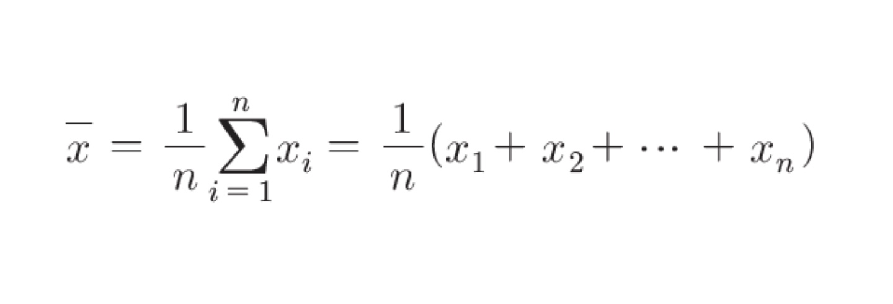
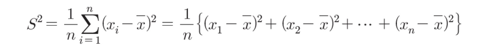
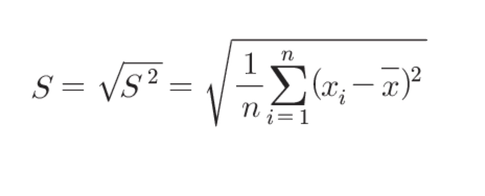
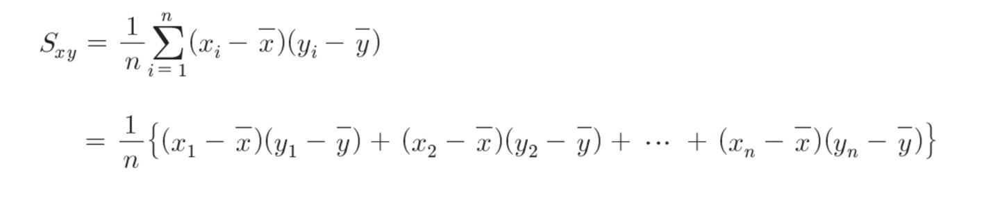
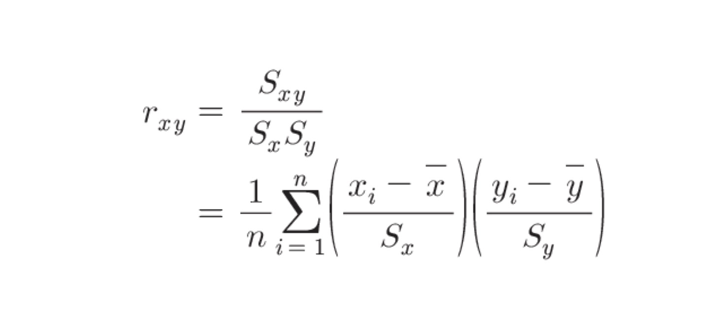

# statistical analysis(통계적 분석) 학습

## Chapter 1 데이터

- 파이썬으로 실습할 때를 가정
- import pandas as pd
    - pandas라는 라이브러리를 pd라는 이름으로 가져온다
- `pd.read_csv`
    - csv 파일을 읽어들일 수 있다
    - pandas의 DataFrame이라는 데이터 구조로 반환 - 2차원 표 데이터 구조
        - 하나의 열만 추출할 경우 Series라는 데이터 구조 반환 - 1차원 데이터 구조

### 데이터의 크기

- DataFrame(df라고 하겠음)의 크기는 shape를 참조해 알 수 있음
- `df.shape`
- 첫번째: 데이터에 대한 수(레코드 수)
- 두번째: 변수에 대한 수(칼럼 수)

### 변수의 종류

- 질적 변수: 선택이 필요한 변수, 종류를 구별하기 위한 변수
    - 명의 척도: 단순히 분류하기 위한 변수
    - 순서 척도: 순서 관계나 대소 관계에 의미가 있는 변수

- 양적 변수: 양을 표현하는 변수
    - 간격 척도: 대소 관계와 함께 그 차이에도 의미를 두는 변수
    - 비례 척도: 대소 관계, 차이, 비 모두에 의미가 있는 변수

- 이산형 변수
    - 하나하나의 값을 취하는 변수
    - 서로 인접한 숫자 사이에 값이 존재하지 않음
    - 주사위 눈, 결석 횟수, 결석 학생 수

- 연속형 변수
    - 연속적인 값을 취할 수 있는 변수
    - 어떤 두 숫자 사이에도 반드시 숫자가 존재
    - 길이, 무게, 시간

## Chapter 2 1차원 데이터 정리

- import numpy as np
    - numpy라는 라이브러리를 np라는 이름으로 가져온다
- %precision 3
    - 주피터 노트북에서 실습할 때 출력을 소수점 이하 3자리로 제한한다
- pd.set_option( ' precision ' , 3)
    - DataFrame의 출력을 소수점 이하 3자리로 제한
    - 오류 발생 시 pd.options.display.precision = 3 또는 pd.set_option('display.precision', 3)
- `df.head()`
    - df의 처음 5행을 표시

### 데이터 중심의 지표

- 평균값
    - 데이터를 모두 더한 뒤, 데이터의 개수로 나누어 구한다
    - sum(scores) / len(scores)
    - `np.mean(scores)`
    - `scores.mean()`
    - `scores_df.mean()`

    
    - $\bar x$ (엑스 바)

- 중앙값
    - 데이터를 크기 순서대로 나열할 때 정확하게 중앙에 위치한 값
    - 이상값에 영향을 덜 받음
    - 데이터의 개수 n이 홀수라면 $(n + 1) \over 2$
    - 데이터의 개수 n이 짝수라면 $n \over 2$ 와 $n \over 2 + 1$ 의 평균
    - `np.median(scores)`
    - `scores_df.median()`

    - 절사평균
        - 양쪽을 좀 자르고 남은 요소들의 평균
        - 이상값에 영향을 덜 받음
        - 정보의 손실이 적음

- 최빈값
    - 데이터에서 가장 많이 나타나는 값
    - `pd.Series([배열]).mode()`

### 데이터의 산포도 지표

- 편차
    - 각 데이터가 평균으로부터 떨어져 있는 정도
    - 평균 - 데이터 값
    - mean = np.mean(scores)
        - deviation = scores - mean
    - 편차 평균은 항상 0

- 분산
    - 편차 제곱의 평균
    - `np.mean(deviation ** 2)`
    - `np.var(scores)`
    - `scores_df.var()`
    - Numpy의 기본 분산은 표본분산
    - Pandas의 기본 분산은 불편분산
        - ddor = 1일 경우 불편분산, 0이면 표본분산
    
    

- 표준편차
    - 분산에 제곱근을 취한 것 = 편차 제곱의 평균에 제곱근을 취한 것
    - `np.sqrt(np.var(scores, ddof = 0))`
    - `np.std(scores, ddof = 0)`

    

-----------
- 범위
    - 데이터의 최댓값과 최솟값만으로 산포도를 표현하는 방법
    - `np.max(scores) - np.min(scores)`
    - $Rg = x_{max} - x_{min}$

- 사분위 범위
    - 데이터의 상위수%에 위치하는 값과 하위수%에 위치하는 값의 차이를 취하는 방법
    - 하위 25%: 제1사분위수 Q1
        - scores_Q1 = np.percentile(scores, 25)
    - 하위 50%: 제2사분위수 Q2
        - scores_Q2 = np.percentile(scores, 50)
    - 하위 75%: 제3사분위수 Q3
        - scores_Q3 = np.percentile(scores, 75)
    - 사분위 범위 $IQR = Q3 - Q1$
        - scores_IQR = scores_Q3 - scores_Q1

------------
- `pd.Series(scores).describe()`
    - 데이터 개수
    - 평균
    - 표준편차
    - 최솟값
    - 하위 25%
    - 하위 50%
    - 하위 75%
    - 최댓값

### 데이터의 정규화

- 표준화
    - 데이터에서 평균을 빼고 표준편차로 나누는 작업
    - 표준화된 데이터 = 표준화 변량 = Z 점수
    - $z_i = \frac{x_i - \bar x}{S}$
    - z = (scores - np.mean(scores)) / np.std(scores)
    - 표준화된 데이터의 평균은 0, 표준편차는 1

- 편찻값
    - 평균이 50, 표준편차가 10이 되도록 정규화한 값
    - $z_i = 50 + 10 \times \frac{x_i - \bar x}{S}$
    - z = 50 + 10 * (scores - np.mean(scores)) / np.std(scores)

### 1차원 데이터의 시각화

- 도수분포표
    - 분할된 구간과 데이터의 개수를 표로 정리한 것
    - 계급: 구간
    - 도수: 각 계급에 속한 데이터 수
    - 계급폭: 각 구간의 폭
    - 계급수: 계급의 수
    - `np.histogram(...)`
        - freq, _ = np.histogram(scores, bins = 10, range = (0, 100))
        - bins: 계급수
        - range: 최솟값, 최댓값 지정

    - 계급값: 계급의 중앙값
    - 상대도수: 전체 데이터에 대해서 해당 계급의 데이터가 차지하는 비율
        - $도수 \over 전체 도수$ 
    - 누적상대도수: 해당 계급까지의 상대도수의 합
        - `np.cumsum`
    - 최빈값: 최대가 되는 계급의 계급값
        - 도수분포표를 만드는 방법에 좌우됨(계급폭이 달라지면 최빈값도 달라짐)

- 히스토그램
    - 도수분포표를 막대그래프로 나타낸 것
    - Matplotlib 라이브러리 필요
        - import matplotlib.pyplot as plt
            - Matplotlib의 pyplot 모듈을 plt라는 이름으로 가져온다
        - %matplotlib inline
            - 그래프가 주피터 노트북 위에 표시된다
    - `ax.hist(...)`

- 상자그림
    - 데이터의 분포와 이상값을 시각적으로 파악 가능
    - 분위수 범위의 Q1, Q2, Q3, IQR 사용
    - 상자는 IQR을 나타냄, 수염은 Q1 - 1.5IQR부터 Q3 + 1.5IQR을 나타냄

## Chapter 3 2차원 데이터 정리

### 두 데이터 사이의 관계를 나타내는 지표

- 양의 상관관계
    - 하나가 높을 때 다른 하나도 높은 경향
- 음의 상관관계
    - 하나가 높을 때 다른 하나는 낮은 경향
- 무상관
    - 하나가 다른 하나에 직접적으로 영향을 미치지 않을 때

- 공분산
    

    - `np.cov(A,B,ddof = 0)`
        - 공분산 행렬(분산공분산 행렬)

- 상관계수
    

    - 공분산을 각 데이터의 표준편차로 나눈 값
    - 항상 -1 ~ 1 사이의 값을 취함
        - 양의 상관관계일수록 1에 가까워짐
        - 음의 상관관계일수록 -1에 가까워짐
        - 무상관이면 0이 됨
    - `np.corrcoef(A,B)`
        - 상관행렬
    - `scores_df.corr()`
        - 상관행렬

### 2차원 데이터의 시각화

- 산점도
    - `ax.scatter(A, B)`
        - A가 x축의 데이터, B가 y축의 데이터

- 회귀직선
    - $y = \beta _0 + \beta _1x$
    - A를 x, B를 y라 했을 때
    - `np.polyfit(A, B, 1)`
        - 계수 $\beta _0$, $\beta _1$ 을 구한다
    - `np.poly1d(polyfit)`
        - 회귀직선을 반환한다

- 히트맵
    - 히스토그램의 2차원 버전으로 색을 이용해 표현하는 그래프
    - `ax.hist2d(A, B, bin, range)`
    - 색이 진할 수록 많은 데이터를 가지고 있다

### 앤스컴의 예

- 동일한 지표를 가지고 있어도 그림으로 표현하면 달라질 수 있다

## Chapter 4 추측통계의 기본

### 모집단과 표본

- 모집단: 추측하고 싶은 관측 대상 전체
- 표본: 추측에 사용하는 관측 대상의 일부분
- 표본추출: 모집단에서 표본을 골라내는 일
- 표본 크기(샘플 사이즈): 골라낸 표본의 수
- 표본통계량: 표본을 바탕으로 계산한 평균이나 분산, 상관계수 등
- 모수: 모집단의 평균이나 분산, 상관계수 등
- 추정량: 표본평균으로 모평균을 추측할 때, 표본평균을 모평균의 추정량이라고 한다
- 추정값: 표본의 데이터를 이용하여 계산한 결과
-----------------

- 무작위추출: 임의로 표본을 추출하는 방법
    - seed(시드)를 0으로 하는 무작위추출은 항상 동일한 결과
- 복원추출: 여러 차례 동일한 표본을 선택하는 방법
    - `np.random.choice(배열, 수)`
- 비복원추출: 동일한 표본은 한 번만 선택하는 방법
    - `np.random.choice(배열, 수, replace=False)`

### 확률 모형

- 확률: 무작위추출과 같은 불확정성을 수반한 현상을 해석하기 위해 사용하는 것
- 확률 모형: 무작위추출 혹은 주사위를 모델링한 것
---------------

- 확률변수: 취하는 값과 그 값이 나올 확률이 결정되어 있는 것(결과를 맞힐 수는 없음)
- 시행: 확률변수의 결과를 관측하는 것
- 실현값: 시행에 의해 관측되는 값
- 사건: 시행 결과로 나타날 수 있는 일
- 근원 사건: 세부적으로 분해할 수 없는 사건
- 상호배반: 동시에 일어날 수 없는 사건
---------------

- 확률분포: 확률변수가 어떻게 움직이는지를 나타낸 것
- 공정한 주사위의 확률분포
    - 모든 눈의 확률이 $1 \over 6$ 로 같다
- 불공정한 주사위의 확률분포
    - 눈의 확률은 $눈 \over 21$ 이다

### 추측통계의 확률

- 무작위추출에서 표본의 크기가 커지면, 표본 데이터의 상대도수는 실제의 확률분포에 근사
- 표본 평균은 모평균을 중심으로 분포
    - 무작위추출에 의한 표본평균으로 모평균 추측 가능

## Chapter 5 이산형 확률변수
