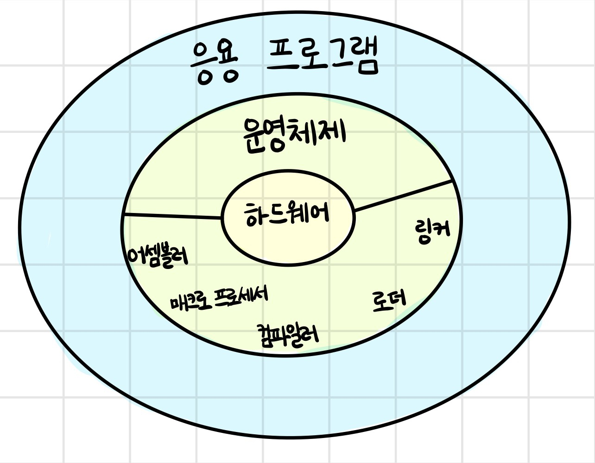
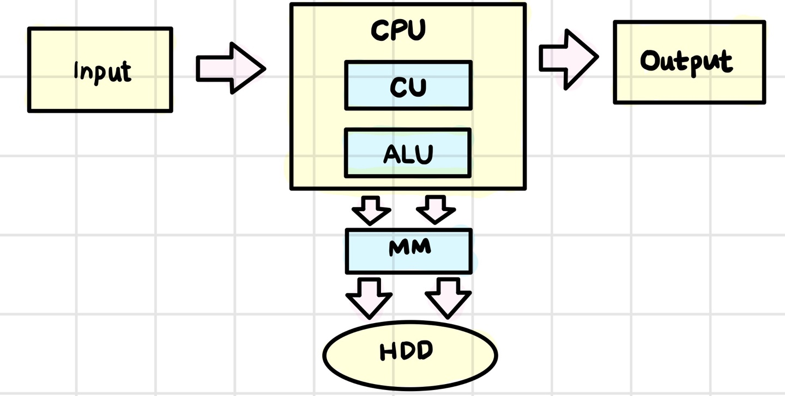
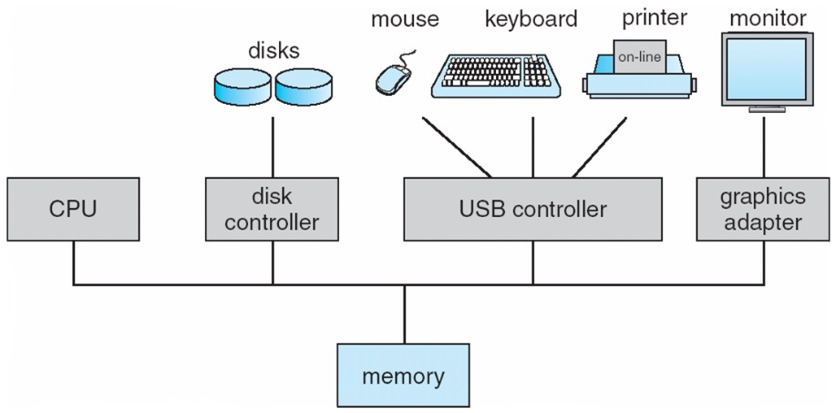
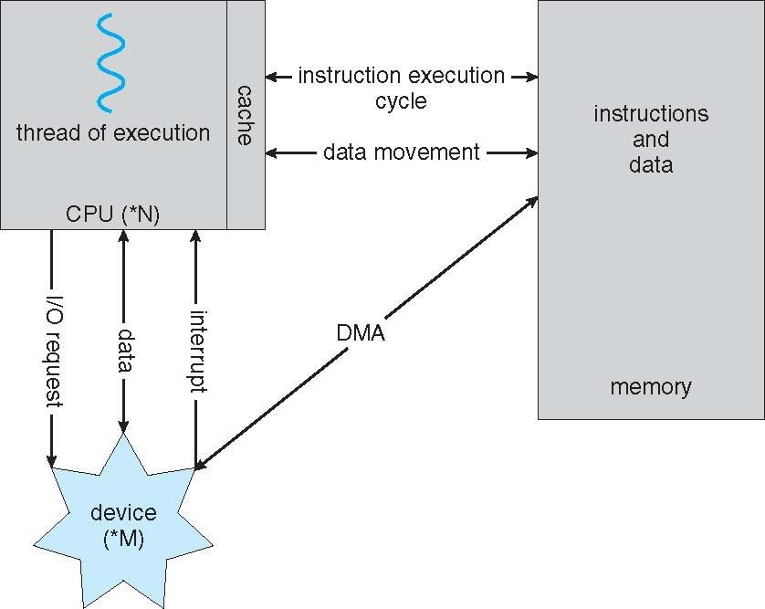
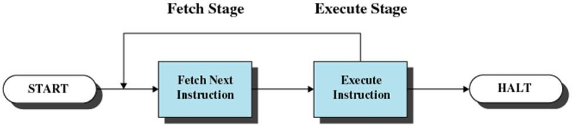
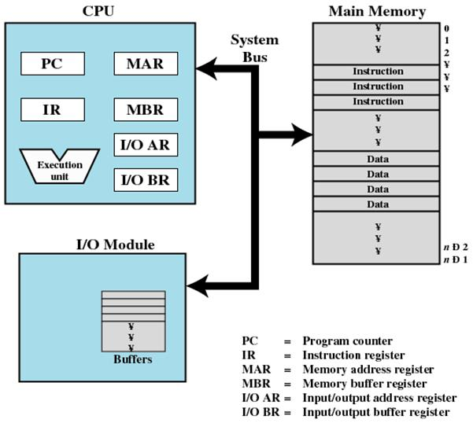

# system software(시스템 소프트웨어) 학습

## Chapter 1

### Computer System

- 컴퓨터 시스템의 구성
   
    - 계층적 구조
    - 사용자, 응용 프로그램, 시스템 소프트웨어, 하드웨어로 이루어짐
    - 사용자는 특정한 응용 프로그램을 실행을 통해 자신의 문제를 해결하려 함
    - 응용 프로그램 실행을 위해선 하드웨어 자원 필요
    - 하드웨어 자원을 운영체제와 같은 시스템 소프트웨어가 적절한 통제를 거쳐 사용 할 수 있게 함

- 컴퓨터 하드웨어
   
    - CPU, MM(Main Memory), 입출력 장치(CPU와 MM을 제외한 나머지 장치들, 줄여서 I/O device)
    - `CPU`: 프로그램을 실행하는 장치
        - `CU(Control Unit)`: CPU의 전체 동작을 제어하는 장치
        - `ALU(Arithmetic Logical Unit)`: 산술 논리 연산 장치
    - `MM`: 실행 중인 프로그램이 머무르는 곳
    - `I/O device`: 컴퓨터 외부와 데이터를 주고받거나 데이터를 보관하는 역할

- 기본 요소   
   
    - Processor(CPU)
    - Main Memory
        - 휘발성(전원이 들어와 있을 동안만 기억 유지)
        - real memory 또는 primary memory라고도 함
    - I/O device
        - 보조 기억 장치(예 - 하드디스크)
        - 통신 장치
        - 터미널
    - System bus
        - 프로세서, 메모리, 입출력 장치 사이를 연결해줌

- 작동 방식
   
    - cache: 프로그램을 실행시키는 성능을 높이기 위해 사용되는 CPU 내부 메모리
    - DMA: 입출력 데이터의 양이 많을 경우 DMA 방식을 걸쳐 메모리에서 직접 데이터를 가져오기도 함
    - interrupt: 입출력 완료 신호

- 컴퓨터 프로그램
    - CPU가 실행해야 할 구체적인 내용을 한 단계씩 순서대로 기술한 명령의 연속

- 기계어
    - 0과 1로 표시된 것으로 컴퓨터의 프로세서가 이해하는 유일한 언어
    - 각 기계간에 호환성이 없음

### Fetch-Execution Cycle

- 에니악은 내장 프로그램이 아님
    - 플러그와 점퍼 케이블을 이용해 연결

- Stored program(내장 프로그램) 방식의 컴퓨터
    - von Neumann(폰 노이만)
    - 현재의 대부분의 컴퓨터
    - computation(계산): 프로그램의 수행
    - memory: 프로그램이 저장된 장소
    - processor: 계산을 수행하는 기계의 부분, CPU
    - computer program: 일련의 컴퓨터 명령들

- 폰 노이만 컴퓨터는 프로세서와 메인 메모리로 구성

- 프로세서에 의한 계산은 Fetch-Execution Cycle을 사용하여 이루어짐
1. 메모리의 명령을 가져옴(`fetch`)
2. 명령 실행(`execution`)
3. 명령 가져오기 단계로 돌아가 반복

### Processor Registers

#### User-visible registers

- 프로그래머가 레지스터 사용을 최적화하여 메인 메모리 참조를 최소화할 수 있게 해줌
- 실행이 되는 과정에 직접 접근하는 레지스터
- 기계어로 참조 가능
- 어떤 프로그램이든(응용이던 시스템이던) 마음대로 user-visible register에 접근 가능
- `데이터 레지스터(data register)`
- `주소 레지스터(address register)`
    - `인덱스(index)`
        - 몇 번째에 접근하는지
        - 주소를 얻기 위해 기본값에 인덱스를 추가하는 작업도 포함
    - `세그먼트 포인터(segment pointer)`
        - 세그먼트 기반의 메모리를 사용하는 경우 어느 세그먼트를 접근해야 하는지 지정
    - `스택 포인터(stack pointer)`
        - 스택의 top을 가리킴

#### Control and status registers

- 프로세서의 동작을 제어하기 위해 사용
- `프로그램 카운터(Program Counter, PC)`
    - 다음에 실행할 명령의 메인 메모리상의 주소를 가지고 있는 레지스터
    - 한 번 fetch가 이루어지면 자동으로 다음 명령을 가리키도록 값이 업데이트 됨
- `명령 레지스터(Instruction Register, IR)`
    - fetch단계에서 메모리로부터 복사해온 명령을 담아두는 레지스터
    - 현재 실행 중인 명령을 담고 있음(명령 하나만 담을 수 있는 크기라 덮어쓰기 함)
- `프로그램 상태 워드(Program Status Word, PSW)`
    - 현재 CPU의 상태에 대한 여러가지 정보를 담고 있는 레지스터
    - `Condition Codes` or `Flags`
        - 연산에 의해 발생한 부가적 정보를 나타냄
            - 양수/음수 결과
            - 0인지 아닌지
            - 오버플로우가 발생했는지 아닌지
    - `Interrupt enable/disable`
        - 인터럽트 신호를 받을지 아닐지 상태 조절
    - `Supervisor/user mode`
        - CPU의 실행 모드 제어

#### Program Execution of a Hypothetical Machine

   
- Memory address register(MAR)
    - 다음에 읽을 또는 쓸 주소 지정
- Memory buffer register(MBR)
    - 메모리에 기록되거나 수신 받은 데이터를 보관
- Accumulator(AC)
- I/O address register
    - 입출력할 데이터의 메모리 주소를 가지고 있는 레지스터
- I/O buffer register

### System software

- 소프트웨어의 구분
    - 응용 소프트웨어: 사용자의 목적을 만족시키는 소프트웨어
    - 시스템 소프트웨어: 다른 프로그램이나 소프트웨어가 필요한 기능 제공
    - 시스템 프로그래밍: 시스템 소프트웨어의 기능을 이용하여 기계를 직접 작동하는 프로그램을 작성하는 일

- `Assembler(어셈블러)`
    - assembly language(어셈블리어)
        - 기계어 대신에 사람이 기억하기 쉽고 연상하기 쉬운 단어로 대체(연상, 심볼)
    - 어셈블리어를 자동적으로 기계어로 번역하는 프로그램
- `Linker(링커)`
    - 여러 개의 모듈 간의 상호 기억 장소 참조를 정리하여 함께 실행될 수 있도록 함
- `Loader(로더)`
    - load module: 링커가 만들어낸 실행 가능한 형태의 프로그램, 실행을 위해서 메모리에 저장이 되는 대상
    - 로드 모듈을 기억 장치에 적재하는 프로그램
    - 어셈블러가 로더의 기능까지 포함하는 경우
        - 기억 장소의 낭비
        - 매번 번역하는 번거로움
- `Macro Processor(매크로 프로세서)`
    - macro(매크로): 정의된 절차에 따라서 입력 시퀸스가 정의되어 있는 대체 출력 시퀸스로 변환이 되는 규칙 또는 패턴
    - 매크로 호출을 매크로에서 정의된 원래 명령어로 대치
- `Compiler(컴파일러)`
    - 고급 언어 프로그램을 받아들여 목적 프로그램을 만듦
    - 목적 프로그램: 고급 언어 프로그램과 동등한 역할을 하는 기계어로 이루어진 프로그램, 링커의 입력으로 사용되기도 함
- `Interpreter(인터프리터)`
    - 고급 언어 프로그램의 각 문장을 기계어로 바꿈

#### 운영체제

- 하드웨어를 관리하고, 응용 프로그램에 실행 환경을 제공하는 시스템 소프트웨어
- 기능
    - 프로세스 관리
    - 메모리 관리
    - CPU 스케줄링
    - 파일 및 I/O 서브 시스템
    - 디스크 스케줄링
    - 유틸리티

## Chapter 2

### Information representation

- Digital form(디지털)
    - 정보를 이산적이고 비연속적인 값으로 표현하는 방식
    - 예 - 디지털 시계(숫자로 시간 표현) 등
    - 정보를 표현하고자 하는 수에 의해 제한됨
- Analog form(아날로그)
    - 정보를 연속적인 값으로 표현하는 방식
    - 예 - 소리, 전압, 전류, 온도 등
- 디지털의 장점
    - 아날로그 보다 더 저렴하고, 신뢰할 수 있으며 범용성이 크다

### Why binary?

- 디지털 컴퓨터/시스템은 처리하고자 하는 정보가 어떤 정보이든지간에 그 정보를 내부적으로 디지털 형태로만 표현하고 처리
    - 아날로그(예 - 전압, 전류) 형태를 컴퓨터에서 처리하기에는 어렵기 때문에 아날로그에서 디지털로 변환(A-to-D)이 필요
- 디지털 컴퓨터는 수만 다름
- 수 형태의 데이터 입력을 받음
- 수들에 대한 연산 수행
- 새로운 수 형성
- 수행하고자 하는 연산은 명령어라고 불리는 수의 형태로 컴퓨터에 주어짐
- 수를 저장하고 조작하는데 용이하고 편리한 수 체계 필요 $\rightarrow$ 2진수 체계 사용
    - 2진수를 표현하고 처리하는 장치를 만드는 것이 10진수 표현 처리 장치를 만드는 것보다 쉽다
    - 0과 1의 2개의 값만 있다
