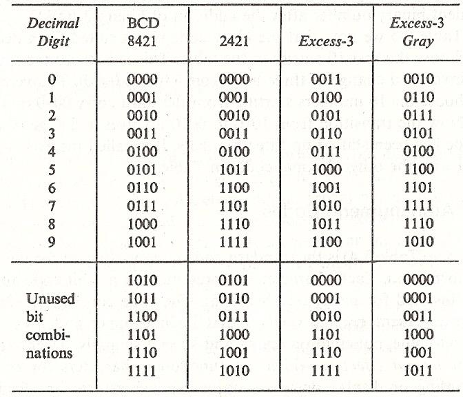

# system software(시스템 소프트웨어) 학습

## Chapter 1

### Computer System

- 컴퓨터 시스템의 구성
   
    - 계층적 구조
    - 사용자, 응용 프로그램, 시스템 소프트웨어, 하드웨어로 이루어짐
    - 사용자는 특정한 응용 프로그램을 실행을 통해 자신의 문제를 해결하려 함
    - 응용 프로그램 실행을 위해선 하드웨어 자원 필요
    - 하드웨어 자원을 운영체제와 같은 시스템 소프트웨어가 적절한 통제를 거쳐 사용 할 수 있게 함

- 컴퓨터 하드웨어
   
    - CPU, MM(Main Memory), 입출력 장치(CPU와 MM을 제외한 나머지 장치들, 줄여서 I/O device)
    - `CPU`: 프로그램을 실행하는 장치
        - `CU(Control Unit)`: CPU의 전체 동작을 제어하는 장치
        - `ALU(Arithmetic Logical Unit)`: 산술 논리 연산 장치
    - `MM`: 실행 중인 프로그램이 머무르는 곳
    - `I/O device`: 컴퓨터 외부와 데이터를 주고받거나 데이터를 보관하는 역할

- 기본 요소   
   
    - Processor(CPU)
    - Main Memory
        - 휘발성(전원이 들어와 있을 동안만 기억 유지)
        - real memory 또는 primary memory라고도 함
    - I/O device
        - 보조 기억 장치(예 - 하드디스크)
        - 통신 장치
        - 터미널
    - System bus
        - 프로세서, 메모리, 입출력 장치 사이를 연결해줌

- 작동 방식
   
    - cache: 프로그램을 실행시키는 성능을 높이기 위해 사용되는 CPU 내부 메모리
    - DMA: 입출력 데이터의 양이 많을 경우 DMA 방식을 걸쳐 메모리에서 직접 데이터를 가져오기도 함
    - interrupt: 입출력 완료 신호

- 컴퓨터 프로그램
    - CPU가 실행해야 할 구체적인 내용을 한 단계씩 순서대로 기술한 명령의 연속

- 기계어
    - 0과 1로 표시된 것으로 컴퓨터의 프로세서가 이해하는 유일한 언어
    - 각 기계간에 호환성이 없음

### Fetch-Execution Cycle

- 에니악은 내장 프로그램이 아님
    - 플러그와 점퍼 케이블을 이용해 연결

- Stored program(내장 프로그램) 방식의 컴퓨터
    - von Neumann(폰 노이만)
    - 현재의 대부분의 컴퓨터
    - computation(계산): 프로그램의 수행
    - memory: 프로그램이 저장된 장소
    - processor: 계산을 수행하는 기계의 부분, CPU
    - computer program: 일련의 컴퓨터 명령들

- 폰 노이만 컴퓨터는 프로세서와 메인 메모리로 구성

- 프로세서에 의한 계산은 Fetch-Execution Cycle을 사용하여 이루어짐
1. 메모리의 명령을 가져옴(`fetch`)
2. 명령 실행(`execution`)
3. 명령 가져오기 단계로 돌아가 반복

### Processor Registers

#### User-visible registers

- 프로그래머가 레지스터 사용을 최적화하여 메인 메모리 참조를 최소화할 수 있게 해줌
- 실행이 되는 과정에 직접 접근하는 레지스터
- 기계어로 참조 가능
- 어떤 프로그램이든(응용이던 시스템이던) 마음대로 user-visible register에 접근 가능
- `데이터 레지스터(data register)`
- `주소 레지스터(address register)`
    - `인덱스(index)`
        - 몇 번째에 접근하는지
        - 주소를 얻기 위해 기본값에 인덱스를 추가하는 작업도 포함
    - `세그먼트 포인터(segment pointer)`
        - 세그먼트 기반의 메모리를 사용하는 경우 어느 세그먼트를 접근해야 하는지 지정
    - `스택 포인터(stack pointer)`
        - 스택의 top을 가리킴

#### Control and status registers

- 프로세서의 동작을 제어하기 위해 사용
- `프로그램 카운터(Program Counter, PC)`
    - 다음에 실행할 명령의 메인 메모리상의 주소를 가지고 있는 레지스터
    - 한 번 fetch가 이루어지면 자동으로 다음 명령을 가리키도록 값이 업데이트 됨
- `명령 레지스터(Instruction Register, IR)`
    - fetch단계에서 메모리로부터 복사해온 명령을 담아두는 레지스터
    - 현재 실행 중인 명령을 담고 있음(명령 하나만 담을 수 있는 크기라 덮어쓰기 함)
- `프로그램 상태 워드(Program Status Word, PSW)`
    - 현재 CPU의 상태에 대한 여러가지 정보를 담고 있는 레지스터
    - `Condition Codes` or `Flags`
        - 연산에 의해 발생한 부가적 정보를 나타냄
            - 양수/음수 결과
            - 0인지 아닌지
            - 오버플로우가 발생했는지 아닌지
    - `Interrupt enable/disable`
        - 인터럽트 신호를 받을지 아닐지 상태 조절
    - `Supervisor/user mode`
        - CPU의 실행 모드 제어

#### Program Execution of a Hypothetical Machine

   
- Memory address register(MAR)
    - 다음에 읽을 또는 쓸 주소 지정
- Memory buffer register(MBR)
    - 메모리에 기록되거나 수신 받은 데이터를 보관
- Accumulator(AC)
- I/O address register
    - 입출력할 데이터의 메모리 주소를 가지고 있는 레지스터
- I/O buffer register

### System software

- 소프트웨어의 구분
    - 응용 소프트웨어: 사용자의 목적을 만족시키는 소프트웨어
    - 시스템 소프트웨어: 다른 프로그램이나 소프트웨어가 필요한 기능 제공
    - 시스템 프로그래밍: 시스템 소프트웨어의 기능을 이용하여 기계를 직접 작동하는 프로그램을 작성하는 일

- `Assembler(어셈블러)`
    - assembly language(어셈블리어)
        - 기계어 대신에 사람이 기억하기 쉽고 연상하기 쉬운 단어로 대체(연상, 심볼)
    - 어셈블리어를 자동적으로 기계어로 번역하는 프로그램
- `Linker(링커)`
    - 여러 개의 모듈 간의 상호 기억 장소 참조를 정리하여 함께 실행될 수 있도록 함
- `Loader(로더)`
    - load module: 링커가 만들어낸 실행 가능한 형태의 프로그램, 실행을 위해서 메모리에 저장이 되는 대상
    - 로드 모듈을 기억 장치에 적재하는 프로그램
    - 어셈블러가 로더의 기능까지 포함하는 경우
        - 기억 장소의 낭비
        - 매번 번역하는 번거로움
- `Macro Processor(매크로 프로세서)`
    - macro(매크로): 정의된 절차에 따라서 입력 시퀸스가 정의되어 있는 대체 출력 시퀸스로 변환이 되는 규칙 또는 패턴
    - 매크로 호출을 매크로에서 정의된 원래 명령어로 대치
- `Compiler(컴파일러)`
    - 고급 언어 프로그램을 받아들여 목적 프로그램을 만듦
    - 목적 프로그램: 고급 언어 프로그램과 동등한 역할을 하는 기계어로 이루어진 프로그램, 링커의 입력으로 사용되기도 함
- `Interpreter(인터프리터)`
    - 고급 언어 프로그램의 각 문장을 기계어로 바꿈

#### 운영체제

- 하드웨어를 관리하고, 응용 프로그램에 실행 환경을 제공하는 시스템 소프트웨어
- 기능
    - 프로세스 관리
    - 메모리 관리
    - CPU 스케줄링
    - 파일 및 I/O 서브 시스템
    - 디스크 스케줄링
    - 유틸리티

## Chapter 2

### Information representation

- Digital form(디지털)
    - 정보를 이산적이고 비연속적인 값으로 표현하는 방식
    - 예 - 디지털 시계(숫자로 시간 표현) 등
    - 정보를 표현하고자 하는 수에 의해 제한됨
- Analog form(아날로그)
    - 정보를 연속적인 값으로 표현하는 방식
    - 예 - 소리, 전압, 전류, 온도 등
- 디지털의 장점
    - 아날로그 보다 더 저렴하고, 신뢰할 수 있으며 범용성이 크다

### Why binary?

- 디지털 컴퓨터/시스템은 처리하고자 하는 정보가 어떤 정보이든지간에 그 정보를 내부적으로 디지털 형태로만 표현하고 처리
    - 아날로그(예 - 전압, 전류) 형태를 컴퓨터에서 처리하기에는 어렵기 때문에 아날로그에서 디지털로 변환(A-to-D)이 필요
- 디지털 컴퓨터는 수만 다름
- 수 형태의 데이터 입력을 받음
- 수들에 대한 연산 수행
- 새로운 수 형성
- 수행하고자 하는 연산은 명령어라고 불리는 수의 형태로 컴퓨터에 주어짐
- 수를 저장하고 조작하는데 용이하고 편리한 수 체계 필요 $\rightarrow$ 2진수 체계 사용
    - 2진수를 표현하고 처리하는 장치를 만드는 것이 10진수 표현 처리 장치를 만드는 것보다 쉽다
    - 0과 1의 2개의 값만 있다

### Binary system

- 10진수
    - 10개의 숫자(0 ~ 9)를 사용하며 각 자리에 따라 10의 거듭제곱을 곱한다
    - $7392 = 7 * 10^3 + 3 * 10^2 + 9 * 10^1 + 2 * 10^0$
- 2진수
    - 2개의 숫자(0, 1)을 사용하며 각 자리에 따라 2의 거듭제곱을 곱한다
    - $1011_2 = 1 * 2^3 + 0 * 2^2 + 1 * 2^1 + 1 * 2^0 = 11$
- 소수점을 가진 수
    - 각 자리에 따라 소수점 기준 왼쪽은 양의 거듭제곱을 곱하고 오른쪽은 음의 거듭제곱을 곱한다
    - $11010.11_2 = 1 * 2^4 + 1 * 2^3 + 0 * 2^2 + 1 * 2^1 + 0 * 2^0 + 1 * 2^{-1} + 1 * 2^{-2} = 26.75$

- binary prefix
    - K(Kilo) = $2^{10} = 1024 \cong 10^3$ thousand
    - M(Mega) = $2^{20} = 1048576 \cong 10^6$ million
    - G(Giga) = $2^{30} = 1073741824 \cong 10^9$ billion
    - T(Tera) = $2^{40} = 1.099 * 10^{12} \cong 10^{12}$ trillion
    - P(Peta) = $2^{50}$
    - E(Exa) = $2^{60}$
    - Z(Zetta) = $2^{70}$
    - Y(Yotta) = $2^{80}$

    - b와 B의 차이
        - b: bits
        - B: bytes(8 bits)

### Base-r system

- 계수에 r의 거듭제곱을 곱한 형태
- 계수의 범위는 0 ~ r - 1
- 진수가 10보다 큰 경우 10자리 숫자에 알파벳을 보충하여 사용

#### Converting decimal to base-r

- r진수 -> 10진수
    - 각 자리에 따라 r의 거듭제곱을 곱한다
- 10진수 -> r진수
    - 주어진 10진수를 r로 나누는 과정을 몫이 0이 될 때까지 반복
        - 처음 구한 나머지가 LSB, 나중에 구한 나머지가 MSB가 된다
    - 10진수의 소수점 부분은 r을 곱하는 과정을 값이 1.0이 될 때까지 반복
        - 처음 구한 나머지가 MSB, 나중에 구한 나머지가 LSB가 된다
    - 정수부와 소수부 둘 다 가진 경우 정수부와 소수부를 각각 구하고 답을 합친다

#### Converting binary to octal

- 2진수 -> 8진수
    - 소수점이 있는 경우에 정수부 쪽으로 왼쪽으로 3자리씩, 소수부 쪽으로 오른쪽으로 3자리씩 묶는다
    - 묶은 3자리를 각각 8진수로 변환한다
- 8진수 -> 2진수
    - 8진수의 각 자릿수를 해당하는 2진수 3자리로 변환한다

#### Converting binary to hexadecimal

- 2진수 -> 16진수
    소수점이 있는 경우에 정수부 쪽으로 왼쪽으로 4자리씩, 소수부 쪽으로 오른쪽으로 4자리씩 묶는다
    - 묶은 4자리를 각각 16진수로 변환한다
- 16진수 -> 2진수
    - 16진수의 각 자릿수를 해당하는 2진수 4자리로 변환한다

### Binary arithmetic

- 덧셈
    - 0 + 0 = 00
    - 1 + 0 = 0 + 1 = 01
    - 1 + 1 = 10
- 뺄셈
    - 0 - 0 = 0
    - 0 - 1 = 1
    - 1 - 0 = 1
    - 1 - 1 = 0
- 곱셈
    - 0 * 0 = 0
    - 1 * 0 = 0 * 1 = 0
    - 1 * 1 = 1

### Complements

- 보수는 뺄셈 연산을 단순화하고 논리적 조작을 위해 사용됨
- 만약 소수점이 있는 수의 보수를 구할 경우 소수점을 임시로 제거후 보수를 구한 뒤 원래 위치에 소수점을 추가한다
- 보수의 보수는 원래의 수이다

#### (r - 1)'s complement

- diminished radix complement
- n자리를 갖는 r진수 숫자 N이 주어졌을 때
    - N의 (r - 1)의 보수는 $(r^n - 1) - N$
- 10진수의 9의 보수는 9에서 각 숫자를 뺀다
- 2진수의 1의 보수는 1에서 각 자리를 뺀다
    - 각 자리에 not 연산을 한 결과와 같다

#### r's complement

- radix complement
- n자리를 갖는 숫자 N이 주어졌을 때
    - N의 r의 보수는 $r^n - N$
- r의 보수 = r - 1의 보수 + 1
- 10진수의 10의 보수
    - 끝에서 앞으로 가면서 처음 나오는 0은 그대로 쓰고, 0이 아닌 수는 10에서 뺀다
    - 그 뒤에 나오는 수는 9에서 뺀다
- 2진수의 2의 보수
    - 끝에서 앞으로 가면서 처음 나오는 1은 그대로 쓴다
    - 그 뒤는 0이면 1, 1이면 0으로 바꾼다

#### Subtraction using complements

- r진수 M - N
    - M + (N의 r의 보수)를 한다
    - M + ( $r^n$ - N) = M - N + $r^n$
    - 만약 M $\ge$ N이라면 end 캐리 무시
    - 만약 M < N이라면 캐리 발생하지 않음
        - 나온 덧셈 값에 r의 보수를 구한 다음 앞에 -기호를 붙여주면 뺄셈의 답을 얻을 수 있음
- 2진수에서 1의 보수를 이용하여 뺄셈을 하는 경우
    - 캐리 발생시 end-around 캐리를 더해준다
    - 나온 덧셈 값에 1의 보수를 구한 다음 앞에 -기호를 붙여준다

### Signed number

- 부호 있는 수를 표현하는 방식
- 음수를 표현하는 3가지 방법
    - signed magnitude
    - 1's complement
    - 2's complement

- Signed magnitude
    - 가장 왼쪽 비트가 사인 비트(부호 비트) 역할
        - 0: 양수
        - 1: 음수
    - 나머지 비트들은 수의 크기의 절댓값
    - 수를 표현하는데 사용되는 비트의 수 n이 정해져 있어야 함
    - n개의 비트가 표시하고 있는 수가 부호가 있는 정수인지 부호가 없는 정수인지 정의되어야 함
        - 부호가 있는 수라면 수를 표현하는 방식 정의되어야 함
- Signed complement
    - 주어진 수의 음수는 주어진 수의 보수
    - 양수는 0으로 시작 보수는 1로 시작

#### Addition signed number

- 8비트 2의 보수의 덧셈
    - 단순한 것은 부호 비교 없이 덧셈만 필요
    - 모든 캐리 무시
    - 만약 음수면 2의 보수 형태
    - 결과값이 음수라면 음수의 2의 보수 앞에 -를 붙이면 답을 확인할 수 있음

#### Subtraction signed number

- M - N
    - N의 2의 보수를 구한다
    - M과 더한다
    - 사인 비트에서 생성된 캐리를 무시한다
    - 음수라면 2의 보수 형태이다
    - 음수의 2의 보수 앞에 -를 붙이면 답을 확인할 수 있다

### Binary codes

- n비트 이진 코드는 0과 1의 $2^n$ 개의 서로 다른 조합을 최대로 가정할 수 있는 n비트의 그룹

- Binary Coded Decimal code(BCD)
    - 각 10진수 기호 0 ~ 9에 4비트의 이진 코드 할당
    - 나머지 6개는 사용하지 않음
    - 10진수가 k개인 숫자는 BCD를 사용할 경우 4k비트 필요
    - 덧셈
        - BCD 숫자 합이 1001보다 작거나 같으면 이진수 덧셈과 유사
        - 합이 1001보다 크면 0110(6)을 더하여 보정한다

- Other Decimal codes
    - 2421, Excess-3, 84-2-1 (BCD는 8421코드)
    - 가중치가 부여된 코드(weighted codes)로 각 비트 위치에 가중치 인자 할당
    - 일부 숫자는 2421에서 가능한 두 가지 방식으로 코딩될 수 있음
        - 예) 4 - 0100 or 1010
    - 2421과 excess-3은 자체 보완
        - 9의 보수는 1을 0으로 0을 1로 바꿈으로 얻을 수 있음
        - 10진수에서 9의 보수 관계가 있다면 해당 2421코드 2개는 서로 1의 보수 관계
    - Gray code
        - 한 숫자에서 다음 숫자로 이동할 때 코드에서 1비트만 변함
        - 너무 많은 비트를 동시에 변경해야 할 때 발생할 수 있는 전자적 계산 오류를 줄여줌

- ASCII code
    - American Standard Code for Information Interchange
    - Alphanumeric - 숫자, 알파벳 영문자(소문자, 대문자), 각종 심볼의 128가지 문제에 대한 코드
    - 128가지의 코드이므로 7비트 코드

#### Error detecting codes

- 데이터 또는 모든 종류의 정보를 읽고 쓰는 동안 오류가 발생할 수 있음
- 오류 탐지 방법 - 전송되는 데이터/메시지와 함께 추가 정보 추가
- 예) ASCII문자에 패리티 비트를 추가하여 패리티를 표시한다
    - 짝수 패리티(even parity): 1인 비트의 수가 짝수가 되도록 비트를 추가
    - 홀수 패리티(odd parity): 1인 비트의 수가 홀수가 되도록 비트를 추가

- 송신자와 수신자 모두 특정 유형의 패리티를 사용하는 것에 동의
1. 송신자에서 각 문자에 대한 패리티 생성
2. 수신자가 각 문자의 패리티 검사
3. 만약 패리티가 일치하지 않으면
    - 오류 - 하나 이상의 비트가 변경됨
    - 송신자에게 메시지를 다시 보내달라고 요청

- 오류가 홀수개일 때만 탐지 가능
- 7비트 ASCII문자는 8비트에 저장되므로 추가 비트는 일반적으로 패리티에 사용됨
    - 각 ASCII문자가 올바르게 읽고,쓰고,전송,저장되었는지 확인

## Chapter 3

### 80x86 Evolution

- 4004
    - 1971년에 출시
    - 4비트 마이크로 프로세서
        - CPU가 한 번에 처리할 수 있는 연산이 4비트 연산이다
    - 최초의 산업용 마이크로 프로세서
    - 4KB 메인 메모리 지원
    - 명령어 개수 45개
    - 50 KIPS
        - 1초에 5만 개의 명령을 실행할 수 있는 속도
- 8008
    - 1972년에 출시
    - 4004의 8비트 버전
        - 8비트 마이크로 프로세서
    - 16KB 메인 메모리 지원
    - 명령어 개수 48개
- 8080
    - 1974년에 출시
    - 8비트 마이크로 프로세서
    - 64KB 메인 메모리 지원
    - 2MHz clock rate
        - 1초에 50만 개의 명령을 실행할 수 있는 속도
    - 8008보다 10배 빨라짐
- 8085
    - 1976년에 출시
    - 8비트 마이크로 프로세서
        - 8080의 성능 향상 버전
    - 64KB 메인 메모리 지원
    - 1.3 microseconds clock cycle time
        - 1초에 80만 개의 명령을 실해할 수 있는 속도
    - 1억 개가 넘는 판매량을 기록
- 8086(1978) / 8088(1979)
    - 8088은 8086의 보급형 버전
    - 16비트 마이크로 프로세서
    - 1MB 메인 메모리 지원
    - 2.5 MIPS (400ns)
        - 1초에 250만 개의 명령을 실행할 수 있는 속도
    - 명령 캐시가 있음
    - 더 많은 레지스터와 더 많은 명령 수
- 80286
    - 1982년 출시
    - 16비트 마이크로 프로세서 (8086과 동일)
    - 8086이나 8088과 호환이 되는 명령어 집합
    - 16MB 메인 메모리 지원
    - 4.0 MIPS(250ns/8MHz)
- 80386
    - 1985년 출시
    - 최초의 32비트 마이크로 프로세서
    - 4GB 메인 메모리 지원
    - 12~33MHz
    - 메모리 관리 유닛(MMU)
        - 가상 메모리를 사용할 수 있게 됨
    - variations: DX, EX, SL, SLC, SX
- 80486
    - 1989년 출시
    - 32비트 마이크로 프로세서
    - 32비트 데이터 버스, 32비트 주소 버스
    - 4GM 메인 메모리 지원
    - 20~50MHz later 66~100MHz
    - 80386과 비슷한 기능을 하는 마이크로 프로세서, 80387과 비슷한 기능을 하는 부동소수점 보조 프로세서 내장
        - 80387: 부동 소수점 연산을 전담하는 전용 보조 프로세서
    - 80386에서의 실행 속도가 반으로 줄었다
    - variations: SX, DX2, DX4
- Pentium
    - 1993년 출시
    - 32비트 마이크로 프로세서
    - 64비트 데이터 버스, 32비트 주소 버스
    - 4GB 메인 메모리 지원
    - 60, 66, 90MHz
        - 제일 빠른 버전은 233MHz
    - 16KB L1 캐시(명령/데이터 8KB씩)
    - 메모리 전송 66MHz
    - 정수 프로세서 2개
- Pentium Pro
    - 1995년 출시
    - 32비트 마이크로 프로세서
    - 64비트 데이터 버스, 36비트 주소 버스
    - 64GB 메인 메모리 지원
    - 150MHz에서 시작 이후에 200MHz 정도도 나옴
    - 16KB L1 캐시(명령/데이터 8KB씩)
    - 256KB L2 캐시
    - 메모리 전송 66MHz
    - 정수 프로세서 3개
- Pentium II
    - 1997년 출시
    - 32비트 마이크로 프로세서
    - 64비트 데이터 버스, 36비트 주소 버스
    - 64GM 메인 메모리 지원
    - 233MHZ에서 시작 이후에 450MHz 정도도 나옴
    - 32KB L1 캐시(명령/데이터 16KB씩)
    - module integrated 512KB L2 캐시(전송 속도 133MHz)
        - 모듈화 되어 있지만 CPU와는 떨어져 있음
    - 메모리 전송 66MHz에서 100MHz
- Pentium III
    - 1999년 출시
    - 32비트 마이크로 프로세서
    - 64비트 데이터 버스, 36비트 주소 버스
    - 64GB 메인 메모리 지원
    - 800MHz 이상
    - 32KB L1 캐시(명령/데이터 16KB씩)
    - On-chip 256KB L2 캐시
        - CPU칩 안에 위치

    - 메모리 전송 100MHz에서 133MHz

- The Intel Pentium M Processor(2003~2006)
    - 64KB L1 캐시(명령/데이터 32KB씩)
    - L2 캐시(2MB까지)
    - Advanced Branch Prediction and Data Prefetch Logic
        - 분기 실행에 대한 예측을 해서 미리 fetch하는 성능 향상 로직
    - MMX technology, Streaming SIMD instructions, SSE2 명령어
    - 버스 속도 400 or 533 MHz
    - 인텔 스피드 스텝 기술 적용
- The Intel Core Duo and Intel Core Solo Processors(2006~2007)
    - 2MB L2 캐시: 2개의 코어 사이에 인텔 스마트 캐시 기술 적용
    - 디코딩과 SIMD 실행 상향
    - 인텔 발열 관리 기술 Deep Sleep 기술을 통해 전력 소비 줄임
    - 디지털 열 센서 인터페이스 제공하는 인텍 Advanced Thermal Manager 기술 적용
    - 전력 최적화된 버스 속도 667MHz
- Pentium 4(2000~2006)
    - Netburst 마이크로 아키텍쳐 사용
    - 1.4~1.9GHz 시작 나중에는 3.20, 3.45GHz까지(Hyper-Threading)
    - 1MB/512KB/256KB L2 캐시
    - 최대 800MHz에서 400MHz까지 시스템 버스 지원
    - 144개의 새로운 SIMD 128비트 처리 명령어
- Mobile Pentium 4-M / Pentium 4E / Pentium 4EE

- Itanium / Itanium2(2001/2002~2010)
    - 733, 800MHz(Itanium), 900MHz – 1.6GHz (Itanium2)
    - 최초의 64비트 CPU
    - 기존의 x86과는 전혀 다른 독자적인 명령 집합(IA-64)
- Pentium 4F / Pentium D(2005)
    - Netburst 마이크로 아키텍쳐
    - 인텔 확장 메모리 64 기술
    - AMD의 AMD64 아키텍쳐와 호환 가능
    - PentiumD: Netburst 마이크로 아키텍쳐를 포함한 데스크탑 듀얼 코어 64비트 x86-64 마이크로 아키텍쳐
- Intel Core 2(2006)
    - 코어 마이크로 아키텍쳐
    - 코어의 개수가 2개인 CPU
    - 64KB L1 캐시(코어 당)
    - 인텔 VT-x 지원
        - 가상 머신 기능을 지원하는 CPU의 기능
    - ~3.0GHz clock rate
- Xeon(2004~)
    - 서버나 고급 사양의 컴퓨터에 장착되는 인텔의 64비트 CPU
- Core i3 / Core i5 / Core i7(2010~)
    - 1세대: Nehalem 마이크로 아키텍쳐(2010)
    - 2/3세대: Sandy Bridge/Ivy Bridge 마이크로 아키텍쳐(2011~2012)
    - 4세대: Haswell(2013)
    - 5세대: Broadwell(2014)
    - 6세대: Skylake(2015~2019)
    - Kady lake, coffee lake, cannon lake, ice lake, comet lake, ...
